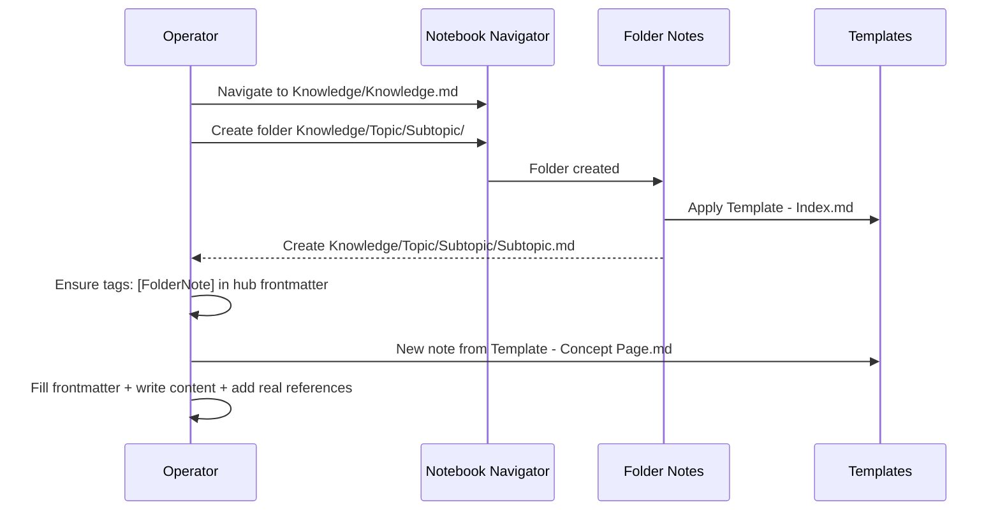

t # AGENTS.md (Vault Operating Contract)

This vault is an Obsidian knowledge base. These rules define how humans and agents MUST operate inside it.

## Quickstart (daily navigation)

- Open the Notebook Navigator homepage: [Knowledge](Knowledge/Knowledge.md)
- Use the roadmap canvas for orientation and gaps: [Roadmap](Knowledge/Roadmap.canvas)
- Search with Omnisearch for any term across notes; prefer Omnisearch over folder browsing when you do not know where a note lives.

## Vault layout + scope boundaries

- `Knowledge/`: primary taxonomy root. All new notes go here (no inbox).
- `Templates/`: note templates (Templates plugin). Templates are examples; do not treat them as required headers but use a default option to start with.

MUST NOT introduce new root folders or new standardized page types.

## Creating structure

### Topic folder + hub note (Folder Notes)

Folders are the primary structure: `Topic/`, `Topic/Subtopic/`, `Topic/Subtopic/Subsubtopic/`.

Folder Notes creates a hub note inside each folder named after the folder:

- Hub path pattern: `<Folder>/<Folder>.md` (Folder Notes uses `{{folder_name}}.md` inside the folder)
- Storage location: inside the folder
- Template used: `Templates/Template - Index.md`

HUB NOTE INVARIANT (STRICT): the hub note MUST include the `FolderNote` tag in YAML frontmatter because the index template filters hub notes via that tag.

Example hub note frontmatter (real hub notes, not templates):

```yaml
---
tags: [FolderNote]
---
```

### Concept page

Concept pages use `Templates/Template - Concept Page.md`.

Frontmatter keys and types are strict:

- `topic`: array of strings (even if one value)
- `subtopic`: array of strings (even if one value)
- `level`: array of strings (default `["1"]`; keep as strings)
- `priority`: enum string (vault currently uses `Medium` everywhere)
- `status`: enum string (ONLY these values are allowed): `Not-Started`, `Repetition`, `Creation`, `Ready To Repeat`, `Done`

Example concept frontmatter:

```yaml
---
topic:
  - Programming
subtopic:
  - NET
level:
  - "1"
priority: Medium
status: Not-Started
tags:
  - FolderNote
---
```

## Formatting + quality rules (STRICT MUST)

- Links: author text MUST use Markdown links only: `[Title](path-or-url)`.
- No wiki-links: do not write wiki-link syntax (double-bracket links) in author text. If you must discuss the syntax, write it spaced like `[ [ Note Name ] ]`.
- No placeholders: real notes MUST NOT retain template placeholders (example questions, example links, "Replace or delete" lines, etc.). Placeholders are allowed only inside `Templates/`.
- Templates are examples: delete irrelevant sections; do not force headers. Still enforce content invariants for real notes:
  - a short intro that answers "what is this" and "why do we care"
  - at least one concrete example (code / command / diagram / worked scenario)
  - at least one real reference link (docs, RFC, book, article)
- Code fences: every fenced block MUST specify a language (e.g. `bash`, `json`, `yaml`, `mermaid`).

## Mermaid policy

Use Mermaid only when it materially improves comprehension (structure, flow, ownership, lifecycle). Do not add diagrams for decoration.

MUST:

- Use fenced blocks with language `mermaid`.
- Keep diagrams small and specific; prefer 1 diagram that answers a question over 5 generic ones.

Mermaid parsing gotcha (practical):
- Keep node and edge label text boring. In some Mermaid renderers/versions, punctuation inside labels can trigger confusing parse errors. Avoid `()`, `[]`, `{}`, `,`, `;`, `/`, `|`, and math-y forms like `A[i]`, `pi[]`, `O(1)` inside labels; write them as words instead (e.g. `A at i`, `pi array`, `O 1`).
- If you validate diagrams with `@mermaid-js/mermaid-cli`, pass a file containing only the diagram text (no surrounding Markdown fences).

Example 1: Folder hub relationship (how hubs and notes relate)

```mermaid
flowchart TD
  K[Knowledge/] --> T[Knowledge/Topic/]
  T --> H[Knowledge/Topic/Topic.md\n(tags: FolderNote)]
  T --> C1[Knowledge/Topic/Concept A.md]
  T --> C2[Knowledge/Topic/Concept B.md]
  C1 -->|Markdown link| C2
```

Example 2: Note creation flow (operator view)



## Plugin SOPs + gotchas (current settings)

### Folder Notes

- Auto-create hub notes is enabled; hub is stored inside the folder and uses `Templates/Template - Index.md`.
- Hub notes may be hidden from some navigation views; do not assume you will always see them listed.
- Even if a hub was auto-created, you MUST ensure its frontmatter includes `tags: [FolderNote]`.

### Notebook Navigator

- Homepage is `Knowledge/Knowledge.md`.
- A shortcut exists to `Knowledge/Roadmap.canvas`; use it as the vault map. But don't change it. It is auto-generated
- Folder notes integration is enabled and folder notes are hidden in list view.
- Search provider is Omnisearch.

### Dataview / DataviewJS

- Dataview, DataviewJS, and inline DataviewJS are enabled.
- Treat DataviewJS as code execution: only use trusted snippets. Do not paste untrusted scripts.

### Omnisearch

- HTTP API is disabled; do not document or rely on an API endpoint.
- Use Omnisearch for fast full-text retrieval; it shows excerpts and highlights matches.

### Custom Attachment Location / Attachments

- Attachments MUST live under `Assets/` (vault setting + custom attachment plugin).
- Do not place images/files inside `Knowledge/`.
- If an attachment ends up in the wrong place, use the plugin workflow to move/collect it rather than manual ad-hoc renames.

### Obsidian Git

- Automatic commit/pull/push is disabled (intervals set to 0, no boot pull).
- Sync is manual; pull happens before push and sync method is merge.
- Do not assume background backups exist; Remind user to sync if work is done.

## Operator checklist (pre-finish)

- File lives under `Knowledge/` (unless it is a template under `Templates/`).
- Frontmatter present and valid (concept pages: `topic`, `subtopic`, `level`, `priority`, `status`; hub notes: `tags: [FolderNote]`).
- No template placeholders remain in real notes.
- All links are Markdown links (no double-bracket link syntax typed in author text).
- At least one concrete example (snippet/diagram/worked scenario) and at least one real reference link.
- Code fences include a language; Mermaid diagrams (if any) use `mermaid` fenced blocks.
- Attachments are under `Assets/` and referenced via Markdown links.

## Workflow notes

- If request contains significant change to the vault fromatting, structure etc. rules, ask user if it must be remembered it in AGENTS.md Memory Section

## Memory
- 
