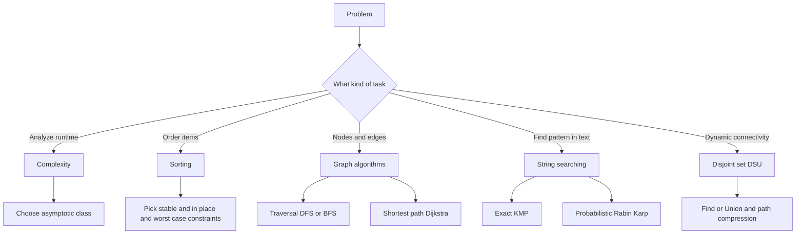

## Parent
:LiArrowUpLeft: `= link(regexreplace(this.file.folder, "/[^/]+$", "") + "/" + regexreplace(regexreplace(this.file.folder, "/[^/]+$", ""), "^.*/", ""), regexreplace(regexreplace(this.file.folder, "/[^/]+$", ""), "^.*/", ""))`

```dataviewjs
const cur = dv.current();
const curFolder = cur.file.folder;
const curPath = cur.file.path;

const isFolderNote = (p) => (p.file.tags ?? []).includes("#FolderNote");

const children = dv.pages()
  .where(p => p.file.folder.startsWith(curFolder + "/"))
  .where(p => p.file.folder.split("/").length === curFolder.split("/").length + 1)
  .where(p => p.file.name === p.file.folder.split("/").slice(-1)[0])
  .where(p => isFolderNote(p))
  .sort(p => p.file.folder, "asc");

if (children.length) {
  dv.header(2, "Children");
  dv.list(children.map(p => p.file.link));
}

const pages = dv.pages()
  .where(p => p.file.folder === curFolder)
  .where(p => p.file.path !== curPath)
  .where(p => !isFolderNote(p))
  .sort(p => p.file.name, "asc");

if (pages.length) {
  dv.header(2, "Pages");
  dv.list(pages.map(p => p.file.link));
}
```
---
## Intro

## Deeper Explanation

[](https://metanit.com/sharp/algoritm/)

[8 Common Data Structures every Programmer must know](https://towardsdatascience.com/8-common-data-structures-every-programmer-must-know-171acf6a1a42)

### Complexity

- [Complexity](Knowledge/02 Computer Science/Algorithms/Complexity/Complexity.md)
- [Algorithms Complexity](Knowledge/02 Computer Science/Algorithms/Complexity/Algorithms Complexity.md)

### Sorting

- [Sorting Algorithms](Knowledge/02 Computer Science/Algorithms/Sorting Algorithms/Sorting Algorithms.md)

### Graph

- [Graph Algorithms](Knowledge/02 Computer Science/Algorithms/Graph Algorithms/Graph Algorithms.md)
- [DFS/BFS](Knowledge/02 Computer Science/Algorithms/Graph Algorithms/DFS BFS.md)
- [Dijkstra](Knowledge/02 Computer Science/Algorithms/Graph Algorithms/Dijkstra.md)

### String Searching

- [String Searching](Knowledge/02 Computer Science/Algorithms/String Searching/String Searching.md)
- [Rabit Karp Search](Knowledge/02 Computer Science/Algorithms/String Searching/Rabit Karp Search.md)
- [KMP (Knuth-Morris-Pratt) Algorithm](Knowledge/02 Computer Science/Algorithms/String Searching/KMP (Knuth-Morris-Pratt) Algorithm.md)

### Disjoint Set

- [Disjoint Set](Knowledge/02 Computer Science/Algorithms/Disjoint Set/Disjoint Set.md)
- [Disjoint Set / Union-Find](Knowledge/02 Computer Science/Algorithms/Disjoint Set/Disjoint Set Union-Find.md)

## Diagram



## Questions

> [!QUESTION]- What is an algorithm? How is its efficiency measured?
> An algorithm is a step-by-step procedure to solve a problem. Its efficiency is measured by time and space complexity, typically using Big-O to describe growth with input size.

> [!QUESTION]- What is abc?
> Answer

## Further Reading
