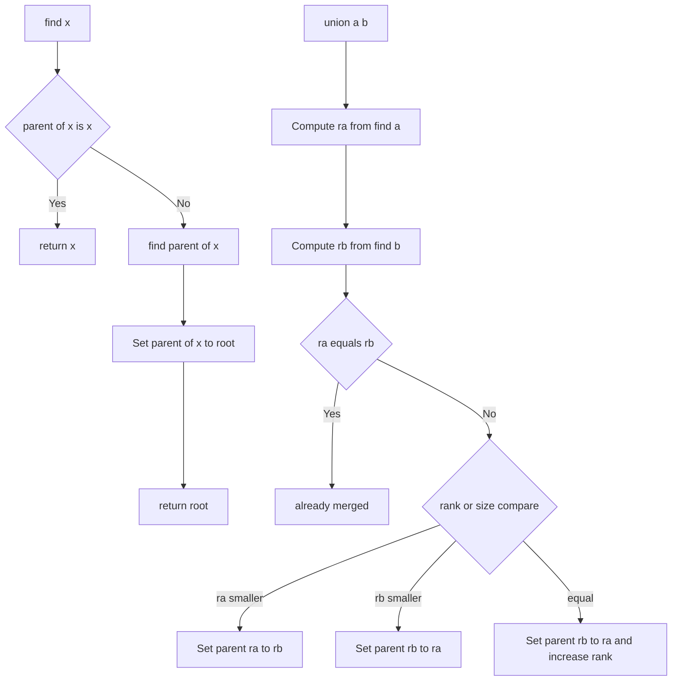

## Parent
:LiArrowUpLeft: `= link(regexreplace(this.file.folder, "/[^/]+$", "") + "/" + regexreplace(regexreplace(this.file.folder, "/[^/]+$", ""), "^.*/", ""), regexreplace(regexreplace(this.file.folder, "/[^/]+$", ""), "^.*/", ""))`

---
## Intro

## Deeper Explanation

## Diagram

## Questions

> [!QUESTION]- What is abc?
> Answer

## Further Reading
