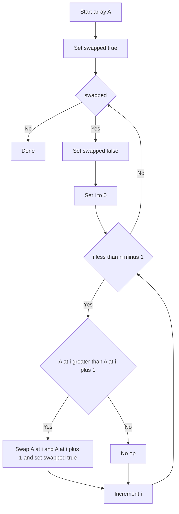

---
topic:
  - Computer Science
subtopic:
  - Algorithms
  - Sorting Algorithms
level: ["1"]
priority: medium
status: Not-Started
---
## Parent
:LiArrowUpLeft: `= link(regexreplace(this.file.folder, "/[^/]+$", "") + "/" + regexreplace(regexreplace(this.file.folder, "/[^/]+$", ""), "^.*/", ""), regexreplace(regexreplace(this.file.folder, "/[^/]+$", ""), "^.*/", ""))`

---
## Intro
Bubble sort repeatedly swaps adjacent out-of-order elements, pushing large values toward the end each pass. It is easy to understand but rarely used in production due to poor performance.

## Deeper Explanation
- Mechanism: scan left-to-right, swap (a[i], a[i+1]) when out of order; after one full pass, the max element is in its final place.
- Early-exit optimization: if a pass makes zero swaps, the array is already sorted.
- Complexity: average/worst O(n^2); best O(n) with early-exit on already-sorted input.
- Properties: stable (with adjacent swaps), in-place, simple.

## Diagram

## Questions

> [!QUESTION]- What is abc?
> Answer

## Further Reading
- https://en.wikipedia.org/wiki/Bubble_sort - Overview and variants
- https://visualgo.net/en/sorting - Animation to build intuition
