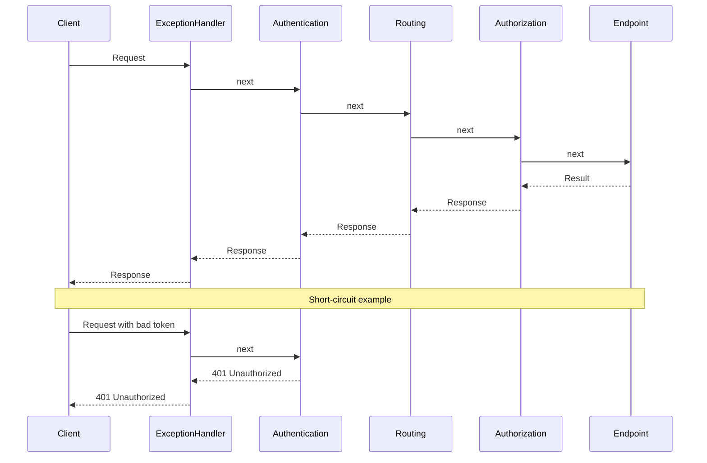

---
{"dg-publish":true,"permalink":"/software-engineering/01-programming/net/asp-net-web-api/middlewares/","dg-note-properties":{"topic":["Programming"],"subtopic":["NET"],"level":["4"],"priority":"High","status":"Ready to Repeat"}}
---

# Intro

ASP.NET Core middleware are components that form the HTTP request pipeline. Each middleware wraps the next like nested layers, processing requests on the way in and responses on the way out. You reach for middleware when a concern must apply to all (or most) requests regardless of which controller or endpoint handles them — logging, authentication, CORS, compression, and exception handling are canonical examples.

Each middleware receives an `HttpContext` and a `RequestDelegate` (`next`). On the way **in**, it can inspect or modify the request before calling `next`. On the way **out**, it can inspect or modify the response. Any middleware can **short-circuit** by returning a response without calling `next` — for example, `UseAuthentication` can reject an unauthenticated request before it ever reaches routing.



Order matters: middleware registered first runs first on the way in and last on the way out. The recommended order in `Program.cs` is:

```csharp
app.UseExceptionHandler("/error");
app.UseHsts();
app.UseHttpsRedirection();
app.UseStaticFiles();
app.UseRouting();
app.UseCors();
app.UseAuthentication();
app.UseAuthorization();
app.MapControllers();
```

## Writing Custom Middleware

The simplest form is an inline lambda:

```csharp
app.Use(async (ctx, next) =>
{
    var sw = System.Diagnostics.Stopwatch.StartNew();
    try
    {
        await next(ctx);
    }
    finally
    {
        sw.Stop();
        app.Logger.LogInformation("{Method} {Path} -> {StatusCode} in {ElapsedMs} ms",
            ctx.Request.Method,
            ctx.Request.Path,
            ctx.Response.StatusCode,
            sw.ElapsedMilliseconds);
    }
});
```

For reusable middleware, use a class with the conventional pattern:

```csharp
public sealed class CorrelationIdMiddleware
{
    private readonly RequestDelegate _next;
    private readonly ILogger<CorrelationIdMiddleware> _logger;

    public CorrelationIdMiddleware(RequestDelegate next, ILogger<CorrelationIdMiddleware> logger)
    {
        _next = next;
        _logger = logger;
    }

    public async Task InvokeAsync(HttpContext context)
    {
        var correlationId = context.Request.Headers["X-Correlation-Id"].FirstOrDefault()
            ?? Guid.NewGuid().ToString("N");

        context.Response.Headers["X-Correlation-Id"] = correlationId;
        using (_logger.BeginScope(new Dictionary<string, object> { ["CorrelationId"] = correlationId }))
        {
            await _next(context);
        }
    }
}

// Registration
app.UseMiddleware<CorrelationIdMiddleware>();
```

> [!WARNING]
> **Convention-based middleware is constructed once (singleton).** The `CorrelationIdMiddleware` instance above is created a single time at startup, so its constructor must only take singleton-lifetime dependencies. To use a **scoped** service, inject it as a parameter of `InvokeAsync` instead (the framework resolves it per request): `public async Task InvokeAsync(HttpContext ctx, IOrderService orders)`. If you need a fully per-request middleware object, implement the **factory-based `IMiddleware`** interface and register the type in DI with the lifetime you want.

## Branching the Pipeline

Beyond the linear chain, you can fork the pipeline:

- **`app.Map("/admin", branch => ...)`** / **`MapWhen(predicate, ...)`** — split off a sub-pipeline by path or arbitrary predicate.
- **`app.UseWhen(predicate, branch => ...)`** — run extra middleware for matching requests, then *rejoin* the main pipeline (unlike `MapWhen`, which terminates in the branch).
- **`app.Run(handler)`** — a terminal middleware that never calls `next` (the end of a branch).

```csharp
app.UseWhen(
    ctx => ctx.Request.Path.StartsWithSegments("/api"),
    api => api.UseMiddleware<ApiKeyMiddleware>()); // only /api gets the API-key check
```

## Pitfalls

**Wrong registration order** — placing `UseAuthorization` before `UseAuthentication` means the identity is never populated, so all requests appear anonymous. The canonical order (exception handler → HSTS → static files → routing → CORS → auth → authorization → endpoints) exists for a reason.

**Modifying the response after it has started** — once `Response.HasStarted` is `true`, headers and status code are already sent. Writing to them throws. Check `context.Response.HasStarted` before any post-`next` response modification.

**Blocking I/O in synchronous middleware** — calling `Thread.Sleep` or synchronous file/DB operations blocks a thread-pool thread for the duration. Use `async/await` throughout.

**Swallowing exceptions silently** — a `try/catch` in middleware that logs and returns 200 hides failures from callers and monitoring. Either rethrow or return an appropriate error status.

**Reading endpoint metadata too early** — routing only *selects* the endpoint at `UseRouting`. Middleware placed **between `UseRouting` and the endpoint** can inspect the chosen endpoint via `context.GetEndpoint()` (e.g. to read `[Authorize]`/custom metadata); middleware before `UseRouting` always sees `null`. Order your middleware accordingly when it depends on which endpoint will run.

## Tradeoffs

| Option | Best for | Weakness |
|---|---|---|
| Middleware | App-wide cross-cutting concerns (logging, auth, exception handling, CORS) | No direct MVC action context; runs for all requests including static files |
| MVC action filters | Concerns tied to controllers/actions and model/action context | Only applies to MVC pipeline; not available for Minimal APIs |
| Endpoint filters | Minimal API endpoint-scoped behavior | Not used by MVC controllers |

**Decision rule**: use middleware when the concern must apply before routing or to all request types. Use filters when you need `ActionExecutingContext`, action arguments, or action result wrapping.

## Questions

> [!QUESTION]- Action filter vs middleware: what is the difference?
> Middleware is pipeline-level and can apply to all requests (before routing/MVC, around endpoint execution). Action filters are MVC-level and run only for MVC actions, with access to action context, model binding, and results; they are a better fit for cross-cutting concerns that are specific to controller actions.

> [!QUESTION]- How can you log execution time for all requests?
> Use a middleware that measures elapsed time around `next()` and logs it. An action filter works too, but only for MVC actions.

> [!QUESTION]- How can you centrally catch errors for all requests?
> Add a global exception-handling middleware. In ASP.NET Core this is commonly done with `app.UseExceptionHandler(...)` (and `app.UseDeveloperExceptionPage()` in development). The handler can log the exception and return a consistent error response (for example, RFC 7807 Problem Details).

> [!QUESTION]- What is the ASP.NET request processing pipeline?
> A request is received by the host (for example, Kestrel) and then flows through an ordered chain of middleware. Middleware can add features (routing, authN/authZ, CORS, compression, etc.), select an endpoint, and finally execute the endpoint (MVC action, Minimal API handler, etc.). On the way back out, the middleware chain unwinds, allowing post-processing of the response.

## Links

- [Middleware in ASP.NET Core](https://learn.microsoft.com/en-us/aspnet/core/fundamentals/middleware/) — official guide covering pipeline order, built-in middleware, and writing custom components.
- [Handle errors in ASP.NET Core](https://learn.microsoft.com/en-us/aspnet/core/fundamentals/error-handling) — covers `UseExceptionHandler`, `UseDeveloperExceptionPage`, and Problem Details.
- [Filters in ASP.NET Core](https://learn.microsoft.com/en-us/aspnet/core/mvc/controllers/filters) — MVC filter pipeline; use alongside this page to understand middleware vs filter tradeoffs.
- [Write custom ASP.NET Core middleware](https://learn.microsoft.com/en-us/aspnet/core/fundamentals/middleware/write) — step-by-step guide with DI, factory-based middleware, and testing patterns.

<!-- whats-next:start -->

---

> [!note] Whats next
> **Parent**
>  [[Software Engineering/01 Programming/NET/NET\|NET]]
>
> **Pages**
> - [[Software Engineering/01 Programming/NET/ASP.NET Web API/Authentication\|Authentication]]
> - [[Software Engineering/01 Programming/NET/ASP.NET Web API/Authorization\|Authorization]]
> - [[Software Engineering/01 Programming/NET/ASP.NET Web API/CORS\|CORS]]
> - [[Software Engineering/01 Programming/NET/ASP.NET Web API/Dependency Injection\|Dependency Injection]]
> - [[Software Engineering/01 Programming/NET/ASP.NET Web API/Filters\|Filters]]
<!-- whats-next:end -->
