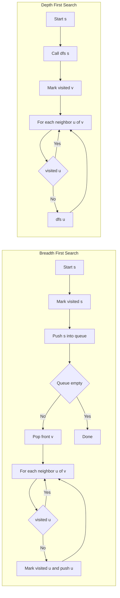

---
{"dg-publish":true,"permalink":"/software-engineering/02-computer-science/algorithms/search-algorithms/dfs-bfs/","dg-note-properties":{"topic":["Computer Science"],"subtopic":["Algorithms"],"level":["4"],"priority":"Medium","status":"Done"}}
---


# Intro

BFS (Breadth-First Search) and DFS (Depth-First Search) are the two fundamental graph traversal strategies. BFS explores nodes layer by layer using a queue — all nodes at distance `k` from the source are visited before any node at distance `k+1`. DFS explores one branch as deep as possible before backtracking, using a stack or recursion. Both run in `O(V + E)` time, but they solve different problems: BFS finds shortest paths by edge count in unweighted graphs, while DFS is the natural fit for cycle detection, topological sorting, and connected component discovery.

The choice between them is not about speed — both visit every reachable node exactly once. It is about which graph property you need: BFS gives distance ordering (layers), DFS gives depth ordering (finish times, back edges).

## How It Works

**BFS** maintains a queue and a visited set:
1. Enqueue the source and mark it visited.
2. Dequeue the front node `v`. For each unvisited neighbor `u`, mark `u` visited and enqueue it.
3. Repeat until the queue is empty. The first visit to any node is along a shortest path by hop count.

**DFS** maintains a stack (explicit or call stack) and a visited set:
1. Push the source (or call `dfs(source)`). Mark it visited.
2. Pop (or recurse into) an unvisited neighbor `u`, mark visited.
3. When a node has no unvisited neighbors, backtrack. Nodes get a finish time when backtracking completes.



## Example

```text
Graph edges: A-B, A-C, B-D, C-E

BFS from A:
  visit A → enqueue B, C → dequeue B → enqueue D → dequeue C → enqueue E → dequeue D → dequeue E
  Visit order: A, B, C, D, E (layer by layer)

DFS from A (recursive, left neighbor first):
  visit A → recurse B → recurse D → backtrack to B → backtrack to A → recurse C → recurse E
  Visit order: A, B, D, C, E (depth first)
```

## Pitfalls

### Stack Overflow with Recursive DFS

- **What goes wrong**: recursive DFS uses call stack proportional to graph depth. On graphs with 10,000+ depth (chain or linked-list shapes), this causes a stack overflow.
- **Why it happens**: most language runtimes default to 1-8 MB stack size, supporting roughly 10k-50k recursive calls depending on frame size.
- **How to avoid it**: use iterative DFS with an explicit stack. The logic is identical — push instead of recurse, pop instead of return.

### Missing Visited Set

- **What goes wrong**: traversal enters infinite loops on cyclic graphs, revisiting the same nodes forever.
- **Why it happens**: without marking nodes visited before or during exploration, cycles cause repeated re-entry.
- **How to avoid it**: always initialize a visited set and check it before exploring a neighbor. For directed cycle detection with DFS, additionally track nodes currently on the recursion stack (three-state: unvisited, in-progress, completed).

### BFS Memory on Wide Graphs

- **What goes wrong**: BFS frontier holds all nodes at the current distance level. On social-graph-like structures with millions of nodes per level, the queue exhausts available memory.
- **Why it happens**: BFS memory is proportional to the widest level of the graph, which can approach `O(V)` in the worst case.
- **How to avoid it**: consider bidirectional BFS (search from both source and target, meet in the middle) or impose a depth limit. DFS uses memory proportional to depth, not width.

## Tradeoffs

| Choice | BFS | DFS | Decision criteria |
| --- | --- | --- | --- |
| Shortest path by edge count | Guarantees shortest | No guarantee | Always use BFS for unweighted shortest path. DFS may find a valid path but not the shortest. |
| Memory on wide graphs | Queue grows with level width | Stack grows with depth | DFS uses less memory on wide, shallow graphs. BFS uses less on narrow, deep graphs. |
| Cycle detection in directed graphs | Less natural | Standard via back edges | DFS with recursion-stack tracking is the textbook method. BFS detects cycles in undirected graphs easily but needs extra work for directed. |
| Topological sort | Kahn's algorithm via in-degree queue | Reverse post-order from DFS | Both work correctly. DFS variant is simpler to code; Kahn's gives an explicit iterative approach. |
| Connected components | Works but less common | Standard approach | DFS is the default for finding connected components and SCCs via Tarjan's or Kosaraju's algorithms. |

## Questions

> [!QUESTION]- When should you choose BFS over DFS?
  > - Use BFS when you need shortest path by hop count in an unweighted graph — BFS visits nodes in order of increasing distance from the source.
  > - Use BFS when you need level-order properties (e.g., minimum moves in a puzzle, shortest transformation sequence).
  > - DFS cannot guarantee shortest path because it may reach a node through a longer branch first.
  > - BFS guarantees shortest paths but can use more memory on wide graphs — accept the memory cost when correctness requires distance ordering.

> [!QUESTION]- Why can recursive DFS cause stack overflow and how do you fix it?
  > - Recursive DFS adds one stack frame per depth level. Graphs shaped like chains with 10k+ depth exceed typical stack limits.
  > - Iterative DFS with an explicit stack has identical traversal logic but uses heap memory instead of call stack, avoiding overflow.
  > - The conversion is mechanical: replace function calls with stack pushes, returns with stack pops.
  > - Iterative DFS is slightly more verbose but safe for arbitrary graph sizes — always prefer it in production code where graph depth is unbounded.

> [!QUESTION]- How do you detect cycles using DFS in a directed graph?
  > - Maintain three states for each node: unvisited, in-progress (on recursion stack), and completed.
  > - A cycle exists if DFS reaches a node that is currently in-progress — this means a back edge closes a cycle.
  > - This is more precise than checking "visited" alone because a cross edge to a completed node is not a cycle.
  > - Three-state tracking adds slight implementation complexity over basic visited-set DFS, but correctly distinguishes back edges from cross edges — necessary for correctness in directed graphs.

## References

- [Breadth-first search -- encyclopedic overview with algorithm description, applications, and complexity analysis (Wikipedia)](https://en.wikipedia.org/wiki/Breadth-first_search)
- [Depth-first search -- encyclopedic overview covering edge classification, applications to cycle detection, and topological sort (Wikipedia)](https://en.wikipedia.org/wiki/Depth-first_search)
- [BFS and applications -- implementation guide with code examples and problem set (cp-algorithms)](https://cp-algorithms.com/graph/breadth-first-search.html)
- [DFS and applications -- implementation guide covering back edges, timestamps, and connected components (cp-algorithms)](https://cp-algorithms.com/graph/depth-first-search.html)

<!-- whats-next:start -->

---

> [!note] Whats next
> **Parent**
>  [[Software Engineering/02 Computer Science/Algorithms/Algorithms\|Algorithms]]
>
> **Pages**
> - [[Software Engineering/02 Computer Science/Algorithms/Search Algorithms/Binary Search\|Binary Search]]
> - [[Software Engineering/02 Computer Science/Algorithms/Search Algorithms/KMP (Knuth-Morris-Pratt) Algorithm\|KMP (Knuth-Morris-Pratt) Algorithm]]
> - [[Software Engineering/02 Computer Science/Algorithms/Search Algorithms/Rabin Karp Search\|Rabin Karp Search]]
<!-- whats-next:end -->
