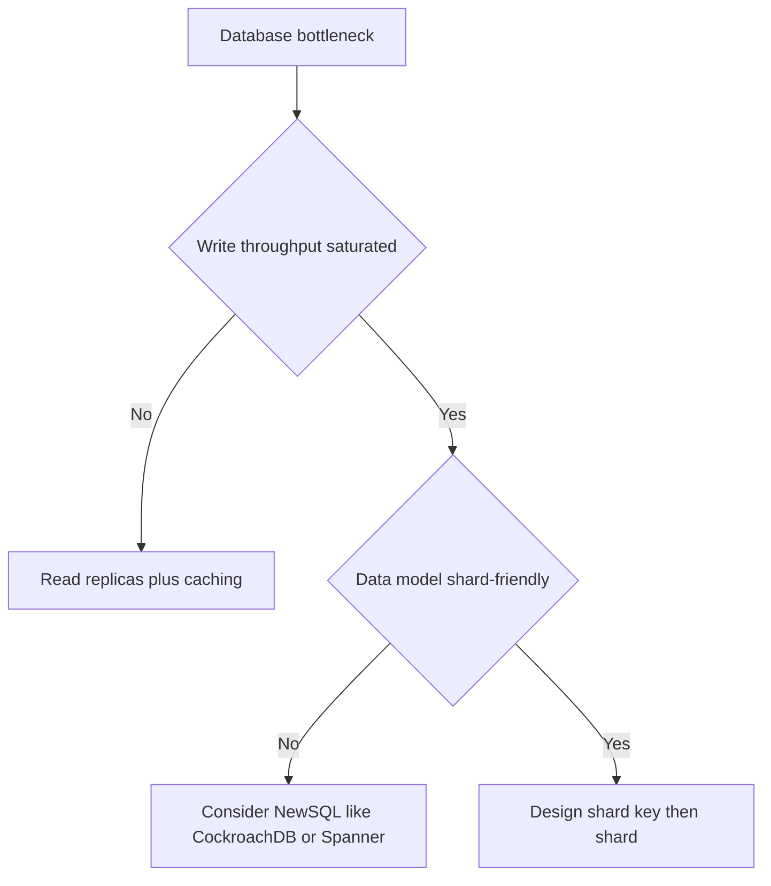

---
{"dg-publish":true,"permalink":"/software-engineering/03-data-persistence/sql/sharding/","dg-note-properties":{"topic":["Data Persistence"],"subtopic":["SQL"],"level":["4"],"priority":"High","status":"Ready to Repeat"}}
---

# Intro

Sharding is horizontal partitioning: you split a single database's rows across multiple independent database instances (shards), each owning a non-overlapping subset of the data. Unlike table partitioning (which splits data within one server), sharding distributes data across separate machines, so each shard can be scaled, backed up, and failed over independently. The core problem it solves: when write throughput or total data volume exceeds what a single node can handle, writes still funnel through one primary regardless of how many read replicas or caches you add. Sharding is a last resort. Before reaching for it, exhaust vertical scaling, read replicas, caching, and table partitioning first, each of which is operationally simpler and preserves cross-table query semantics.

## Sharding Strategies

The shard key determines which shard owns a given row. Choosing it wrong is the most expensive mistake you can make.

| Strategy | Routing | Hotspot Risk | Resharding Cost | Best For |
|---|---|---|---|---|
| Range-based | `key / range_size` | High (sequential inserts) | Low (add new range) | Time-series, archival |
| Hash-based | `hash(key) % N` | Low (uniform distribution) | Very high (all data moves) | User data, uniform access |
| Directory-based | Lookup table maps key to shard | None (explicit control) | Low (update table) | Multi-tenant, irregular data |
| Geographic | Region/country to shard | Medium (population skew) | Medium | GDPR compliance, latency |

### Consistent hashing

Simple modulo hashing (`hash(key) % N`) has a fatal flaw: adding one shard changes N, which remaps almost every key to a different shard. A full data migration follows. Consistent hashing places both keys and shards on a hash ring. Adding a shard only displaces the keys that fall between the new shard and its predecessor, limiting remapping to roughly 1/N of keys. Virtual nodes (multiple ring positions per physical shard) smooth out uneven distribution further. A practical variant is pre-allocating many logical shards mapped to fewer physical machines: adding capacity means remapping logical shards to new nodes, moving only the affected partitions rather than the entire dataset.

## Cross-Shard Operations

Cross-shard joins can't be executed as a single native join across independent shard databases without middleware or application fan-out. The application must fetch rows from each relevant shard and join them in memory, which is expensive and easy to get wrong under load.

Across independent shards, transactions typically require two-phase commit (2PC) or a redesign toward single-shard transactions, sagas, or eventual consistency. Most sharding setups don't provide native cross-shard ACID, so the common answer is to design the schema so that all writes for a business entity land on the same shard.

Scatter queries (queries without the shard key in the `WHERE` clause) fan out to every shard in parallel, aggregate results, and return. At small scale this is invisible. At large scale it's a silent performance killer that grows linearly with shard count.

Replicate static reference data (country codes, product categories, config tables) to every shard. The duplication cost is low; the alternative is a cross-shard lookup on every query that touches that data.

## Tradeoffs

| Dimension | Sharding | Alternatives |
|---|---|---|
| Write scaling | Distributed across shards | Read replicas don't help writes |
| Operational complexity | High: key choice, rebalancing, monitoring | Vertical scaling is operationally simple |
| Cross-shard queries | Expensive or impossible | Single DB handles any query |
| Rollback difficulty | Very hard: data is spread | Simple: one database |
| When to use | Write throughput or storage exceeds single node | Try vertical scale, read replicas, partitioning, caching first |

### Decision flowchart

## Pitfalls

**Hotspot shards.** Uneven key distribution concentrates load on one shard while others sit idle. Sequential keys (auto-increment IDs, timestamps) are the classic cause with range-based sharding. Mitigation: use hash-based keys and monitor per-shard CPU and query latency separately.

**The single hot key ("celebrity problem").** Even with a perfect hash, *one* key can be too active or too large for any single shard — a celebrity with millions of followers, or one enterprise tenant dwarfing the rest. Hashing doesn't help because all that traffic shares one key and therefore one shard. Mitigations: **split the hot key** by appending a random/bounded suffix (`celebrityId:0..N`) so its data spreads across shards (the app fans the key's reads/writes back together), cache the hot key in front of the shard, or give the outlier tenant its **own dedicated shard**. This is distinct from a hotspot *shard* (skewed key distribution) — here the skew is within a single key.

**Wrong shard key.** A key absent from most query WHERE clauses forces scatter queries on every read. Changing the key later requires a full data migration. Mitigation: analyze your top queries before choosing; the key must appear in the majority of them.

**Resharding pain.** Simple modulo hashing requires moving nearly all data when you add a shard. Mitigation: use consistent hashing, or pre-allocate many logical shards mapped to fewer physical machines so adding capacity only remaps the affected partitions.

**Cross-shard transactions.** A write spanning two shards can partially commit if one fails, leaving data inconsistent. Mitigation: design the schema so all writes for a business entity land on the same shard; use sagas with compensating transactions when cross-shard writes are unavoidable.

**Operational complexity multiplied.** Migrations, backups, and incident response all scale with shard count. Mitigation: invest in automation before sharding. Managed services (Vitess, PlanetScale, CockroachDB) absorb much of this cost.

## Questions

> [!QUESTION]- When should you shard a database, and what should you try first?
> Shard only when write throughput or storage saturates a single node. Try these first:
> - **Vertical scaling**: operationally trivial, preserves full SQL semantics.
> - **Read replicas**: offload reads but don't help writes.
> - **Caching**: reduces DB load for hot reads.
> - **Table partitioning**: splits data within one server, preserving joins and transactions.
>
> Sharding adds permanent operational complexity and limits cross-shard queries.
> [!QUESTION]- Why is shard key choice critical, and what makes a good shard key?
> The key determines data distribution and query routing. A bad key causes hotspot shards (uneven load) or scatter queries (fan-out to all shards on every read).
>
> A good shard key has high cardinality, even distribution (avoid sequential IDs with range sharding), query alignment (appears in most WHERE clauses), and stability (changing a key requires moving the row). Common choices: user ID, tenant ID, or a composite of region + entity ID.
> [!QUESTION]- How does consistent hashing reduce resharding cost compared to simple modulo hashing?
> With `hash(key) % N`, adding one shard changes N and remaps almost every key, requiring a near-total data migration.
>
> Consistent hashing maps keys and shards onto a circular ring. Adding a shard displaces only the keys between the new shard and its predecessor, roughly 1/N of all keys. Virtual nodes (multiple ring positions per physical shard) prevent any shard from owning a disproportionately large arc.
## Links

- [Horizontal, vertical, and functional data partitioning (Azure Architecture Center)](https://learn.microsoft.com/azure/architecture/best-practices/data-partitioning) — practical guidance on partitioning strategies with tradeoffs for each approach.
- [Sharding pattern (Azure Architecture Center)](https://learn.microsoft.com/azure/architecture/patterns/sharding) — pattern description covering shard key selection, routing, and rebalancing considerations.
- [Sharding Pinterest — How We Scaled Our MySQL Fleet](https://medium.com/pinterest-engineering/sharding-pinterest-how-we-scaled-our-mysql-fleet-3f341e96ca6f) — production case study on range-based sharding at scale with lessons on shard key design and migration.
- [Scaling Etsy Payments with Vitess — Part 1](https://www.etsy.com/codeascraft/scaling-etsy-payments-with-vitess-part-1--the-data-model) — real-world account of migrating a payments system to Vitess (MySQL sharding layer) with data model decisions.
- [Designing Data-Intensive Applications, Ch. 6 (Martin Kleppmann)](https://www.oreilly.com/library/view/designing-data-intensive-applications/9781098119058/) — covers partitioning strategies, secondary indexes on sharded data, and rebalancing algorithms.
- [Don't shard yet — 8 strategies to try first](https://www.lazertechnologies.com/insights/dont-shard-yet-8-database-performance-strategies-to-try-before-sharding) — practitioner post on exhausting simpler scaling options before committing to sharding complexity.

<!-- whats-next:start -->

---

> [!note] Whats next
> **Parent**
>  [[Software Engineering/03 Data Persistence/03 Data Persistence\|03 Data Persistence]]
>
> **Pages**
> - [[Software Engineering/03 Data Persistence/SQL/Indexes\|Indexes]]
> - [[Software Engineering/03 Data Persistence/SQL/Normalization Denormalization\|Normalization Denormalization]]
> - [[Software Engineering/03 Data Persistence/SQL/Replication\|Replication]]
<!-- whats-next:end -->
