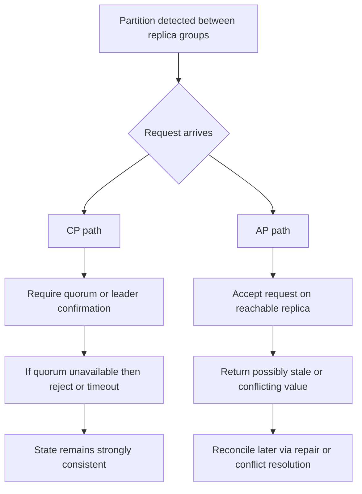

---
{"dg-publish":true,"permalink":"/software-engineering/05-architecture/distributed-systems/cap-theorem/","dg-note-properties":{"topic":["Architecture"],"subtopic":["Distributed Systems"],"level":["2"],"priority":"High","status":"Done"}}
---

# Intro

CAP theorem says that in a distributed data system, once a network partition happens, you can guarantee at most one of **strong consistency** or **availability** (while still tolerating the partition). This matters because real systems eventually hit partial failures: links drop, regions isolate, packets reorder, and suddenly nodes cannot communicate reliably. A partition is not "the whole system is down"; it is specifically "some nodes can still process requests, but they cannot exchange enough messages to maintain a single, current view of data." You reach for CAP when deciding failure behavior in system design: do we reject some operations to protect correctness, or accept operations and repair divergence later?

## What CAP Actually Means

### Definitions in operational terms

- **Consistency (C)**: every successful read sees the most recent successful write (or an error), as if there is one up-to-date value. *(This is **linearizability** — replicas agreeing. It is **not** the "C" in [[Software Engineering/03 Data Persistence/ACID\|ACID]], which means constraint/invariant preservation within one node. A system can be ACID and AP, or CP and non-ACID — the two C's are unrelated.)*
- **Availability (A)**: every request to a non-failed node receives a non-error response in finite time.
- **Partition tolerance (P)**: the system continues operating despite message loss/delay between node groups.

The common "pick any 2 of 3" slogan is a simplification that often causes wrong design decisions. In modern distributed systems, partition tolerance is usually non-negotiable once data is replicated across machines, racks, zones, or regions. The real forced choice is:

- during a partition, choose **C** (reject/timeout some operations)
- or choose **A** (continue serving operations with possible staleness/conflicts)

When there is **no** partition, many systems can provide both consistency and availability for normal operation.

## Mechanism: Why You Cannot Have C and A During Partition

Imagine two replicas, `R1` and `R2`, serving the same key.

1. Client writes `x=5` to `R1`.
2. A network partition isolates `R1` from `R2`.
3. Another client reads from `R2`.

If `R2` answers immediately, it may return old `x=4` (availability preserved, consistency broken). If `R2` refuses/blocks until it can confirm latest state from `R1`, it preserves consistency but sacrifices availability for that request path.

That is the CAP tension: with no reliable communication path, a node cannot both always answer and always be globally current.

## CP vs AP With Concrete Systems

### CP behavior (consistency-first during partition)

Representative systems: ZooKeeper / etcd style coordination services, majority-quorum relational deployments.

- They require leader or quorum confirmation before committing writes.
- If a partition prevents quorum, writes are rejected or blocked.
- Reads may also be restricted if linearizability is required.

Concrete effect:

- **Good**: no split-brain writes, strong correctness for locks, config, leader election.
- **Cost**: reduced availability for some operations during partition.

ZooKeeper-style mindset: "If I cannot prove this write is globally safe, I will not accept it."

### AP behavior (availability-first during partition)

Representative systems: Amazon DynamoDB (Dynamo-style), Cassandra, and many multi-region eventually consistent setups.

- Replicas accept writes on reachable nodes even when not fully coordinated.
- Divergent versions can exist temporarily.
- Background repair, vector clocks/timestamps, or app-level merge rules reconcile state.

Concrete effect:

- **Good**: service continues under partition, better uptime for user-facing traffic.
- **Cost**: clients may observe stale reads or conflict resolution artifacts.

Dynamo-style mindset: "Keep accepting traffic now, converge state later."

## CAP Is About Partition Time, Not Normal Time

This is one of the most important interview points:

- If links are healthy and quorum is reachable, a CP system can look both consistent and available.
- If links are healthy, an AP system can also look fully correct because replicas converge quickly.
- CAP only constrains guarantees **when partition actually exists**.

Practical implication: ask "What happens in the bad 0.1% network case?" rather than evaluating only happy-path latency graphs.

## PACELC Extension (What You Face Daily)

CAP explains partition behavior, but most daily engineering happens without active partition alarms. PACELC extends the model:

- **PA/EC**: if Partition then choose Availability or Consistency; Else choose Latency or Consistency.

So even without partitions, distributed databases still force a design choice:

- wait for more replicas/quorum to improve consistency
- or respond faster from local/near replicas with weaker freshness guarantees

This is why engineers spend so much time on read consistency levels, session guarantees, quorum sizes, and timeout policy tuning.

## .NET System Design Relevance

For senior .NET interviews, tie CAP/PACELC to concrete platform choices instead of abstract definitions.

### SQL Server with Always On/synchronous replication (CP-leaning)

- CAP tradeoffs show up when SQL Server is deployed as a replicated system (for example, Always On Availability Groups), not as a single standalone instance.
- Strong transactional guarantees and synchronous commit patterns prioritize correctness when replicas must coordinate commit.
- Under replication or failover network issues, some operations may block/fail rather than return divergent committed state.
- Good fit for orders, payments, inventory reservation, ledger-like data.

### Azure Cosmos DB (tunable consistency)

- You can select [[Software Engineering/05 Architecture/Distributed Systems/Consistency Models\|consistency models]] (Strong, Bounded Staleness, Session, Consistent Prefix, Eventual).
- This lets you pick different points on latency/freshness per workload.
- Interview signal: mention that one product can serve CP-like or AP-leaning behaviors depending on configuration and operation.

### Redis (AP-leaning in cache usage patterns)

- In most architectures, Redis is used as a cache where temporary staleness or key loss is acceptable.
- During partitions/failover races, cache inconsistencies are tolerated because database remains source of truth.
- The business decision is explicit: keep low-latency serving path available, recover correctness from authoritative store.

### Mixed-store architecture is normal

Most production .NET systems are not globally CP or AP. They are operation-scoped:

- `PlaceOrder` path: CP-leaning store + strict idempotency + transactional guarantees.
- `GetRecommendations` path: AP-leaning cache/search index + eventual refresh.
- `UserProfile` path: session consistency may be enough.

That per-operation selection is usually what interviewers want to hear.

## Pitfalls

### Pitfall 1: "CAP means pick two of three"

- **What goes wrong**: teams assume they can permanently choose C and A while ignoring P.
- **Why it is wrong**: once replication spans unreliable networks, partitions will happen; P is not optional in practice.
- **How to avoid it**: restate CAP as "during partition, choose C or A" and design explicit failure policy for each critical operation.

### Pitfall 2: Treating CAP choice as system-wide and static

- **What goes wrong**: architecture docs label entire platform "CP" or "AP," then apply one rule to all endpoints.
- **Why it is risky**: different endpoints have different correctness and UX budgets.
- **How to avoid it**: classify operations by business invariants and allowed stale window, then pick per-operation consistency/availability behavior.

### Pitfall 3: Ignoring reconciliation design in AP paths

- **What goes wrong**: system accepts writes under partition but has weak conflict strategy.
- **Why it is risky**: silent data corruption appears later as duplicate orders or lost preference updates.
- **How to avoid it**: define merge policy, [[Software Engineering/05 Architecture/Distributed Systems/Idempotency\|idempotency keys]], causality/version metadata, and repair observability from day one.

## Questions

> [!QUESTION]- If CAP is only about partitions, why do we still tune consistency levels on healthy clusters?
> Because CAP only describes the partition case, and partitions are rare — PACELC covers the other 99% of the time. Its "ELC" half says that even with healthy links (Else), a replicated store still trades Latency against Consistency: wait for a quorum to confirm and you get fresher, better-ordered reads at higher latency; answer from the nearest replica and you get speed with a chance of staleness. That is exactly what read-consistency levels, session guarantees, quorum sizes, and timeout tuning are dialing in. CAP tells you how to fail; PACELC tells you what you pay every day.

> [!QUESTION]- Is a system "CP" or "AP" as a whole?
> Don't think of it system-wide — decide per operation, because different endpoints have different correctness budgets. A `PlaceOrder` or ledger write wants CP: refuse it under partition rather than risk split-brain or a double charge. A `GetRecommendations` read wants AP: keep serving slightly stale data because availability beats freshness there. A profile read might only need session consistency. So the same system is CP on some paths and AP on others; labeling the whole platform and applying one rule everywhere is the mistake. Map each operation to its business invariant and its allowed staleness window.

> [!QUESTION]- Why is "pick two of three" a misleading way to state CAP?
> Because in any system that replicates data across machines, partition tolerance isn't something you opt out of — networks drop packets and isolate nodes whether you like it or not. So "CA" isn't really on the menu: the moment a partition hits, a system that didn't plan for it just stops being correct or stops responding. The honest framing is that P is a given, and the real decision is what you do *during* a partition — sacrifice consistency to stay available (AP), or sacrifice availability to stay consistent (CP). With no partition you can have both; CAP only forces the choice inside the failure window.

## References

- [Brewer, "Towards Robust Distributed Systems" (PODC 2000 keynote)](https://people.eecs.berkeley.edu/~brewer/cs262b-2004/PODC-keynote.pdf) — the original CAP conjecture presentation by Eric Brewer.
- [Gilbert and Lynch, "Brewer's Conjecture and the Feasibility of Consistent, Available, Partition-Tolerant Web Services"](https://groups.csail.mit.edu/tds/papers/Lynch/jacm.pdf) — the formal proof of the CAP theorem with precise definitions of consistency and availability.
- [Azure Cosmos DB consistency levels](https://learn.microsoft.com/azure/cosmos-db/consistency-levels) — practical example of a production system offering five tunable consistency levels, illustrating CAP tradeoffs in a real product.
- [Amazon Dynamo paper (SOSP 2007)](https://www.allthingsdistributed.com/files/amazon-dynamo-sosp2007.pdf) — canonical AP system design paper showing how Amazon chose availability over consistency and the engineering consequences.
- [Abadi, "Consistency Tradeoffs in Modern Distributed Database System Design: CAP is only part of the story" (PACELC)](https://www.cs.umd.edu/~abadi/papers/abadi-pacelc.pdf) — extends CAP with the PACELC model, adding latency vs consistency tradeoffs during normal operation.

<!-- whats-next:start -->

---

> [!note] Whats next
> **Parent**
>  [[Software Engineering/05 Architecture/05 Architecture\|05 Architecture]]
>
> **Topics**
> - [[Software Engineering/05 Architecture/Distributed Systems/Message Queues/Message Queues\|Message Queues]]
> - [[Software Engineering/05 Architecture/Distributed Systems/Scalability Patterns/Scalability Patterns\|Scalability Patterns]]
>
> **Pages**
> - [[Software Engineering/05 Architecture/Distributed Systems/API Gateway\|API Gateway]]
> - [[Software Engineering/05 Architecture/Distributed Systems/Consistency Models\|Consistency Models]]
> - [[Software Engineering/05 Architecture/Distributed Systems/Distributed Transactions\|Distributed Transactions]]
> - [[Software Engineering/05 Architecture/Distributed Systems/Idempotency\|Idempotency]]
> - [[Software Engineering/05 Architecture/Distributed Systems/Load Balancing\|Load Balancing]]
> - [[Software Engineering/05 Architecture/Distributed Systems/Webhooks\|Webhooks]]
<!-- whats-next:end -->
