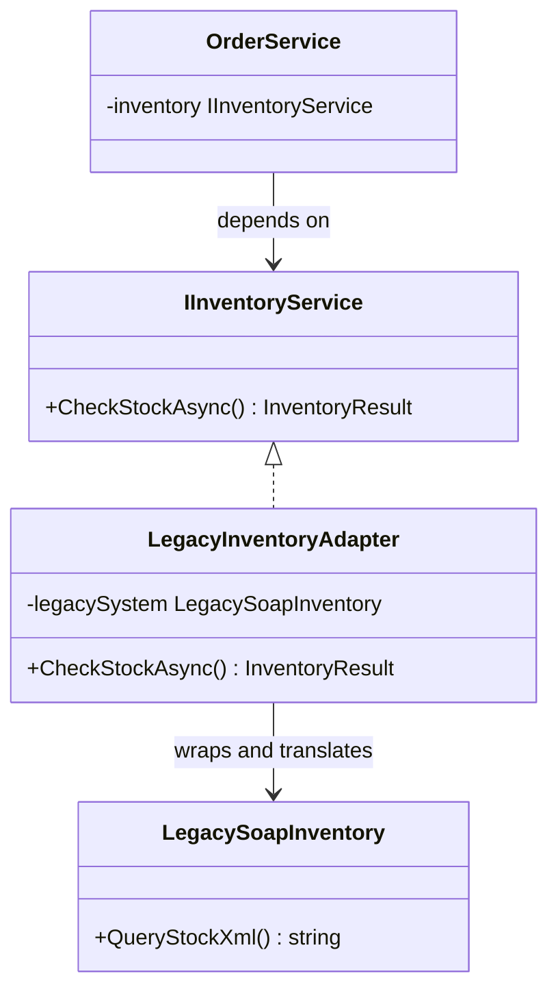

---
{"dg-publish":true,"permalink":"/software-engineering/05-architecture/patterns/design-patterns/structural/adapter/","dg-note-properties":{"topic":["Architecture"],"subtopic":["Patterns"],"level":["2"],"priority":"High","status":["Done"]}}
---

# Adapter

Traveling abroad with a US laptop charger, you discover your plug doesn’t fit the European outlet. You buy a power adapter at the airport. The adapter doesn’t change your charger or rewire the outlet — it sits between them and translates one shape into another. Both sides keep working exactly as before.

The Adapter pattern does the same thing in code: it converts the interface of an existing class into a different interface that clients expect. The adapter implements the target interface your code already works with and holds a reference to the incompatible object (the adaptee). Every method call on the target interface delegates to the adaptee with any necessary translation — converting data formats, mapping method names, or adapting return types. The key insight: the adapter preserves the original capability without modifying either side.



> [!NOTE] Adapter vs Facade vs Bridge
> **Adapter** makes an existing incompatible interface work — it's a retrofit. [[Software Engineering/05 Architecture/Patterns/Design Patterns/Structural/Facade\|Facade]] creates a new simplified interface over a complex subsystem — it's about convenience. [[Software Engineering/05 Architecture/Patterns/Design Patterns/Structural/Bridge\|Bridge]] is designed upfront to separate abstraction from implementation — it's not a retrofit at all.

## Problem

`OrderService` directly calls a legacy SOAP/XML inventory system. The legacy interface leaks into the order domain:

```csharp
public class OrderService
{
    private readonly LegacyInventorySystem _legacyInventory;

    public OrderService(LegacyInventorySystem legacyInventory)
    {
        _legacyInventory = legacyInventory;
    }

    public async Task<bool> ReserveInventoryAsync(Order order)
    {
        foreach (var item in order.Items)
        {
            // ⚠️ Legacy XML format leaks into order domain logic
            var xmlRequest = $"""
                <InventoryRequest>
                    <SKU>{item.ProductId}</SKU>
                    <Quantity>{item.Quantity}</Quantity>
                    <WarehouseCode>WH-001</WarehouseCode>
                </InventoryRequest>
                """;

            // ⚠️ Parsing XML response in the middle of order logic
            var xmlResponse = await _legacyInventory.CheckAndReserveAsync(xmlRequest);
            var doc = XDocument.Parse(xmlResponse);
            var success = doc.Root?.Element("Status")?.Value == "RESERVED";

            if (!success)
            {
                // ⚠️ Error handling tied to legacy error codes
                var errorCode = doc.Root?.Element("ErrorCode")?.Value;
                if (errorCode == "INSUF_STOCK")
                    return false;
                throw new Exception($"Legacy inventory error: {errorCode}");
            }
        }
        return true;
    }
}
```

Here's what breaks when requirements change: replacing the legacy system with a modern REST API requires rewriting `OrderService` — the XML parsing and legacy error codes are embedded throughout.

## Solution

Introduce `IInventoryService` and an adapter that translates between the modern interface and the legacy system:

```csharp
// Target interface — what OrderService wants to work with
public interface IInventoryService
{
    Task<InventoryReservation> ReserveAsync(Guid productId, int quantity, string warehouseCode);
    Task ReleaseAsync(string reservationId);
}

public record InventoryReservation(string ReservationId, bool Success, string? FailureReason);

// Adaptee — the legacy system we can't change
public class LegacyInventorySystem
{
    public Task<string> CheckAndReserveAsync(string xmlRequest) => /* SOAP call */ Task.FromResult("");
    public Task<string> ReleaseReservationAsync(string xmlReleaseRequest) => Task.FromResult("");
}

// Adapter — translates between IInventoryService and LegacyInventorySystem
public class LegacyInventoryAdapter(LegacyInventorySystem legacy) : IInventoryService
{
    public async Task<InventoryReservation> ReserveAsync(Guid productId, int quantity, string warehouseCode)
    {
        // ✅ XML translation isolated here — OrderService never sees it
        var xmlRequest = $"""
            <InventoryRequest>
                <SKU>{productId}</SKU>
                <Quantity>{quantity}</Quantity>
                <WarehouseCode>{warehouseCode}</WarehouseCode>
            </InventoryRequest>
            """;

        var xmlResponse = await legacy.CheckAndReserveAsync(xmlRequest);
        var doc = XDocument.Parse(xmlResponse);
        var status = doc.Root?.Element("Status")?.Value;

        return status == "RESERVED"
            ? new InventoryReservation(doc.Root!.Element("ReservationId")!.Value, true, null)
            : new InventoryReservation("", false, MapLegacyError(doc.Root?.Element("ErrorCode")?.Value));
    }

    public async Task ReleaseAsync(string reservationId)
    {
        var xmlRequest = $"<ReleaseRequest><ReservationId>{reservationId}</ReservationId></ReleaseRequest>";
        await legacy.ReleaseReservationAsync(xmlRequest);
    }

    private static string MapLegacyError(string? errorCode) => errorCode switch
    {
        "INSUF_STOCK" => "Insufficient stock",
        "SKU_NOT_FOUND" => "Product not found in inventory",
        _ => $"Inventory error: {errorCode}"
    };
}

// ✅ OrderService works against the clean interface — no XML, no legacy error codes
public class OrderService(IInventoryService inventory)
{
    public async Task<bool> ReserveInventoryAsync(Order order)
    {
        foreach (var item in order.Items)
        {
            var reservation = await inventory.ReserveAsync(item.ProductId, item.Quantity, "WH-001");
            if (!reservation.Success)
                return false;
        }
        return true;
    }
}

// Replacing legacy with modern REST API = swap the adapter, zero changes to OrderService
builder.Services.AddScoped<IInventoryService, ModernInventoryRestAdapter>();
```

Replacing the legacy system now means writing a new adapter class — `OrderService` never changes.

## You Already Use This

**`StreamReader` / `StreamWriter`** — adapts the byte-oriented `Stream` interface to a text-oriented API. `new StreamReader(fileStream)` wraps a `FileStream` (which speaks bytes) and exposes `ReadLine()`, `ReadToEnd()` (which speak strings). The adapter translates between the two interfaces.

**`ILogger` adapters (Serilog, NLog, Application Insights)** — these logging libraries implement the .NET `ILogger` / `ILoggerProvider` interfaces, adapting their own internal APIs to the .NET logging abstraction. Your code depends on `ILogger<T>`; the adapter translates to Serilog's `ILogger` or NLog's `Logger`.

**`DelegatingHandler` subclasses** — wrap `HttpMessageHandler` to add behavior (auth headers, retry logic, logging) while adapting the `HttpRequestMessage`/`HttpResponseMessage` interface. Each handler in the chain adapts the request/response before passing it along.

## Pitfalls

**Leaky abstraction** — if the legacy system has quirks (rate limits, specific error codes, ordering requirements), the adapter may expose these through the target interface. Example: `IInventoryService.ReserveAsync` returning a legacy-specific error code string. Keep the target interface clean; map all legacy concepts to domain concepts inside the adapter.

## Questions

> [!QUESTION]- How do you test code that uses an Adapter?
> Test the consumer (`OrderService`) by injecting a mock `IInventoryService` — the adapter is invisible to the test. Test the adapter itself with integration tests against the real legacy system (or a recorded response). Unit-testing the adapter with a mock `LegacyInventorySystem` is valid but limited — the real value is verifying the XML translation is correct, which requires the actual legacy format. The tradeoff: integration tests are slower and environment-dependent; unit tests are fast but may miss translation bugs.

> [!QUESTION]- When does an Adapter become a Facade?
> When the adapter starts simplifying the interface rather than just translating it. An Adapter preserves the full capability of the adaptee — every method on `IInventoryService` maps to a corresponding legacy operation. A Facade intentionally hides complexity, exposing only a subset of the subsystem's capabilities. If your "adapter" only exposes 3 of the legacy system's 20 operations and adds orchestration logic, it's a Facade. The distinction matters for maintenance: an Adapter should be a thin translation layer; a Facade can contain business logic.

## References

- [Adapter Pattern — Christopher Okhravi](https://www.youtube.com/watch?v=2PKQtcJjYvc&list=PLrhzvIcii6GNjpARdnO4ueTUAVR9eMBpc&index=8) — video walkthrough of the Adapter pattern with OOP examples
- [Adapter — refactoring.guru](https://refactoring.guru/design-patterns/adapter) — canonical pattern description with object and class adapter variants, C# example
- [StreamReader — Microsoft Learn](https://learn.microsoft.com/en-us/dotnet/api/system.io.streamreader) — .NET's built-in Adapter for byte-to-text stream translation
- [DelegatingHandler — Microsoft Learn](https://learn.microsoft.com/en-us/dotnet/api/system.net.http.delegatinghandler) — HTTP pipeline adapter pattern in .NET
- [Strangler Fig pattern — Microsoft Learn](https://learn.microsoft.com/en-us/azure/architecture/patterns/strangler-fig) — using Adapters to incrementally replace legacy systems

<!-- whats-next:start -->

---

> [!note] Whats next
> **Parent**
>  [[Software Engineering/05 Architecture/Patterns/Design Patterns/Design Patterns\|Design Patterns]]
>
> **Pages**
> - [[Software Engineering/05 Architecture/Patterns/Design Patterns/Structural/Bridge\|Bridge]]
> - [[Software Engineering/05 Architecture/Patterns/Design Patterns/Structural/Composite\|Composite]]
> - [[Software Engineering/05 Architecture/Patterns/Design Patterns/Structural/Decorator\|Decorator]]
> - [[Software Engineering/05 Architecture/Patterns/Design Patterns/Structural/Facade\|Facade]]
> - [[Software Engineering/05 Architecture/Patterns/Design Patterns/Structural/Flyweight\|Flyweight]]
> - [[Software Engineering/05 Architecture/Patterns/Design Patterns/Structural/Proxy\|Proxy]]
<!-- whats-next:end -->
