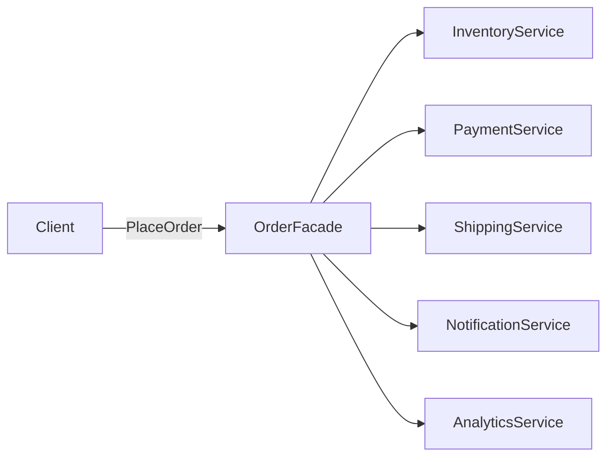

---
{"dg-publish":true,"permalink":"/software-engineering/05-architecture/patterns/design-patterns/structural/facade/","dg-note-properties":{"topic":["Architecture"],"subtopic":["Patterns"],"level":["2"],"priority":"High","status":"Ready to Repeat"}}
---

# Facade

A hotel concierge is a Facade. You walk up and say "I need a restaurant reservation, a taxi, and theater tickets." Behind the scenes, the concierge calls the restaurant, the taxi company, and the box office. You interact with one person instead of three separate services, each with its own phone number, hold music, and booking protocol. The concierge doesn’t add new capabilities — they simplify access to existing ones.

The Facade pattern provides a simplified interface to a complex subsystem. The facade class holds references to subsystem components (inventory, payment, shipping, notification) and exposes high-level methods that coordinate them. The client calls `OrderFacade.PlaceOrderAsync(order)` instead of manually orchestrating five services in the right sequence with the right error handling. The subsystems remain fully accessible for clients that need fine-grained control — the facade is a convenience, not a prison.



> [!NOTE] Facade vs Adapter
> **Facade** creates a **new simplified interface** for your convenience — it's about reducing complexity. [[Software Engineering/05 Architecture/Patterns/Design Patterns/Structural/Adapter\|Adapter]] makes an **existing incompatible interface** fit a target interface — it's about compatibility. Facade is optional (you could call the subsystems directly); Adapter is required (the interfaces are incompatible without it).

## Problem

`CheckoutController` orchestrates 5 services directly. The controller knows too much:

```csharp
[ApiController]
public class CheckoutController(
    IInventoryService inventory,
    IPaymentService payment,
    IShippingService shipping,
    INotificationService notification,
    IAnalyticsService analytics,
    IOrderRepository orderRepository) : ControllerBase
{
    [HttpPost]
    public async Task<IActionResult> CheckoutAsync(CheckoutRequest request)
    {
        // ⚠️ Controller orchestrates 5 services — knows the entire checkout workflow
        var order = await orderRepository.CreateDraftAsync(request.CustomerId, request.Items);

        // ⚠️ Inventory check
        foreach (var item in order.Items)
        {
            var available = await inventory.CheckStockAsync(item.ProductId, item.Quantity);
            if (!available)
                return BadRequest($"Product {item.ProductId} is out of stock");
        }

        // ⚠️ Payment
        var paymentResult = await payment.ChargeAsync(order.Total, request.PaymentMethod);
        if (!paymentResult.Success)
            return BadRequest("Payment failed");

        // ⚠️ Reserve inventory after payment
        await inventory.ReserveAsync(order.Items);

        // ⚠️ Create shipping label
        var shipment = await shipping.CreateLabelAsync(order, request.ShippingAddress);

        // ⚠️ Notifications and analytics — controller shouldn't know about these
        await notification.SendOrderConfirmationAsync(order, shipment.TrackingNumber);
        await analytics.TrackOrderPlacedAsync(order);

        await orderRepository.ConfirmAsync(order.Id, paymentResult.TransactionId, shipment.TrackingNumber);
        return Ok(new { OrderId = order.Id, TrackingNumber = shipment.TrackingNumber });
    }
}
```

Here's what breaks when requirements change: adding fraud detection requires editing the controller. Every endpoint that places orders (web, mobile API, B2B API) duplicates this orchestration.

## Solution

`OrderFacade` encapsulates the checkout workflow. The controller has one dependency:

```csharp
public record CheckoutResult(Guid OrderId, string TrackingNumber, decimal Total);

public class OrderFacade(
    IInventoryService inventory,
    IPaymentService payment,
    IShippingService shipping,
    INotificationService notification,
    IAnalyticsService analytics,
    IOrderRepository orderRepository)
{
    // ✅ Checkout workflow in one place — all callers use the same orchestration
    public async Task<CheckoutResult> PlaceOrderAsync(
        Customer customer,
        IReadOnlyList<OrderItem> items,
        Address shippingAddress,
        PaymentMethod paymentMethod)
    {
        var order = await orderRepository.CreateDraftAsync(customer.Id, items);

        foreach (var item in order.Items)
        {
            if (!await inventory.CheckStockAsync(item.ProductId, item.Quantity))
                throw new OutOfStockException(item.ProductId);
        }

        var paymentResult = await payment.ChargeAsync(order.Total, paymentMethod);
        if (!paymentResult.Success)
            throw new PaymentFailedException(paymentResult.FailureReason);

        await inventory.ReserveAsync(order.Items);
        var shipment = await shipping.CreateLabelAsync(order, shippingAddress);

        await orderRepository.ConfirmAsync(order.Id, paymentResult.TransactionId, shipment.TrackingNumber);

        // ✅ Fire-and-forget side effects — controller doesn't need to know about these
        _ = Task.WhenAll(
            notification.SendOrderConfirmationAsync(order, shipment.TrackingNumber),
            analytics.TrackOrderPlacedAsync(order));

        return new CheckoutResult(order.Id, shipment.TrackingNumber, order.Total);
    }
}

// ✅ Controller has one dependency — knows nothing about the checkout workflow
[ApiController]
public class CheckoutController(OrderFacade orderFacade) : ControllerBase
{
    [HttpPost]
    public async Task<IActionResult> CheckoutAsync(CheckoutRequest request)
    {
        try
        {
            var result = await orderFacade.PlaceOrderAsync(
                request.Customer, request.Items, request.ShippingAddress, request.PaymentMethod);
            return Ok(result);
        }
        catch (OutOfStockException ex) { return BadRequest($"Out of stock: {ex.ProductId}"); }
        catch (PaymentFailedException ex) { return BadRequest($"Payment failed: {ex.Reason}"); }
    }
}

// DI registration
builder.Services.AddScoped<OrderFacade>();
```

Adding fraud detection now means editing `OrderFacade.PlaceOrderAsync` in one place — all callers (web, mobile, B2B) get the update automatically.

## You Already Use This

**`File` static class** — a facade over `FileStream`, `StreamReader`, `StreamWriter`, and `Path`. `File.ReadAllTextAsync("data.json")` hides stream creation, buffering, encoding, and disposal. You could do it manually; `File` makes it one line.

**`HttpClient`** — a facade over `HttpMessageHandler`, `HttpRequestMessage`, `HttpResponseMessage`, connection pooling, and DNS resolution. `client.GetStringAsync(url)` hides the entire HTTP machinery.

**`DbContext` (EF Core)** — a facade over `DbConnection`, `DbCommand`, change tracking, identity map, and SQL generation. `context.Orders.Where(o => o.Status == OrderStatus.Pending).ToListAsync()` hides all of it.

**`WebApplication` minimal APIs** — a facade over `IApplicationBuilder`, `IEndpointRouteBuilder`, `IServiceProvider`, and the hosting infrastructure. `app.MapGet("/orders", handler)` hides the routing pipeline setup.

## Tradeoffs

**Use it when**: a complex subsystem (several collaborating classes, a tricky call sequence) is used the same way by many clients — wrap it in one high-level entry point so callers (and the rest of your code) don't depend on the subsystem's shape. It also decouples clients from churn inside the subsystem.

**Don't reach for it when**: there's no real complexity to hide (one class behind one class is just indirection), or the facade starts **accreting business rules** and becomes a god object — a facade should *orchestrate/simplify*, not *own* domain logic. Keep the subsystem directly accessible for callers that need fine control; a facade is a convenience, not a gatekeeper.

**vs related**: **[[Software Engineering/05 Architecture/Patterns/Design Patterns/Structural/Adapter\|Adapter]]** changes an interface to make things *compatible* (required); Facade *simplifies* an interface for convenience (optional) — see the note above. A **[[Software Engineering/05 Architecture/Patterns/Design Patterns/Behavioral/Mediator\|Mediator]]** coordinates peers bidirectionally; a Facade is a one-way front door. At the network boundary, an **[[Software Engineering/05 Architecture/Distributed Systems/API Gateway\|API Gateway]]** is essentially a Facade over many microservices.

## Questions

> [!QUESTION]- When does a Facade become a "god class" anti-pattern?
> When it starts containing business logic instead of just orchestrating subsystems. A Facade should be a thin coordinator — it calls subsystems in the right order but doesn't make business decisions. If `OrderFacade` starts calculating discounts, validating business rules, or managing state, it's accumulating responsibilities it shouldn't have. The signal: the facade has more than 200-300 lines, or it's the hardest class to test. The fix: extract business logic into domain services; keep the facade as a pure orchestrator. The tradeoff: a thin facade is easy to test (mock all subsystems); a fat facade is hard to test and hard to change.

> [!QUESTION]- Should a Facade expose the subsystems it wraps, or hide them completely?
> Hide them. If callers can access `orderFacade.Payment.ChargeAsync()` directly, they bypass the facade's orchestration and the workflow guarantee breaks. The facade's value is the guaranteed sequence: check stock → charge → reserve → ship → notify. Exposing subsystems lets callers skip steps. The tradeoff: hiding subsystems means callers can't do advanced operations that the facade doesn't expose. In that case, add a new method to the facade rather than exposing the subsystem — the facade's interface should grow to cover legitimate use cases.

## References

- [Facade Pattern — Christopher Okhravi](https://www.youtube.com/watch?v=K4FkHVO5iac&list=PLrhzvIcii6GNjpARdnO4ueTUAVR9eMBpc&index=9) — video walkthrough of the Facade pattern with OOP examples
- [Facade — refactoring.guru](https://refactoring.guru/design-patterns/facade) — canonical pattern description with subsystem diagram and C# example
- [File class — Microsoft Learn](https://learn.microsoft.com/en-us/dotnet/api/system.io.file) — .NET's built-in Facade for file I/O operations
- [HttpClient — Microsoft Learn](https://learn.microsoft.com/en-us/dotnet/api/system.net.http.httpclient) — Facade over the HTTP message handler pipeline
- [DbContext — Microsoft Learn](https://learn.microsoft.com/en-us/dotnet/api/microsoft.entityframeworkcore.dbcontext) — EF Core's Facade over database operations and change tracking

<!-- whats-next:start -->

---

> [!note] Whats next
> **Parent**
>  [[Software Engineering/05 Architecture/Patterns/Design Patterns/Design Patterns\|Design Patterns]]
>
> **Pages**
> - [[Software Engineering/05 Architecture/Patterns/Design Patterns/Structural/Adapter\|Adapter]]
> - [[Software Engineering/05 Architecture/Patterns/Design Patterns/Structural/Bridge\|Bridge]]
> - [[Software Engineering/05 Architecture/Patterns/Design Patterns/Structural/Composite\|Composite]]
> - [[Software Engineering/05 Architecture/Patterns/Design Patterns/Structural/Decorator\|Decorator]]
> - [[Software Engineering/05 Architecture/Patterns/Design Patterns/Structural/Flyweight\|Flyweight]]
> - [[Software Engineering/05 Architecture/Patterns/Design Patterns/Structural/Proxy\|Proxy]]
<!-- whats-next:end -->
