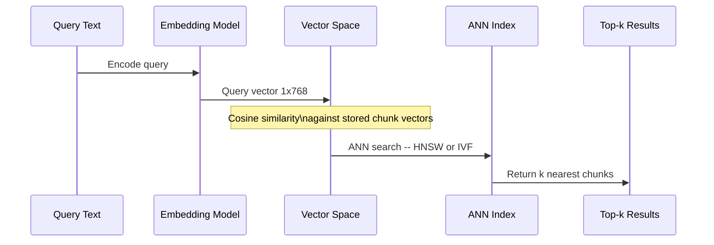

---
{"dg-publish":true,"permalink":"/software-engineering/11-ai-and-ml/llm/embeddings/","dg-note-properties":{"topic":["AI & ML"],"subtopic":["LLM"],"level":["2"],"priority":"High","status":"Done"}}
---

# Intro

Embeddings map text into a dense vector space where semantic similarity becomes geometric proximity — similar meanings land near each other, unrelated meanings land far apart. This is what lets retrieval match a query like "throttle partner API traffic" against a document about "rate limiting for partner plan" even though no keywords overlap.

The mechanism: an encoder model (a transformer trained with contrastive objectives) reads a text span and produces a fixed-length vector. During training, the model learns to push semantically similar pairs closer together and dissimilar pairs apart in vector space. At query time, the system embeds the query with the same model, then finds the nearest stored vectors using cosine similarity or dot product. The closest vectors correspond to the most semantically relevant chunks.

The engineering decision is not just model quality — it is a tradeoff across recall, latency, cost, and domain fit under your corpus and SLA. A model that tops the MTEB leaderboard may still miss your internal terminology.

## Embedding Model Selection

### Model Families

Three categories dominate production RAG systems:

**Proprietary API models** — OpenAI `text-embedding-3-small` (1536-dim) and `text-embedding-3-large` (3072-dim) are the most widely deployed. They support a `dimensions` parameter that truncates vectors at inference time using Matryoshka training. Cohere `embed-v3` adds an `input_type` parameter (`search_document` vs `search_query`) for asymmetric embedding, and covers 100+ languages natively. Check the OpenAI pricing page for current per-token rates — these change frequently.

**Open-source bi-encoders** — Sentence Transformers (SBERT) provides models like `all-MiniLM-L6-v2` (384-dim, 22M params, fast) and `all-mpnet-base-v2` (768-dim, 109M params, higher quality). These run locally with no per-token cost, which matters at scale. The tradeoff is infrastructure: you host inference, manage GPU allocation, and handle model updates.

**Domain-finetuned models** — When general-purpose models underperform on internal terminology, finetuning a base model on your corpus can close the gap. Databricks showed that finetuning `gte-large-en-v1.5` (0.4B params) on synthetic domain data beat `text-embedding-3-large` on FinanceBench retrieval ([[Software Engineering/11 AI & ML/LLM/RAG/Monitoring#Retrieval Quality Metrics\|Recall@10]]: 0.552 vs 0.44). Two common approaches: continued pre-training with MLM for vocabulary adaptation, and contrastive finetuning with synthetic query-document pairs.

### Dimensionality

Higher dimensions give the model more room to represent fine-grained distinctions. But higher dimensions also mean more storage (4 bytes × dimensions per vector), more compute for similarity search, and higher ANN index memory.

Matryoshka Representation Learning (MRL) trains models so that any prefix of the full vector is independently meaningful. OpenAI's `text-embedding-3-large` at 256 dimensions outperforms `ada-002` at 1536 dimensions on MTEB retrieval tasks. This means you can store shorter vectors, search faster, and only use full dimensions when precision demands it.

A practical pattern: index at reduced dimensions for the initial ANN search (fast, cheap), then re-rank the top candidates using full-dimensional vectors or a cross-encoder.

### Similarity Metrics

The choice of similarity metric determines how "closeness" is calculated in vector space:

**Cosine similarity** measures the angle between vectors, ignoring magnitude. Most embedding models are trained with cosine objectives, making it the default choice. Range: -1 to 1 (1 = identical direction).

**Dot product** is cosine similarity scaled by vector magnitudes. When vectors are L2-normalized (as most embedding APIs return them), dot product equals cosine similarity. Some models intentionally encode relevance in magnitude — for these, dot product captures both semantic alignment and confidence.

**Euclidean (L2) distance** measures straight-line distance in vector space. Less common for text embeddings because high-dimensional spaces make absolute distances less discriminative than angular measures.

For most RAG systems: use cosine similarity unless the model documentation specifically recommends dot product.

## Pitfalls

### Distribution Shift on Internal Terminology

A model that scores well on MTEB benchmarks may still fail on your domain. MTEB evaluates on general web text — if your corpus uses internal acronyms, product names, or domain jargon absent from the model's training data, embeddings for those terms will be noisy. Queries and documents containing the same jargon may land far apart in vector space.

Detection: compare recall@k on a held-out set of domain-specific queries vs generic queries. A significant gap signals distribution shift.

Mitigation: finetune with domain data (GPL or continued pre-training on your corpus), or supplement embeddings with keyword search in a [[Software Engineering/11 AI & ML/LLM/RAG/Retrieval\|hybrid retrieval]] setup where BM25 handles exact lexical matches.

### Embedding Model Swap Invalidation

Changing the embedding model — even a minor version — invalidates every stored vector. The new model produces vectors in a different geometric space. Cosine similarity between old and new vectors is meaningless.

This means re-embedding the entire corpus: for a 10M-chunk index at $0.02/1M tokens and 500 tokens/chunk average, that is ~$100 and hours of ingestion time. Key the [[Software Engineering/11 AI & ML/LLM/RAG/Caching\|embedding cache]] by model name + version to prevent serving stale vectors.

### Benchmark Leaderboard Overfitting

MTEB aggregates scores across multiple task families — retrieval, STS, classification, clustering, bitext mining, and others — each containing many individual datasets. A model ranked #1 overall can rank poorly on retrieval-specific datasets because STS, classification, and clustering scores inflate the average. Always filter MTEB by the `Retrieval` task category when selecting for RAG, and validate on your own evaluation set.

### Multilingual Embedding Collapse

Models trained primarily on English text cluster non-English content into a smaller region of vector space, reducing separation between distinct concepts. A Spanish query about "seguridad informática" and one about "seguridad alimentaria" may land closer together than they should because the model undertrained on Spanish semantic distinctions.

Mitigation: use models with explicit multilingual training (Cohere `embed-v3`, SBERT multilingual variants), and evaluate recall per language separately.

## Tradeoffs

| Factor | Proprietary API | Open-Source Self-Hosted | Domain-Finetuned |
| --- | --- | --- | --- |
| Cost at scale | Per-token pricing -- scales linearly | Infrastructure cost -- GPU amortized across volume | Training cost upfront -- inference same as base |
| Recall on general text | High -- trained on massive web corpora | Competitive -- top models match proprietary on MTEB | Depends on base model and training data quality |
| Recall on domain text | Can miss internal terminology | Same limitation as proprietary | Highest -- trained on your distribution |
| Latency | Network round-trip + provider queue | Local inference -- no network hop | Same as self-hosted base model |
| Operational burden | Minimal -- API call | High -- GPU infra and model serving and updates | Highest -- training pipeline plus serving |
| Vendor lock-in | Model changes break vector index | Full control over versioning | Full control |
| Dimensionality control | Some models support MRL truncation | Full control via model choice | Full control |

Decision rule: start with a proprietary API model to establish baseline recall. Measure per-query-type performance. Switch to domain-finetuning only when domain-specific recall failures dominate over chunking or retrieval issues — finetuning the embedding model cannot fix bad chunks.

## Questions

> [!QUESTION]- How can Matryoshka dimensionality reduction lower embedding storage costs without significant recall loss?
> Use the `dimensions` parameter to truncate vectors to 256 or 512 dimensions. Models trained with Matryoshka objectives produce vectors where any prefix is independently meaningful. Truncation to 256 dims reduces storage by ~6x and speeds up ANN search proportionally. Validate by comparing recall@k on your evaluation set at 256, 512, and full dimensions — MRL models can retain strong retrieval quality at reduced dimensions, but the actual degradation is model-specific and corpus-dependent. If recall drops unacceptably, use a two-stage approach: retrieve at reduced dimensions, then re-rank candidates using full-dimensional vectors.

> [!QUESTION]- Why can switching to a higher-scoring embedding model cause recall to drop on existing queries?
> Different embedding models produce vectors in different geometric spaces — cosine similarity between vectors from two different models is meaningless. If the corpus is not re-embedded with the new model, queries encoded with the new model are compared against vectors from the old model, producing degraded or random rankings. The fix is to re-embed the entire corpus with the new model before switching query-time inference. This is also why embedding caches must key by model name and version.

> [!QUESTION]- When is domain-finetuning the embedding model justified over improving chunking or retrieval?
> Finetuning is justified when retrieval failures are specifically caused by semantic mismatches on domain terminology — queries and relevant documents contain the same domain concepts but land far apart in vector space. If failures trace to split logical units (chunking issue), missing metadata filters (retrieval pipeline issue), or query ambiguity (query translation issue), finetuning the embedding model will not help. Diagnose by examining the top-k retrieved chunks for failed queries: if semantically relevant chunks exist but rank low, the embedding model is the bottleneck.

## References

- [Embeddings guide — text-embedding-3 models and MRL (OpenAI)](https://platform.openai.com/docs/guides/embeddings)
- [MTEB leaderboard — filter by Retrieval task (Hugging Face)](https://huggingface.co/spaces/mteb/leaderboard)
- [Pretrained models and MTEB caveats (Sentence Transformers)](https://sbert.net/docs/sentence_transformer/pretrained_models.html)
- [Matryoshka Representation Learning — original MRL paper (arXiv)](https://arxiv.org/abs/2205.13147)
- [Matryoshka embeddings training with MatryoshkaLoss (SBERT)](https://sbert.net/examples/sentence_transformer/training/matryoshka/README.html)
- [Domain adaptation — GPL and adaptive pre-training (SBERT)](https://sbert.net/examples/sentence_transformer/domain_adaptation/README.html)
- [Improving retrieval with embedding finetuning — FinanceBench experiment (Databricks)](https://www.databricks.com/blog/improving-retrieval-and-rag-embedding-model-finetuning)
- [Fine-tuning embeddings for enterprise RAG — Glean lessons (Jason Liu / Glean)](https://jxnl.co/writing/2025/03/06/fine-tuning-embedding-models-for-enterprise-rag-lessons-from-glean/)
- [Introducing Embed v3 — input_type and compression-aware training (Cohere)](https://cohere.com/blog/introducing-embed-v3)
- [Azure OpenAI embeddings — deployment and SDK usage (Microsoft Learn)](https://learn.microsoft.com/en-us/azure/ai-foundry/openai/how-to/embeddings)
<!-- whats-next:start -->

---

> [!note] Whats next
> **Parent**
>  [[Software Engineering/11 AI & ML/11 AI & ML\|11 AI & ML]]
>
> **Topics**
> - [[Software Engineering/11 AI & ML/LLM/Agents/Agents\|Agents]]
> - [[Software Engineering/11 AI & ML/LLM/Evaluation/Evaluation\|Evaluation]]
> - [[Software Engineering/11 AI & ML/LLM/Prompting/Prompting\|Prompting]]
> - [[Software Engineering/11 AI & ML/LLM/RAG/RAG\|RAG]]
>
> **Pages**
> - [[Software Engineering/11 AI & ML/LLM/Context Engineering\|Context Engineering]]
> - [[Software Engineering/11 AI & ML/LLM/Fine-tuning\|Fine-tuning]]
> - [[Software Engineering/11 AI & ML/LLM/Generation\|Generation]]
> - [[Software Engineering/11 AI & ML/LLM/Guardrails\|Guardrails]]
> - [[Software Engineering/11 AI & ML/LLM/Hallucinations\|Hallucinations]]
> - [[Software Engineering/11 AI & ML/LLM/Model Selection and Routing\|Model Selection and Routing]]
> - [[Software Engineering/11 AI & ML/LLM/OWASP vulnerabilities on AI LLM\|OWASP vulnerabilities on AI LLM]]
<!-- whats-next:end -->
