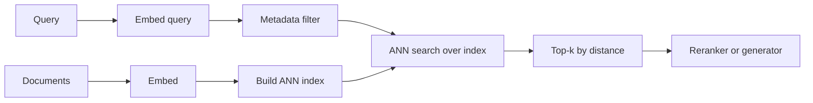

---
{"dg-publish":true,"permalink":"/software-engineering/11-ai-and-ml/llm/rag/vector-databases/","dg-note-properties":{"topic":["AI & ML"],"subtopic":["LLM"],"level":["2"],"priority":"High","status":"Done"}}
---

# Intro

A vector database stores [[Software Engineering/11 AI & ML/LLM/Embeddings\|embeddings]] alongside their metadata and serves nearest-neighbor search over them at scale. It is the infrastructure under dense [[Software Engineering/11 AI & ML/LLM/RAG/Retrieval\|retrieval]]: the [[Software Engineering/11 AI & ML/LLM/RAG/Chunking\|chunks]] you embed have to live somewhere that can find the closest vectors to a query in milliseconds, even across millions or billions of them.

The central trick is **approximate** nearest-neighbor (ANN) search. Exact search compares the query against every stored vector — correct but O(N) per query and far too slow at scale. ANN indexes trade a small, measurable amount of recall for orders-of-magnitude speed, returning *most* of the true nearest neighbors in sub-millisecond time. Every engineering decision in a vector database is a point on that recall–latency–memory surface, and the recall you give up is silent unless you measure it (see [[Software Engineering/11 AI & ML/LLM/RAG/Evaluation/Component-Level Evaluation\|Component-Level Evaluation]] on ANN recall).

## Index Types

The index is the core choice; it sets the recall, latency, memory, and build-time profile.

- **Flat (brute force)** — compare against every vector. Exact, no recall loss, but O(N) per query. Use it for small collections and as the ground truth when measuring ANN recall.
- **HNSW (Hierarchical Navigable Small World)** — a multi-layer proximity graph; search starts coarse at the top layer and descends to fine neighbors, greedily walking toward the query. High recall at low latency, the default in most vector databases. Cost: the graph and vectors live in RAM, so it is memory-hungry. Key parameters: `M` (graph connectivity), `ef_construction` (build-time effort), and `ef_search` (query-time effort — higher means more of the graph explored, higher recall, higher latency).
- **IVF (Inverted File)** — cluster vectors into `nlist` cells (Voronoi partitions); at query time search only the `nprobe` nearest cells. Lower memory and faster build than HNSW; recall depends on `nprobe` (more cells searched, higher recall, slower).
- **PQ (Product Quantization)** — compress each vector into a compact code from a learned codebook, shrinking memory dramatically. Usually combined as **IVF-PQ** for very large corpora where storing full vectors is infeasible, at the cost of additional recall loss from the lossy compression.
- **Disk-based (e.g. DiskANN)** — keep the graph on SSD instead of RAM to serve billion-scale collections where an in-memory index would be prohibitively expensive, trading some latency for far lower memory cost.

[[Software Engineering/11 AI & ML/LLM/Embeddings\|Distance metric]] must match how the embedding model was trained — cosine for most text embedding models, dot product when relevance is encoded in magnitude, Euclidean rarely. An index built for one metric returns wrong neighbors if queried with another.

## Metadata Filtering

Real queries are rarely pure similarity — they are "similar *and* authorized, *and* in this date range, *and* this tenant." How filtering combines with ANN matters:

- **Pre-filtering** narrows the candidate set by metadata *before* the vector search. Required for tenant-safe and ACL-scoped retrieval — semantic similarity does not enforce authorization, so the filter must constrain *which* vectors are even eligible.
- **Post-filtering** runs ANN first, then drops results failing the filter. Simpler, but dangerous under high selectivity: if most top-k results are filtered out, the effective result set shrinks unpredictably and recall collapses.
- **Filtered indexes** — some engines maintain graph connectivity across filter boundaries so recall holds even under narrow filters, at the cost of extra index structure.

See [[Software Engineering/11 AI & ML/LLM/RAG/Retrieval\|Retrieval]] for how pre/post-filtering interacts with the rest of the retrieval pipeline.

## Operations

A vector database is a stateful service, not a static index:

- **Upserts and deletes** — many ANN indexes (HNSW especially) degrade with heavy delete/update churn; deletes are often tombstones that leave the graph fragmented. Plan periodic rebuilds.
- **Index rebuilds and zero-downtime swaps** — re-embedding (a new embedding model) or re-chunking invalidates the index. Build the new collection in parallel and switch via a **collection alias** for instant, reversible cutover (the shadow-index pattern in [[Software Engineering/11 AI & ML/LLM/RAG/Evaluation/Component-Level Evaluation\|Component-Level Evaluation]]).
- **Sharding and replication** — shard for capacity beyond one node, replicate for throughput and availability; watch for hot shards when data clusters semantically.
- **Memory budgeting** — for in-memory indexes, plan roughly `N × dimensions × 4 bytes` for the raw vectors plus graph overhead; this is often the dominant cost and the reason to consider PQ or disk-based indexes at scale.

## Choosing a System

| Category | Examples | When it fits |
| --- | --- | --- |
| Managed vector DB | Pinecone, Azure AI Search, Weaviate Cloud | Want search-as-a-service, no infra ops, willing to pay per usage |
| Self-hosted vector DB | Qdrant, Milvus, Weaviate | Want control over cost, versioning, and data residency; have ops capacity |
| Add-on to existing store | pgvector (Postgres), OpenSearch/Elasticsearch kNN | Already run the database; want vectors beside relational/lexical data and one fewer system |
| Library, not a service | FAISS, hnswlib | Embedding search inside your own app; you own persistence, scaling, and serving |

A practical decision: if you already run Postgres and the corpus is modest, **pgvector** keeps vectors next to your relational data and your existing [[Software Engineering/11 AI & ML/LLM/RAG/Retrieval\|keyword search]], avoiding a second system. Reach for a dedicated vector database when scale, filtered-search recall, or specialized index types (IVF-PQ, DiskANN) exceed what an add-on can do.

## Pitfalls

### Silent Recall Degradation at Scale

**What goes wrong**: as the corpus grows, an HNSW index at a fixed `ef_search` returns fewer of the true nearest neighbors — answer quality drops with no error and no latency change.

**Why it happens**: a denser graph needs more exploration to find true neighbors, but `ef_search` stays constant, so the search covers proportionally less of it. Latency is stable because the search visits the same number of candidates.

**How to avoid it**: measure ANN recall against brute-force ground truth on a schedule, and re-tune `ef_search` (or `nprobe`) as the corpus grows. Infrastructure dashboards will not catch this — only an explicit recall check will (see [[Software Engineering/11 AI & ML/LLM/RAG/Retrieval\|Retrieval]] on silent recall degradation).

### Filtered-Search Recall Collapse

**What goes wrong**: adding a selective metadata filter causes retrieval to return far fewer relevant results than the same query without the filter.

**Why it happens**: post-filtering applies the filter after ANN, so under high selectivity most retrieved candidates are discarded; with graph indexes, narrow filters can also disconnect the search path.

**How to avoid it**: use pre-filtering or a filtered-index capability for selective filters, and evaluate recall at realistic selectivity levels (100%, 10%, 1%), not just unfiltered.

### Memory Blowup from In-Memory Indexes

**What goes wrong**: an HNSW collection that fits comfortably at a million vectors runs out of memory at ten million, with cost scaling faster than expected.

**Why it happens**: HNSW keeps full vectors plus the graph in RAM; cost grows with `N × dimensions` plus graph overhead, and high dimensionality multiplies it.

**How to avoid it**: budget memory up front, reduce dimensionality where the embedding model supports it (see [[Software Engineering/11 AI & ML/LLM/Embeddings\|Matryoshka truncation]]), and move to IVF-PQ or a disk-based index before the corpus outgrows RAM.

### Stale Index After Re-embedding

**What goes wrong**: the embedding model is upgraded but the index is not rebuilt, so new query vectors are compared against vectors from the old model and rankings become meaningless.

**Why it happens**: different embedding models occupy different vector spaces; their vectors are not comparable.

**How to avoid it**: re-embed the entire corpus on any model change, key the [[Software Engineering/11 AI & ML/LLM/RAG/Caching\|embedding cache]] by model version, and cut over with a collection alias after validating recall on the new index.

## Tradeoffs

| Index | Recall | Query latency | Memory | Build cost | Best for |
| --- | --- | --- | --- | --- | --- |
| Flat | Exact (100%) | High (O(N)) | High (raw vectors) | None | Small corpora; ground truth for recall measurement |
| HNSW | High | Low | High (graph in RAM) | Medium–high | The default for most production text RAG |
| IVF | Tunable via `nprobe` | Low–medium | Medium | Low–medium | Large corpora where HNSW memory is too high |
| IVF-PQ | Lower (lossy) | Low | Lowest | Medium | Very large corpora (10M+) where memory dominates |
| DiskANN | High | Medium | Low (on SSD) | High | Billion-scale where in-memory is infeasible |

**Decision rule**: start with HNSW — it is the default for a reason and gives high recall at low latency for most corpora. Move to IVF or IVF-PQ when memory cost becomes the binding constraint, and to a disk-based index only at billion-scale. Whatever the index, measure ANN recall against brute-force ground truth on a schedule and re-tune as the corpus grows; the recall you lose is invisible until you look for it.

## Questions

> [!QUESTION]- Why do vector databases use approximate nearest-neighbor search instead of exact search?
> - Exact (brute-force) search compares the query against every stored vector — correct, but O(N) per query and far too slow once there are millions of vectors
> - ANN indexes (HNSW, IVF, IVF-PQ) trade a small, measurable amount of recall for orders-of-magnitude lower latency, returning most of the true nearest neighbors in sub-millisecond time
> - The recall given up is silent: there is no error, and latency stays stable, so it only shows up as slightly worse retrieved context unless you measure ANN recall against brute-force ground truth
> - The right operating point is chosen by tuning index parameters (`ef_search`, `nprobe`) on the recall–latency curve for your corpus and SLA

> [!QUESTION]- When should you use pgvector or an existing search engine instead of a dedicated vector database?
> - When you already run the database (Postgres, OpenSearch) and the corpus is modest: keeping vectors beside your relational or lexical data avoids operating a second system and simplifies hybrid search
> - pgvector gives you transactional consistency and joins with existing data, which a standalone vector DB cannot
> - Reach for a dedicated vector database when scale, filtered-search recall under narrow filters, or specialized indexes (IVF-PQ, DiskANN) exceed what the add-on supports
> - The tradeoff is operational simplicity (one system) versus peak scale and index flexibility (dedicated engine) — start with the add-on and migrate only when a real limit is hit

> [!QUESTION]- Why does HNSW recall degrade as the corpus grows, and how do you catch it?
> - HNSW finds neighbors by walking a proximity graph, exploring a number of candidates set by `ef_search`; as the graph grows denser, a fixed `ef_search` covers proportionally less of it and misses more true neighbors
> - Latency stays constant (the search visits the same number of candidates) and no error is raised, so infrastructure dashboards show everything healthy while retrieval quality silently drops
> - Detection requires an explicit Recall@k check against brute-force ground truth on a scheduled query set
> - The fix is to re-tune `ef_search` upward as the corpus grows, accepting a little more latency to hold recall

## References

- [Efficient and robust approximate nearest neighbor search using HNSW graphs (Malkov & Yashunin, 2016)](https://arxiv.org/abs/1603.09320) — the HNSW algorithm behind most vector databases.
- [Product Quantization for Nearest Neighbor Search (Jégou et al., 2011)](https://hal.inria.fr/inria-00514462/document) — the compression technique behind IVF-PQ.
- [DiskANN: Fast Accurate Billion-point Nearest Neighbor Search on a Single Node (Subramanya et al., 2019)](https://proceedings.neurips.cc/paper/2019/hash/09853c7fb1d3f8ee67a61b6bf4a7f8e6-Abstract.html) — disk-resident graphs for billion-scale search.
- [Faiss: A Library for Efficient Similarity Search (Meta AI)](https://github.com/facebookresearch/faiss) — the foundational ANN library; index types and tradeoffs.
- [ANN-Benchmarks — recall vs latency across ANN implementations](https://ann-benchmarks.com/) — empirical comparison of index types and libraries.
- [pgvector — open-source vector similarity search for Postgres](https://github.com/pgvector/pgvector) — vectors alongside relational data with HNSW and IVF-Flat indexes.
- [Vector search concepts (Azure AI Search)](https://learn.microsoft.com/en-us/azure/search/vector-search-overview) — managed vector search, filtering, and index configuration in production.

<!-- whats-next:start -->

---

> [!note] Whats next
> **Parent**
>  [[Software Engineering/11 AI & ML/LLM/LLM\|LLM]]
>
> **Topics**
> - [[Software Engineering/11 AI & ML/LLM/RAG/Evaluation/Evaluation\|Evaluation]]
>
> **Pages**
> - [[Software Engineering/11 AI & ML/LLM/RAG/Caching\|Caching]]
> - [[Software Engineering/11 AI & ML/LLM/RAG/Chunking\|Chunking]]
> - [[Software Engineering/11 AI & ML/LLM/RAG/Monitoring\|Monitoring]]
> - [[Software Engineering/11 AI & ML/LLM/RAG/Query Translation\|Query Translation]]
> - [[Software Engineering/11 AI & ML/LLM/RAG/RAG Patterns\|RAG Patterns]]
> - [[Software Engineering/11 AI & ML/LLM/RAG/Re-ranking\|Re-ranking]]
> - [[Software Engineering/11 AI & ML/LLM/RAG/Retrieval\|Retrieval]]
<!-- whats-next:end -->
