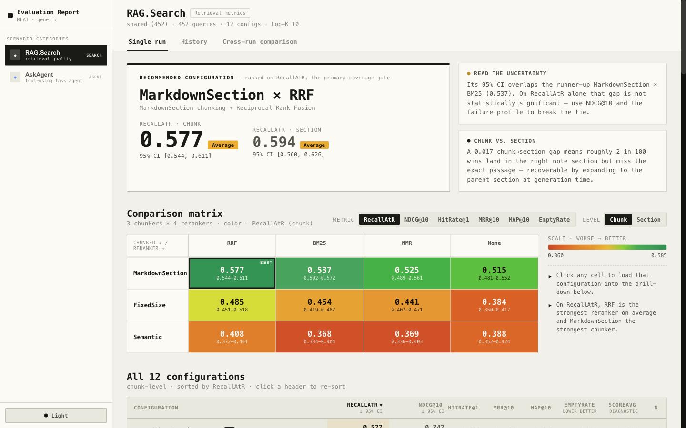

# DevBook RAG Evaluation

This project measures **how well DevBook's retrieval finds the right evidence** for a question, and lets you compare retrieval configurations (chunking strategy × reranking strategy) on a level playing field.

It answers one question precisely: *given a user query, does the RAG search surface the note sections that actually contain the answer, and does it rank them near the top?* It is a **retrieval** evaluation — it does not grade the final generated answer (that would be a separate answer-quality eval).



*The generated `report.fancy.html`: the recommended configuration, the chunking × reranking comparison matrix, and per-metric detail for all 12 combinations.*

---

## How it works (the big picture)

The evaluation has two halves that meet at a single artifact:

```text
 Vault notes ──► (1) Golden dataset generation ──► chunks-shared.json
                                                        │
                                                        ▼
 Live RAG search  ◄── (2) Evaluation runs each query ──┘
   (3 chunkers ×          against every chunking +
    4 rerankers)          reranking combination
        │
        ▼
  Metrics + report.html
```

### The one design decision everything follows from

**There is a single, chunker-neutral golden dataset that scores every chunking strategy.**

Earlier each chunking strategy had its *own* dataset, generated from its *own* chunks. That made cross-strategy comparison meaningless: the strategies were answering different question sets, with ground truth bound to one strategy's chunk IDs. You couldn't say "MarkdownSection retrieves better than FixedSize" because they weren't taking the same test.

The fix: generate **one** question set whose ground truth is expressed in **chunker-independent** terms — *source note + heading + a short verbatim snippet* — and run all strategies against it. A retrieved chunk is judged relevant by **content** (does it come from the right note and contain the expected snippet?), never by chunk ID. This is what makes the comparison fair, and it is the reason almost every design choice below exists.

---

## The golden dataset

### What a dataset contains

One file, `Datasets/chunks-shared.json`, validated by [`Datasets/Schemas/generated-dataset.schema.json`](Datasets/Schemas/generated-dataset.schema.json):

```jsonc
{
  "version": 3,
  "generatedAt": "2026-06-19T…",
  "collection": "shared",          // marker: one dataset for all strategies
  "cases": [
    {
      "id": "shared-what-are-the-main-pitfalls-of-c-value-types-001",
      "query": "What are the main pitfalls of C# value types and reference types…",
      "difficulty": "medium",
      "expected": [                 // flat list of evidence sections, all equal weight
        {
          "documentId": "doc_…",                 // traceability only, not used for matching
          "heading": "Pitfalls",                 // section heading (null for preamble sections)
          "citationLabel": "01 Programming/NET/.../Types.md",  // SOURCE PATH (the match key)
          "text": "Assuming reference types are always safe to pass around…"  // short verbatim SNIPPET
        }
      ]
    }
  ]
}
```

The crucial field is `text`: it is **not** the chunk body, it is a **short locating snippet** (a verbatim sentence, capped at 200 chars). It exists so retrieval can be matched by *containment* — a retrieved chunk is relevant if its text *contains* this snippet. Keeping it short is deliberate: it must fit inside whatever chunk *any* strategy produces (a long snippet could straddle a small chunk's boundary and never match). `citationLabel` carries the source path because the evaluator maps it onto the retrieved document's source.

> **Why no chunk IDs and no graded buckets?** Chunk IDs would re-bind the dataset to one strategy. The evidence list is also flat (no primary/supporting/acceptable) because the scorer treats all expected evidence as equally relevant — graded buckets were collected but never affected any score, so they were removed. See *Design notes* below.

Two companion artifacts are written to `Datasets/Groups/` for inspection (not consumed by the eval): `shared.groups.json` (the groups sent to the LLM) and `summary.json` (run-level counts, including the single- vs multi-evidence split).

### How a dataset is generated

Source of truth is the **raw notes** in the Mongo `documents` collection — the un-chunked copy of each note — so generation is independent of any chunking strategy. Pipeline in [`RunDatasetGeneration.cs`](RunDatasetGeneration.cs):

1. **Load notes** and **split each into heading sections** (`SplitSections`, code-fence aware — a `#` inside a fenced block is not a heading). This mirrors how a note is naturally divided, without depending on a chunker.
2. **Keep substantive sections** only (`--min-section-chars`, ≥12 distinct terms) so trivial sections don't generate noise.
3. **Group cross-note via `[[wikilinks]]`.** A seed note is grouped with the notes it links to, and each section gets a local id (`S1`, `S2`, …). *Why:* real vector search returns chunks from several documents, so a question's evidence should be able to span multiple pages. Wikilinks are the vault's own notion of relatedness, and need no embeddings. Section reuse across groups is capped (`--section-reuse-cap`) so popular notes don't dominate.
4. **Generate queries with an LLM.** Each group is sent to the model, which writes 2–4 realistic queries and, for each, lists the sections needed to answer it plus a short verbatim quote. The prompt **strongly prefers multi-section evidence** so single-evidence cases stay a minority (mirroring top-K retrieval).
5. **Build expected evidence.** Each cited section becomes an expected item: `source path + heading + snippet`. The snippet is the LLM's quote *validated to be a verbatim substring of the section* (`SelectSnippet`); if validation fails it falls back to the section's leading sentence. This guarantees the snippet is always findable inside the real chunk.

The LLM model comes from `GoldenDatasetGeneratorOptions:ModelId` (default `gpt-5.4-mini`), overridable per run with the `GOLDEN_DATASET_MODEL` env var. Mongo/OpenAI settings are read from `appsettings.Evaluations.json`, `DevBook.API/appsettings.Development.json`, user-secrets, and environment variables; secrets are never printed.

### Tweaking the dataset

| Goal | Lever | Notes |
| --- | --- | --- |
| Bigger / smaller dataset | `--max-groups` | Hard cap on groups sent to the LLM. ~120 groups ≈ 450 cases; ~10 ≈ 30–40 cases. The main size dial and the main LLM-cost dial. |
| Separate sizes that coexist | `--label <name>` | Suffixes all output files (`chunks-shared-<name>.json`, `shared-<name>.groups.json`, `summary-<name>.json`). Empty label = the default *full* names. Used for the **mini** variant so it never overwrites full. |
| Section selectivity | `--min-section-chars` | Higher = only longer sections become evidence. |
| Cross-page richness | `--max-linked-notes`, `--sections-per-note`, `--max-sections-per-group` | Control how many notes/sections compose a group → how multi-page the questions can be. |
| Avoid hub-note dominance | `--section-reuse-cap` | Max groups a single section may appear in. |
| Different query style | `GOLDEN_DATASET_MODEL` env | Swap the generation model. |
| Preview before paying for the LLM | `--dry-run` | Runs steps 1–3 only and writes groups + summary. Check `summary.json` (`groups`, `crossNoteGroups`, expected case split) before a real run. |

> Note: the evaluation currently loads the **full** `chunks-shared.json`. The **mini** dataset is for fast generation iteration / inspection; pointing the eval at it is a future tweak (it would need a dataset-name selector in `SearchEvaluation`).

### Run dataset generation

From the repository root:

```bash
# Full dataset (default file names)
dotnet run Platform/DevBook/DevBook.Evaluations/RunDatasetGeneration.cs -- --max-groups 120

# Mini dataset (writes chunks-shared-mini.json etc., coexists with full)
dotnet run Platform/DevBook/DevBook.Evaluations/RunDatasetGeneration.cs -- --label mini --max-groups 10

# Dry run: grouping + summary only, no LLM cost
dotnet run Platform/DevBook/DevBook.Evaluations/RunDatasetGeneration.cs -- --dry-run --max-groups 120
```

The same commands are available as IDE launch profiles in `DevBook.API/Properties/launchSettings.json` (*Run Dataset Generation*, *Run Dataset Generation - Mini*, and their *Dry Run* variants).

---

## Evaluation

### How the dataset is used

Defined in [`SearchEvaluation.cs`](Scenarios/RAG/Search/SearchEvaluation.cs). It loads `chunks-shared.json` and builds a test matrix:

```text
test cases  =  dataset cases  ×  chunking strategies  ×  reranking strategies
```

- **Chunking strategies (3):** `FixedSize`, `MarkdownSection`, `Semantic`.
- **Reranking strategies (4):** `NoReranking`, `Bm25`, `MaximalMarginalRelevance`, `ReciprocalRankFusion` (`Llm` is available but disabled by default).

So every question is run against all 12 combinations — that 12× multiplier is the whole point (one question set, scored on every configuration). With ~450 cases that is ~5,400 tests; use a smaller `--max-groups` (or trim the strategy lists) if that is too heavy, since each test also invokes a live evaluator.

For each `(case, chunker, reranker)`:

1. Call the real `RagSearchService.SearchAsync(query, topK)` with that chunking + reranking configuration (`topK = RagRetrievalPolicy.MaxTopK`).
2. Map the retrieved chunks to comparison documents (real source path, heading, chunk text, score).
3. Build a `SearchPrediction(query, expected[], retrieved[])` and score it.

### How matching works (the chunker-neutral core)

In [`SearchMetricCalculator.cs`](Scenarios/RAG/Search/SearchMetricCalculator.cs). A retrieved chunk is credited as relevant when:

1. **Same source** — its source name matches an expected item's, normalized by filename and wiki-link aware (so `[[Bubble Sort]]`, `…/Bubble Sort.md`, and a heading-qualified link all resolve to the same note); **and**
2. **Evidence present** — the retrieved chunk's text **contains the expected snippet** (heading-agnostic when a snippet exists), or matches the heading when no snippet is given.

Because matching is *containment*, longer chunks (e.g. MarkdownSection) contain short snippets easily; very small chunks are the only ones at mild risk of splitting a snippet. Each retrieved chunk credits **at most one** expected item, and duplicate retrievals of an already-credited source add no extra recall.

Section-level metrics use a **content-aware** section match (same source + matching heading *or* contained snippet). *Why:* `FixedSize` and `Semantic` chunks store no heading, so a strict source+heading key would unfairly zero their section scores; matching by content keeps them comparable.

### The evaluation flow

```text
load chunks-shared.json
  for each case × chunker × reranker:
      RagSearchService.SearchAsync(query)         → retrieved chunks
      score retrieved vs expected (per query)     → per-case metrics
  aggregate by "<chunker>.<reranker>"             → summary metrics + bootstrap CIs
  dotnet aieval report                            → report.html
```

### Run evaluation

```bash
dotnet run Platform/DevBook/DevBook.Evaluations/RunEvaluation.cs -- --name RAG.Search
dotnet run Platform/DevBook/DevBook.Evaluations/RunEvaluation.cs -- --name RAG.Search --open-browser
```

`RunEvaluation.cs` runs the tests, locates the run's report folder, and invokes `dotnet aieval report` to write `report.html`. Also available as the *Run Evaluation* / *Run Evaluation - Open Report* launch profiles.

---

## Reading the results

Each `<chunker>.<reranker>` combination gets a summary block (raw per-case results live under `EvaluationReports/results/<run>/`). Metrics come in **chunk-level** and **section-level** twins so you can see the gap between "found the exact evidence chunk" and "reached the right section".

| Metric | Means | Read it as |
| --- | --- | --- |
| `RecallAtR` | Share of expected evidence found within the first **R** retrieved chunks, where R = number of expected items for that case | **The coverage gate.** Retrieval can't answer with evidence it never surfaced. |
| `HitRateAt1` | Is the top result relevant? | Quality of the very first hit. |
| `MRRAt10` | Reciprocal rank of the first relevant chunk | How early the first hit appears. |
| `MAPAt10` | Average precision over all relevant chunks | Getting *all* expected chunks high, precision-weighted. |
| `NDCGAt10` | Rank quality with log position discount, normalized to the ideal | **Primary ranking-quality number.** Normalization makes it comparable across cases with different R. |
| `Section*` twins | Same metrics after collapsing to source + heading | **The fairest cross-chunker view** — robust to chunk-boundary differences. |
| `EmptyResultRate` | Fraction of queries that returned nothing | Should be 0. |
| `ScoreAverage` | Mean raw retrieval score (diagnostic) | Compare only within the same reranker/scorer scale. |

Ratings (`Exceptional / Good / Average / Poor / Unacceptable`) come from fixed bands in [`SearchEvaluator.cs`](Scenarios/RAG/Search/SearchEvaluator.cs): recall and ranking families grade `≥0.8 Good`, `≥0.5 Average`, `>0 Poor`. `RecallAtR` also flags a per-case **fail** when not all expected evidence was found.

How to read a run:
- Use **`RecallAtR`** as the coverage gate and **`NDCGAt10`** as ranking quality; use the **`Section*`** twins as the fair cross-chunker comparison.
- All expected evidence is weighted equally — the eval measures *whether* evidence was retrieved and ranked well, not which piece was most critical.
- Bootstrap 95% CIs accompany the ranking metrics; at a few hundred cases adjacent configurations often overlap, so don't over-read small gaps.

Established findings from this setup: reranking orders **`RRF > NoReranking > BM25 > MMR`** consistently, and the shipped default is **`MarkdownSection` + `ReciprocalRankFusion`** (configured in [`RagSearchOptions.cs`](../DevBook.Data/Options/RagSearchOptions.cs); other strategies remain selectable).

---

## Design notes (why it's built this way)

- **One shared, chunker-neutral dataset** — the only way to compare chunking strategies fairly; ground truth is content (source + heading + snippet), never chunk IDs.
- **Snippet-containment matching** — short snippets survive any chunk boundary, so the same gold works for 512-char and 1200-char chunks alike.
- **Content-aware section matching** — keeps headingless strategies (FixedSize, Semantic) from being unfairly penalized at the section level.
- **Cross-note grouping via wikilinks** — produces multi-page evidence like real retrieval, with no embedding dependency.
- **Flat, equal-weight evidence** — the scorer never used graded relevance, so the buckets were removed to keep the data honest about what's measured. If evidence *criticality* ever matters, reintroduce graded relevance and switch nDCG to graded gain.
- **Strategy lists are code, not flags** — the chunking/reranking matrix lives in `SearchEvaluation.cs` and the default config in `RagSearchOptions.cs`, so evaluation stays aligned with the app.

### Key files

| File | Role |
| --- | --- |
| [`RunDatasetGeneration.cs`](RunDatasetGeneration.cs) | Generates the golden dataset from raw notes |
| [`RunEvaluation.cs`](RunEvaluation.cs) | Runs the evaluation and builds the report |
| [`Scenarios/RAG/Search/SearchEvaluation.cs`](Scenarios/RAG/Search/SearchEvaluation.cs) | Test matrix, live search, prediction assembly |
| [`Scenarios/RAG/Search/SearchMetricCalculator.cs`](Scenarios/RAG/Search/SearchMetricCalculator.cs) | Chunker-neutral matching and metric math |
| [`Scenarios/RAG/Search/SearchEvaluator.cs`](Scenarios/RAG/Search/SearchEvaluator.cs) | Metric names, rating bands, report wiring |
| [`Datasets/Schemas/`](Datasets/Schemas/) | JSON schemas for dataset, groups, summary |
