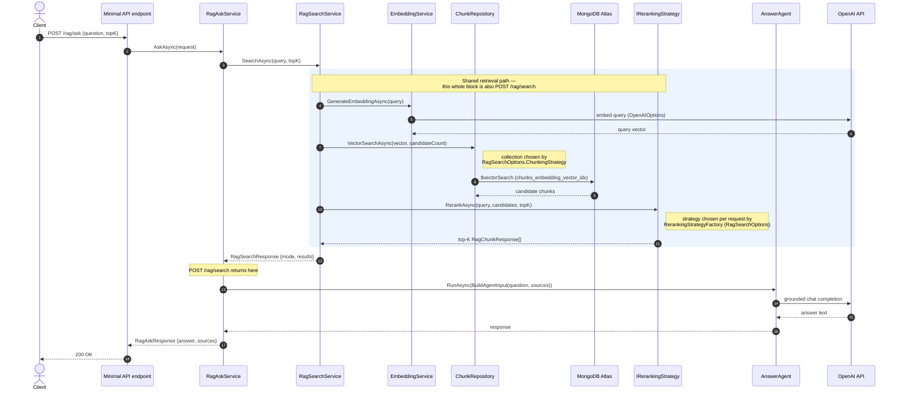

# DevBook API

> Part of **[DevBook](../../README.md)** — the .NET RAG backend over the notes. See also the [website README](../../Web/README.md).

Small local API for ingesting markdown notes, storing documents/chunks in MongoDB through `MongoDB.Driver`, and generating embeddings through `Microsoft.Extensions.AI` with an OpenAI-backed embedding client.

This is a personal R&D proof of concept for learning RAG mechanics, not a production enterprise service. The code intentionally favors a small number of classes and visible constants over extra configuration layers, extension points, and defensive edge-case handling.

## Projects

- `DevBook.API`, minimal ASP.NET Core host.
- `DevBook.Data`, ingestion, chunking, small MongoDB.Driver repositories, Hangfire boilerplate for future jobs, embedding integration, RAG search/ask services, agents, and reranking strategies.
- `DevBook.Evaluations`, test-style RAG search evaluation over generated search datasets and local HTML report generation.
- `DevBook.Tests`, xUnit unit and integration tests for API endpoints, services, chunking, embedding batching, reranking, and evaluation metrics.

## Architecture at a glance

**Composition root.** [`DevBook.API/Program.cs`](DevBook.API/Program.cs) wires the app top to bottom. Every data-layer service, chunking/reranking strategy, repository, agent, and the embedding generator is registered in one place: [`DevBook.Data/ServiceCollectionExtensions.AddServices()`](DevBook.Data/ServiceCollectionExtensions.cs). The knobs and constants a newcomer goes looking for live in [`RagSearchOptions`](DevBook.Data/Options/RagSearchOptions.cs) (active chunker + reranker), [`RagRetrievalPolicy`](DevBook.Data/Services/RagRetrievalPolicy.cs) (top-K caps and candidate multipliers), and [`ChunkVectorIndex`](DevBook.Data/Repositories/ChunkVectorIndex.cs) (the Atlas index name/path/similarity).

**Request lifecycle.** `POST /rag/ask` reuses the entire `/rag/search` retrieval path, then grounds an answer with the `AnswerAgent`. The shaded block is exactly what `/rag/search` runs on its own:



**Chunk domain model.** Several "chunk" types appear in the code; they are pipeline stages, not duplicates:

| Type | Stage | Lives in |
|---|---|---|
| `ChunkContent` | produced by a chunking strategy, **before** embedding | `Services/Chunking/` |
| `ChunkModel` | **stored** MongoDB chunk (text + embedding + citation) | `Models/` |
| `RagChunkResponse` | **returned** to API callers and the answer agent | `Models/` |

**Adding a strategy.** Implement `IChunkingStrategy` (or `IRerankingStrategy`), add a `…Kind` enum member, and register it in `AddServices()`. Chunkers are resolved at DI time and filtered by `Strategy`; rerankers are resolved per request through `IRerankingStrategyFactory`.

## Prerequisites

- MongoDB connection string in `ConnectionStrings:MongoDb`.
- Atlas MongoDB for the current API host. Startup calls `$listSearchIndexes` and creates Atlas Vector Search indexes for each chunking strategy collection before endpoints are served.
- OpenAI API key in `OpenAIOptions:ApiKey` or the `OpenAIOptions__ApiKey` environment variable.
- Optional `OpenAIOptions:Endpoint` or `OpenAIOptions__Endpoint` if you are not using the default OpenAI endpoint.
- Chat agent model IDs come from `AgentConfigBase.ModelId`; override `ModelId` in an agent config when one agent needs a different model.

Required runtime configuration:

```json
{
  "ConnectionStrings": {
    "MongoDb": "<mongo-connection-string>"
  },
  "EmbeddingOptions": {
    "ModelId": "text-embedding-3-small",
    "VectorDimensions": 384
  },
  "OpenAIOptions": {
    "ApiKey": "<openai-api-key>"
  }
}
```

Keep secret values in user-secrets or environment variables, not in committed `appsettings*.json` files.

## Run

From the repo root:

```bash
dotnet run --project Platform/DevBook/DevBook.API/DevBook.API.csproj
```

The local launch profiles use:

- `http://localhost:5288`
- `https://localhost:7280`

## Debug

- Use the `http` or `https` launch profile from `DevBook.API/Properties/launchSettings.json`.
- `ASPNETCORE_ENVIRONMENT` is set to `Development` by those profiles.

## Build and test

Build:

```bash
dotnet build Platform/DevBook/DevBook.API/DevBook.API.csproj
```

Test:

```bash
dotnet test Platform/DevBook/DevBook.Tests/DevBook.Tests.csproj
```

## Evaluation

The `DevBook.Evaluations` project measures **how well retrieval finds the right evidence** for a question: given a query, does RAG search surface the note sections that actually contain the answer, and rank them near the top? It is a **retrieval** evaluation — it does not grade the generated answer — run across the full matrix of chunking strategies × reranking strategies so configurations can be compared on a level playing field.

[](DevBook.Evaluations/README.md)

Established finding: rerankers order **`RRF > NoReranking > BM25 > MMR`** consistently, and the shipped default is **`MarkdownSection` + `ReciprocalRankFusion`** (configured in [`DevBook.Data/Options/RagSearchOptions.cs`](DevBook.Data/Options/RagSearchOptions.cs)).

> **Methodology, golden dataset, and metrics** are documented in the deep-dive: **[DevBook.Evaluations/README.md](DevBook.Evaluations/README.md)**. Every chunking strategy is scored against one chunker-neutral dataset, `chunks-shared.json`, in `DevBook.Evaluations/Datasets/`.

### Build

```bash
dotnet build Platform/DevBook/DevBook.Evaluations/DevBook.Evaluations.csproj
```

### Configuration

Evaluation runs load configuration from `DevBook.Evaluations/appsettings.json`, `DevBook.Evaluations/appsettings.Evaluations.json`, and environment variables. Before running live evaluations, provide:

- `ConnectionStrings:MongoDb` with an Atlas connection string that has the vector-search index.
- `OpenAIOptions:ApiKey` with an OpenAI API key.

If either value is missing, the scenario tests are skipped and no new evaluation report folder is created.

Live LLM evaluations cap NUnit worker parallelism at 4. When OpenAI returns HTTP `429` from an evaluation call, the eval runner reads `x-ratelimit-reset-requests` and `x-ratelimit-reset-tokens`, waits for the longer reset duration plus one second, logs the retry delay, then retries up to `EvaluationRateLimitOptions:MaxRetryAttempts`:

```json
{
  "EvaluationRateLimitOptions": {
    "MaxRetryAttempts": 5
  }
}
```

### Run

Restore the local report tool once from the repo root — the tool manifest tracks `Microsoft.Extensions.AI.Evaluation.Console`, which provides `dotnet aieval report`:

```bash
dotnet tool restore
```

Run the evaluation. This runs the scenario tests, locates the run's report folder, and writes `report.html`:

```bash
ConnectionStrings__MongoDb="<mongo-connection-string>" \
OpenAIOptions__ApiKey="<openai-api-key>" \
dotnet run --project Platform/DevBook/DevBook.Evaluations/DevBook.Evaluations.csproj -- --name RAG.Search
```

Selecting and running the `DevBook.Evaluations` project in the IDE executes the same `RunEvaluation.cs` report-generation flow, which invokes the report command for the latest run folder:

```bash
dotnet aieval report --path EvaluationReports --output <latest-run>/report.html
```

## Ingestion API

Endpoint:

```text
POST /ingestion/documents
```

Example request:

```json
{
  "sourcePath": "11 AI & ML/LLM/RAG",
  "fileName": "Chunking.md",
  "forceReingest": false,
  "chunkingStrategy": "MarkdownSection"
}
```

Example full-folder request:

```json
{
  "sourcePath": "11 AI & ML/LLM/RAG",
  "fileName": null,
  "forceReingest": true
}
```

Example full-root request:

```json
{
  "sourcePath": null,
  "fileName": null,
  "forceReingest": true
}
```

## Ingestion rules

- `sourcePath` is **relative to** the configured ingestion root; null or blank ingests the full root.
- Default ingestion root: `Vault/Software Engineering`.
- `fileName` is optional, but when present it must be a single `.md` file name with no path segments.
- `forceReingest` is optional and defaults to `false`; set it to `true` to refresh stored documents/chunks even when the source content is unchanged.
- `chunkingStrategy` is optional. When omitted, ingestion writes chunks for all registered strategies: `FixedSize`, `MarkdownSection`, and `Semantic`. When set, ingestion updates only that strategy collection.
- Requests are rejected if they try to escape the configured ingestion root.
- Folder ingestion reads matching markdown files with `dg-publish: true` frontmatter and skips files under `Templates`; individual markdown file size is not checked.
- Folder ingestion scans current markdown files, compares hashes against stored documents, upserts only new or changed files, deletes only stored documents whose files no longer exist, and chunks/embeds only changed documents. Single-file ingestion stays scoped to that file and does not delete sibling documents.
- Hangfire server/storage is wired for future background work, but ingestion chunking currently runs inline from the API request; no ingestion job is registered.

Persistence is intentionally driver-only. The app uses two tiny repositories over `MongoDB.Driver`: one for document lookup/upsert and one for chunk replacement/vector search. There is no EF Core DbContext, migration layer, generic repository, or unit-of-work abstraction.

## RAG API

`/rag/search` performs real vector retrieval against the configured strategy collection: `chunks.fixedsize`, `chunks.markdownsection`, or `chunks.semantic`. It embeds the query with the configured embedding model, retrieves candidates with Atlas `$vectorSearch`, reranks them with the configured reranking strategy, and returns a mode such as `vector+Bm25`.

`/rag/ask` performs the same real vector chunk retrieval as `/rag/search`, sends the retrieved chunks to a Microsoft Agent Framework `AnswerAgent`, and returns the generated answer with the retrieved chunks as sources.

Search chunks:

```text
POST /rag/search
```

```json
{
  "query": "when should I use RAG",
  "topK": 5
}
```

`topK` defaults to `5`, values less than or equal to zero fall back to `5`, and values above `10` are capped at `10`. Chunking and reranking are configured through `RagSearchOptions`, not per request. Defaults are `MarkdownSection` and `Bm25`.

Example QA request for a blank query:

```bash
curl -i http://localhost:5288/rag/search \
  -H "Content-Type: application/json" \
  -d '{"query":"   ","topK":5}'
```

Expected response shape:

```json
{
  "type": "https://tools.ietf.org/html/rfc9110#section-15.5.1",
  "title": "Bad Request",
  "status": 400,
  "detail": "Query is required."
}
```

Example QA request for vector retrieval:

```bash
curl -s http://localhost:5288/rag/search \
  -H "Content-Type: application/json" \
  -d '{"query":"when should I use RAG","topK":5}'
```

Expected response shape:

```json
{
  "query": "when should I use RAG",
  "mode": "vector+Bm25",
  "results": [
    {
      "chunkId": "<chunk-id>",
      "documentId": "<document-id>",
      "chunkText": "<matched chunk text>",
      "heading": "<document heading or null when the selected chunking strategy does not preserve headings>",
      "citationLabel": "<citation>",
      "score": 0.82
    }
  ]
}
```

Ask a question:

```text
POST /rag/ask
```

```json
{
  "question": "When should I use RAG instead of fine tuning?",
  "topK": 5
}
```

The answer field is generated by the grounded RAG answer agent. The `sources` array comes from real vector retrieval against MongoDB chunks.

Only `markdownsection` chunks preserve Markdown heading metadata and section-level citation labels. `fixedsize` and pure `semantic` chunks can cross or ignore source headings, so their `heading` is `null` and their citations point to the document.

## Atlas Vector Search index

The API tries to create this Atlas Vector Search index at startup on every strategy collection: `chunks.fixedsize`, `chunks.markdownsection`, and `chunks.semantic`.

```json
{
  "name": "chunks_embedding_vector_idx",
  "type": "vectorSearch",
  "definition": {
    "fields": [
      {
        "type": "vector",
        "path": "Embedding",
        "numDimensions": 384,
        "similarity": "cosine"
      }
    ]
  }
}
```

The index dimensions come from `EmbeddingOptions:VectorDimensions`. The index name, vector path (`Embedding`), and similarity are defined once in [`ChunkVectorIndex`](DevBook.Data/Repositories/ChunkVectorIndex.cs) — the single source shared by index creation at startup ([`MongoSearchIndexExtensions`](DevBook.API/Extensions/MongoSearchIndexExtensions.cs)) and `$vectorSearch` at query time ([`ChunkRepository`](DevBook.Data/Repositories/ChunkRepository.cs)) — and must stay `Embedding` unless the chunk model and index are changed together.

## RAG troubleshooting

- Missing Atlas Search support: the API startup path lists and creates search indexes. A local/non-Atlas MongoDB instance can fail before endpoints are served unless that startup behavior is changed.
- Missing index: if startup cannot create `chunks_embedding_vector_idx` on the selected strategy collection, `/rag/search` cannot run Atlas `$vectorSearch` successfully.
- Dimension mismatch: the Atlas index uses `384` dimensions, so `EmbeddingOptions:ModelId` must stay `text-embedding-3-small` with `EmbeddingOptions:VectorDimensions = 384` unless you rebuild stored chunk embeddings and recreate the index with matching dimensions.
- Empty results: if `/rag/search` returns a vector mode with an empty `results` array, first ingest publishable markdown documents for the configured chunking strategy so the API can create chunks and embeddings. A valid index cannot return matches when the selected strategy collection has no embedded chunks.
- Secret handling: keep `ConnectionStrings:MongoDb` and `OpenAIOptions:ApiKey` in user-secrets or environment variables only. Use double underscores for environment variables, for example `ConnectionStrings__MongoDb` and `OpenAIOptions__ApiKey`. Committed configuration should contain placeholders or non-secret defaults.

## Runtime flow

1. The API validates the request and scans markdown files under the configured ingestion root.
2. Folder ingestion loads stored documents under the selected folder scope and compares them with current file paths and content hashes.
3. Missing files delete their stored documents and chunks; unchanged files are skipped unless `forceReingest` is true.
4. New or changed markdown documents are created or updated in MongoDB.
5. Changed documents are chunked and embedded before the ingestion response returns.
6. Chunk replacement deletes the document's previous chunks and inserts the new embedded chunks.
