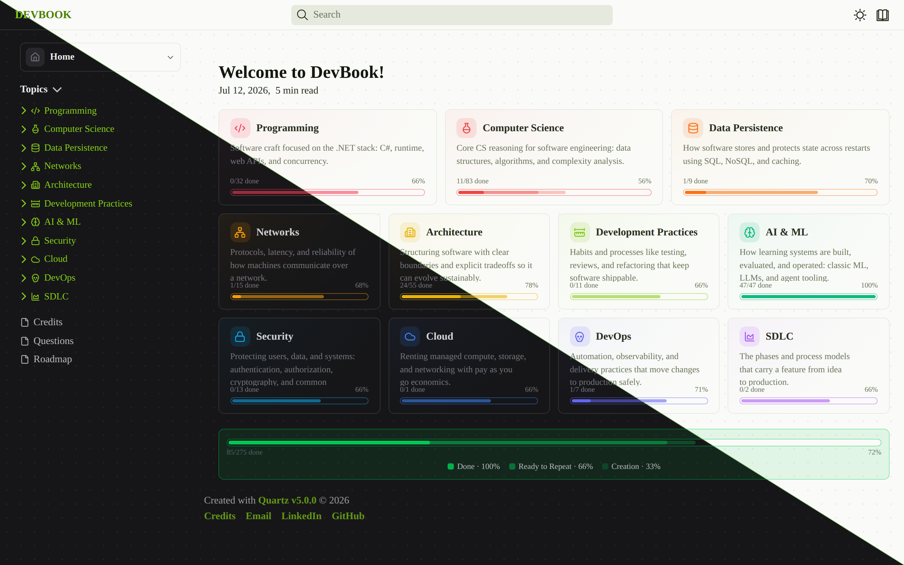

# DevBook

> A personal Senior .NET / AI software-engineering knowledge base — authored in [Obsidian](https://obsidian.md), published as a static website, and paired with a .NET RAG backend that searches and answers over the same notes.

**🔗 Live site: [devbook.zip](https://devbook.zip)**

[](https://devbook.zip)

## What It Is

A structured collection of software engineering notes covering 11 topic areas, designed for learning and interview preparation at a Senior .NET / AI engineering level. Every note follows a strict quality bar: intro in your own words, concrete examples, pitfalls, tradeoffs, interview-style questions, and curated references.

The same notes feed two things: a **static website** (write in Obsidian → publish with Quartz Syncer → auto-deploy) and a **.NET RAG backend** — a personal R&D proof of concept for learning retrieval mechanics (ingestion, chunking, embeddings, vector search, reranking, and evaluation) over real content.

### Topic Areas

| # | Topic | Scope |
|---|-------|-------|
| 01 | Programming | Languages, paradigms, .NET ecosystem |
| 02 | Computer Science | Data structures, algorithms, fundamentals |
| 03 | Data Persistence | Databases, EF Core, caching, indexing |
| 04 | Networks | Protocols, HTTP, sockets, DNS |
| 05 | Architecture | Design patterns, system design, DDD |
| 06 | Development Practices | Testing, code quality, CI/CD practices |
| 07 | Security | Auth, encryption, OWASP, identity |
| 08 | SDLC | Software development lifecycle |
| 09 | DevOps | Containers, orchestration, IaC |
| 10 | Cloud | Azure, cloud-native patterns |
| 11 | AI & ML | LLMs, RAG, embeddings, evaluation |

## The Three Pillars

| Directory | What it is | Docs |
|-----------|------------|------|
| **`Vault/`** | The Obsidian vault — where all notes live and are authored | — |
| **`Web/`** | Quartz v5 static site that publishes the vault to [devbook.zip](https://devbook.zip) | [Web/README.md](Web/README.md) |
| **`Platform/`** | .NET RAG backend (ingestion, vector search, ask agent) + retrieval evaluation over the notes | [Platform/DevBook/README.md](Platform/DevBook/README.md) |

```text
DevBook/
├── Vault/        # The Obsidian vault (open this in Obsidian)
├── Web/          # Quartz v5 site that publishes the vault       → Web/README.md
├── Platform/     # .NET RAG backend + evaluation                 → Platform/DevBook/README.md
├── .scripts/     # Vault maintenance automation (Python)
├── .githooks/    # Pre-commit hook that runs the automations
└── AGENTS.md     # AI agent operating contract
```

## Documentation

- **[WORKFLOW.md](WORKFLOW.md)** — the SDLC: issues, project board, PR review, and release automation.
- **[Web/README.md](Web/README.md)** — the content → site pipeline: Obsidian authoring, the Quartz Syncer publish step, the Quartz build, dashboards, customizations, and automations.
- **[Platform/DevBook/README.md](Platform/DevBook/README.md)** — the .NET RAG backend: ingestion, vector search, the ask agent, and the **[Evaluation](Platform/DevBook/README.md#evaluation)** section.
- **[Platform/DevBook/DevBook.Evaluations/README.md](Platform/DevBook/DevBook.Evaluations/README.md)** — the RAG retrieval evaluation deep-dive (golden dataset, metrics, methodology).

## Quick Start

```bash
git clone https://github.com/grafanaKibana/devbook.zip.git
cd devbook.zip
```

- **Edit notes** — open `Vault/` as an Obsidian vault.
- **Run the website** — see [Web/README.md](Web/README.md#local-development) (`cd Web && npm ci && npx quartz build --serve`).
- **Run the backend** — see [Platform/DevBook/README.md](Platform/DevBook/README.md#run) (`dotnet run --project Platform/DevBook/DevBook.API/DevBook.API.csproj`).

## License

[MIT License](LICENSE)
