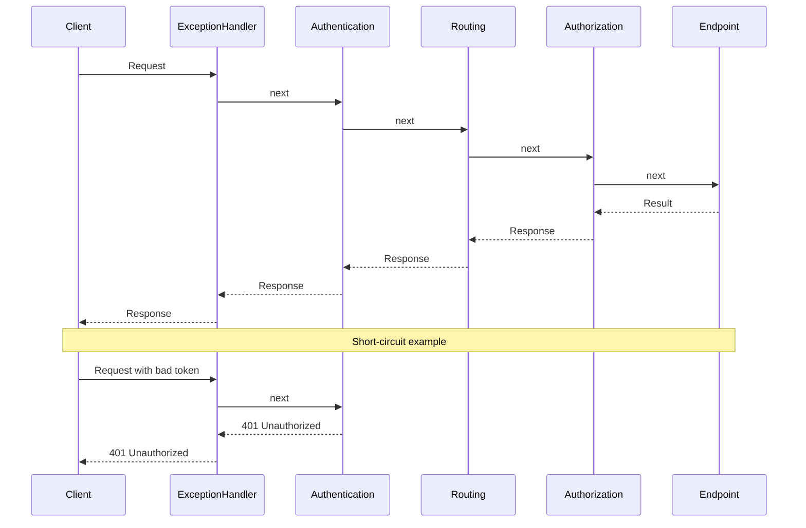

---
topic:
  - Programming
subtopic:
  - NET
level:
  - "3"
priority: Medium
status: Not-Started
---
# Intro

ASP.NET Core middleware are components that form the HTTP request pipeline. Each middleware wraps the next like nested layers, processing requests on the way in and responses on the way out.

## Deeper Explanation

Each middleware wraps the next like nested layers. On the way **in**, a middleware can inspect or modify the request before calling `next`. On the way **out**, it can inspect or modify the response. Any middleware can **short-circuit** by returning a response without calling `next` — for example, `Authentication` can reject an unauthenticated request before it ever reaches `Routing`.



## Questions

> [!QUESTION]- What is middleware in ASP.NET Core?
> Middleware is a component in the HTTP request pipeline. It can inspect/modify the request and response, call the next component, or short-circuit the pipeline (for example, return a cached response without calling the next middleware). Order matters.

> [!QUESTION]- Action filter vs middleware: what is the difference?
> Middleware is pipeline-level and can apply to all requests (before routing/MVC, around endpoint execution). Action filters are MVC-level and run only for MVC actions, with access to action context, model binding, and results; they are a better fit for cross-cutting concerns that are specific to controller actions.

> [!QUESTION]- How can you log execution time for all requests?
> Use a middleware that measures elapsed time around `next()` and logs it (or an action filter if you only care about MVC actions).
>
> ```csharp
> app.Use(async (ctx, next) =>
> {
>     var sw = System.Diagnostics.Stopwatch.StartNew();
>     try
>     {
>         await next();
>     }
>     finally
>     {
>         sw.Stop();
>         app.Logger.LogInformation("{Method} {Path} -> {StatusCode} in {ElapsedMs} ms",
>             ctx.Request.Method,
>             ctx.Request.Path,
>             ctx.Response.StatusCode,
>             sw.ElapsedMilliseconds);
>     }
> });
> ```

> [!QUESTION]- How can you centrally catch errors for all requests?
> Add a global exception-handling middleware. In ASP.NET Core this is commonly done with `app.UseExceptionHandler(...)` (and `app.UseDeveloperExceptionPage()` in development). The handler can log the exception and return a consistent error response (for example, RFC 7807 Problem Details).

> [!QUESTION]- What is the ASP.NET request processing pipeline?
> A request is received by the host (for example, Kestrel) and then flows through an ordered chain of middleware. Middleware can add features (routing, authN/authZ, CORS, compression, etc.), select an endpoint, and finally execute the endpoint (MVC action, Minimal API handler, etc.). On the way back out, the middleware chain unwinds, allowing post-processing of the response.

> [!QUESTION]- What is an action filter?
> An MVC filter (for example, implementing `IActionFilter`/`IAsyncActionFilter`) that runs before and/or after a controller action executes. It can validate inputs, modify the action arguments, short-circuit by setting a result, or wrap execution to implement cross-cutting concerns such as logging, caching, and metrics.

## Links

- [Middleware in ASP.NET Core](https://learn.microsoft.com/en-us/aspnet/core/fundamentals/middleware/)
- [Handle errors in ASP.NET Core](https://learn.microsoft.com/en-us/aspnet/core/fundamentals/error-handling)
- [Filters in ASP.NET Core](https://learn.microsoft.com/en-us/aspnet/core/mvc/controllers/filters)

# Whats next

:LiArrowUpLeft: `dv: link(regexreplace(this.file.folder, "/[^/]+$", "") + "/" + regexreplace(regexreplace(this.file.folder, "/[^/]+$", ""), "^.*/", ""), regexreplace(regexreplace(this.file.folder, "/[^/]+$", ""), "^.*/", ""))`

```dataviewjs
const cur = dv.current();
const curFolder = cur.file.folder;
const curPath = cur.file.path;

const isFolderNote = (p) => (p.file.tags ?? []).includes("#FolderNote");

const children = dv.pages()
  .where(p => p.file.folder.startsWith(curFolder + "/"))
  .where(p => p.file.folder.split("/").length === curFolder.split("/").length + 1)
  .where(p => p.file.name === p.file.folder.split("/").slice(-1)[0])
  .where(p => isFolderNote(p))
  .sort(p => p.file.folder, "asc");

const pages = dv.pages()
  .where(p => p.file.folder === curFolder)
  .where(p => p.file.path !== curPath)
  .where(p => !isFolderNote(p))
  .sort(p => p.file.name, "asc");
  
  if (children.length) {
	  dv.header(2, "Topics");
	  dv.list(children.map(p => p.file.link));
  }
  if (pages.length) {
	  dv.header(2, "Pages");
	  dv.list(pages.map(p => p.file.link));
  }
  
```

