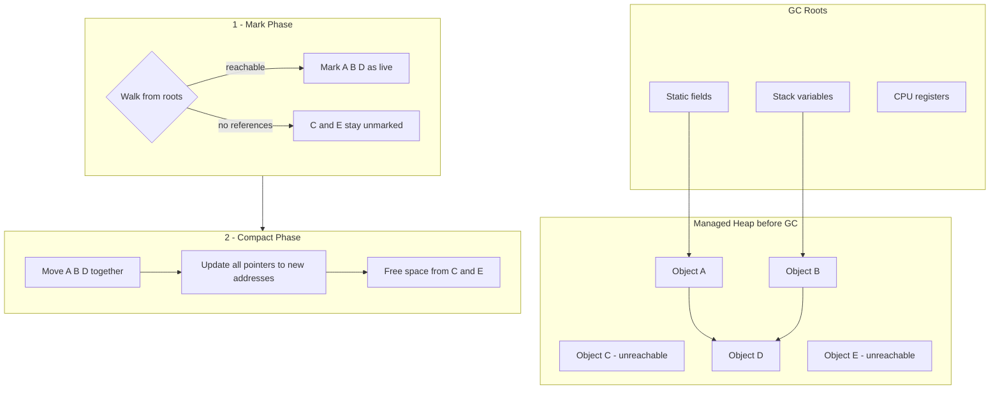
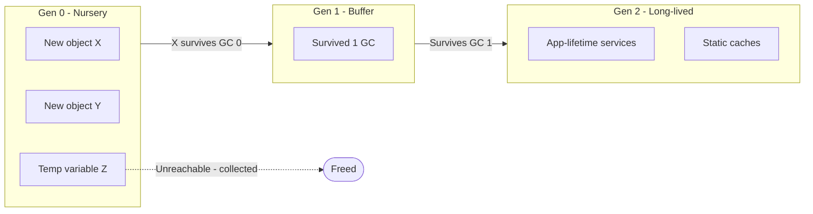

---
topic:
  - Programming
subtopic:
  - NET
level:
  - "1"
priority: Medium
status: Not-Started
---
## Parent
:LiArrowUpLeft: `= link(regexreplace(this.file.folder, "/[^/]+$", "") + "/" + regexreplace(regexreplace(this.file.folder, "/[^/]+$", ""), "^.*/", ""), regexreplace(regexreplace(this.file.folder, "/[^/]+$", ""), "^.*/", ""))`

---
## Intro

Сборщик мусора (GC) в общем языковом среде (CLR) служит автоматическим менеджером памяти которые управляет выделением и освобождением памяти для вашего приложения. Каждый раз, когда создаётся новый объект, среда выполнения выделяет память для объекта из управляемой кучи. Пока в управляемой куче доступно адресное пространство, среда выполнения продолжает выделять пространство для новых объектов.

Однако память не бесконечна. В конечном итоге сборщик мусора должен выполнить сборку, чтобы освободить некоторую память. Оптимизирующий движок сборщика мусора определяет наилучшее время для выполнения сборки, исходя из производимых выделений. Когда сборщик мусора выполняет сборку, он проверяет объекты в управляемой куче, которые больше не используются приложением, и выполняет необходимые операции для восстановления их памяти.

Сборщик мусора предоставляет следующие преимущества:

- Освобождает разработчиков от необходимости вручную освобождать память.
- Эффективно выделяет объекты на управляемой куче.
- Восстанавливает объекты, которые больше не используются, очищает их память и сохраняет память доступной для будущих выделений.
- Управляемые объекты автоматически получают чистое содержимое, поэтому их конструкторы не должны инициализировать каждое поле данных.
- Обеспечивает безопасность памяти, убедившись, что объект не может использовать для себя память, выделенную для другого объекта.

Сборщик мусора .NET не выделяет или не освобождает неуправляемую память. Шаблон для уничтожения объекта, называемый шаблоном `dispose`. Шаблон `dispose` используется для объектов, которые реализуют интерфейс `IDisposable`.

## Управляемая куча

После инициализации сборщика мусора среда CLR выделяет сегмент памяти для хранения объектов и управления ими. Эта память называется управляемой кучей в отличие от собственной кучи операционной системы.

Для каждого управляемого процесса существует управляемая куча. Все потоки в процессе выделяют память для объектов в одной и той же куче.

Для резервирования памяти сборщик мусора вызывает функцию Windows [VirtualAlloc](https://learn.microsoft.com/ru-ru/windows/desktop/api/memoryapi/nf-memoryapi-virtualalloc) и резервирует для управляемых приложений по одному сегменту памяти за раз. Сборщик мусора также резервирует сегменты по мере необходимости и освобождает сегменты обратно в операционную систему (после очистки от любых объектов) путем вызова функции [Windows VirtualFree](https://learn.microsoft.com/ru-ru/windows/desktop/api/memoryapi/nf-memoryapi-virtualfree) .

> [!TIP]
> 🚨 Размер сегментов, выделенных сборщиком мусора, зависит от реализации и может быть изменен в любое время, в том числе при периодических обновлениях. Приложение не должно делать никаких допущений относительно размера определенного сегмента, полагаться на него или пытаться настроить объем памяти, доступный для выделения сегментов.

Чем меньше объектов распределено в куче, тем меньше придется работать сборщику мусора. При размещении объектов не используйте округленные значения, превышающие фактические потребности, например не выделяйте 32 байта, когда необходимо только 15 байтов.

Активированный процесс сборки мусора освобождает память, занятую неиспользуемыми объектами. Процесс освобождения сжимает живые объекты, чтобы они перемещались вместе, и мертвое пространство удаляется, тем самым уменьшая кучу. Этот процесс гарантирует, что объекты, выделенные вместе, остаются вместе в управляемой куче, чтобы сохранить свое расположение.

Степень вмешательства (частота и длительность) сборок мусора зависит от числа распределений и сохранившейся в управляемой куче памяти.

Кучу можно рассматривать как совокупность двух куч: [куча больших объектов](https://learn.microsoft.com/ru-ru/dotnet/standard/garbage-collection/large-object-heap) - Large Object Heap, и куча маленьких объектов - Small Object Heap. Куча больших объектов содержит объекты размером от 85 000 байтов, обычно представленные массивами. Редко объект экземпляра может быть очень большим.

> [!TIP]
> Вы можете [**настроить пороговый размер**](https://learn.microsoft.com/ru-ru/dotnet/core/runtime-config/garbage-collector#large-object-heap-threshold) для объектов, помещаемых в кучу больших объектов.

## Освобождение памяти

Механизм оптимизации сборщика мусора определяет наилучшее время для выполнения сбора, основываясь на произведенных выделениях памяти. Когда сборщик мусора выполняет очистку, он освобождает память, выделенную для объектов, которые больше не используются приложением. Он определяет, какие объекты больше не используются, анализируя *корни*приложения. Корни приложения содержат статические поля, локальные переменные в стеке потока, регистры процессора, дескрипторы сборки мусора и очередь завершения. Каждый корень либо ссылается на объект, находящийся в управляемой куче, либо имеет значение NULL. Сборщик мусора может запросить остальную часть среды выполнения для этих корней. Сборщик мусора использует этот список для создания графа, содержащего все объекты, доступные из корней.

Объекты, которых нет в графе, недоступны из корней приложения. Сборщик мусора считает недостижимые объекты мусором и освобождает выделенную для них память. В процессе очистки сборщик мусора проверяет управляемую кучу, отыскивая блоки адресного пространства, занятые недостижимыми объектами. При обнаружении недостижимого объекта он использует функцию копирования памяти для уплотнения достижимых объектов в памяти, освобождая блоки адресного пространства, выделенные под недостижимые объекты. После уплотнения памяти, занимаемой достижимыми объектами, сборщик мусора вносит необходимые поправки в указатель, чтобы корни приложения указывали на новые расположения объектов. Он также устанавливает указатель управляемой кучи в положение после последнего достижимого объекта.

### Условия для сборки мусора

Сборка мусора возникает при выполнении одного из следующих условий:

- Недостаточно физической памяти в системе. Размер памяти определяется уведомлением о нехватке памяти от операционной системы или нехватке памяти, как указано узлом.
- Объем памяти, используемой объектами, выделенными в управляемой куче, превышает допустимый порог. Этот порог непрерывно корректируется во время выполнения процесса.
- Вызывается метод [GC.Collect](https://learn.microsoft.com/ru-ru/dotnet/api/system.gc.collect) . Почти во всех случаях не нужно вызывать этот метод, так как сборщик мусора работает непрерывно. Этот метод в основном используется для уникальных ситуаций и тестирования.

## Модель исполнения GC

### Generational Heap

Most objects die young in Gen 0 and never promote. Gen 2 collection is expensive and only runs under memory pressure.

1. **Фаза маркировки “живых” объектов**
    1. **Начало сборки мусора:** Сборщик мусора начинает свою работу с набора ссылок, известных как **корни**. Это участки памяти, которые в силу определенных причин должны быть доступны всегда, и которые содержат ссылки на объекты, созданные приложением. Это могут быть регистры процессора, стек вызовов потоков, статические переменные и другие участки памяти, содержащие ссылки на объекты. Сборщик помечает эти объекты как "живые".
    2. **Поиск и маркировка:** Сборщик мусора просматривает все объекты, на которые ссылаются корни, помечая их как "живые". Затем он рекурсивно повторяет этот процесс для объектов, на которые ссылаются уже помеченные объекты, пока не обойдет все достижимые из корней объекты.
    3. **Критерии "живого" объекта:** Объект считается "живым", если на него есть ссылка из корневого набора или из других "живых" объектов. Сборщик определяет, что объект является ссылочным, если у него есть поле, содержащее ссылку на другой объект.
2. **Фаза перемещения**
    1. **Обновление ссылок на сжимаемые объекты:** После того как сборщик мусора определил, какие объекты считаются "живыми", начинается фаза перемещения. В этой фазе сборщик мусора перемещает "живые" объекты, чтобы они занимали непрерывный участок памяти. Во время этого процесса сборщик обновляет все ссылки на эти объекты, чтобы они указывали на новые адреса в памяти после перемещения.
3. **Этап сжатия**
    1. **Освобождение пространства и сжатие выживших объектов:** После перемещения "живых" объектов в непрерывный блок памяти, сборщик мусора освобождает память, занятую неиспользуемыми объектами. Это освобожденное пространство может быть использовано для новых объектов. Сборщик также сжимает выжившие объекты, чтобы уменьшить фрагментацию памяти.

## Корневые объекты

Чтобы разобраться, каким образом сборщик мусора определяется, когда объект уже не нужен, необходимо знать, что собой представляют *корневые элементы приложения* (application roots). Попросту говоря, *корневым элементом* (root) называется ячейка в памяти, в которой содержится ссылка на размещающийся в куче объект. 

Строго говоря, корневыми могут называться элементы:

- Ссылки на глобальные объекты (хотя в C# они не разрешены, CIL-код позволяет размещать глобальные объекты
- Ссылки на любые статические объекты или статические поля.
- Ссылки на локальные объекты в пределах кодовой базы приложения.
- Ссылки на передаваемые методу параметры объекта.
- Ссылки на объект, ожидающий *финализации*.
- Любые регистры центрального процессора, которые ссылаются на объект.

## Поколения объектов

При попытке обнаружить недостижимый код объекты CLR-среды не проверяют буквально каждый находящийся в куче объект. Очевидно, что на это уходила бы масса времени, особенно в крупных проектах.

Для оптимизации процесса каждый объект в куче относится к определённому *«поколению»*

Смысл в применении поколений выглядит довольно просто:

> Чем дольше объект находится в куче, тем выше вероятность того, что он там будет оставаться.
> 

Например, класс, определённый в главном окне настольного приложения, будет оставаться в памяти вплоть до завершения программы. С другой стороны, объект, попавший в кучу совсем недавно (например те, что находятся в области видимости методов), вероятнее всего будут становиться недостижимыми достаточно быстро. Изводя из этих предположений, каждый объект в куче относится к:

- *Поколение 0.* Идентифицируется новый только что размещённый объект, который ещё никогда не помечался как надлежащий удалению в процессе сборки мусора
- *Поколение 1.* Идентифицирует объект, который уже «пережил» один процесс сборки мусора (был помечен, как надлежащий удалению, но не был удалён из-за достаточного свободного места в куче).
- *Поколение 2.* Идентифицирует объект, который пережил более одного прогона сбора мусора

Сборщик мусора сначала анализирует все объекты, которые относятся к поколению 0. Если после их удаления остаётся достаточное количество памяти, статус всех уцелевших объектов повышается до поколения 1. Если все объекты поколения 0 были проверены, но всё равно требуется дополнительное пространство, то будет запцщени проверка объектов поколения 1. Объекты этого поколения, которым удалось уцелеть, станут объектами поколения 2. если же сборщику мусора **всё равно** понадобится память, что сборке мусора подвергнуться объекты поколения 2. Так как объектов выше 2 поколения не бывает, то статус объектов не изменится. Из всего вышесказанного можно сделать вывод, что более новые объекты будут удалятся быстрее, нежели более старые.

## Questions

> [!QUESTION]- What is the Garbage Collector? Why do we need it? How does it work (high level)?
> The GC is the .NET runtime's automatic memory manager for managed objects. It periodically finds objects that are no longer reachable from GC roots, reclaims their memory, and (on the SOH) typically compacts surviving objects to reduce fragmentation.
> The GC is generational (Gen 0/1/2): most collections are small and fast, while full collections are less frequent.

> [!QUESTION]- What are the Small Object Heap (SOH) and the Large Object Heap (LOH)?
> The SOH stores most objects (typically smaller than ~85,000 bytes) and is compacted regularly.
> The LOH stores large allocations (typically 85,000 bytes and above, often large arrays). It is collected with Gen 2 and can become fragmented; compaction behavior differs from the SOH and is more expensive.

> [!QUESTION]- What is a memory leak?
> Memory that is no longer needed but cannot be reclaimed. In .NET this can be caused by keeping objects reachable (managed leaks) or by not releasing unmanaged resources.
> See: [[Memory Leaks]]

## References and Further Reading

- https://habr.com/ru/articles/590475/

## Further Reading
