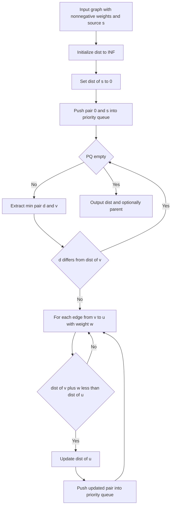

---
topic:
  - Computer Science
subtopic:
  - Algorithms
level: ["1"]
priority: Medium
status: Not-Started
---
## Parent
:LiArrowUpLeft: `= link(regexreplace(this.file.folder, "/[^/]+$", "") + "/" + regexreplace(regexreplace(this.file.folder, "/[^/]+$", ""), "^.*/", ""), regexreplace(regexreplace(this.file.folder, "/[^/]+$", ""), "^.*/", ""))`

---
# Intro

## Deeper Explanation

## Diagram

## Questions

> [!QUESTION]- What is abc?
> Answer

## Links
