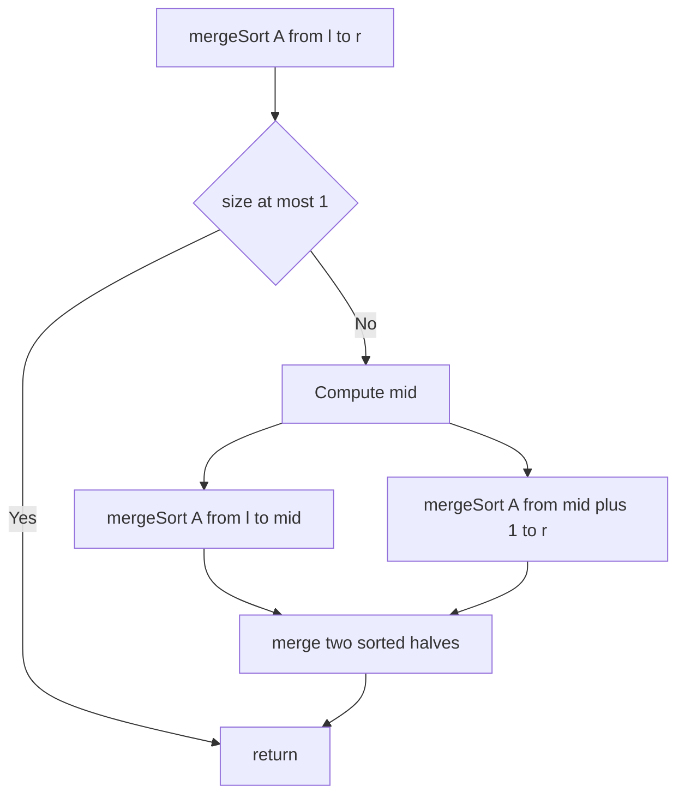

---
topic:
  - "Computer Science"
subtopic:
  - "Algorithms"
level:
  - "4"
priority: Medium
status: Ready To Repeat

---

# Intro

Merge sort is a divide-and-conquer algorithm: split the array, sort each half, then merge the two sorted halves. It has reliable O(n log n) time and is stable, at the cost of extra memory.

## Deeper Explanation

- Mechanism: recursively split until size 1, then merge by repeatedly taking the smaller front element from the two halves.
- Complexity: O(n log n) time in all cases; O(n) extra space for the merge buffer (array implementation).
- Properties: stable (with careful merge), not in-place in typical array form.
- Practical notes: great for linked lists and external sorting (sorting data that does not fit in memory).

## Diagram



## Questions

> [!QUESTION]- What is Merge Sort?
> Merge sort is a divide-and-conquer algorithm: split the array, sort each half, then merge the two sorted halves. It has reliable O(n log n) time and is stable, at the cost of extra memory.


## Links

- https://en.wikipedia.org/wiki/Merge_sort - Core idea + variants
- https://cp-algorithms.com/sorting/merge_sort.html - Implementation details

# Whats next

:LiArrowUpLeft: `dv: link(regexreplace(this.file.folder, "/[^/]+$", "") + "/" + regexreplace(regexreplace(this.file.folder, "/[^/]+$", ""), "^.*/", ""), regexreplace(regexreplace(this.file.folder, "/[^/]+$", ""), "^.*/", ""))`

```dataviewjs
const cur = dv.current();
const curFolder = cur.file.folder;
const curPath = cur.file.path;

const isFolderNote = (p) => (p.file.tags ?? []).includes("#FolderNote");

const children = dv.pages()
  .where(p => p.file.folder.startsWith(curFolder + "/"))
  .where(p => p.file.folder.split("/").length === curFolder.split("/").length + 1)
  .where(p => p.file.name === p.file.folder.split("/").slice(-1)[0])
  .where(p => isFolderNote(p))
  .sort(p => p.file.folder, "asc");

const pages = dv.pages()
  .where(p => p.file.folder === curFolder)
  .where(p => p.file.path !== curPath)
  .where(p => !isFolderNote(p))
  .sort(p => p.file.name, "asc");
  
  if (children.length) {
	dv.header(2, "Topics");
	dv.list(children.map(p => p.file.link));
  }
  if (pages.length) {
	dv.header(2, "Pages");
	dv.list(pages.map(p => p.file.link));
  }
  
```
