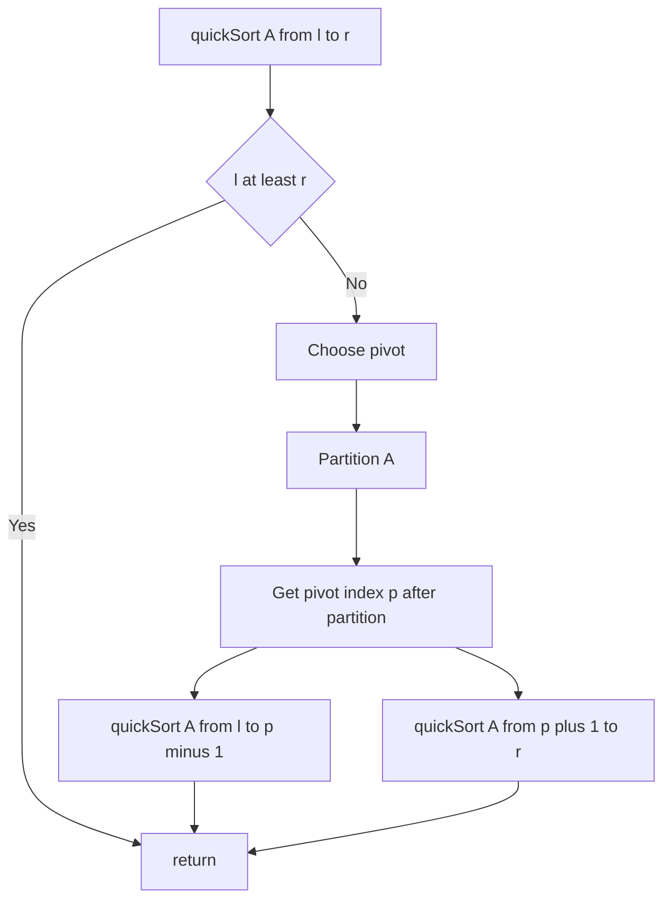

---
topic:
  - Computer Science
subtopic:
  - Algorithms
level:
  - "2"
priority: Medium
status: Not-Started
---
## Parent
:LiArrowUpLeft: `= link(regexreplace(this.file.folder, "/[^/]+$", "") + "/" + regexreplace(regexreplace(this.file.folder, "/[^/]+$", ""), "^.*/", ""), regexreplace(regexreplace(this.file.folder, "/[^/]+$", ""), "^.*/", ""))`

---
# Intro
Quick sort partitions the array around a pivot so smaller elements go left and larger go right, then recursively sorts the partitions. It is often very fast in practice but has a worst-case O(n^2) if pivots are consistently bad.

## Deeper Explanation
- Mechanism: choose pivot, partition in-place (Lomuto/Hoare), then recurse on left/right partitions.
- Complexity: average O(n log n); worst O(n^2) without protections.
- Properties: in-place (typical), not stable.
- How to make it robust: randomized pivot or median-of-three; switch to [[Insertion Sort|insertion sort]] on small partitions; consider introsort (fallback to heapsort) for worst-case bounds.

## Diagram

## Questions

> [!QUESTION]- What is abc?
> Answer

## Links
- https://en.wikipedia.org/wiki/Quicksort - Partition schemes and analysis
- https://cp-algorithms.com/sorting/quick_sort.html - Practical implementation tips
