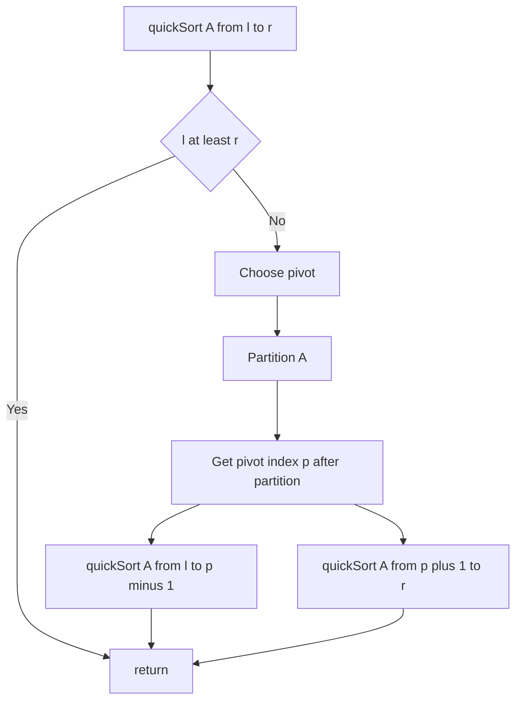

---
topic:
  - "Computer Science"
subtopic:
  - "Algorithms"
level:
  - "4"
priority: Medium
status: Ready To Repeat

---

# Intro

Quick sort partitions the array around a pivot so smaller elements go left and larger go right, then recursively sorts the partitions. It is often very fast in practice but has a worst-case O(n^2) if pivots are consistently bad.

## Deeper Explanation

- Mechanism: choose pivot, partition in-place (Lomuto/Hoare), then recurse on left/right partitions.
- Complexity: average O(n log n); worst O(n^2) without protections.
- Properties: in-place (typical), not stable.
- How to make it robust: randomized pivot or median-of-three; switch to insertion sort on small partitions; consider introsort (fallback to heapsort) for worst-case bounds.

## Diagram



## Questions

> [!QUESTION]- What is Quick Sort?
> Quick sort partitions the array around a pivot so smaller elements go left and larger go right, then recursively sorts the partitions. It is often very fast in practice but has a worst-case O(n^2) if pivots are consistently bad.


## Links

- https://en.wikipedia.org/wiki/Quicksort - Partition schemes and analysis
- https://cp-algorithms.com/sorting/quick_sort.html - Practical implementation tips

# Whats next

:LiArrowUpLeft: `dv: link(regexreplace(this.file.folder, "/[^/]+$", "") + "/" + regexreplace(regexreplace(this.file.folder, "/[^/]+$", ""), "^.*/", ""), regexreplace(regexreplace(this.file.folder, "/[^/]+$", ""), "^.*/", ""))`

```dataviewjs
const cur = dv.current();
const curFolder = cur.file.folder;
const curPath = cur.file.path;

const isFolderNote = (p) => (p.file.tags ?? []).includes("#FolderNote");

const children = dv.pages()
  .where(p => p.file.folder.startsWith(curFolder + "/"))
  .where(p => p.file.folder.split("/").length === curFolder.split("/").length + 1)
  .where(p => p.file.name === p.file.folder.split("/").slice(-1)[0])
  .where(p => isFolderNote(p))
  .sort(p => p.file.folder, "asc");

const pages = dv.pages()
  .where(p => p.file.folder === curFolder)
  .where(p => p.file.path !== curPath)
  .where(p => !isFolderNote(p))
  .sort(p => p.file.name, "asc");
  
  if (children.length) {
	dv.header(2, "Topics");
	dv.list(children.map(p => p.file.link));
  }
  if (pages.length) {
	dv.header(2, "Pages");
	dv.list(pages.map(p => p.file.link));
  }
  
```
