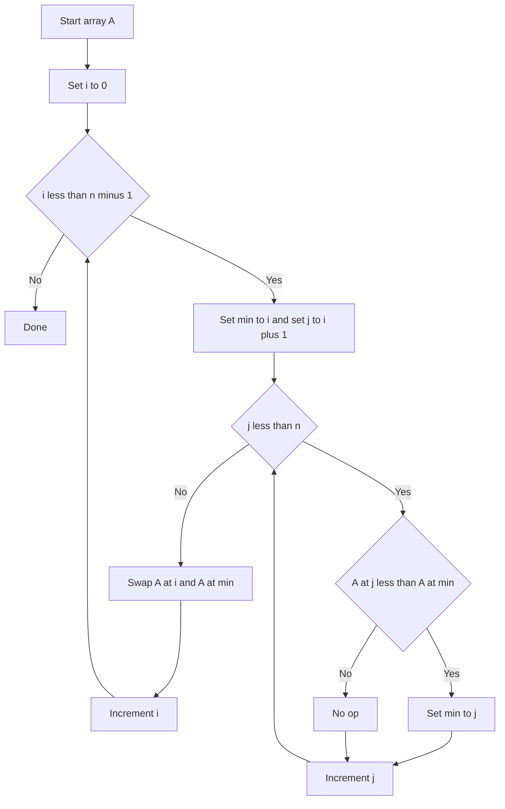

---
topic:
  - Computer Science
subtopic:
  - Algorithms
level:
  - "1"
priority: Medium
status: Not-Started
---
## Parent
:LiArrowUpLeft: `= link(regexreplace(this.file.folder, "/[^/]+$", "") + "/" + regexreplace(regexreplace(this.file.folder, "/[^/]+$", ""), "^.*/", ""), regexreplace(regexreplace(this.file.folder, "/[^/]+$", ""), "^.*/", ""))`

---
# Intro
Selection sort builds a sorted prefix by repeatedly selecting the minimum remaining element and swapping it into place. It does a predictable number of comparisons but is still quadratic time.

## Deeper Explanation
- Mechanism: for each position i, find the smallest element in a[i..n-1], then swap it with a[i].
- Complexity: always O(n^2) comparisons; O(n) swaps.
- Properties: in-place; typically not stable (a swap can reorder equal keys).
- When it can make sense: when writes are expensive but comparisons are cheap (still uncommon).

## Diagram

## Questions

> [!QUESTION]- What is abc?
> Answer

## Links
- https://en.wikipedia.org/wiki/Selection_sort - Details + stability discussion
- https://visualgo.net/en/sorting - Step-by-step visualization
