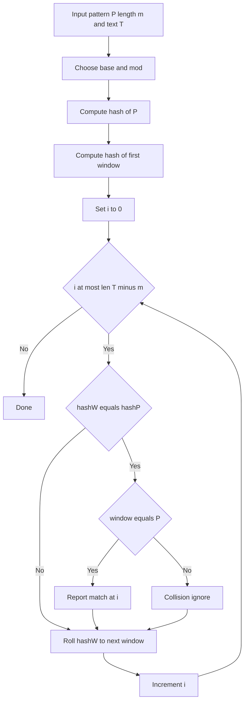

---
topic:
  - "Computer Science"
subtopic:
  - "Algorithms"
level:
  - "4"
priority: Medium
status: Ready To Repeat

---

# Intro

## Deeper Explanation

## Diagram



## Questions

> [!QUESTION]- What are hash collisions and how do we handle them?
> A collision is when two different strings produce the same hash. Rabin-Karp handles this by verifying the actual substring when a hash match occurs, and collisions can be made very unlikely with good moduli/base choices (or double hashing).

## Links

- [Rabin-Karp algorithm (Wikipedia)](https://en.wikipedia.org/wiki/Rabin%E2%80%93Karp_algorithm)
- [String hashing (cp-algorithms)](https://cp-algorithms.com/string/string-hashing.html)

# Whats next

:LiArrowUpLeft: `dv: link(regexreplace(this.file.folder, "/[^/]+$", "") + "/" + regexreplace(regexreplace(this.file.folder, "/[^/]+$", ""), "^.*/", ""), regexreplace(regexreplace(this.file.folder, "/[^/]+$", ""), "^.*/", ""))`

```dataviewjs
const cur = dv.current();
const curFolder = cur.file.folder;
const curPath = cur.file.path;

const isFolderNote = (p) => (p.file.tags ?? []).includes("#FolderNote");

const children = dv.pages()
  .where(p => p.file.folder.startsWith(curFolder + "/"))
  .where(p => p.file.folder.split("/").length === curFolder.split("/").length + 1)
  .where(p => p.file.name === p.file.folder.split("/").slice(-1)[0])
  .where(p => isFolderNote(p))
  .sort(p => p.file.folder, "asc");

const pages = dv.pages()
  .where(p => p.file.folder === curFolder)
  .where(p => p.file.path !== curPath)
  .where(p => !isFolderNote(p))
  .sort(p => p.file.name, "asc");
  
  if (children.length) {
	dv.header(2, "Topics");
	dv.list(children.map(p => p.file.link));
  }
  if (pages.length) {
	dv.header(2, "Pages");
	dv.list(pages.map(p => p.file.link));
  }
  
```
