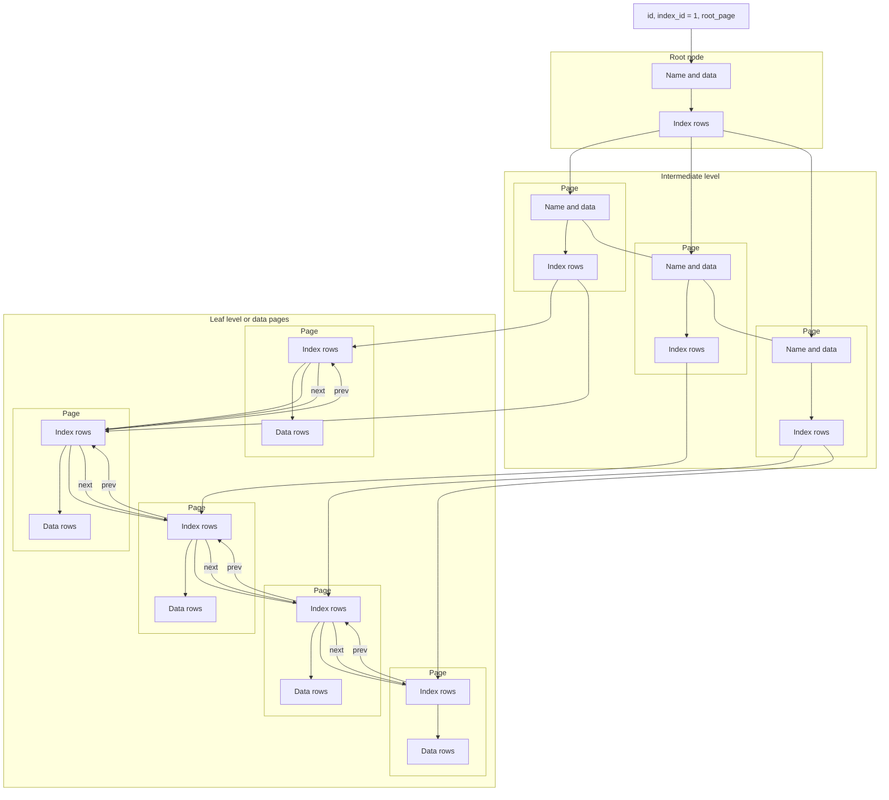
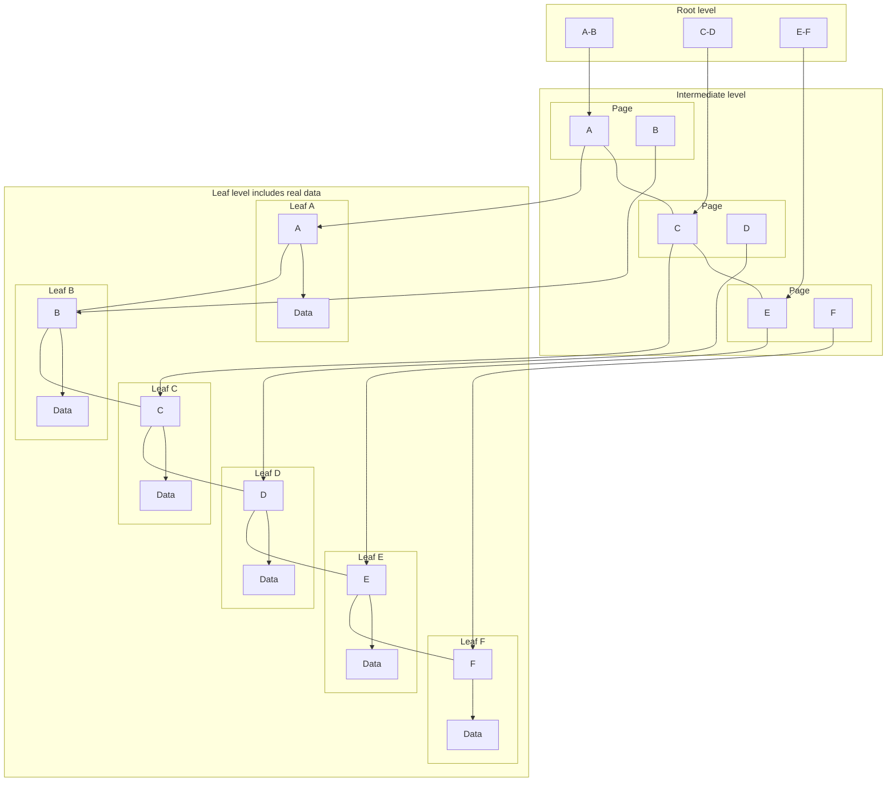
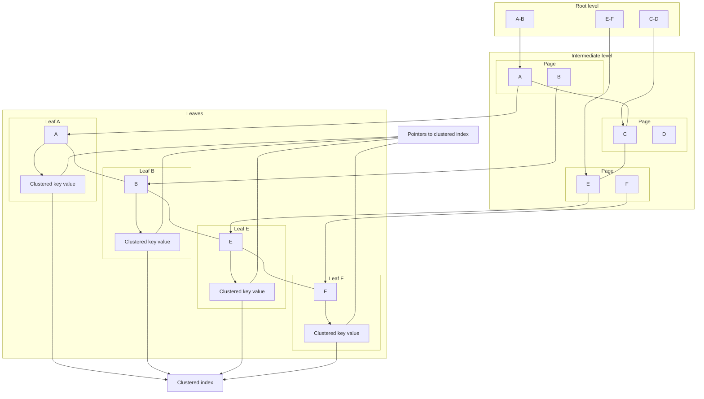
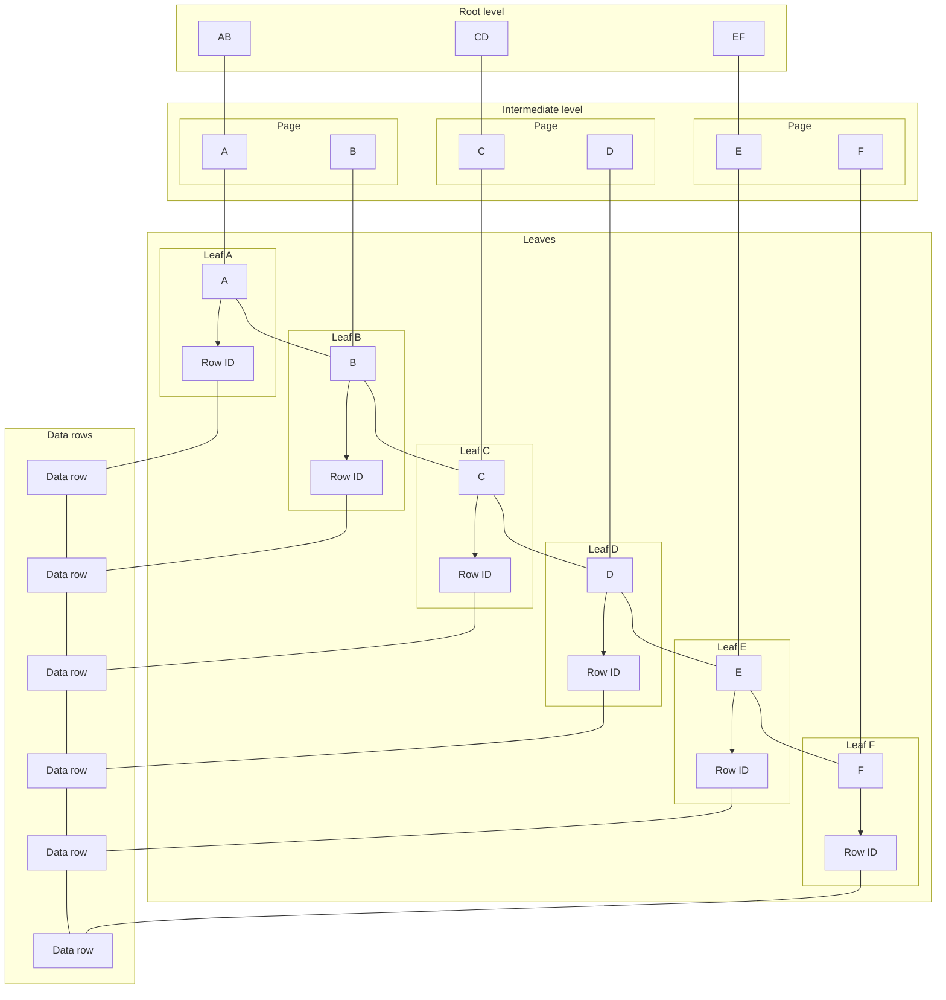

---
topic:
  - "Data Persistance"
subtopic:
  - "SQL"
dg-publish: true
---

# Intro

An index is a sorted auxiliary data structure that dramatically speeds up row retrieval in SQL databases by avoiding full table scans. Indexes use balanced-tree structures to reduce search complexity from `O(n)` to `O(log n)`, at the cost of additional disk space and slower write operations. The two main types are clustered indexes (which define the physical row order) and non-clustered indexes (which store pointers to the data).

## Deeper Explanation

An index is an on-disk structure associated with a table or view that speeds up retrieving rows from that table or view. An index contains keys built from one or more columns in the table or view. These keys are stored as a balanced-tree structure that supports fast lookup of rows by their key values in SQL Server.

## Purpose of indexes

The simplest way to find records in a database that match a specific criterion is a full scan. But as the number of records grows, the performance of this approach drops noticeably. To improve lookup performance, auxiliary structures are created: indexes. With indexes, you can significantly increase search speed because the data in the index is stored in a form that lets you skip ranges that cannot possibly contain the desired elements.

Importantly, indexes not only reduce absolute lookup time, they also reduce the algorithmic complexity of the search process. This means that as the database grows, the time required to search using indexes increases much more slowly than with a full scan.

When you query an indexed column, the query processor starts at the root node and gradually moves down through intermediate nodes, with each intermediate layer containing more detailed information about the data. The query processor continues traversing the index nodes until it reaches the bottom (leaf) level.

Binary search has algorithmic complexity `O(log(n))`. Using the complexity formulas `O(n)` and `O(log(n))`, we can estimate how the approximate number of operations changes for different search approaches as the data volume grows.


Mermaid alternative:

```mermaid
flowchart LR
  %% Mermaid can't draw the colored regions/curves precisely, but this keeps the same structure.

  subgraph Legend[Legend]
    direction LR
    Horrible[Horrible] --- Bad[Bad] --- Fair[Fair] --- Good[Good] --- Excellent[Excellent]
  end

  subgraph Plot[Plot]
    direction LR
    Origin((Origin))
    X[Elements]
    Y[Operations]

    Origin --> Nf[O(n!)]
    Origin --> P2[O(2^n)]
    Origin --> N2[O(n^2)]
    Origin --> Nnlogn[O(n log n)]
    Origin --> Nn[O(n)]
    Origin --> Nlog[O(log n)<br/>O(1)]

    Nf --- Y
    Nlog --- X
  end
```

### Heap

**A heap** is data stored without any defined ordering (i.e., a table without a clustered index). Access and searching over such data happens sequentially by scanning pages, which can take a long time and negatively impact performance.

### Index structure

An index is a tree-like sorted on-disk data structure associated with a table or view that speeds up retrieving rows from that table or view. An index contains keys built from one or more columns in the table or view. These keys are stored as a balanced-tree structure that supports fast lookup of rows by their key values in SQL Server.

The balanced tree itself consists of three levels:

1. Root node
    1. Stores pointers to intermediate nodes and the range of data they cover
2. Intermediate level
    1. Stores pointers to leaf nodes and the range of data stored in them
3. Leaf level
    1. A leaf is a page with the actual data for a given range

### Clustered index

In a clustered index, the bottom nodes (leaves) contain the data pages of the base table.

At the root level, index rows are stored; each row contains a key value and a pointer to an intermediate-level page.

At the intermediate level, index rows are stored; each row contains a key value and a pointer to a data row at the leaf level.

Pages at each level are linked in a doubly linked list.

An important property of a clustered index is that all values are ordered in a specific direction (ascending or descending). Therefore, a table or view can have only one clustered index. Also note that the table's data is stored in sorted order only when a clustered index exists on that table. A table without a clustered index is called a heap.


Mermaid alternative:




Mermaid alternative:



### Simplified Example

Our database has a table with data that has a clustered index on ID. Suppose the IDs in the table are in the range from 1 to 5000, and we want to find element **1456**.

1. The query arrives at the root level and considers the possible intermediate nodes
    1. Node 1 covers the range from 1 to 1250
    2. **Node 2 covers the range from 1251 to 2500** - the range we need
    3. Node 3 covers the range from 2501 to 3750
    4. Node 4 covers the range from 3751 to 5000
2. The intermediate node itself has pointers to 5 pages, 249 rows per page
    1. **Page 1 covers the range from 1251 to 1500** - the range we need
    2. Page 2 covers the range from 1501 to 1750
    3. Page 3 covers the range from 1751 to 2000
    4. Page 4 covers the range from 2001 to 2250
    5. Page 5 covers the range from 2251 to 2500
3. Next, we scan within that range linearly and significantly speed up retrieval by reducing the search space from 5000 to 249 elements. (Node and page sizes are chosen for illustration.)

### Nonclustered index

Unlike a clustered index, the leaf level of a nonclustered index contains only the columns (*key columns*) the index is defined on, and a pointer to the rows with the actual data in the table. This means the query processor needs an additional operation to locate and fetch the required data. What the data pointer contains depends on how the table is stored: as a clustered table or as a heap. If the pointer refers to a clustered table, it points to the clustered index, which can then be used to find the actual data. If the pointer refers to a heap, it points to a specific row identifier (RID).

- **With a clustered index**
    - If the table has a clustered index, then nonclustered indexes store the clustered index key value for the row in their leaf level
        


Mermaid alternative:


        
- **Without a clustered index**
    - If the table does not have a clustered index, then nonclustered indexes on that table store row identifiers (RIDs) in their leaf level. A row identifier points to the actual data row in the table; in practice it includes the data file number, the page number, and the row's slot/location on that page.
        


Mermaid alternative:


        

### Pros/Cons

- Pros
    - Faster record lookups
    - Reads can return data in sorted order, which means additional sorting may not be required
- Cons
    - Indexes can reduce performance for queries that insert, update, or delete rows, because the DBMS must also maintain the index as part of those operations
    - Index storage requires additional disk space; the longer the key, the larger the index and its storage footprint
    - Not all data is suitable for indexing. Data that is not sufficiently selective (for example, a state name in a table of US cities) will not yield the same indexing benefit as data with a wider range of values

### Usage recommendations

- For tables that are updated frequently, use as few indexes as possible.
- If a table contains a large amount of data but changes are minor, then use as many indexes as needed to improve query performance. However, think carefully before adding indexes to small tables, because an index seek can sometimes take longer than simply scanning all rows.
- For clustered indexes, try to use the shortest possible key columns. Ideally, apply a clustered index to columns with unique values and that do not allow NULLs. This is why a primary key is often used as a clustered index.
- Column value uniqueness affects index performance. In general, the more duplicates you have in a column, the worse the index performs. Conversely, the more unique the values, the better the index performs. When possible, use a unique index.
- For a composite index, consider column order. Columns used in *WHERE* predicates (for example, *WHERE FirstName = 'Charlie'*) should come first. Subsequent columns should be ordered by selectivity (columns with the highest number of unique values first).
- You can also index computed columns if they meet certain requirements. For example, expressions used to compute the column value must be deterministic (always returning the same result for the same set of input parameters).

### Questions

> [!QUESTION]- Why can't a table have two clustered indexes?
> Reference: [Article](https://habr.com/ru/post/247373/#01)
> A clustered index is effectively the table. When you create a clustered index, the storage engine orders the table's rows according to the index key (ascending or descending). A clustered index is not a separate structure like other indexes; it is the way the table data itself is organized to enable efficient access to rows.
>
> Imagine you have a table that stores a sales history. The Sales table contains information such as order id, line id, product id, quantity, order number and date, and so on. You create a clustered index on the *OrderID* and *LineID* columns, sorted ascending, as shown in the following T-SQL:
>
> ```sql
> CREATE UNIQUE CLUSTERED INDEX ix_oriderid_lineid
> ON dbo.Sales(OrderID, LineID);
> ```
>
> When you run this script, all rows in the table are physically ordered first by OrderID and then by LineID, but the data still remains a single logical structure: the table. For this reason, you cannot create two clustered indexes. There is only one table with one set of data, and that data can only be ordered one way at a time.

> [!QUESTION]- If a clustered table has many benefits, why use a heap?
> Reference: [Article](https://habr.com/ru/post/247373/#02)
> Answer is not provided in the source interview list; see Links.

> [!QUESTION]- How do you change the default index fill factor?
> Reference: [Article](https://habr.com/ru/post/247373/#03)
> Answer is not provided in the source interview list; see Links.

> [!QUESTION]- Can you create a clustered index on a column with duplicates?
> Reference: [Article](https://habr.com/ru/post/247373/#04)
> Answer is not provided in the source interview list; see Links.

> [!QUESTION]- How is a table stored if no clustered index exists?
> Reference: [Article](https://habr.com/ru/post/247373/#05)
> Answer is not provided in the source interview list; see Links.

> [!QUESTION]- What is the relationship between unique constraints, primary keys, and table indexes?
> Reference: [Article](https://habr.com/ru/post/247373/#06)
> Answer is not provided in the source interview list; see Links.

> [!QUESTION]- Why are clustered and nonclustered indexes called balanced trees in SQL Server?
> Reference: [Article](https://habr.com/ru/post/247373/#07)
> Answer is not provided in the source interview list; see Links.

> [!QUESTION]- How can an index improve query performance if you have to traverse all those index nodes?
> Reference: [Article](https://habr.com/ru/post/247373/#08)
> Answer is not provided in the source interview list; see Links.

> [!QUESTION]- If indexes are so great, why not create them on every column?
> Reference: [Article](https://habr.com/ru/post/247373/#09)
> Answer is not provided in the source interview list; see Links.

> [!QUESTION]- Do you have to create a clustered index on the primary key column?
> Reference: [Article](https://habr.com/ru/post/247373/#10)
> Answer is not provided in the source interview list; see Links.

> [!QUESTION]- If you index a view, is it still a view?
> Reference: [Article](https://habr.com/ru/post/247373/#11)
> Answer is not provided in the source interview list; see Links.

> [!QUESTION]- Why use a covering index instead of a composite index?
> Reference: [Article](https://habr.com/ru/post/247373/#12)
> Answer is not provided in the source interview list; see Links.

> [!QUESTION]- Does the number of duplicates in the key column matter?
> Reference: [Article](https://habr.com/ru/post/247373/#13)
> Answer is not provided in the source interview list; see Links.

> [!QUESTION]- Can you create a nonclustered index for only a subset of key column values?
> Reference: [Article](https://habr.com/ru/post/247373/#14)
> Answer is not provided in the source interview list; see Links.

## Questions

> [!QUESTION]- What is an index and what types exist?
> An index is an additional on-disk/in-memory data structure (often a B-tree) that speeds up data access by allowing efficient seeks and ordered scans. Common types include clustered and nonclustered indexes; also unique, composite, filtered/partial, and full-text indexes (availability depends on the DB engine).

> [!QUESTION]- How does ordering work for clustered vs nonclustered indexes?
> With a clustered index, the leaf level is the table data itself, stored in the index key order, so range scans return rows already ordered by that key. With a nonclustered index, the leaf level stores index keys plus row locators; rows are ordered by the nonclustered key, but fetching non-index columns may require lookups into the clustered index (or heap).

## Links

## Deeper Explanation


## Questions


## Links


# Whats next

:LiArrowUpLeft: `dv: link(regexreplace(this.file.folder, "/[^/]+$", "") + "/" + regexreplace(regexreplace(this.file.folder, "/[^/]+$", ""), "^.*/", ""), regexreplace(regexreplace(this.file.folder, "/[^/]+$", ""), "^.*/", ""))`

```dataviewjs
const cur = dv.current();
const curFolder = cur.file.folder;
const curPath = cur.file.path;

const isFolderNote = (p) => (p.file.tags ?? []).includes("#FolderNote");

const children = dv.pages()
  .where(p => p.file.folder.startsWith(curFolder + "/"))
  .where(p => p.file.folder.split("/").length === curFolder.split("/").length + 1)
  .where(p => p.file.name === p.file.folder.split("/").slice(-1)[0])
  .where(p => isFolderNote(p))
  .sort(p => p.file.folder, "asc");

const pages = dv.pages()
  .where(p => p.file.folder === curFolder)
  .where(p => p.file.path !== curPath)
  .where(p => !isFolderNote(p))
  .sort(p => p.file.name, "asc");
  
  if (children.length) {
	  dv.header(2, "Topics");
	  dv.list(children.map(p => p.file.link));
  }
  if (pages.length) {
	  dv.header(2, "Pages");
	  dv.list(pages.map(p => p.file.link));
  }
  
```
