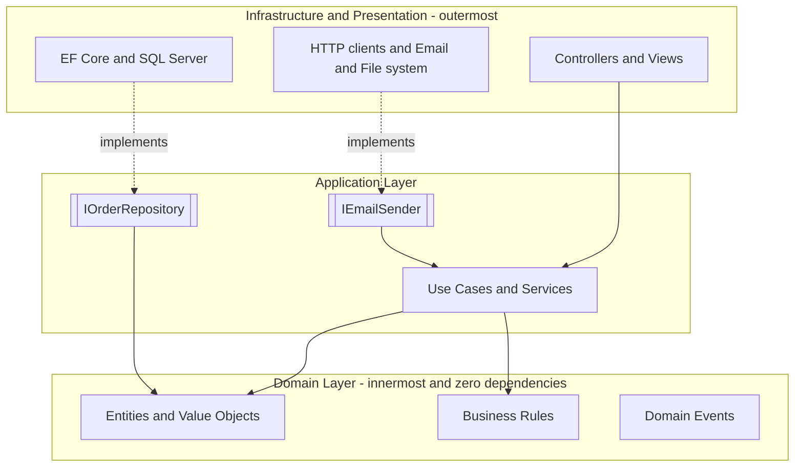
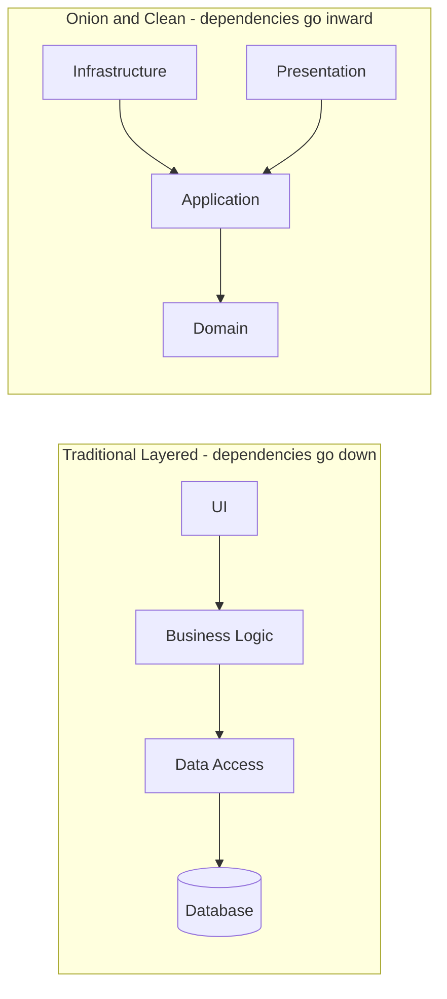

---
topic:
  - Architecture
subtopic:
  - Application Architecture
level:
  - "1"
priority: Medium
status: Not-Started
---
## Parent
:LiArrowUpLeft: `= link(regexreplace(this.file.folder, "/[^/]+$", "") + "/" + regexreplace(regexreplace(this.file.folder, "/[^/]+$", ""), "^.*/", ""), regexreplace(regexreplace(this.file.folder, "/[^/]+$", ""), "^.*/", ""))`

---
# Intro

Layered architecture (also called multi-layered or n-tier) structures an application into layers with clear responsibilities and dependency directions.

## Deeper Explanation

**Dependency Rule**: All arrows point **inward**. The Domain knows nothing about databases, frameworks, or UI. Infrastructure implements interfaces defined by inner layers — this is why it depends inward, not the other way around.

In traditional layered architecture, UI depends on Business Logic which depends on Data Access — a top-down chain where changing the DB affects everything above. In Onion Architecture, the dependency is **inverted**: Infrastructure depends on the Domain through interfaces, so you can swap databases without touching business rules.

## Questions

> [!QUESTION]- What is multi-layered architecture?
> Multi-layered architecture splits the system into layers such as Presentation, Application (use cases), Domain (business rules), and Infrastructure/Data access. Each layer has a focused responsibility and communicates through well-defined interfaces, which improves maintainability and testability.

> [!QUESTION]- What is Onion Architecture?
> Onion Architecture is a layered style where the Domain is at the center and dependencies point inward. Outer layers (infrastructure, UI, frameworks) depend on inner layers; inner layers do not depend on details. This is usually enforced by defining abstractions (interfaces) in the inner layers and implementing them in the outer layers.

## Further Reading

- [Wikipedia - Multitier architecture](https://en.wikipedia.org/wiki/Multitier_architecture)
- [The Clean Architecture (Robert C. Martin)](https://thecleanarchitecture.com/)
