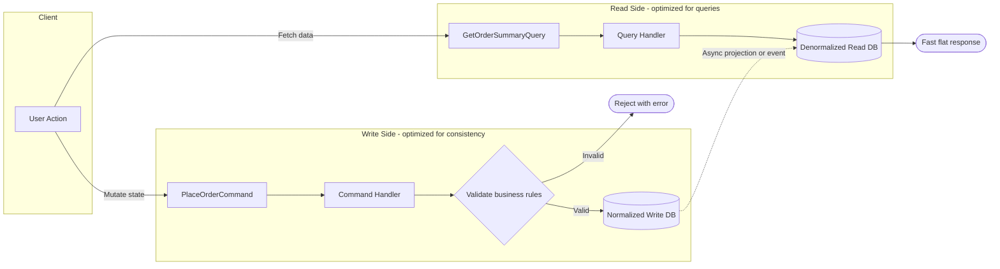

---
topic:
  - Architecture
subtopic:
  - Patterns
level:
  - "1"
priority: Medium
status: Not-Started
---
# Intro

CQRS is an architectural pattern that separates write operations (commands) from read operations (queries).

## Deeper Explanation



The key insight: the **write model** is normalized and enforces business rules, while the **read model** is denormalized and shaped for fast queries. They can use different databases, different schemas, or even different technologies. The trade-off is **eventual consistency** between the two sides.

## Questions

> [!QUESTION]- What is CQRS?
> CQRS (Command Query Responsibility Segregation) separates the model used for writes (commands that change state) from the model used for reads (queries that return data). This can simplify complex domains and enable different scaling/optimization strategies for reads vs writes. It adds complexity (more moving parts, eventual consistency when using separate read stores), so it is usually applied where the benefits justify the cost.

## Links

- [CQRS.nu - Command and Query Responsibility Segregation](https://cqrs.nu/faq/Command%20and%20Query%20Responsibility%20Segregation)

# Whats next

:LiArrowUpLeft: `= link(regexreplace(this.file.folder, "/[^/]+$", "") + "/" + regexreplace(regexreplace(this.file.folder, "/[^/]+$", ""), "^.*/", ""), regexreplace(regexreplace(this.file.folder, "/[^/]+$", ""), "^.*/", ""))`

```dataviewjs
const cur = dv.current();
const curFolder = cur.file.folder;
const curPath = cur.file.path;

const isFolderNote = (p) => (p.file.tags ?? []).includes("#FolderNote");

const children = dv.pages()
  .where(p => p.file.folder.startsWith(curFolder + "/"))
  .where(p => p.file.folder.split("/").length === curFolder.split("/").length + 1)
  .where(p => p.file.name === p.file.folder.split("/").slice(-1)[0])
  .where(p => isFolderNote(p))
  .sort(p => p.file.folder, "asc");

const pages = dv.pages()
  .where(p => p.file.folder === curFolder)
  .where(p => p.file.path !== curPath)
  .where(p => !isFolderNote(p))
  .sort(p => p.file.name, "asc");
  
  if (children.length) {
	  dv.header(2, "Topics");
	  dv.list(children.map(p => p.file.link));
  }
  if (pages.length) {
	  dv.header(2, "Pages");
	  dv.list(pages.map(p => p.file.link));
  }
  
```

