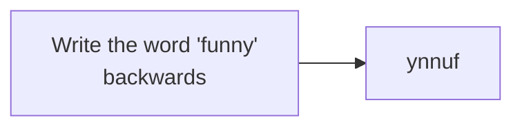

---
topic:
  - AI & ML
subtopic:
  - LLM
level:
  - "1"
priority: Medium
status: Not-Started
tags:
  - FolderNote
---
## Parent
:LiArrowUpLeft: `= link(regexreplace(this.file.folder, "/[^/]+$", "") + "/" + regexreplace(regexreplace(this.file.folder, "/[^/]+$", ""), "^.*/", ""), regexreplace(regexreplace(this.file.folder, "/[^/]+$", ""), "^.*/", ""))`
```dataviewjs
const cur = dv.current();
const curFolder = cur.file.folder;
const curPath = cur.file.path;

const isFolderNote = (p) => (p.file.tags ?? []).includes("#FolderNote");

const children = dv.pages()
  .where(p => p.file.folder.startsWith(curFolder + "/"))
  .where(p => p.file.folder.split("/").length === curFolder.split("/").length + 1)
  .where(p => p.file.name === p.file.folder.split("/").slice(-1)[0])
  .where(p => isFolderNote(p))
  .sort(p => p.file.folder, "asc");

if (children.length) {
  dv.header(2, "Children");
  dv.list(children.map(p => p.file.link));
}

const pages = dv.pages()
  .where(p => p.file.folder === curFolder)
  .where(p => p.file.path !== curPath)
  .where(p => !isFolderNote(p))
  .sort(p => p.file.name, "asc");

if (pages.length) {
  dv.header(2, "Pages");
  dv.list(pages.map(p => p.file.link));
}
```
---
## Intro

Prompts play a key role in generating useful and accurate information from AI language models. Learning how to write better prompts — "Prompt Engineering" — unlocks the full potential of these models by guiding their behavior, improving output quality, and reducing inaccuracies.

## Why Prompting Matters

- **Guiding Model Behavior** — Without prompts, a model generates content aimlessly. A well-crafted prompt steers the model toward useful, relevant results.
- **Improving Quality and Relevance** — Clear and concise prompts encourage the model to produce text that meets the required quality and closely matches the user's intent.
- **Eliciting Specific Output** — Prompts can be engineered to summarize text, suggest alternate phrasings, create storylines, analyse sentiment, or extract data — harnessing the model's flexibility.
- **Aligning AI and Human Intent** — Effective prompting minimizes the understanding gap between the AI and the user's actual needs and preferences.
- **Reducing Inaccuracies and Ambiguity** — A clear, complete prompt prevents the model from making unfounded assumptions or providing unclear information.

## Instruction Prompting

Instruction prompting is one of the simplest and most effective techniques — you directly tell the model what to do in natural language. The key is being specific about the task, the expected format, and any constraints.



### Name Parsing

A common problem when collecting name data is that different people format their names differently. Some might include **`Mrs.`** or **`Jr.`**, and the first and last name could be out of order. Instruction prompting automates this cleanup.

> **Prompt**
> 
> ```
> A user has input their first and last name into a form. 
> We don't know in which order their first name and last name are, 
> but we need it to be in this format '<Last name>, <First name>'.
> 
> Please convert the following name in the expected format: Nikita Reshetnik
> ```

> **Output**
> 
> ```
> Reshetnik, Nikita
> ```

### Personally Identifiable Information Removal

Before releasing private documents, corporations or governments may need to redact PII. Instruction prompting can automate this entirely.

> **Prompt**
> 
> ```
> Read the following sales email. Remove any personally identifiable information (PII),
> and replace it with the appropriate placeholder. For example, replace the name "John Doe"
> with "[NAME]".
> 
> Hi John,
> 
> I'm writing to you because I noticed you recently purchased a new car. I'm a salesperson
> at a local dealership (Cheap Dealz), and I wanted to let you know that we have a great deal on a new
> car. If you're interested, please let me know.
> 
> Thanks,
> 
> Jimmy Smith
> 
> Phone: 410-805-2345
> Email: sales@email.com
> ```

> **Output**
> 
> ```
> Hi [NAME],
> 
> I'm writing to you because I noticed you recently purchased a new car. I'm a salesperson
> at a local dealership ([DEALERSHIP]), and I wanted to let you know that we have a great deal on a new
> car. If you're interested, please let me know.
> 
> Thanks,
> 
> [SALESPERSON]
> 
> Phone: [PHONE NUMBER]
> Email: [EMAIL ADDRESS]
> ```

### Essay Evaluation and Feedback

Gen AI can evaluate essays against complex criteria like grammar, clarity, coherence, and argument quality — providing structured, scored feedback.

> **Prompt**
> 
> ```
> Read the following excerpt from an essay and provide feedback based on the following criteria: 
> grammar, clarity, coherence, argument quality, and use of evidence. 
> Provide a score from 1-10 for each attribute, along with reasoning for your score.
> 
> "Despite the popular belief, there's no solid evidence supporting the idea that video games lead to violent behavior. 
> Research on the topic is often contradictory and inconclusive. 
> Some studies found a correlation, but correlation don't imply causation. 
> So, it's premature to blame video games for violence in society."
> ```

> **Output**
> 
> ```
> Attribute: Grammar
> Score: 9
> Reasoning: The essay is mostly grammatically correct, but there is a minor 
> error - 'correlation don't imply causation' should be 'correlation doesn't imply causation'.
> 
> Attribute: Clarity
> Score: 8
> Reasoning: The essay is generally clear, but could provide more detail or explanation 
> about the contradictory and inconclusive nature of the research.
> 
> Attribute: Coherence
> Score: 8
> Reasoning: The arguments are coherent and related, but the transition between them could be smoother.
> 
> Attribute: Argument Quality
> Score: 7
> Reasoning: The argument presented is logical and well-reasoned, but it could be strengthened 
> with a clearer statement of the writer's position on the issue.
> ```

## Questions

> [!QUESTION]- What is abc?
> Answer

## Further Reading
- [OpenAI Platform](https://platform.openai.com/docs/guides/prompt-engineering/strategy-write-clear-instructions)
- [Learn Prompting: Your Guide to Communicating with AI](https://learnprompting.org/docs/basics/introduction)
- [Prompt Engineering Guide – Nextra](https://www.promptingguide.ai/)
