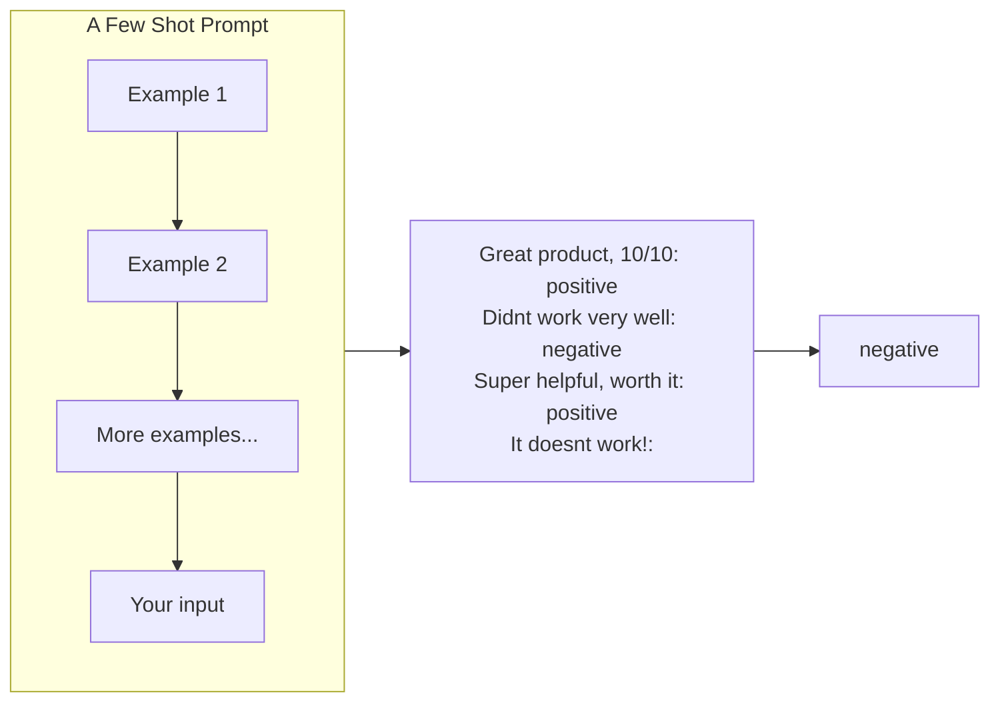

---
topic:
  - AI & ML
subtopic:
  - LLM
level: ["1"]
priority: Medium
status: Not-Started
tags:
  - FolderNote
---
## Parent
:LiArrowUpLeft: `= link(regexreplace(this.file.folder, "/[^/]+$", "") + "/" + regexreplace(regexreplace(this.file.folder, "/[^/]+$", ""), "^.*/", ""), regexreplace(regexreplace(this.file.folder, "/[^/]+$", ""), "^.*/", ""))`

```dataviewjs
const cur = dv.current();
const curFolder = cur.file.folder;
const curPath = cur.file.path;

const isFolderNote = (p) => (p.file.tags ?? []).includes("#FolderNote");

const children = dv.pages()
  .where(p => p.file.folder.startsWith(curFolder + "/"))
  .where(p => p.file.folder.split("/").length === curFolder.split("/").length + 1)
  .where(p => p.file.name === p.file.folder.split("/").slice(-1)[0])
  .where(p => isFolderNote(p))
  .sort(p => p.file.folder, "asc");

if (children.length) {
  dv.header(2, "Children");
  dv.list(children.map(p => p.file.link));
}

const pages = dv.pages()
  .where(p => p.file.folder === curFolder)
  .where(p => p.file.path !== curPath)
  .where(p => !isFolderNote(p))
  .sort(p => p.file.name, "asc");

if (pages.length) {
  dv.header(2, "Pages");
  dv.list(pages.map(p => p.file.link));
}
```
---
# Intro

Yet another [[Prompting|prompting]] strategy is *few-shot prompting*, which is basically just **showing examples** (also called "shots") to the model of what you want it to do. Few-shot prompts allow the AI to learn from these examples.

Consider the graphic at the top of this article, in which we are attempting to classify customer feedback as positive or negative. We show the model three examples of positive/negative feedback, then we show it a new piece of feedback that has not been classified yet (*It doesn't work!:*). The model sees that the first three examples were classified as either *positive* or *negative*, and uses this information to classify the new example as negative.

## Structure



The way that we structure the examples is very important. Given that we have organised these three instances in an *input: classification* format, the model generates a single word following the final line, rather than outputting a complete sentence such as *this review is positive.*

A key use case for few-shot prompting is when you need the output to be **structured in a specific way** that is difficult to describe to the model. To understand this, let's consider a relevant example: say you are conducting an economic analysis and need to compile the names and occupations of well-known citizens in towns nearby by analyzing local newspaper articles. You would like the model to read each article and output a list of names and occupations in the **`First Last [OCCUPATION]`** format. In order to get the model to do this, you can show a few examples. Look through the embed to see them.

> **Prompt**
> 
> 
> ```
> In the bustling town of Emerald Hills, a diverse group of individuals made their mark. 
> Sarah Martinez, a dedicated nurse, was known for her compassionate care at the local hospital. 
> David Thompson, an innovative software engineer, worked tirelessly on groundbreaking projects that would revolutionize the tech industry. 
> Meanwhile, Emily Nakamura, a talented artist and muralist, painted vibrant and thought-provoking pieces that adorned the walls of buildings and galleries alike. 
> Lastly, Michael O'Connell, an ambitious entrepreneur, opened a unique, eco-friendly cafe that quickly became the town's favorite meeting spot. 
> Each of these individuals contributed to the rich tapestry of the Emerald Hills community.
> 1. Sarah Martinez [NURSE]
> 2. David Thompson [SOFTWARE ENGINEER]
> 3. Emily Nakamura [ARTIST]
> 4. Michael O'Connell [ENTREPRENEUR]
> 
> At the heart of the town, Chef Oliver Hamilton has transformed the culinary scene with his farm-to-table restaurant, Green Plate. 
> Oliver's dedication to sourcing local, organic ingredients has earned the establishment rave reviews from food critics and locals alike.
> 
> Just down the street, you'll find the Riverside Grove Library, where head librarian Elizabeth Chen has worked diligently to create a welcoming and inclusive space for all. 
> Her efforts to expand the library's offerings and establish reading programs for children have had a significant impact on the town's literacy rates.
> 
> As you stroll through the charming town square, you'll be captivated by the beautiful murals adorning the walls. 
> These masterpieces are the work of renowned artist, Isabella Torres, whose talent for capturing the essence of Riverside Grove has brought the town to life.
> 
> Riverside Grove's athletic achievements are also worth noting, thanks to former Olympic swimmer-turned-coach, Marcus Jenkins. 
> Marcus has used his experience and passion to train the town's youth, leading the Riverside Grove Swim Team to several regional championships.
> 
> 1. Oliver Hamilton [CHEF]
> 2. Elizabeth Chen [LIBRARIAN]
> 3. Isabella Torres [ARTIST]
> 4. Marcus Jenkins [COACH]
> 
> Oak Valley, a charming small town, is home to a remarkable trio of individuals whose skills and dedication have left a lasting impact on the community.
> 
> At the town's bustling farmer's market, you'll find Laura Simmons, a passionate organic farmer known for her delicious and sustainably grown produce. 
> Her dedication to promoting healthy eating has inspired the town to embrace a more eco-conscious lifestyle.
> 
> In Oak Valley's community center, Kevin Alvarez, a skilled dance instructor, has brought the joy of movement to people of all ages. 
> His inclusive dance classes have fostered a sense of unity and self-expression among residents, enriching the local arts scene.
> 
> Lastly, Rachel O'Connor, a tireless volunteer, dedicates her time to various charitable initiatives. 
> Her commitment to improving the lives of others has been instrumental in creating a strong sense of community within Oak Valley.
> 
> Through their unique talents and unwavering dedication, Laura, Kevin, and Rachel have woven themselves into the fabric of Oak Valley, helping to create a vibrant and thriving small town.
> ```
> 

> **Output**
> 
> 
> ```
> 1. Laura Simmons [FARMER]
> 2. Kevin Alvarez [DANCE INSTRUCTOR]
> 3. Rachel O'Connor [VOLUNTEER]
> ```
> 

By showing the model examples of the correct output format, it is able to produce the correct output for new articles. We could produce this same output by using an instruction prompt instead, but the few-shot prompt works much more consistently.

## Variants of Shot Prompting

The word "shot" is synonymous with "example". Aside from few-shot prompting, there are two other types of shot prompting that exist. The only difference between these variants is how many examples you show the model.

### Zero-Shot Prompting

Zero-shot prompting is the most basic form of prompting. It simply shows the model a prompt without examples and asks it to generate a response. As such, all of the instruction and role prompts that you have seen so far are zero-shot prompts. An additional example of a zero-shot prompt is:

> **Prompt**
> 
> 
> ```
> Add 2+2:
> ```
> 

### One-Shot Prompting

One-shot prompting is when you show the model a single example. For example, the one-shot analog of the zero-shot prompt **`Add 2+2:`** is:

> **Prompt**
> 
> 
> ```
> Add 2+2: 4
> Add 3+3:
> ```
> 

We have shown the model only one complete example (**`Add 3+3: 6`**), so this is a one-shot prompt.

### Few-Show Prompting

Few-shot prompting is when you show the model 2 or more examples. The few-shot analog of the above two prompts is:

> **Prompt**
> 
> 
> ```
> Add 2+2: 4
> Add 3+3: 6
> Add 5+5:
> ```
> 

This is a few-shot prompt since we have shown the model at least 2 complete examples (**`Add 3+3: 6`** and **`Add 5+5: 10`**). Usually, the more examples you show the model, the better the output will be, so few-shot prompting is preferred over zero-shot and one-shot prompting in most cases.

## Conclusion

In conclusion, few-shot prompting is an effective strategy that can guide the model to generate accurate and appropriately structured responses. By showing the model multiple examples, few-shot prompting allows the model to understand the desired output format and respond accordingly, making it a preferred method over zero-shot and one-shot prompting in most scenarios

## Questions

> [!QUESTION]- What is abc?
> Answer

## Links

- [[Prompting]]
- [[Showing Examples]]
- [[Role Prompting]]
