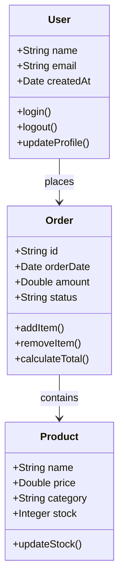

```mermaid
classDiagram
    class User {
        +String name
        +String email
        +Date createdAt
        +login()
        +logout()
        +updateProfile()
    }
    
    class Order {
        +String id
        +Date orderDate
        +Double amount
        +String status
        +addItem()
        +removeItem()
        +calculateTotal()
    }
    
    class Product {
        +String name
        +Double price
        +String category
        +Integer stock
        +updateStock()
    }
    
    User --> Order : places
    Order --> Product : contains
```