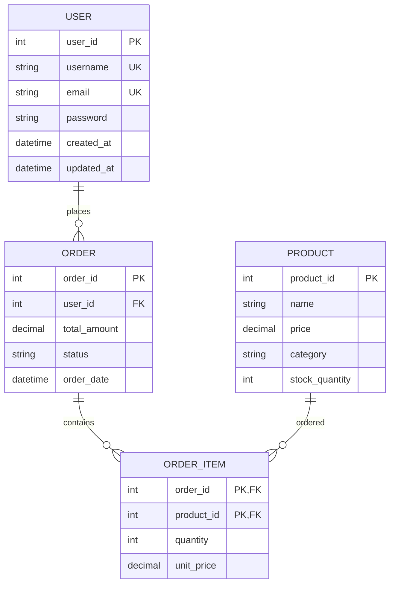

```mermaid
erDiagram
    USER {
        int user_id PK
        string username UK
        string email UK
        string password
        datetime created_at
        datetime updated_at
    }
    
    ORDER {
        int order_id PK
        int user_id FK
        decimal total_amount
        string status
        datetime order_date
    }
    
    PRODUCT {
        int product_id PK
        string name
        decimal price
        string category
        int stock_quantity
    }
    
    ORDER_ITEM {
        int order_id PK,FK
        int product_id PK,FK
        int quantity
        decimal unit_price
    }
    
    USER ||--o{ ORDER : "places"
    ORDER ||--o{ ORDER_ITEM : "contains"
    PRODUCT ||--o{ ORDER_ITEM : "ordered"
```