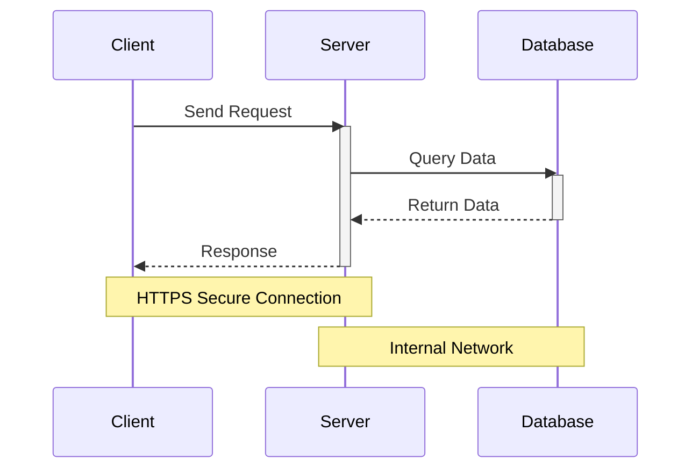

```mermaid
sequenceDiagram
    participant C as Client
    participant S as Server
    participant D as Database
    
    C->>S: Send Request
    activate S
    S->>D: Query Data
    activate D
    D-->>S: Return Data
    deactivate D
    S-->>C: Response
    deactivate S
    
    Note over C,S: HTTPS Secure Connection
    Note over S,D: Internal Network
```