# Senior AI Engineer — Technical Deep Dive Prep (DraftKings AIP DevEx)

## Preparation Checklist

### Day 1 (Thursday) — RAG Technical Deep Dive

- [x] Read [[#Quick Reference Card]] out loud (10 min)
- [x] Understand the [[RAG]] pipeline end-to-end — walk through all 8 stages from [[#RAG Pipeline End-to-End]]
- [x] Study [[Chunking]] strategies, [[#Embedding Models]], and [[#Vector Databases]] tables — know trade-offs for each
- [x] Understand [[Retrieval]] approaches — explain when hybrid beats dense, and how [[Re-ranking]] improves precision
- [x] Study [[#RAG Pain Points]] — practice detection + mitigation per stage
- [x] Understand [[Evaluation]] metrics ([[#RAG Evaluation (RAGAS)]]) — explain faithfulness, relevancy, precision, recall
- [x] Practice [[#Day 1 Practice Q&A]] — all 3 questions out loud
- [x] Read: [Anthropic RAG Cookbook](https://github.com/anthropics/anthropic-cookbook/tree/main/misc/retrieval_augmented_generation) · [Twelve RAG Pain Points](https://arxiv.org/abs/2401.05856)

### Day 2 (Friday) — Agents & MCP

- [x] Read [[#Quick Reference Card]] out loud (10 min)
- [x] Understand [[Agents|agent patterns]] — complexity ladder, ReAct vs Plan-and-Execute vs Reflexion ([[#Agent Patterns and Complexity Ladder]])
- [x] Study [[Tools|tool use]] and function calling — 5-step flow + error handling patterns ([[#Tool Use & Function Calling]])
- [x] Deep dive [[Model Context Protocol]] — 3 primitives, transport, DraftKings N×M narrative ([[#MCP Deep Dive (Critical — Core to DraftKings Stack)]])
- [x] Understand [[Multi-Agentic Systems|multi-agent orchestration]] — Supervisor vs Hierarchical vs Peer-to-peer ([[#Multi-Agent Orchestration]])
- [x] Study n8n workflow pattern and agentic coding tools status at DK ([[#n8n Workflows]], [[#Agentic Coding Tools]])
- [x] Practice [[#Day 2 Practice Q&A]] — all 3 questions out loud
- [x] Read: [Building Effective Agents](https://www.anthropic.com/engineering/building-effective-agents) (MUST READ) · [MCP docs](https://modelcontextprotocol.io/)

### Day 3 (Saturday) — System Design + Class Design

- [x] Read [[#Quick Reference Card]] out loud (10 min)
- [x] Internalize the [[#System Design Framework]] — 5/10/15/5 time-box
- [x] Study [[#Building Blocks Quick Reference]] and [[#.NET-Specific Patterns]] — know each component's purpose
- [x] Understand all 4 [[#AI System Design Patterns]] — Webhook→Queue→Worker, Rate Limiting, Vector DB, Async Validation
- [x] Study [[#Project Deep Dive Framework (How to Present ANY Past Project)|5-Layer Presentation Framework]] with cheat sheets: [[#Communication Patterns Cheat Sheet|communication]], [[#Database Selection Cheat Sheet|databases]], [[#Scalability Patterns Quick Reference|scalability]], [[#Consistency Models|consistency]]
- [x] Walk through [[#Class Design Round — Robot-Managed Restaurant (HackerRank Style)|Robot Restaurant class design]] end-to-end — diagram, patterns ([[Design Patterns]]), A* pathfinding, extension question
- [ ] Practice [[#Day 3 Practice Q&A]] + [[#Class Design Questions (HackerRank Round)|additional class design questions]]

### Day 4 (Sunday) — Projects & AI Ownership

- [x] Read [[#Quick Reference Card]] out loud (10 min)
- [x] Practice 2-minute pitches for each project (timed): [[#Dexter (Jira → PR Automation)|Dexter]], [[#Doculus (Auto-Documentation)|Doculus]], [[#SlackJack (Support Bot)|SlackJack]], [[#AmendA (PR Comment Updater)|AmendA]]
- [x] Study [[#AI Ownership Framework]] — scoping, [[#Metrics Framework|metrics]], [[#Adoption Challenges + Responses|adoption]], iteration loops, risk
- [x] Memorize [[#DraftKings Numbers to Anchor|DK numbers]]: 20% tickets via AI · 15% throughput · 100% 101 completion
- [x] Review [[#DraftKings Intelligence Brief]] — vision, 2026 goals, priority timeline
- [ ] Study [[#Interview Traps & Ownership Signals]] — internalize traps + practice [[#Ownership Phrases to Practice Verbatim|ownership phrases]] out loud
- [ ] Practice [[#Day 4 Practice Q&A]] — all 3 questions out loud

### Day 5 (Monday) — Final Review

- [ ] [[#Morning Cheat Sheet (30 minutes)|Morning Cheat Sheet]] review (30 min)
- [ ] [[#Timed Practice Drill (3 rounds)|Timed practice]]: 3 rounds × 30 min (RAG assistant, MCP platform, Dexter roadmap)
- [ ] Review [[#Additional Practice Questions]] — past projects + [[#API Design Quick Reference|API design]]
- [ ] Practice [[#2-Minute Closing Script]] out loud — 3 times minimum
- [ ] Final pass: re-read [[#Interview Traps & Ownership Signals]] + [[#Top 3 Ownership Signals]]


## Quick Reference Card

> [!tip] How to use this card
> Spend 10 minutes on this before each practice session. Speak each line out loud as if answering in the interview.

### RAG Pipeline (8 stages)

1. **Ingestion** — Collect source documents, normalize metadata for filtering by team, service, freshness
2. **Chunking** — Split into retrieval-sized units preserving semantic meaning with overlap
3. **Embedding** — Convert chunks to vectors using model chosen for quality/latency/cost fit
4. **Indexing** — Store vectors + metadata in vector store optimized for ANN search and filtering
5. **Query** — Rewrite/expand user queries to improve retrievability (synonyms, acronyms, decomposition)
6. **Retrieval** — Fetch candidate chunks via dense, sparse, or hybrid search with metadata filters
7. **Re-ranking** — Reorder candidates with a stronger model to improve precision before context assembly
8. **Generation** — Prompt LLM with curated context + instructions for grounded output with citations

### Agent Loop (ReAct in 4 steps)

1. **Think** — model reasons about goal and next best action
2. **Act** — model emits tool call with structured arguments
3. **Observe** — system executes tool and returns result/errors
4. **Decide** — model either answers or repeats loop

### MCP Quick View

- **Resources**: read-only contextual data exposed in a standard format
- **Tools**: executable capabilities with typed inputs/outputs
- **Prompts**: reusable prompt templates for common workflows
- **Architecture**: MCP Client (LLM app) ↔ MCP Server via JSON-RPC 2.0 (stdio or SSE); server advertises capabilities once, any compliant client can consume them

### System Design Framework (30 minutes)

1. **Requirements (5 min)**: functional + non-functional, traffic, SLOs
2. **High-level design (10 min)**: core components, data flow, API boundaries
3. **Deep dive (15 min)**: pick 2-3 risky components, discuss trade-offs
4. **Wrap-up (5 min)**: summarize decisions, failure modes, scale path

### DraftKings Numbers to Anchor

- **20%** tickets via AI — use-case signal
- **15%** throughput increase — org-level outcome target
- **100%** 101-level completion — enablement target

### Top 3 Ownership Signals

1. I define success metrics before implementation
2. I scope MVP by risk and adoption, not feature volume
3. I run feedback loops (telemetry + user input) and ship measurable iterations

---

## Day 1 (Thursday) — RAG Technical Deep Dive

### RAG Pipeline End-to-End

I would explain [[RAG]] as an **information supply chain**: if upstream quality is weak, generation quality collapses.

| Stage | What it does | Why it matters | What goes wrong |
|---|---|---|---|
| **Ingestion** | Collect docs, parse structure, keep source IDs + timestamps | Without provenance and freshness, can't debug wrong answers | Missing docs, permission leakage, stale snapshots |
| **Chunking** | Split content preserving local meaning ([[Chunking]]) | Retrieval works on chunks, not full documents | Too small = lost context; too large = noise dilution |
| **Embedding** | Map chunks/query to vector space | Semantic similarity search depends on embedding quality | Domain mismatch, multilingual drift, high cost at scale |
| **Indexing** | Build ANN indexes with metadata filters ([[Retrieval]]) | Latency + precision under production load | Slow reindexing, weak filtering, inconsistent metadata |
| **Query** | Rewrite, route, or expand query ([[Query Translation]]) | Users ask vague questions; system must sharpen intent | Over-rewrite shifts intent, hurts precision |
| **Retrieval** | Dense/sparse/hybrid candidate fetch | Recall ceiling is set here | Lexical misses acronyms; semantic misses exact IDs |
| **Re-ranking** | Refine top-k order ([[Re-ranking]]) | Improves grounding by elevating most relevant evidence | Latency spikes, model cost |
| **Generation** | Constrained answer synthesis ([[Generation]], [[LLM]]) | Converts evidence into user-facing value | [[Hallucinations]], wrong format, unsupported claims |

> [!warning] Interview trap
> If you describe only prompting, you look shallow. Always walk through ingestion-to-observability and mention what breaks in production.

### Chunking Strategies

| Strategy | How it works | Typical size | Overlap | Best for | Common failure |
|---|---|---|---|---|---|
| Fixed-size | Split every N tokens | 256-1024 | 10-20% | Fast baseline, homogeneous docs | Breaks semantic units |
| Recursive (LangChain default) | Try paragraph/sentence boundaries first, fallback split | 300-800 | 10-20% | General docs with mixed structure | Inconsistent chunk granularity |
| Semantic | Split by meaning shifts (embedding similarity boundaries) | 200-700 | 5-15% | Long narrative text | Costly preprocessing |
| Document-aware | Use headings, sections, tables, code blocks | 300-1200 | 10-15% | Confluence/spec/API docs | Parser complexity |
| Sentence-window | Retrieve local sentence with neighbor window | sentence + window | N/A | QA over precise facts | Loses broader context |

**What I would say:** "I start with recursive chunking and metadata-rich document-aware boundaries because it gives good quality quickly. Then I use evals to tune chunk size/overlap by content type, not one global value."

### Embedding Models

| Model family | Dimensions | Cost | Multilingual | MTEB quality | Notes |
|---|---|---|---|---|---|
| OpenAI `text-embedding-3-small` | 1536 | Low | Good | Strong | Great default for cost-sensitive production |
| OpenAI `text-embedding-3-large` | 3072 | Higher | Good | Very strong | Better recall/nuance, higher storage cost |
| Cohere `embed-v3` | ~1024 | Medium | Strong | Strong | Good enterprise tooling, rerank synergy |
| BGE / E5 (open source) | 768-1024 | Infra only | Varies | Strong if tuned | Great for self-hosting/compliance |
| Voyage AI | 1024-1536 | Medium | Strong | Strong | Good quality/latency trade-off |

> [!tip] Interview line
> "I pick embeddings with an eval harness first, then optimize cost. Premature model choice without retrieval metrics is usually wasted effort."

### Vector Databases

| DB | Strength | Trade-off | Best fit |
|---|---|---|---|
| Pinecone | Fully managed, easy scaling | Managed cost, vendor dependency | Speed of delivery priority |
| Weaviate | Native hybrid capabilities, rich schema | Operational complexity if self-hosted | Hybrid search heavy use cases |
| Qdrant | Fast (Rust core), good filtering | Self-hosting ops unless cloud | Performance-focused teams |
| pgvector | Lives in Postgres, SQL-native | Not specialized for extreme ANN scale | **.NET/Postgres stacks** |
| Chroma | Quick local prototyping | Limited production controls | Rapid experimentation |

> [!note] .NET recommendation
> `pgvector` is the natural choice for .NET teams already on Postgres. It integrates with Npgsql and EF Core workflows and keeps operational surface area small.

### Retrieval Strategies

- **Naive (dense only)**: semantic retrieval only; quick to implement
- **Hybrid (dense + BM25 with RRF)**: combines lexical precision with semantic recall
- **Advanced**: HyDE, multi-query expansion, query decomposition

**When hybrid beats naive:** Internal docs with jargon/acronyms (`MCP`, service codes, ticket IDs). Queries requiring exact term match + semantic context.

**What I would say:** "Hybrid retrieval is my default in production because dense misses exact tokens and sparse misses semantics; RRF gives robust gains with minimal complexity."

### Re-ranking

- **Why**: retrieval top-k includes noise; re-ranker improves context quality before generation
- **Models**: Cohere Rerank, open-source cross-encoders
- **Trade-off**: +50-200ms latency for significantly better answer precision
- **Decision rule**: Use for complex questions and low-confidence retrieval. Skip for trivial queries with high retrieval confidence.

### RAG Pain Points

From "Twelve RAG Pain Points" (Barnett et al.) + production experience:

| Pain point | Detection | Mitigation |
|---|---|---|
| Missing content | High "no answer" rate on known-covered queries | Ingestion coverage dashboard; connector audits |
| Missed top-ranked docs | Relevant docs exist but not in top-k | Hybrid retrieval; tune filters; rerank |
| Not in context window | Right docs retrieved but truncated | Context packing strategy; chunk priority scoring |
| Not extracted correctly | Answer omits key fact from context | Better prompting with extraction constraints + citation checks |
| Wrong output format | JSON/template violations | Structured output validation + repair pass |
| Stale data | Answers cite old versions | Freshness metadata, TTLs, reindex schedule |
| Hallucinations | Claims unsupported by citations | Grounded generation prompts; abstain policy; citation verifier |

> [!warning] Ownership signal
> Don't say "hallucinations are unavoidable." Say: "I measure unsupported-claim rate and reduce it with retrieval quality, prompt constraints, and output validation."

### RAG Evaluation (RAGAS)

| Metric | What it measures | Why it matters |
|---|---|---|
| Faithfulness | Is answer supported by retrieved context? | Core hallucination control |
| Answer Relevancy | Does answer address user intent? | User value alignment |
| Context Precision | How much retrieved context is relevant? | Reduces noise and token waste |
| Context Recall | Did retrieval capture necessary evidence? | Upper bound on answer quality |

**Eval pipeline I would describe:**

1. Build **golden set** of representative queries + expected evidence
2. Run offline eval nightly with RAGAS metrics ([[Evaluation]], [[LLM-as-a-Judge]])
3. Add scenario tags: acronym-heavy, stale-doc risk, multi-hop questions
4. Track regressions per pipeline stage after each change
5. Run online A/B for high-impact changes
6. Gate deployments with minimum quality thresholds

> [!tip] Interview line
> "I treat eval as CI for AI systems: if faithfulness or context precision drops beyond threshold, rollout is blocked."

### Day 1 Practice Q&A

> [!question] "Design a RAG system for internal documentation"
> **Model answer framework:**
> 1. **Scope**: "Start with Confluence + runbooks + ADRs, exclude low-trust docs initially"
> 2. **Pipeline**: "Ingestion with source metadata → recursive/document-aware chunking → embedding → hybrid retrieval → rerank → grounded generation with citations"
> 3. **Data model**: "Each chunk stores source ID, owner team, last updated, permission tags"
> 4. **Quality**: "RAGAS offline + golden set + citation verifier online"
> 5. **Ops**: "Latency budget split across retrieval/rerank/generation; caching for repeated queries ([[Caching]])"
> 6. **Rollout**: "Pilot one org → measure resolution rate and unsupported claim rate → expand"

> [!question] "What are the biggest challenges with RAG in production?"
> **Organize by pipeline stage:**
> - Ingestion: connector drift, access control, stale content
> - Chunking/Embedding: domain mismatch, poor chunk boundaries
> - Retrieval: lexical misses, over-filtering, poor metadata hygiene
> - Re-ranking: latency/cost pressure
> - Generation: hallucinations, format failures
> - Operations: weak [[Monitoring]], no eval gating
> **Closing line:** "Most failures are data and retrieval failures, not model intelligence failures."

> [!question] "How would you evaluate RAG quality?"
> **Model answer:**
> - "I use three layers: offline, pre-prod, and production telemetry"
> - Offline: RAGAS (faithfulness/relevancy/context metrics) on stratified golden set
> - Pre-prod: adversarial tests (ambiguous queries, stale docs, acronym collisions)
> - Production: acceptance metrics, user feedback, escalation rates, citation compliance
> - "I require metric deltas, not anecdotes, to ship retrieval changes"

**Resources**: [Anthropic RAG Cookbook](https://github.com/anthropics/anthropic-cookbook/tree/main/misc/retrieval_augmented_generation) · [Twelve RAG Pain Points](https://arxiv.org/abs/2401.05856) · [LangChain RAG docs](https://python.langchain.com/docs/tutorials/rag/) · [Pinecone RAG guide](https://www.pinecone.io/learn/retrieval-augmented-generation/)

---

## Day 2 (Friday) — Agents & MCP

### Agent Patterns and Complexity Ladder


*← simpler and predictable · · · capable and less predictable →*

- **ReAct** (Think → Act → Observe): strong baseline for tool-using assistants
- **Plan-and-Execute**: better for multi-step tasks where explicit decomposition helps
- **Reflexion**: adds self-critique/repair loop; useful when high correctness needed

> [!tip] Core principle from Anthropic
> Start simple and add agent complexity only when metrics prove necessity. Most "agent" use cases are better served by workflows.

**What I would say:** "I avoid jumping to fully autonomous agents. I start with deterministic workflows and introduce agency only where uncertainty and branching justify it."

### Tool Use & Function Calling

For detailed coverage of tool design principles — naming, parameters, versatility, fault tolerance, and caching — see [[Tools]].


How it works:

1. Model emits structured tool call (name + JSON args)
2. Runtime validates schema and authorization
3. System executes tool
4. Tool result (or typed error) returned to model
5. Model decides next step or final answer

**Error handling patterns:**
- **Validation errors**: return machine-readable field errors, ask model to repair args
- **Transient errors**: retry with exponential backoff
- **Permission errors**: explicit denial reason, no silent fallback
- **Timeouts**: partial result handling + user-visible degraded mode

### MCP Deep Dive (Critical — Core to DraftKings Stack)

[[Model Context Protocol]] is a standard that decouples LLM clients from tool/data integrations.

- **What**: Open protocol for model-to-tool/data interoperability
- **Transport**: JSON-RPC 2.0 over stdio or SSE
- **Architecture**: MCP Client ↔ MCP Server
- **Three primitives**:
  - **Resources** — read context/data
  - **Tools** — execute actions
  - **Prompts** — reusable prompt templates/workflows
- **Why it matters**: One server can serve multiple clients (Claude, Cursor, Kiro). Standard discovery and invocation reduce integration duplication. Better governance and auditability.

**DraftKings-relevant narrative:** "If engineering teams need Jira, Bitbucket, Slack, Confluence, and Snowflake access in AI workflows, MCP reduces N×M custom integrations to a standard interface and accelerates safe scaling."

> [!warning] Interview trap
> Don't define MCP as "just plugin plumbing." Emphasize interoperability, governance, and velocity gains across tools and clients.

### Multi-Agent Orchestration

| Pattern | How it works | When to use |
|---|---|---|
| **Supervisor** | One coordinator delegates to specialized agents | Operational clarity and observability |
| **Hierarchical** | Tree of planners/executors | Complex long workflows |
| **Peer-to-peer** | Agents negotiate responsibilities | Rarely — higher coordination risk |

### Agentic Coding Tools

| Tool | Strength | Status at DK | Interview angle |
|---|---|---|---|
| Claude Code | Strong reasoning + tool use | N/A | Implementation acceleration |
| Cursor | Mature IDE integration | Used | Day-to-day assisted coding |
| Kiro (Amazon) | Org alignment, enterprise readiness | **Approved by InfoSec** | Mention adoption fit |
| Junie (JetBrains) | Alternative in workbench | **Under InfoSec review** | Show objective evaluation mindset |

### n8n Workflows

n8n is the backbone of DraftKings' AI automation.

**Core pattern**: `Webhook → Normalize → Route → AI Step → Action → Audit Log`

- Fits support bots (SlackJack) and doc update loops (Doculus)
- Easy human-in-the-loop insertion
- Good boundary between deterministic orchestration and LLM uncertainty
- Workflows can be duplicated per team channel with custom MCP integrations

### Day 2 Practice Q&A

> [!question] "Walk me through an agent architecture for a Slack bot"
> **Model answer (map to SlackJack):**
> - Trigger: Slack event webhook
> - Orchestration: n8n routes by intent
> - Agent core: ReAct with constrained toolset ([[Agents]], [[Tools]])
> - Context: channel memory in Postgres + Confluence retrieval
> - Safety: sensitive-topic classifier, permission filters
> - Reliability: retries, idempotency keys, fallback response
> - Metrics: first response time, resolution rate, escalation rate

> [!question] "What is MCP and why does it matter?"
> **Model answer:**
> - "MCP is a standard protocol for connecting LLM apps to external resources and tools"
> - "It defines capability discovery and invocation semantics via JSON-RPC"
> - "Business value: interoperability — build once, use across clients"
> - "Operational value: governance — typed interfaces, clearer audit points"
> - "For DevEx orgs, faster rollout of AI capabilities to all engineers"

> [!question] "Workflow vs autonomous agent — how do you decide?"
> **Model answer:**
> - "If path is known and deterministic → workflow"
> - "If task requires uncertain exploration and iterative tool use → agent"
> - "I start with workflow baseline, add agent loop only where metrics justify complexity"
> - "Decision factors: failure tolerance, latency budget, observability, blast radius"

**Resources**: [Building Effective Agents](https://www.anthropic.com/engineering/building-effective-agents) (MUST READ) · [MCP docs](https://modelcontextprotocol.io/) · [Anthropic Tool Use docs](https://docs.anthropic.com/en/docs/build-with-claude/tool-use/overview)

---

## Day 3 (Saturday) — System Design

### System Design Framework

Use this for EVERY design question:

| Step | Time | What to do |
|---|---|---|
| **Requirements** | 5 min | Functional + non-functional, clarifying questions, scale estimates |
| **High-Level Design** | 10 min | Boxes and arrows, API design, data model |
| **Deep Dive** | 15 min | Pick 2-3 risky components, show trade-offs |
| **Wrap-up** | 5 min | Trade-offs summary, 10x scale considerations |

### Building Blocks Quick Reference

| Component | Purpose | .NET Implementation | DK Relevance |
|---|---|---|---|
| Load Balancer | Distribute traffic, HA | Cloud LB + Kestrel | Stable ingress for AI services |
| API Gateway | Routing/auth/policy | YARP | Service boundary control |
| Message Queue | Async decoupling | [[RabbitMQ]] / [[Kafka]] / Azure Service Bus | Core for webhook pipelines |
| Cache | Reduce latency + API cost | Redis + `IDistributedCache` | Fast repeat answers, metadata cache |
| Database | State, config, audit | Postgres/SQL Server | Durable workflow state |
| Circuit Breaker | Prevent cascading failures | Polly ([[Circuit Breaker]]) | Protect LLM/API dependencies |
| Rate Limiter | Quota protection | ASP.NET Core middleware | Cost and reliability control |

### .NET-Specific Patterns

- [[Microservices]] with ASP.NET Core Minimal APIs for service boundaries
- [[gRPC]] for internal low-latency service-to-service communication
- [[Message Queues]] with [[RabbitMQ]] or [[Kafka]] for resilient async workflows
- [[CQRS]] + [[Event Sourcing]] for auditable intent and replayability
- Redis caching via `IDistributedCache` for request dedupe and hot retrieval results
- Background workers (Worker Service / Hangfire) for long-running AI tasks
- YARP gateway for policy centralization and service discovery

### AI System Design Patterns

#### Pattern 1: Webhook → Queue → AI Worker → Result

This is the architecture of **ALL DraftKings AI tools**.

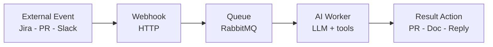

Why this is strong: isolates bursty traffic from model latency, supports retries/idempotency, enables horizontal worker scaling.

#### Pattern 2: Rate Limiting & Retry for LLM APIs

- Token-bucket limiter per tenant/team
- Exponential backoff with jitter for transient failures
- Circuit breaker (Polly) to stop storming unhealthy providers
- Fallback model/path for degraded operation

#### Pattern 3: Vector DB in .NET Stack

- Semantic Kernel orchestration + Npgsql + pgvector
- Keep retrieval metadata relational for governance/reporting
- Start simple; move to specialized vector DB only when scale demands it

#### Pattern 4: Async Validation Pipeline


- Input: schema + auth + idempotency key
- Output: format check, policy checks, confidence threshold
- Action: commit, post PR comment, send Slack reply

> [!tip] Interview line
> "For AI systems, reliability patterns from distributed systems are still the backbone; the model is just one dependency in the chain."

### Day 3 Practice Q&A

> [!question] "How would you automate Jira-to-PR?"
> **Model answer (draw Dexter):**
> - Requirements: latency target, quality threshold, auditability
> - Flow: Jira webhook → queue → worker → repo mapping → codegen → pre-commit checks → PR → Jira update
> - Data: ticket-to-repo mapping store + run history
> - Reliability: retries, dead-letter queue, confidence threshold for auto-open PR
> - Metrics: PR acceptance rate, build pass rate, cycle time reduction
> - Security: scoped credentials, secret rotation, policy checks

> [!question] "Design AI-powered documentation updates"
> **Model answer (draw Doculus):**
> - Trigger on merged PR
> - Diff-aware doc impact analysis
> - Regenerate targeted sections with AIDOC markers
> - Open review PR with traceable source mapping
> - Prevent loops with event dedupe and source tags
> - Measure freshness SLA and human acceptance rate

**Resources**: [System Design Primer](https://github.com/donnemartin/system-design-primer) · [ByteByteGo](https://www.youtube.com/@ByteByteGo) · [Semantic Kernel docs](https://learn.microsoft.com/en-us/semantic-kernel/)

---

## Day 4 (Sunday) — Projects & AI Ownership

### Project Deep Dives

For each project, present: Architecture → MVP scope → Edge cases → Metrics → What I'd improve → 2-minute pitch.

---

### Dexter (Jira → PR Automation)

**Architecture:**

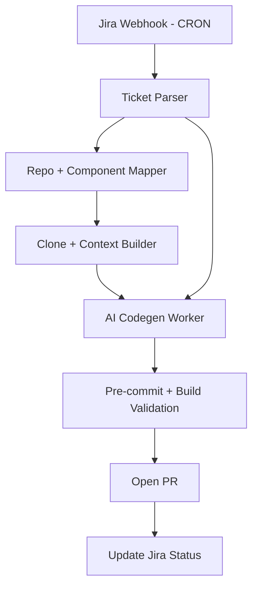

**MVP scope:** Single-repo, low-risk services. Generate branch + PR draft first, then expand to code changes. Strict confidence threshold before auto-PR.

**Edge cases:**
- Multi-repo tickets with ambiguous ownership
- Ticket lacks acceptance criteria → codegen quality drops
- Code compiles but fails tests → need pre-commit gate
- Security-sensitive area → require manual gate

**Metrics:** `% tickets with AI-assisted PR` (20% target), PR acceptance rate, build/test pass rate, median cycle time from ticket to first PR.

**What I'd improve:** Better component mapping via historical ownership signals. Retrieval of similar historical tickets/PRs for pattern grounding. Structured reviewer feedback loop.

**Milestones from doc:** Auto branch creator → Real code changes → Config support → Pre-commit validations → Feedback loop

> [!tip] 2-minute pitch
> "Dexter automates the boring first 60% of Jira-to-PR flow. It listens to ticket events, maps to the right repo context, generates constrained code changes, validates with pre-commit checks, and opens a traceable PR. The ownership lens is measurable throughput with quality guardrails: acceptance rate, build pass rate, and cycle time."

---

### Doculus (Auto-Documentation)

**Architecture:**

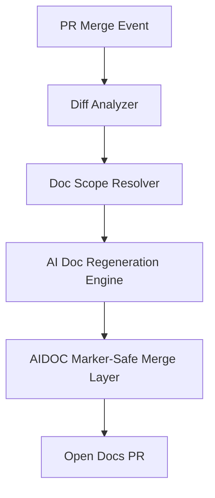

**MVP scope:** One doc type first (runbooks or API docs). Only update sections with explicit markers. Human review required initially. ~22 story points.

**Edge cases:** Manual edits overwritten without marker discipline. Circular trigger loops. Huge PR diffs causing noisy doc updates.

**Metrics:** Doc freshness (time from code merge to doc update), coverage (% repos with auto-docs), developer trust/satisfaction.

> [!tip] 2-minute pitch
> "Doculus closes the code-doc drift gap. It uses merge events, diff-aware impact detection, and marker-safe regeneration to create auditable doc PRs. We optimize for freshness and trust, not blind automation."

---

### SlackJack (Support Bot)

**Architecture:**

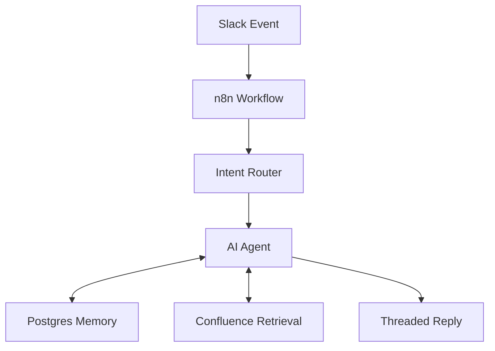

**MVP scope:** One team channel, FAQ + runbook questions, escalation path for low-confidence. ~12 story points.

**Edge cases:** Ambiguous/multi-part questions. Sensitive data in shared channels. Rate limiting. Context window overflow on long threads.

**Metrics:** First response time, resolution without escalation, satisfaction rating.

**Key pattern:** n8n workflow duplicable for each team channel — customize with team-specific MCPs (Snowflake, ContentStack, LaunchDarkly).

> [!tip] 2-minute pitch
> "SlackJack is an async support accelerator: event-driven, context-grounded, and safe-by-default. It cuts repetitive support load while preserving human escalation for ambiguity or policy-sensitive topics."

---

### AmendA (PR Comment Updater)

**Architecture:**

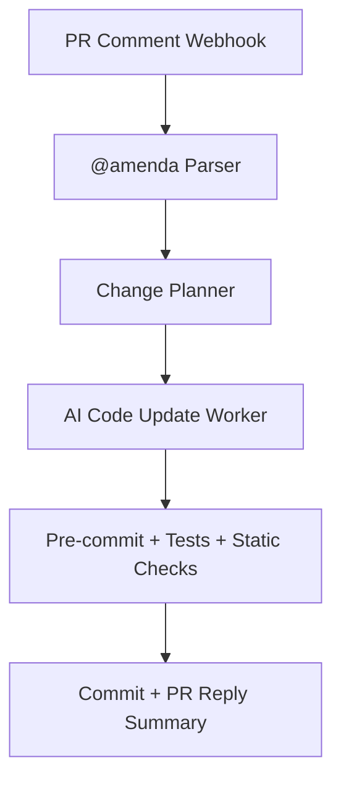

**Modes:** Single comment (immediate localized change) · Batch (`@amenda Apply All` for grouped updates)

**Edge cases:** Conflicting reviewer comments. Ambiguous natural language intent. Merge conflicts after branch drift.

**Key control:** Confidence threshold — high confidence auto-applies, low confidence proposes as draft.

**Metrics:** Turnaround time per review round, accepted suggestion rate, revert rate after auto-updates.

> [!tip] 2-minute pitch
> "AmendA compresses review iteration loops by converting reviewer intent into validated code updates. The differentiator is confidence-based execution: high confidence auto-applies; low confidence proposes."

---

### AI Ownership Framework

#### Scoping
- Define MVP by high-value, low-risk path
- Separate must-have from nice-to-have
- Time-box iteration windows, freeze scope per sprint

#### Metrics Framework

| Category | What to measure | Example |
|---|---|---|
| **Adoption** | Active engineer usage rate | Weekly active users, repeat usage |
| **Throughput** | Delivery speed uplift | 20% tickets via AI, cycle time reduction |
| **Quality** | Output reliability | PR acceptance rate, hallucination rate, build pass rate |
| **Satisfaction** | Developer trust | CSAT, NPS, qualitative feedback |

#### Adoption Challenges + Responses

**Problem:** Setup friction > benefit for small tasks (engineers skip AI for routine work).

**Solutions from DK strategy:**
- **AI Fridays** — hands-on experimentation days
- **Learning Loops** — office hours with AI Coach
- **Shared Prompts Hub** — curated prompts for top 5 languages (.NET, JS, Python, iOS, Android)
- **AI Engineering Guild 2.0** — cross-team collaboration
- **Enablement ladder**: 101 (prompt engineering) → 201 (MCPs, sub-agents) → 301 (RAG, architecture)

#### Iteration Loops
- PR feedback → refine prompts/tooling
- Telemetry anomalies → tune retrieval and thresholds
- User complaints → improve UX and guardrails first, not just model swap

#### Risk Management
- InfoSec review for external tool/data access (Kiro approved, Junie under review)
- Guardrails for hallucination and policy violations
- Confidence threshold + human-in-the-loop for high-blast-radius actions

> [!warning] Interview trap
> "We'll use a better model" is not an ownership plan. You need scope, metrics, rollout strategy, and risk controls.

### Day 4 Practice Q&A

> [!question] "You own Dexter — what would you build in Q1 vs Q2?"
> **Model answer:**
> - **Q1**: Foundation — reliable pipeline, constrained scope (single-repo, low-risk tickets), measurement infrastructure (acceptance rate, build pass)
> - **Q2**: Expansion — multi-repo support, smarter retrieval (historical PRs via Glean), feedback learning from review outcomes
> - "I gate expansion on build pass and acceptance metrics, not roadmap optimism"

> [!question] "What metrics would you track for AI developer tools?"
> **Model answer:**
> - Adoption: weekly active users, repeat usage
> - Throughput: cycle-time reduction, PR velocity, % tickets via AI
> - Quality: acceptance rate, rollback/rework rate, hallucination rate
> - Satisfaction: CSAT/NPS and friction themes
> - "I treat metric slices by team and workflow to avoid false averages"

> [!question] "How would you improve adoption of AI tools?"
> **Model answer:**
> - Reduce friction (single command, templates, defaults)
> - Build trust (quality metrics + transparent failures)
> - Teach by doing (office hours, AI Fridays, prompt library)
> - Reward champions and publish internal wins
> - "Adoption is behavior change, not tool deployment"

---

## Day 5 (Monday) — Final Review

### Morning Cheat Sheet (30 minutes)

- **RAG**: 8-stage pipeline from ingestion to grounded generation ([[RAG]], [[Retrieval]], [[Re-ranking]])
- **Agent**: Think → Act → Observe → Decide ([[Agents]], [[Tools]])
- **MCP**: Resources, Tools, Prompts ([[Model Context Protocol]])
- **System Design**: 5/10/15/5 time-box
- **DK Numbers**: 20% tickets via AI · 15% throughput · 100% 101 completion
- **Ownership**: metrics + trade-offs + failure modes + iteration plan

### Timed Practice Drill (3 rounds)

**Round 1** — "Design internal RAG assistant" (30 min)
- Requirements: 5m → Design: 10m → Deep dive: 10m → Wrap-up: 5m

**Round 2** — "Design MCP-based tool platform for engineering" (30 min)
- Requirements: 5m → Design: 10m → Deep dive: 10m → Wrap-up: 5m

**Round 3** — "Own Dexter roadmap under throughput target" (30 min)
- Requirements: 5m → Design: 10m → Deep dive: 10m → Wrap-up: 5m

> [!tip] Final-day strategy
> Prioritize clarity and decision quality over breadth. In the interview, a well-defended architecture beats a flashy one.

---

## DraftKings Intelligence Brief

### Vision

> **"Empower every DraftKings engineer to build faster, smarter, and safer through AI-augmented development."**

### 2026 Goals
- **15%** throughput increase
- **100%** 101-level completion (all code-writing engineers)
- **DevEx CSAT** improvement (baseline being established)

### Priority Timeline

| Quarter | Focus |
|---|---|
| **Q1** | Enablement (Prompt Engineering, Learning Loops, AI Fridays), AI Workbench (Kiro/Junie pilots), Impact Insights (CSAT baseline, metrics solution eval) |
| **Q2** | Hands-On Lab 101 rollout, Shared Prompts Hub (top 5 languages + sub-agents), Doculus evaluation |
| **Q3+** | 201/301 enablement, Dev-to-PR rollout, Doculus pilot, Curio integrations |

### Metrics Tools Under Evaluation
Jellyfish · DX (Atlassian) · LiteLLM (in-house)

### Full Use-Case Portfolio
Dexter · Doculus · SlackJack · AmendA · Ops Support Bot · Curio · Tech Planner Bot · Ops Review Chatbot

**How to leverage in interview:** Connect every technical answer to business outcomes: "This design improves throughput safely," "This increases adoption," "This reduces DevEx friction while preserving governance."

---

## Interview Traps & Ownership Signals

### Common Mistakes to Avoid

> [!warning]- Trap 1: "I know RAG" but no production scars
> Saying "I built a RAG system" without describing what broke is a red flag. Interviewers assume you followed a tutorial.
> **What they want to hear**: Failure modes by pipeline stage — stale ingestion, bad chunk boundaries, embedding domain mismatch, retrieval missing acronyms, hallucinated citations — and how you detected and mitigated each.
> **Fix**: "We saw faithfulness drop when legal jargon entered the corpus. Dense retrieval missed exact statute IDs, so we added BM25 hybrid retrieval and saw context precision recover from 0.61 to 0.78."

> [!warning]- Trap 2: Handwavy "agent" language
> Saying "we used agents" without naming the exact pattern, tool boundaries, or control flow signals shallow understanding. "Agent" has become a buzzword.
> **What they want to hear**: Is it ReAct, Plan-and-Execute, or a deterministic workflow with one LLM step? What tools does the agent have access to? What happens when a tool call fails? What is the termination condition?
> **Fix**: "SlackJack uses a ReAct loop with a constrained toolset — Confluence search, Postgres memory read, and Slack reply. If tool confidence is below threshold, it escalates to a human rather than hallucinating an answer. Max 5 iterations before forced response."

> [!warning]- Trap 3: No failure-mode analysis in system design
> Drawing boxes and arrows without discussing what breaks is a junior move. Every interviewer will ask "what happens when X goes down?"
> **What they want to hear**: For each dependency — what fails, how you detect it, how you recover, and how you prevent cascading. Retries with backoff, circuit breakers, dead-letter queues, idempotency keys, health checks, graceful degradation.
> **Fix**: "If the LLM provider returns 503s, Polly circuit breaker trips after 5 failures in 30 seconds. While tripped, we return a degraded response and route the task to a fallback queue. Half-open probes every 60 seconds. DLQ alert fires if depth exceeds 10 in 5 minutes."

> [!warning]- Trap 4: Project talk without metrics
> Describing what you built without quantifying impact sounds like you shipped and forgot. Ownership means measuring outcomes, not just deploying code.
> **What they want to hear**: Adoption, throughput, quality, and satisfaction metrics — with actual numbers or targets. What did you measure? What did the numbers tell you? What did you change because of the data?
> **Fix**: "Dexter's success metric is PR acceptance rate — currently 73% for low-risk tickets. Build pass rate is 91%. We track cycle time from ticket creation to first PR: median dropped from 4 hours to 22 minutes for eligible tickets."

> [!warning]- Trap 5: Treating the model as a black box
> "We send the prompt and get an answer" suggests you have no debugging strategy when outputs are wrong. Senior engineers understand why models fail, not just that they fail.
> **What they want to hear**: Prompt engineering with structured constraints, output validation, confidence estimation, systematic debugging (is it a retrieval failure or a generation failure?), and when to use cheaper models vs frontier models.
> **Fix**: "When Dexter generated wrong import statements, I traced it to a retrieval problem — the context window had the right file but the wrong version. Fixing the freshness TTL on the code index resolved it. The model was fine; the context was stale."

> [!warning]- Trap 6: No cost awareness in architecture
> Designing an AI system without discussing token costs, API pricing tiers, or cost-per-query signals that you have never operated AI at real scale. Cost is a first-class architectural constraint.
> **What they want to hear**: Cost-per-query estimates, caching strategies to avoid redundant LLM calls, model tiering (cheap model for classification, frontier model for generation), token budget allocation across retrieval/reranking/generation, and how you monitor cost drift.
> **Fix**: "We route simple ticket classification through a smaller model at ~$0.001/call and reserve GPT-4 for code generation at ~$0.05/call. Caching repeated Confluence queries in Redis saves ~30% of embedding API calls. We track cost-per-PR in our dashboard and alert if it exceeds $0.50."

> [!warning]- Trap 7: "We will just use a better model"
> Using model upgrades as the answer to quality problems is not an engineering strategy. Models improve, but your pipeline, retrieval, and validation are what you control. This trap is explicitly called out in DraftKings ownership thinking.
> **What they want to hear**: That you diagnose *where* in the pipeline the quality problem originates (ingestion? chunking? retrieval? prompt? output validation?) before reaching for a model swap. Model choice is one lever among many.
> **Fix**: "Before considering a model upgrade, I check retrieval metrics first — context precision and recall. In 80% of cases, the issue is that the right evidence never reached the model. Fixing retrieval is cheaper and more durable than chasing the next model release."

> [!warning]- Trap 8: No security or governance thinking
> Building AI features without mentioning access control, PII handling, prompt injection, or audit trails suggests you have never shipped to an enterprise environment. DraftKings is a regulated company — this matters.
> **What they want to hear**: Scoped credentials with least-privilege access, PII stripping before AI context, prompt injection defenses (input sanitization, system prompt isolation), audit logging of all AI decisions traceable to source event + model version, and InfoSec review gates for new tool integrations.
> **Fix**: "Every MCP server integration goes through InfoSec review — Kiro is approved, Junie is under review. Slack messages are stripped of email addresses before entering the AI context. All AI actions are logged with correlation ID, model version, and source event for audit."

> [!warning]- Trap 9: Jumping to multi-agent when a workflow suffices
> Proposing a multi-agent architecture for a problem that a deterministic workflow solves is over-engineering. It signals you are chasing hype rather than solving the problem. Anthropic's own guidance says most "agent" use cases are better served by workflows.
> **What they want to hear**: A clear decision framework for when to add agency. Deterministic path known → workflow. Uncertain exploration with branching → agent. You should start simple and add complexity only when metrics prove necessity.
> **Fix**: "Doculus uses a purely deterministic pipeline: PR merge → diff analysis → doc scope resolution → regeneration → PR. No agent loop needed — the path is fully predictable. SlackJack uses a ReAct agent because user questions are open-ended and require iterative tool use. The architecture matches the uncertainty of each problem."

> [!warning]- Trap 10: No rollout or adoption strategy
> Building a tool without a plan for how engineers will actually use it is shipping into a vacuum. Adoption is behavior change, not deployment.
> **What they want to hear**: Phased rollout (pilot one team → measure → expand), friction reduction (single command, sensible defaults, templates), trust-building (transparent failures, quality dashboards), feedback loops (telemetry + user input → iteration), and enablement (office hours, documentation, champions).
> **Fix**: "We piloted SlackJack in one team channel for 4 weeks, measured resolution-without-escalation rate and CSAT, iterated on the intent router based on misclassification logs, then expanded to three more channels. Adoption grew from 12% to 68% weekly active usage once we added team-specific MCP integrations for Snowflake and LaunchDarkly."

### Ownership Phrases to Practice Verbatim

- "When I owned X, I measured success by…"
- "The trade-off I considered was latency vs precision, and I chose… because…"
- "I scoped the MVP to… to reduce risk and shorten feedback loops"
- "The failure mode we hit was…; detection was…; mitigation was…"
- "I would not scale this yet because the current bottleneck is…"
- "I use eval gates before rollout, so quality regressions fail fast"

### 2-Minute Closing Script

> [!note] Practice this out loud
> "I'm strongest where distributed systems discipline meets applied AI execution. I design AI systems end-to-end: ingestion, retrieval quality, tool orchestration, observability, and rollout metrics. For agentic systems, I start simple and add autonomy only when it's justified by measurable outcomes. For MCP, I value the interoperability and governance benefits because they scale DevEx impact across teams and tools. When I own a project, I define success metrics early, scope MVP tightly, and iterate based on telemetry and user feedback. That's how I'd contribute to DraftKings' throughput, enablement, and developer trust goals."


---

## Class Design Round — Robot-Managed Restaurant (HackerRank Style)

> [!warning] This section prepares you for the OOP class design round
> The interviewer expects clean OOP with clear interfaces, extensibility, and attention to real-world movement mechanics. Think diagrams plus patterns plus key method signatures — not full implementations.

### Problem Statement

Design a robot-managed restaurant system where:
1. A robot takes orders from customer tables
2. Robot sends orders to the kitchen
3. Robot picks up completed dishes and delivers to customers
4. **Extension**: add a Cleaner Robot without breaking existing design
5. **Special focus**: how does a robot physically move from point A to point B?

### Step 1: Identify Core Entities

```text
┌─────────────────────────────────────────────────────────┐
│                    Restaurant System                     │
├──────────┬──────────┬──────────┬──────────┬─────────────┤
│  Robot   │  Table   │ Kitchen  │  Order   │ Restaurant  │
│ (types)  │ (seats)  │ (queues) │ (items)  │   Floor     │
└──────────┴──────────┴──────────┴──────────┴─────────────┘
```

### Step 2: Class Hierarchy

> [!tip] Key Design Principle
> **Program to interfaces, not implementations.** This is what enables the Cleaner Robot extension later without modifying existing code (Open/Closed Principle).

#### Robot Hierarchy and Movement Strategy

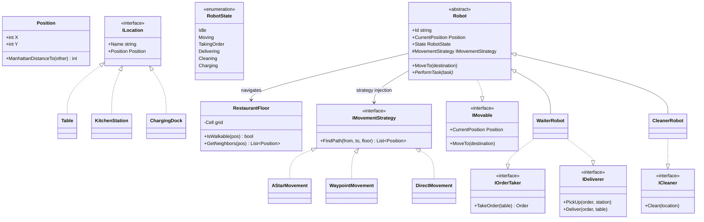

**Why this hierarchy wins in interviews:**

- **Open/Closed**: Adding `CleanerRobot` required **zero changes** to `WaiterRobot`, `Robot`, or `Kitchen`
- **Interface Segregation**: `ICleaner` is separate from `IOrderTaker` — no robot implements methods it doesn't need
- **Strategy**: Movement algorithm is injectable per robot instance — A* for waiters, waypoint-based for cleaners
- **Liskov Substitution**: Any `Robot` subclass can be used wherever `Robot` is expected

**Key pattern — Strategy injection in Robot constructor:**

```csharp
protected Robot(string id, Position startPos, IMovementStrategy movement)
{
    Id = id;
    CurrentPosition = startPos;
    MovementStrategy = movement;  // Injected — swap A* for waypoint without changing Robot
    State = RobotState.Idle;
}
```

> [!question] "How would the robot physically move from A to B?"
> **Model answer:**
> "I model the restaurant floor as a 2D grid where each cell is walkable or blocked. The robot uses a **pathfinding strategy** — I'd inject `IMovementStrategy` via constructor. For a fixed restaurant layout, I'd use A* on a pre-computed waypoint graph: optimal paths without re-running full grid search on every move. Real service robots like BellaBot and Bear Robotics' Servi do exactly this: SLAM builds the map once, then navigation runs on it. A collision avoidance layer checks if the next position is occupied by another robot — if so, wait or re-route."

#### Kitchen and Orchestration — Observer Pattern

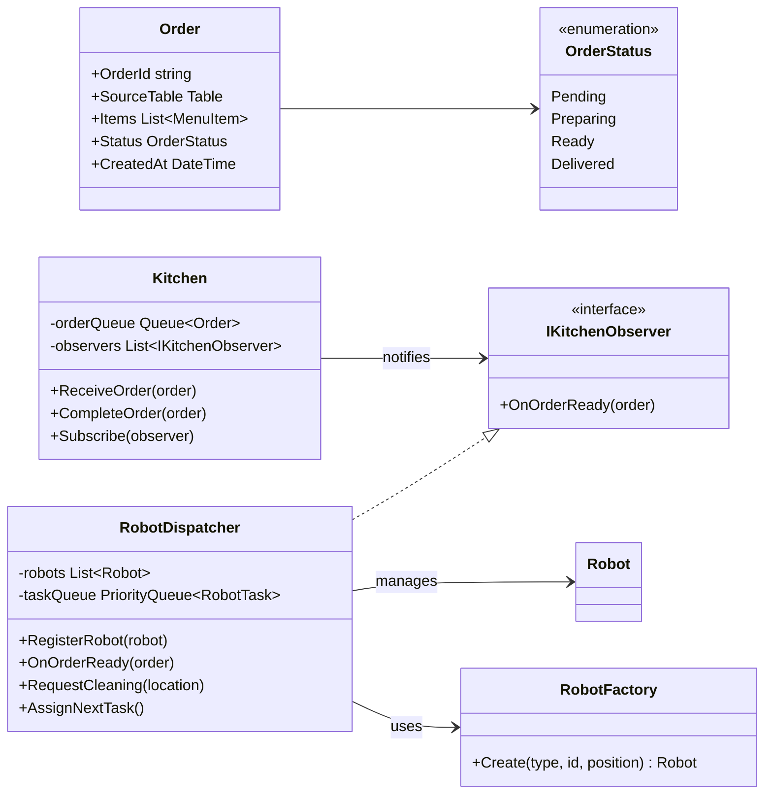

**Key pattern — Observer decouples Kitchen from Dispatcher:**

```csharp
// Kitchen does NOT know about robots — it just notifies observers
public void CompleteOrder(Order order)
{
    order.Status = OrderStatus.Ready;
    foreach (var obs in observers)
        obs.OnOrderReady(order);  // Dispatcher reacts by assigning delivery
}
```

### Step 3: Async Concurrency — Multiple Customers Simultaneously

This is the critical part interviewers probe: how does the system handle **concurrent operations** when multiple customers are at different stages?

#### Robot State Machine

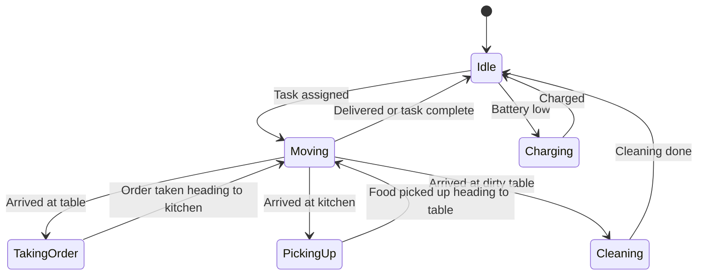

#### Concurrent Scenario — Three Customers at Different Stages

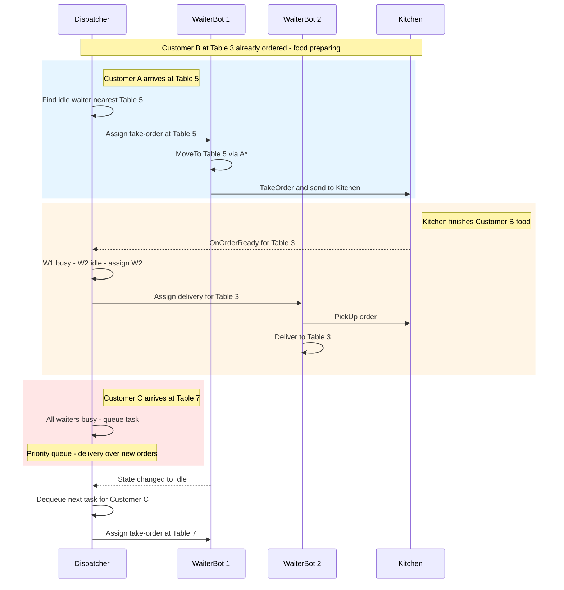

#### How the Dispatcher Handles Concurrency

**Task Priority Queue** — When all robots are busy, tasks are queued by priority:

| Priority | Task Type | Rationale |
|----------|-----------|-----------|
| 1 Highest | Food delivery | Food gets cold — direct customer impact |
| 2 | Order taking | Customer is waiting but not losing quality |
| 3 | Table cleaning | No active customer affected |
| 4 Lowest | Restocking or charging | Background maintenance |

**Dispatcher assignment logic:**

```csharp
public void AssignNextTask()
{
    if (!taskQueue.TryDequeue(out var task)) return;

    var candidate = robots
        .Where(r => r.State == RobotState.Idle && r.CanHandle(task))
        .OrderBy(r => r.CurrentPosition.ManhattanDistanceTo(task.Location))
        .FirstOrDefault();

    if (candidate != null)
        candidate.PerformTask(task);
    else
        taskQueue.Enqueue(task);  // Re-queue if no idle robot available
}
```

**Key concurrency behaviors:**

1. **Observer notifications are non-blocking** — Kitchen fires `OnOrderReady`, Dispatcher evaluates immediately but only assigns if a robot is idle. Otherwise the delivery task enters the priority queue.

2. **State-checked dispatch** — The Dispatcher only assigns work to `Idle` robots. A robot moving to Table 5 for an order cannot be reassigned mid-path. The new task goes to another idle robot or the queue.

3. **Proximity-based selection** — Among idle robots that can handle the task, the nearest one is chosen via Manhattan distance. This minimizes wait time and avoids two robots crossing paths.

4. **Completion callback** — When a robot finishes any task, it sets `State = Idle` and calls `Dispatcher.AssignNextTask()`, which checks the queue and immediately assigns the next highest-priority task.

> [!tip] Interview line
> "The Dispatcher is event-driven: Kitchen events and robot-idle events both trigger task assignment. The system self-balances without polling — as soon as capacity frees up, queued work starts immediately."

### Full System Flow

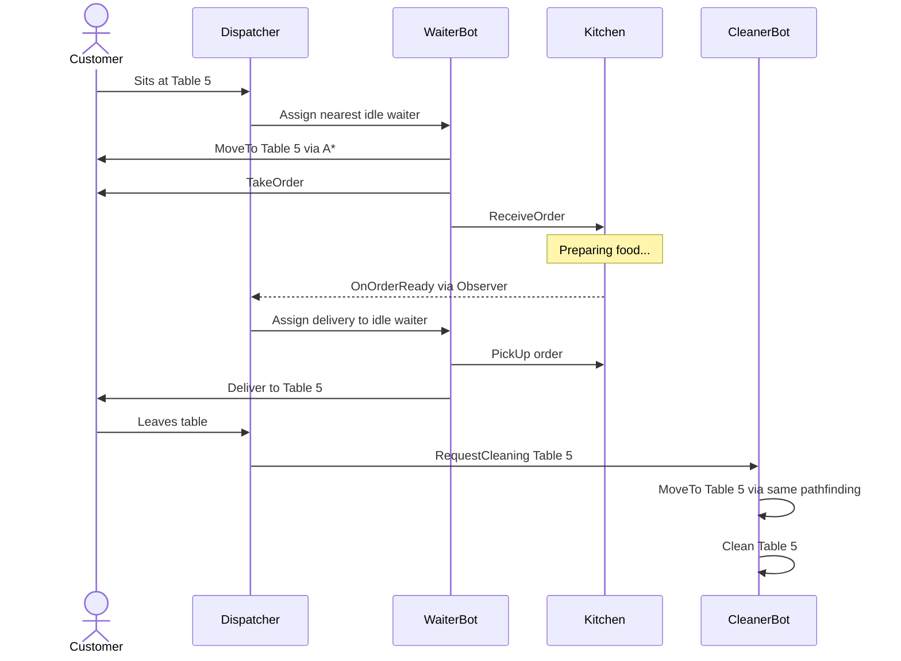

### Patterns Summary Table

| Pattern | Where Used | Why |
|---|---|---|
| **Strategy** | `IMovementStrategy` | Swap pathfinding per robot or context without changing robot code |
| **Observer** | `Kitchen` to `IKitchenObserver` | Decouple kitchen from robot assignment logic |
| **Command-like** | `Order` object | Order flows through system as data — can be queued or logged |
| **Factory** | `RobotFactory` | Encapsulate robot creation — easy to add new types |
| **Template Method** | `Robot` base class | Shared movement logic with specialized task behavior in subclasses |
| **ISP** | `IOrderTaker` and `ICleaner` and `IDeliverer` | Robots only implement capabilities they actually have |
| **Priority Queue** | `RobotDispatcher.taskQueue` | Handle concurrent demand when robots are busy |

### Follow-Up: "Add another robot type?"

> [!question] "Add a Host Robot that greets customers and seats them"
> **Model answer:**
> 1. Create `IGreeter` interface with `GreetAndSeat(Customer, Table)` method
> 2. Create `HostRobot : Robot, IGreeter` — inherits movement, implements greeting
> 3. Add `"host"` case to `RobotFactory`
> 4. Add seating logic to `RobotDispatcher` (on customer arrival event)
> 5. **Zero changes** to `WaiterRobot`, `CleanerRobot`, `Kitchen`, or `Order`
>
> "This is OCP in practice — open for extension, closed for modification."

### Pathfinding Deep Dive (If Interviewer Probes)

**A* in 4 sentences:**
> "A* maintains open set (candidates) and closed set (explored). Each node has cost `f = g + h` where `g` is actual cost from start and `h` is heuristic estimate to goal (Manhattan distance for grid). We always expand the lowest-f node first. When we reach the goal, backtrack parent pointers for the path."

**Grid representation for whiteboard:**
```text
Restaurant Floor (10x8 grid):
┌──┬──┬──┬──┬──┬──┬──┬──┬──┬──┐
│  │  │  │T1│  │  │T2│  │  │  │  T = Table
├──┼──┼──┼──┼──┼──┼──┼──┼──┼──┤  K = Kitchen
│  │  │  │  │  │  │  │  │  │  │  W = Wall
├──┼──┼──┼──┼──┼──┼──┼──┼──┼──┤  C = Charging
│  │WW│WW│WW│  │WW│WW│WW│  │  │  R = Robot
├──┼──┼──┼──┼──┼──┼──┼──┼──┼──┤
│  │  │  │T3│R→│→ │→ │→T4│  │  │  ← A* path shown
├──┼──┼──┼──┼──┼──┼──┼──┼──┼──┤
│K │K │  │  │  │  │  │  │T5│  │
├──┼──┼──┼──┼──┼──┼──┼──┼──┼──┤
│  │  │  │  │  │  │  │  │  │C │
└──┴──┴──┴──┴──┴──┴──┴──┴──┴──┘
```

**Collision avoidance:**
- Each robot reserves its next N positions in a shared occupancy map
- Before stepping, check if target cell is reserved by another robot
- If blocked: wait briefly, then re-route via A* with dynamic obstacles

**Real-world reference:** BellaBot (Pudu Robotics) uses dual SLAM (LiDAR + Visual) which maps to swappable `IMovementStrategy`. The Nav2 navigation stack (used by 100+ companies) explicitly uses a plugin architecture for path planners — the Strategy pattern at framework scale.

---

## Project Deep Dive Framework (How to Present ANY Past Project)

> [!tip] Use this framework for Day 3 (System Design) AND Day 4 (Ownership)
> When asked "Walk me through your project" or "Explain the architecture."

### The 5-Layer Presentation Framework

**Present in this order — mirrors how senior engineers think:**

#### Layer 1: Problem & Context (30 seconds)
- What business problem does this solve?
- Who are the users? What's the scale?
- What were the constraints? (team size, timeline, existing infra)

#### Layer 2: High-Level Architecture (2 minutes)
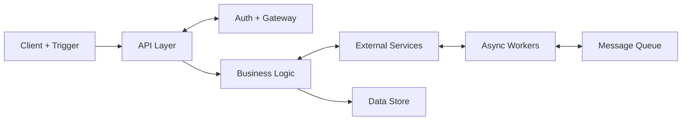
For each box: **technology choice** + **WHY** + **communication pattern** (sync vs async)

#### Layer 3: Key Technical Decisions (3 minutes)

Present 2-3 decisions as trade-offs:
> "We chose X over Y because [concrete reason tied to our constraints]."

| Decision Area | Options to Compare | What Interviewers Want |
|---|---|---|
| **Communication** | REST vs gRPC vs Queue | When sync vs async, latency vs reliability |
| **Database** | SQL vs NoSQL vs Both | Data model fit, consistency needs, query patterns |
| **Caching** | Redis vs In-memory vs None | Invalidation strategy, TTL reasoning |
| **Auth** | JWT vs Session vs OAuth | Token lifecycle, service-to-service auth |
| **Deployment** | Monolith vs Microservices | Team size, deployment independence |
| **Async** | Workers vs Queues vs Events | Failure handling, retry, ordering |
| **Error handling** | Retry vs Breaker vs DLQ | Idempotency, poison message handling |

#### Layer 4: Failure Modes & Observability (2 minutes)

> [!warning] This is where senior engineers differentiate themselves
> Junior: "It works." Senior: "Here's what breaks and how we detect it."

- **What can fail?** (external service, DB timeout, queue backup, data inconsistency)
- **How detected?** (health checks, metrics, alerts, structured logs)
- **How recovered?** (retry, fallback, circuit breaker, manual intervention)
- **How prevented?** (rate limiting, validation, idempotency, chaos testing)

#### Layer 5: Metrics & Evolution (1 minute)
- KPIs that prove the system works
- What you'd change with hindsight
- Scaling bottleneck at 10x

### Communication Patterns Cheat Sheet

| Pattern | When | .NET Implementation | Trade-off |
|---|---|---|---|
| **REST (sync)** | Client-facing APIs, CRUD | ASP.NET Core Minimal APIs | Simple but tight coupling |
| **gRPC (sync)** | Internal service calls | ASP.NET Core gRPC | Fast + typed, harder to debug |
| **Queue (async)** | Decouple producer/consumer | [[RabbitMQ]], Azure Service Bus | Reliable, eventual consistency |
| **Event stream** | Event sourcing, real-time | [[Kafka]] | Ordered + replayable, complex ops |
| **Webhooks** | External triggers | ASP.NET endpoint | Decoupled, needs idempotency |
| **SignalR** | Real-time UI updates | ASP.NET Core SignalR | Great UX, connection management |

### Database Selection Cheat Sheet

| Need | Choose | Why | .NET Integration |
|---|---|---|---|
| Structured + joins + ACID | **PostgreSQL / SQL Server** | Relational integrity | EF Core |
| Flexible schema / documents | **MongoDB / CosmosDB** | Evolving schema, nested data | MongoDB.Driver |
| Key-value + caching | **Redis** | Sub-ms reads, TTL | StackExchange.Redis |
| Vector search + embeddings | **pgvector / Qdrant** | Semantic search for AI | Npgsql + pgvector |
| Time-series | **TimescaleDB / InfluxDB** | Range queries on timestamps | Native clients |
| Full-text search | **Elasticsearch** | Complex search queries | NEST / Elastic.Clients |

### Scalability Patterns Quick Reference

| Pattern | Solves | Key Concept |
|---|---|---|
| Horizontal scaling | More load | Add instances behind load balancer |
| Vertical scaling | More per-node capacity | Bigger machine (limited ceiling) |
| DB sharding | Write bottleneck | Partition by key (user_id, region) |
| Read replicas | Read bottleneck | Replicate to read-only DBs |
| [[CQRS]] | Mixed read/write | Separate read/write models |
| [[Event-Driven Architecture]] | Tight coupling | Async events decouple services |
| CDN | Static asset latency | Cache at edge |
| Connection pooling | DB connection limits | Reuse connections (PgBouncer) |

### Consistency Models

| Model | Guarantee | When to use |
|---|---|---|
| **Strong** | Read always sees latest write | Financial transactions, inventory |
| **Eventual** | Reads may be stale temporarily | Social feeds, analytics, caching |
| **Causal** | Related writes are ordered | Chat, collaborative editing |

> [!tip] [[CAP theorem]] interview line
> "During a partition, you choose between consistency and availability. We chose [AP/CP] because [reason]. Most systems make different choices per operation."

### Monitoring — The Three Pillars

| Pillar | What | Tools | .NET |
|---|---|---|---|
| **Metrics** | Numbers over time | Prometheus, Datadog | OpenTelemetry, App Insights |
| **Logs** | Structured events | ELK, Seq, Loki | Serilog, NLog |
| **Traces** | Request flow across services | Jaeger, Zipkin | OpenTelemetry |

> [!tip] Senior signal
> "I instrument with OpenTelemetry from day one. The cost of adding observability later is 10x."

### "Walk Me Through Your Architecture" — Template

> [!question] Use this for presenting ANY DraftKings project
> **Opening**: "[Project] solves [problem] by [approach]. It serves [users] at [scale]."
>
> **Architecture**: "It's a webhook-driven async pipeline. [Trigger] → validate → enqueue → [worker] processes with [AI/logic] → [action]. We chose async because [latency tolerance, retry needs, burst handling]."
>
> **Database**: "We use [DB] because [data model fit]. [Caching strategy] for [hot data]."
>
> **Communication**: "External triggers via webhooks. Internal via [REST/gRPC/queue] because [trade-off]."
>
> **Failures**: "If [service] is down → [breaker/retry/DLQ]. If [worker] crashes → [idempotency/checkpoint]. Monitored via [metrics/alerts]."
>
> **Metrics**: "Success = [KPI]. Current: [numbers]. Next improvement: [specific step]."

---

## Additional Practice Questions

### Class Design Questions (HackerRank Round)

> [!question] "Design a parking lot system"
> **Core entities**: `Vehicle` (Car, Truck, Motorcycle) → `ParkingSpot` (Compact, Regular, Large, Handicapped) → `ParkingFloor` → `ParkingLot` → `Ticket`
>
> **Key patterns**:
> - **Strategy** — `ISpotAssignmentStrategy` injected into `ParkingLot`: `NearestEntranceStrategy`, `EvenDistributionStrategy`, `CompactFirstStrategy`. Swap assignment logic without changing lot code.
> - **Observer** — `IAvailabilityObserver` notified when spots free up. Display boards and waitlist system subscribe.
> - **Factory** — `ParkingSpotFactory.Create(SpotType)` encapsulates spot creation.
> - **ISP** — `IElectricChargeable` only on spots with chargers, not all spots.
>
> **Model answer**:
> 1. Vehicle arrives → `ParkingLot.AssignSpot(vehicle)` uses strategy to find best available spot that fits vehicle size
> 2. Vehicle size → spot size mapping: Motorcycle fits Compact+; Car fits Regular+; Truck requires Large only
> 3. `Ticket` records vehicle, spot, entry time — used for fee calculation
> 4. On exit: `ParkingLot.FreeSpot(ticket)` → calculates fee by duration → notifies observers (display boards update)
> 5. Fee calculation: Strategy pattern again — `IFeeStrategy` (hourly, daily cap, weekend rates)
>
> **Key code — Assignment with Observer notification**:
> ```csharp
> public class ParkingLot
> {
>     private readonly List<ParkingFloor> _floors;
>     private readonly ISpotAssignmentStrategy _strategy;
>     private readonly List<IAvailabilityObserver> _observers;
>     
>     public Ticket? AssignSpot(Vehicle vehicle)
>     {
>         var spot = _strategy.FindSpot(vehicle, _floors);
>         if (spot == null) return null; // Full
>         spot.Occupy(vehicle);
>         return new Ticket(vehicle, spot, DateTime.UtcNow);
>     }
>     
>     public decimal FreeSpot(Ticket ticket)
>     {
>         ticket.Spot.Vacate();
>         var fee = _feeStrategy.Calculate(ticket);
>         foreach (var obs in _observers)
>             obs.OnSpotAvailable(ticket.Spot); // Display boards update
>         return fee;
>     }
> }
> ```
>
> **Interviewer probes to expect**:
> - **Concurrency**: Two vehicles arrive simultaneously for the last spot — use optimistic locking or transaction on `spot.Occupy()` to prevent double-assignment. Alternatively, `ConcurrentDictionary<SpotId, Vehicle>` with atomic `TryAdd`.
> - **Persistence**: Tickets and occupancy must survive service restart — persist to Postgres. Display boards read from cache (Redis) populated by Observer on each state change.
> - **Entrance/exit gates**: Gate opens only after payment confirmed. Payment flow: scan ticket → calculate fee → pay → raise gate → vacate spot → notify observers.
>
> **Extension question: "Add EV charging spots"**
> 1. Create `IElectricChargeable` interface with `StartCharging()` / `StopCharging()` / `ChargeLevel`
> 2. `ElectricParkingSpot : ParkingSpot, IElectricChargeable`
> 3. Update assignment strategy to prefer EV spots for electric vehicles — zero changes to `ParkingLot`, `Ticket`, or existing spot types
> 4. Observer notifies when charging complete — same pattern as availability

> [!question] "Design an elevator system"
> **Core entities**: `Elevator` (id, current floor, direction, state, max capacity) → `ElevatorController` → `Request` (floor, direction) → `Building`
>
> **Key patterns**:
> - **Strategy** — `IDispatchStrategy` injected into `ElevatorController`: `NearestIdleStrategy` (minimize wait), `SameDirectionStrategy` (LOOK-like: prefer elevator already heading toward request), `RoundRobinStrategy` (even load). Dispatch picks *which elevator* handles a request. Each elevator internally services its stop queue in SCAN order (sweep up, then down).
> - **Observer** — `IFloorArrivalObserver` notified when elevator reaches a floor. Floor display panels and telemetry/logging subscribe. The controller does NOT subscribe — it owns the request queue directly and mutates it on dispatch.
> - **State** — `ElevatorState` enum (Idle, MovingUp, MovingDown, DoorsOpen, Maintenance). Clean state machine governs transitions.
> - **Command** — Each `Request` is a command object queued and processed by the controller. Two types: `HallCall` (floor + direction, from outside) and `CarCall` (floor, from inside elevator).
>
> **State machine**:
> ```mermaid
> stateDiagram-v2
>     [*] --> Idle
>     Idle --> MovingUp : Request above
>     Idle --> MovingDown : Request below
>     Idle --> DoorsOpen : Request at current floor
>     MovingUp --> DoorsOpen : Arrived at target
>     MovingDown --> DoorsOpen : Arrived at target
>     DoorsOpen --> Idle : No more requests
>     DoorsOpen --> MovingUp : Next request above
>     DoorsOpen --> MovingDown : Next request below
>     Idle --> Maintenance : Manual trigger
>     Maintenance --> Idle : Cleared
> ```
>
> **Model answer**:
> 1. User presses UP button on floor 3 → `HallCall(floor=3, direction=Up)` created
> 2. `ElevatorController.Dispatch(request)` → dispatch strategy picks the best elevator: prefer one already moving up and below floor 3, then idle nearest, then any
> 3. Elevator adds floor 3 to its internal stop queue. Internally, each elevator uses SCAN order: service all stops in current direction before reversing — prevents starvation
> 4. Elevator moves floor-by-floor, checking at each: are there pickups or dropoffs here? If yes → `DoorsOpen` → load/unload → resume
> 5. Capacity check before boarding: `if (elevator.CurrentLoad >= elevator.MaxCapacity)` skip pickup, leave hall call active for next elevator
>
> **Key code — Dispatch strategy (picks which elevator)**:
> ```csharp
> public class SameDirectionStrategy : IDispatchStrategy
> {
>     public Elevator? SelectElevator(Request request, List<Elevator> elevators)
>     {
>         return elevators
>             .Where(e => e.State != ElevatorState.Maintenance)
>             .Where(e => e.CurrentLoad < e.MaxCapacity)
>             .OrderBy(e => IsMovingToward(e, request) ? 0 : 1)  // Prefer same-direction
>             .ThenBy(e => e.State == ElevatorState.Idle ? 0 : 1) // Then idle
>             .ThenBy(e => Math.Abs(e.CurrentFloor - request.Floor)) // Then nearest
>             .FirstOrDefault();
>     }
> }
> ```
>
> **Interviewer probes to expect**:
> - **Hall calls vs car calls**: Hall call ("I want to go up from floor 3") is dispatched to an elevator. Car call ("Take me to floor 7") goes directly to that elevator's stop queue. These are separate request types — don't conflate them.
> - **Starvation/fairness**: Pure nearest-first can starve distant floors. SCAN ordering prevents this by guaranteeing every floor in the sweep direction gets served before reversal.
> - **Full elevator**: If the selected elevator is full when it arrives, the hall call must remain active and be reassigned to the next available elevator — not silently dropped.
>
> **Extension question: "Add VIP priority and emergency mode"**
> 1. `Request` gets a `Priority` enum (Normal, VIP, Emergency)
> 2. Controller uses `PriorityQueue<Request>` — emergency preempts everything
> 3. Emergency mode: all elevators go to ground floor, doors open, ignore normal requests
> 4. Zero changes to `Elevator` internals — only controller dispatch logic changes

> [!question] "Design a chess game"
> **Core entities**: `Board` (8x8 grid of `Square`) → `Piece` hierarchy (King, Queen, Rook, Bishop, Knight, Pawn) → `Game` (manages turns, win conditions) → `Move` (from, to, captured piece)
>
> **Key patterns**:
> - **Polymorphism** — Each `Piece` subclass implements `GetLegalMoves(board)`. Shared sliding logic lives in base class `SlideMoves()` helper (used by Rook, Bishop, Queen). Knight and Pawn override completely.
> - **Template Method** — `Piece` base has `ExecuteMove(from, to, board)` that calls: `PreMoveValidation()` (shared: bounds + turn check) → `ApplyMove()` (shared: update board) → `PostMoveAction()` (override per piece: pawn promotion, castling flag update, en passant state). Subclasses customize `PostMoveAction` without rewriting the move flow.
> - **Command** — `Move` object stores from, to, captured piece, and any special state (was it castling? en passant?) — making it undoable.
> - **Observer** — `IGameObserver` notified on check, checkmate, stalemate. UI and game logger subscribe.
>
> **Model answer**:
> 1. `Board` is 8x8 array of `Square` objects. Each square holds optional `Piece` reference and knows its position
> 2. Each `Piece` subclass implements `GetLegalMoves(board)` returning `List<Move>` — this is where piece-specific logic lives (rook: rank/file lines until blocked; bishop: diagonals; knight: L-shapes ignoring blocks; pawn: forward + capture + en passant)
> 3. `Game.TryMove(from, to)` flow: validate it is current player's piece → call `piece.GetLegalMoves(board)` → check if target is in legal moves → call `piece.ExecuteMove()` (Template Method) → check if own king is now in check (illegal, undo) → switch turns → check opponent for checkmate/stalemate
> 4. Check detection: after every move, compute *attack squares* (pseudo-legal moves, ignoring self-check constraint) for all opponent pieces. If any attack square targets the king's position → king is in check. This avoids circular dependency between legality and check.
> 5. Checkmate: king is in check AND no legal move by any piece removes the check (try every possible move, undo, see if king is still attacked)
>
> **Key code — Piece hierarchy with Template Method**:
> ```csharp
> public abstract class Piece
> {
>     public Color Color { get; }
>     public Position Position { get; set; }
>     public abstract List<Move> GetLegalMoves(Board board);
>     
>     // Template Method: shared flow, customizable post-action
>     public Move ExecuteMove(Position to, Board board)
>     {
>         var captured = board.GetPiece(to);
>         var move = new Move(Position, to, captured);
>         board.MovePiece(this, to);         // Shared: update board state
>         PostMoveAction(move, board);        // Override: pawn promotion, castling flags
>         return move;
>     }
>     
>     protected virtual void PostMoveAction(Move move, Board board) { } // Default: no-op
>     
>     protected List<Move> SlideMoves(Board board, (int dr, int dc)[] directions)
>     {
>         var moves = new List<Move>();
>         foreach (var (dr, dc) in directions)
>         {
>             var pos = Position;
>             while (true)
>             {
>                 pos = new Position(pos.Row + dr, pos.Col + dc);
>                 if (!board.IsInBounds(pos)) break;
>                 if (board.IsOccupiedByAlly(pos, Color)) break;
>                 moves.Add(new Move(Position, pos, board.GetPiece(pos)));
>                 if (board.IsOccupiedByEnemy(pos, Color)) break; // Capture then stop
>             }
>         }
>         return moves;
>     }
> }
> 
> public class Pawn : Piece
> {
>     public override List<Move> GetLegalMoves(Board board) { /* forward, capture, en passant */ }
>     protected override void PostMoveAction(Move move, Board board)
>     {
>         if (move.To.Row == PromotionRank)
>             board.PromotePawn(this); // Replace pawn with chosen piece
>     }
> }
> ```
>
> **Interviewer probes to expect**:
> - **Special moves**: Castling (king + rook move together, requires neither has moved, no check through), en passant (capture pawn that just double-moved), promotion (pawn reaches back rank). Each needs state tracking — `HasMoved` flag on King/Rook, `lastDoublePawnMove` on Game.
> - **Draw conditions**: Stalemate, threefold repetition (need board state hashing via Zobrist), fifty-move rule, insufficient material. Move history from Command pattern enables all of these.
>
> **Extension question: "Add undo/redo and move history"**
> 1. `Move` already stores captured piece — `Undo()` restores piece to original square, puts captured piece back
> 2. `Game` maintains `Stack<Move> history` and `Stack<Move> redoStack`
> 3. Undo pops from history, pushes to redo. Any new move clears redo stack
> 4. Move history enables PGN export, game replay, and draw-by-repetition detection
> 5. Zero changes to `Piece` subclasses or `Board` — only `Game` orchestration changes
### Past Project Deep Dive Questions

> [!question] "How did services communicate in your system?"
> **Model answer (anchor to Dexter/Doculus — queue-based; SlackJack uses n8n workflows)**:
> - "For **Dexter and Doculus**, we use **webhook-driven async pipelines**. External events (Jira webhooks, PR merge events) hit an HTTP endpoint, validate + normalize, then enqueue to RabbitMQ. Workers consume from the queue and run the AI pipeline."
> - "**SlackJack is different** — it uses **n8n workflow orchestration** instead of a raw queue. Slack events trigger an n8n webhook, which routes by intent through a deterministic workflow before reaching the AI agent. n8n gives us visual workflow editing, easy human-in-the-loop insertion, and per-team workflow duplication without code changes."
> - "We chose **async over sync** for all tools because LLM processing takes 5-30 seconds — holding an HTTP connection open that long causes timeout cascading and blocks the caller. With a queue (or n8n's async steps), the trigger returns 202 immediately, and processing happens at its own pace."
> - "Internal service-to-service calls (e.g., worker calling the repo mapper or ticket parser) use **REST over HTTP** because the call graph is simple and tooling is mature. If we had high-frequency internal calls, I would switch to **gRPC** for typed contracts and lower latency."
> - **Trade-offs**: Async adds complexity — you need idempotency keys (we derive from the stable webhook delivery ID — Jira's `webhookEvent` ID, GitHub's `X-GitHub-Delivery` header, Slack's `event_id`), dead-letter queues for poison messages, and correlation IDs threaded through the entire pipeline for tracing.
> - **Failure handling**: Transient failures (LLM API 429/503) → exponential backoff with jitter via Polly. Permanent failures (invalid ticket, missing repo) → route to DLQ, alert on-call, create incident ticket. Circuit breaker on the LLM provider — trips after 5 consecutive failures in a 30-second window, half-open probes every 60 seconds. While tripped, return a degraded response and route to fallback queue.
> - **At 10x scale**: The webhook endpoint becomes the bottleneck. I would add a load balancer in front, scale worker instances horizontally (queue-based autoscaling on queue depth), and partition queues by team/org to prevent noisy-neighbor issues.

> [!question] "What database did you use and why?"
> **Model answer (anchor to Dexter + SlackJack)**:
> - "**PostgreSQL** for all structured state: ticket-to-repo mappings, run history, audit logs, workflow configuration. Postgres was the natural choice because the team already operates it, EF Core integration is mature, and the data is inherently relational (tickets reference repos, runs reference tickets)."
> - "For SlackJack's conversation memory, Postgres with JSONB columns gives us flexible message storage with relational query power for threading and retrieval. No need for a separate document store."
> - **Query patterns**: Most reads are by ticket ID or repo ID (indexed). Audit log queries are time-range scans (B-tree on `created_at`). We considered time-series DBs for telemetry but kept it in Postgres with partitioning — simpler ops for the team size.
> - **Caching**: Redis for hot data — repo metadata that rarely changes (TTL: 1 hour), recent ticket context during active processing (TTL: 10 minutes). Cache-aside pattern: check Redis first, miss falls through to Postgres, populate cache on read.
> - **Consistency**: Strong consistency for workflow state (a ticket must not be processed twice). Eventual consistency is fine for analytics dashboards and display metrics.
> - **If I needed vector search** (e.g., embedding historical PRs for retrieval-grounded codegen): pgvector extension on the same Postgres instance. Keeps operational surface small. I would only move to a dedicated vector DB (Qdrant/Pinecone) if ANN query latency or index size exceeds what pgvector handles.

> [!question] "How did you handle failures?"
> **Model answer (anchor to production AI pipelines)**:
> - "I categorize failures into three tiers with different handling strategies."
> - **Tier 1 — Transient** (LLM API rate limits, network blips, DB connection timeout): Retry with exponential backoff + jitter. Polly policy: 3 retries, starting at 500ms, max 8s. Jitter prevents thundering herd when multiple workers retry simultaneously.
> - **Tier 2 — Degraded dependency** (LLM provider consistently slow or erroring): Circuit breaker trips after 5 consecutive failures in a 30-second window. Half-open state probes every 60 seconds. While tripped: return a degraded response (“I was unable to generate code for this ticket, manual handling required”) and route the task to a fallback queue for later retry.
> - **Tier 3 — Permanent** (invalid input, missing repo, unsupported ticket type): No retry. Route to DLQ immediately. Structured log with correlation ID, ticket ID, failure reason. Alert fires if DLQ depth exceeds threshold (>10 messages in 5 minutes → Slack alert to on-call).
> - **Idempotency**: Every webhook handler derives an idempotency key from the stable delivery ID provided by the source system (Jira webhook ID, GitHub `X-GitHub-Delivery` header, Slack `event_id`). Before processing, check if key exists in Postgres. If yes, return cached result. This prevents duplicate PRs from webhook retries.
> - **Observability**: Every pipeline stage emits structured logs with correlation ID. Metrics: failure rate by stage (ingestion/codegen/validation/PR creation), p95 latency per stage, DLQ depth, circuit breaker state. Dashboards in Grafana, alerts in PagerDuty.
> - **Recovery**: For DLQ items, on-call reviews the failure reason. If it is a data issue (bad ticket format), fix and replay. If it is a code bug, fix, deploy, replay. Replay is safe because idempotency prevents duplicates.

> [!question] "How would you scale to 100x?"
> **Model answer (anchor to Dexter at 100x ticket volume)**:
> - "First step: identify the actual bottleneck, not assume. At current scale, the LLM API is the bottleneck — it is the slowest stage by 10x (5-30s per call vs. <100ms for everything else)."
> - **LLM layer**: Multiple provider accounts with load balancing (round-robin with health checks). Negotiate higher rate limits. Consider self-hosted models for high-volume, lower-complexity tasks (small codegen) while keeping frontier models for complex tickets.
> - **Worker layer**: Horizontal scaling — spin up more workers. Queue-based autoscaling: when queue depth exceeds threshold for >2 minutes, add workers. Scale down when idle. Workers are stateless — all state lives in Postgres and Redis.
> - **Database**: At 100x, read load grows fastest (dashboards, audit queries, status checks). Add read replicas. For write-heavy scenarios (audit logs at 100x), partition the audit table by month. If query patterns diverge significantly, consider CQRS: separate write model (normalized Postgres) from read model (denormalized views or Elasticsearch for search).
> - **Queue**: Partition by team or org to prevent noisy neighbors. Add priority lanes — P1 tickets get dedicated queue with reserved worker capacity.
> - **Caching**: More aggressive caching of repo metadata, ticket templates, prompt templates. Warm cache on deployment instead of lazy population.
> - **What does NOT need to change**: The webhook → queue → worker architecture. It scales horizontally by design. The core pattern is sound; scaling is about tuning capacity at each stage.

> [!question] "What would you do differently?"
> **Model answer (anchor to lessons from Dexter/Doculus)**:
> - "**Evaluation infrastructure from day one.** We built Dexter's codegen pipeline before building systematic quality measurement. We relied on manual PR review to assess quality, which does not scale and gives inconsistent signal. If I started over, I would build a golden test set of 20-30 representative tickets with expected outputs before writing the first line of pipeline code. Every pipeline change would run against this set with automated scoring (code compiles, tests pass, diff similarity to expected)."
> - "**Better component mapping.** Dexter's initial repo-to-ticket mapping was simple keyword matching. It worked for 60% of tickets but failed on ambiguous ownership (shared libraries, cross-team services). What I would do now: build the mapping from Git history — who changed what files for similar tickets — rather than static configuration. Historical ownership signals are more accurate than manual mappings."
> - "The original decisions made sense at the time. We optimized for speed-to-MVP: get the pipeline working, prove value, then improve quality. That was correct — we proved the 20% ticket target was achievable. But I would timebox the 'no eval' phase to 2 weeks max, not let it stretch to a month."
> - **Why the original made sense**: Small team, tight deadline, needed to prove concept before investing in infrastructure. The fast approach gave us data to justify the investment.
> - **What changed**: Scale — manual review of AI outputs does not work past ~50 tickets/week. And trust — without automated quality gates, engineers did not trust Dexter's PRs enough to merge without heavy review, defeating the throughput goal.
> - **Security note**: Scoped tokens with least-privilege access for each integration (read-only Jira token for ticket fetch, write-scoped Git token limited to PR creation). Slack PII handled by stripping user emails from AI context. Audit log retention for compliance — all AI decisions traceable to source event + model version.

### API Design Quick Reference

**REST conventions:**
- Nouns for resources (`/orders/{id}`), HTTP verbs for actions
- Cursor-based pagination for large datasets
- Idempotency keys for POST operations
- Versioning: URL path (`/v1/`) or header-based

**Rate limiting strategies:**
- Token bucket (smooth, allows bursts)
- Sliding window (precise, more memory)
- Fixed window (simple, boundary edge cases)

---

## Vault Cross-Reference Map

> [!note] Quick links to existing vault notes for deeper study
> [[RAG]] · [[Chunking]] · [[Retrieval]] · [[Re-ranking]] · [[Evaluation]] · [[Query Translation]] · [[Caching]] · [[Monitoring]] · [[Agents]] · [[Tools]] · [[Multi-Agentic Systems]] · [[Mental Framework]] · [[Model Context Protocol]] · [[Hallucinations]] · [[Generation]] · [[LLM]] · [[LLM-as-a-Judge]] · [[CQRS]] · [[Event Sourcing]] · [[Event-Driven Architecture]] · [[Microservices]] · [[Message Queues]] · [[Kafka]] · [[RabbitMQ]] · [[CAP theorem]] · [[Circuit Breaker]] · [[REST]] · [[gRPC]]
