# Object-Oriented Design — Interview Prep (DraftKings OOD Round)

## Preparation Checklist

### Day 0 (Wednesday, March 4) — Orientation (15 min)

- [x] Read [[Sr. AI Engineer - OOD Interview Prep#6-day plan at a glance|Day 0 overview]] — understand the 6-day plan and what each day covers
- [x] Skim [[Sr. AI Engineer - OOD Interview Prep#Quick Reference Card]] — don't memorize yet, just get familiar with the structure
- [x] Skim [[Sr. AI Engineer - OOD Interview Prep#Design a Robot-Managed Restaurant PRIORITY — Actual DK Problem|Robot Restaurant]] section — know this is the priority problem

### Day 1 (Thursday, March 5) — OOD Foundations & SOLID

- [x] Read [[Sr. AI Engineer - OOD Interview Prep#Quick Reference Card]] out loud (10 min)
- [x] Internalize the [[Sr. AI Engineer - OOD Interview Prep#OOD Interview Framework]] — 3/3/5/10/10/5 time-box for any class design problem
- [x] Study [[Sr. AI Engineer - OOD Interview Prep#SOLID Principles — Interview-Ready Explanations]] — practice explaining each with C# code, not textbook definitions
- [ ] Study all 8 patterns in [[Sr. AI Engineer - OOD Interview Prep#Design Patterns Reference]] — know when to use each and the interview signal for each
- [x] Memorize [[Sr. AI Engineer - OOD Interview Prep#Pattern Decision Framework]] table — given a requirement signal, name the pattern in < 3 seconds
- [x] Study [[Sr. AI Engineer - OOD Interview Prep#Common OOD Interview Mistakes]] — internalize the 7 traps
- [x] Practice [[Sr. AI Engineer - OOD Interview Prep#Day 1 Practice Q&A]] — all questions out loud

### Day 2 (Friday, March 6) — The Actual DK Problem + Classic Set 1

- [x] Read [[Sr. AI Engineer - OOD Interview Prep#Quick Reference Card]] out loud (10 min)
- [ ] Walk through [[Sr. AI Engineer - OOD Interview Prep#Design a Robot-Managed Restaurant PRIORITY — Actual DK Problem|Robot Restaurant]] FIRST — this is the most likely problem (30 min timed)
- [ ] Walk through [[Sr. AI Engineer - OOD Interview Prep#Design a Library Management System]] end-to-end — diagram, patterns, code, extensions
- [ ] Walk through [[Sr. AI Engineer - OOD Interview Prep#Design a Vending Machine]] — State pattern focus, state diagram, transitions
- [ ] Walk through [[Sr. AI Engineer - OOD Interview Prep#Design a File System]] — Composite pattern focus, recursive operations
- [ ] For each problem: practice the entities → hierarchy → patterns → code → extension flow out loud
- [ ] Practice [[Sr. AI Engineer - OOD Interview Prep#Day 2 Practice Q&A]] — model answers out loud
- [ ] Time yourself: each problem should take 30-35 minutes whiteboard-style

### Day 3 (Saturday, March 7) — Classic OOD Problems (Set 2) + DraftKings-Relevant

- [ ] Read [[Sr. AI Engineer - OOD Interview Prep#Quick Reference Card]] out loud (10 min)
- [ ] Walk through [[Sr. AI Engineer - OOD Interview Prep#Design a Task Ticket Management System]] — relevant to Jira/Dexter
- [ ] Walk through [[Sr. AI Engineer - OOD Interview Prep#Design a Notification System]] — relevant to SlackJack/AmendA
- [ ] Walk through [[Sr. AI Engineer - OOD Interview Prep#Design a Plugin Extension System]] — relevant to MCP architecture
- [ ] For each: practice the DraftKings connection narrative
- [ ] Practice [[Sr. AI Engineer - OOD Interview Prep#Day 3 Practice Q&A]] — all questions out loud
- [ ] Cross-reference: connect each design to DraftKings projects (Dexter, SlackJack, AmendA, Doculus)

### Day 4 (Sunday, March 8) — Mock Practice & Edge Cases

- [ ] Read [[Sr. AI Engineer - OOD Interview Prep#Quick Reference Card]] out loud (10 min)
- [ ] Study [[Sr. AI Engineer - OOD Interview Prep#Concurrency Patterns in OOD]] — thread safety, async patterns in C#
- [ ] Practice [[Sr. AI Engineer - OOD Interview Prep#Handling Extension Questions Gracefully]] — the 4-step extension framework
- [ ] Do all 5 [[Sr. AI Engineer - OOD Interview Prep#Rapid-Fire Mini OOD Problems]] timed (15 min each) — entities + pattern + key code
- [ ] Study [[Sr. AI Engineer - OOD Interview Prep#Common Interviewer Follow-ups]] — know the 8 probes and model responses
- [ ] Study [[Sr. AI Engineer - OOD Interview Prep#Anti-Patterns in Class Design]] — know each one and the fix
- [ ] Practice [[Sr. AI Engineer - OOD Interview Prep#Day 4 Practice Q&A]] — all questions out loud

### Day 5 (Monday, March 9) — Full Mock & Weak Spots

- [ ] Read [[Sr. AI Engineer - OOD Interview Prep#Quick Reference Card]] out loud (10 min)
- [ ] Walk through [[Sr. AI Engineer - OOD Interview Prep#Design a Robot-Managed Restaurant PRIORITY — Actual DK Problem|Robot Restaurant]] again — full 35 min timed, simulate interview conditions
- [ ] Pick your 2 weakest problems from Days 2-3 and redo them timed
- [ ] Practice all extension questions from every problem — use the [[Sr. AI Engineer - OOD Interview Prep#Handling Extension Questions Gracefully|4-step extension framework]]
- [ ] Review [[Sr. AI Engineer - OOD Interview Prep#Concurrency Patterns in OOD]] — make sure you can answer concurrency probes for any design
- [ ] Practice [[Sr. AI Engineer - OOD Interview Prep#2-Minute Closing Script for OOD Round]] out loud — 3 times minimum

### Day 6 (Tuesday, March 10 morning) — Final Review Before 4 PM Interview

- [ ] [[Sr. AI Engineer - OOD Interview Prep#Morning Cheat Sheet 30 Minutes|Morning Cheat Sheet]] review (30 min)
- [ ] Review [[Sr. AI Engineer - OOD Interview Prep#Pattern Decision Tree]] — given any requirement, identify the pattern instantly
- [ ] Review [[Sr. AI Engineer - OOD Interview Prep#SOLID Violations Quick-Check]] — spot violations in < 10 seconds
- [ ] Walk through Robot Restaurant one final time — focus on the movement question and extension
- [ ] Practice [[Sr. AI Engineer - OOD Interview Prep#2-Minute Closing Script for OOD Round]] out loud — 3 times minimum
- [ ] Final pass: re-read [[Sr. AI Engineer - OOD Interview Prep#OOD Interview Framework]] + [[Sr. AI Engineer - OOD Interview Prep#Common OOD Interview Mistakes]]

## Quick Reference Card

> [!tip] How to use this card
> Spend 10 minutes on this before each practice session. Speak each line out loud as if answering in the interview.

### OOD Interview Framework (35 minutes)

1. **Clarify** (3 min) — Ask scope, actors, core actions, constraints
2. **Entities** (3 min) — List nouns, identify relationships (has-a, is-a)
3. **Class Hierarchy** (5 min) — Draw interfaces, abstract classes, concrete types
4. **Apply Patterns** (10 min) — Match requirements to patterns, explain WHY
5. **Key Code** (10 min) — Write constructors, key methods, show pattern wiring
6. **Extensions** (5 min) — Handle "add a new requirement" without breaking existing code

### SOLID One-Liners (say these verbatim)

- **S**: "Each class has one reason to change — one owner, one responsibility"
- **O**: "New behavior via new classes, not editing existing ones"
- **L**: "Subtypes must honor the base type's contract — no surprises"
- **I**: "Clients depend only on methods they actually call"
- **D**: "High-level policy depends on abstractions, not low-level details"

### Pattern Quick-Match

| Signal in requirements | Pattern | One-line why |
|---|---|---|
| "Multiple algorithms/strategies" | **[[Strategy]]** | Swap behavior at runtime via injection |
| "Notify when something happens" | **[[Observer]]** | Decouple event producer from consumers |
| "Object creation varies" | **[[Factory Method]]** | Encapsulate construction, hide concrete types |
| "Steps are same, details differ" | **[[Template Method]]** | Reuse skeleton, customize hooks |
| "Undo, queue, log actions" | **[[Command]]** | Reify operations as objects |
| "Object changes behavior by state" | **[[State]]** | Replace conditionals with polymorphism |
| "Add behavior without subclassing" | **[[Decorator]]** | Wrap and enhance transparently |
| "Incompatible interfaces" | **[[Adapter]]** | Bridge between two contracts |
| "Tree structures, uniform treatment" | **[[Composite]]** | Treat leaf and container identically |

### Top 3 OOD Interview Signals

1. I start with interfaces and inject dependencies — never `new` concrete types in business logic
2. I extend via new classes, not `if/else` chains in existing code
3. I name the pattern, explain WHY it fits, then write the code

---

## Day 0 (Wednesday, March 4) — Orientation (15 min)

> [!tip] Goal
> Spend 15 minutes getting the lay of the land. No deep study today — just understand what you are preparing for and what each day covers.

### What this round is

DraftKings added a dedicated OOD round because the previous interviewer wasn't trained to assess class design. The feedback on your technical deep dive (RAG, agents, system design) was "very positive" — this round is specifically testing whether you can:

- Decompose a domain into clean classes and interfaces
- Apply design patterns with clear reasoning (not name-dropping)
- Extend a design without breaking existing code (Open/Closed)
- Handle concurrency and real-world constraints
- Write key C# code that demonstrates the design works

### The format

HackerRank-style class design. Not UML-level detail, but close — interfaces, class hierarchy, key method signatures, and enough code to show the design is real. Expect one main problem (~25 min) with an extension question (~5-10 min).

### The most likely problem

The **Robot-Managed Restaurant** was the exact problem asked in a previous DraftKings round. It covers Strategy, Observer, Factory, ISP, OCP, pathfinding, and concurrency — all in one problem. This is your priority.

### 6-day plan at a glance

| Day | Date | Focus | Time |
|---|---|---|---|
| **0** | Wed Mar 4 | Orientation — skim structure, know the priority problem | 15 min |
| **1** | Thu Mar 5 | SOLID principles + 8 design patterns + OOD interview framework | 2-3 hours |
| **2** | Fri Mar 6 | Robot Restaurant (priority) + Library + Vending Machine + File System | 3-4 hours |
| **3** | Sat Mar 7 | DK-relevant problems: Ticket System, Notifications, Plugin System | 2-3 hours |
| **4** | Sun Mar 8 | Concurrency, extension questions, 5 rapid-fire problems, anti-patterns | 2-3 hours |
| **5** | Mon Mar 9 | Full mock: Robot Restaurant timed + redo 2 weakest problems + closing script | 2-3 hours |
| **6** | Tue Mar 10 | Morning review: cheat sheet, pattern decision tree, SOLID quick-check, final Robot Restaurant pass | 1 hour (before 4 PM interview) |

### What to skim right now (10 min)

1. **[[Sr. AI Engineer - OOD Interview Prep#Quick Reference Card]]** — read the OOD Framework steps and Pattern Quick-Match table
2. **[[Sr. AI Engineer - OOD Interview Prep#Design a Robot-Managed Restaurant PRIORITY — Actual DK Problem]]** — scroll through the diagrams and code, get a feel for the scope
3. **[[Sr. AI Engineer - OOD Interview Prep#Pattern Decision Tree]]** — look at the flowchart so you know what you're building toward

That's it for today. Real work starts tomorrow.

---


## Day 1 (Thursday, March 5) — OOD Foundations & SOLID

### OOD Interview Framework

> [!tip] Use this for EVERY class design question
> This is the equivalent of the System Design framework but for object-oriented problems. Time-box strictly.

| Step | Time | What to do | What the interviewer evaluates |
|---|---|---|---|
| **Clarify** | 3 min | Ask scope, actors, core use cases, constraints | Do you ask before coding? |
| **Entities** | 3 min | List nouns, relationships, cardinality | Can you decompose a domain? |
| **Class Hierarchy** | 5 min | Interfaces, abstract classes, inheritance vs composition | Do you think in abstractions? |
| **Apply Patterns** | 10 min | Name patterns, explain fit, draw class diagram | Do you know when/why to apply patterns? |
| **Key Code** | 10 min | Constructors, core methods, pattern wiring | Can you translate design to working code? |
| **Extensions** | 5 min | Handle "add X" without breaking existing code | Is your design actually extensible? |

**How to start (say this):**

> "Before I start designing, let me make sure I understand the scope. Are we designing the full system or focusing on a specific subsystem? What are the core actors and actions? Are there any constraints like concurrency, persistence, or scale I should consider?"

> [!warning] The #1 OOD mistake
> Jumping straight to code. Always spend the first 6 minutes on entities and hierarchy. The interviewer is evaluating your design thinking, not your typing speed.

### SOLID Principles — Interview-Ready Explanations

> [!note] How to explain SOLID in interviews
> Don't recite textbook definitions. For each principle: state it in one sentence, show a violation, show the fix, explain WHY the fix is better. Keep it under 90 seconds per principle.

#### Single Responsibility Principle (SRP)

**One-liner:** "A class should have one reason to change — one owner, one responsibility."

**Violation:**

```csharp
// BAD: Report class handles data, formatting, AND persistence
public class Report
{
    public List<ReportRow> GatherData(DateRange range) { /* query DB */ }
    public string FormatAsHtml(List<ReportRow> rows) { /* build HTML */ }
    public void SaveToDisk(string html, string path) { /* write file */ }
}
```

**Fix:**

```csharp
// GOOD: Each class has one reason to change
public class ReportDataGatherer
{
    public List<ReportRow> Gather(DateRange range) { /* query DB */ }
}

public class HtmlReportFormatter : IReportFormatter
{
    public string Format(List<ReportRow> rows) { /* build HTML */ }
}

public class ReportFileWriter : IReportWriter
{
    public void Write(string content, string path) { /* write file */ }
}
```

**Interview line:** "Now if the report format changes, only the formatter changes. If we switch from file to S3, only the writer changes. Each class has exactly one owner."

#### Open/Closed Principle (OCP)

**One-liner:** "Open for extension, closed for modification — add new behavior via new classes, not editing existing code."

**Violation:**

```csharp
// BAD: Adding a new discount type requires editing this method
public decimal CalculateDiscount(Order order)
{
    if (order.CustomerType == "Premium") return order.Total * 0.2m;
    if (order.CustomerType == "Employee") return order.Total * 0.3m;
    if (order.CustomerType == "VIP") return order.Total * 0.4m; // Added later — modified existing code
    return 0;
}
```

**Fix:**

```csharp
// GOOD: New discount = new class, zero changes to existing code
public interface IDiscountStrategy
{
    decimal Calculate(Order order);
}

public class PremiumDiscount : IDiscountStrategy
{
    public decimal Calculate(Order order) => order.Total * 0.2m;
}

public class EmployeeDiscount : IDiscountStrategy
{
    public decimal Calculate(Order order) => order.Total * 0.3m;
}

// Adding VIP: create new class, register it — never touch PremiumDiscount or EmployeeDiscount
public class VipDiscount : IDiscountStrategy
{
    public decimal Calculate(Order order) => order.Total * 0.4m;
}
```

**Interview line:** "The `if/else` chain is the classic OCP violation. Every new type forces you to modify and retest existing code. With Strategy, you add a class and register it — existing code is untouched."

#### Liskov Substitution Principle (LSP)

**One-liner:** "Subtypes must honor the base type's contract — callers should never get surprised by a subclass."

**Violation:**

```csharp
// BAD: Square violates Rectangle's contract
public class Rectangle
{
    public virtual int Width { get; set; }
    public virtual int Height { get; set; }
    public int Area => Width * Height;
}

public class Square : Rectangle
{
    public override int Width
    {
        get => base.Width;
        set { base.Width = value; base.Height = value; } // Surprise! Setting width changes height
    }
}

// Caller expects Rectangle behavior:
Rectangle r = new Square();
r.Width = 5;
r.Height = 3;
// Expected area: 15. Actual area: 9. Contract broken.
```

**Fix:**

```csharp
// GOOD: Separate types, shared interface for what's actually common
public interface IShape
{
    int Area { get; }
}

public class Rectangle : IShape
{
    public int Width { get; }
    public int Height { get; }
    public int Area => Width * Height;
    public Rectangle(int width, int height) { Width = width; Height = height; }
}

public class Square : IShape
{
    public int Side { get; }
    public int Area => Side * Side;
    public Square(int side) { Side = side; }
}
```

**Interview line:** "The classic Rectangle-Square problem. Square can't honor Rectangle's independent width/height contract. The fix is not to force an is-a relationship — use a shared interface for the behavior that's actually common."

#### Interface Segregation Principle (ISP)

**One-liner:** "Clients should depend only on methods they actually call — no fat interfaces."

**Violation:**

```csharp
// BAD: Read-only clients are forced to depend on write methods
public interface IRepository<T>
{
    T GetById(int id);
    List<T> GetAll();
    void Add(T entity);
    void Update(T entity);
    void Delete(int id);
}

// A reporting service only reads but depends on Add/Update/Delete
public class ReportService
{
    private readonly IRepository<Order> _repo; // Forced dependency on write methods it never calls
}
```

**Fix:**

```csharp
// GOOD: Segregated interfaces — depend only on what you use
public interface IReadRepository<T>
{
    T GetById(int id);
    List<T> GetAll();
}

public interface IWriteRepository<T>
{
    void Add(T entity);
    void Update(T entity);
    void Delete(int id);
}

public interface IRepository<T> : IReadRepository<T>, IWriteRepository<T> { }

// Report service depends only on read operations
public class ReportService
{
    private readonly IReadRepository<Order> _repo; // Clean — no unused dependencies
}
```

**Interview line:** "ISP is about dependency honesty. If a class only reads, it should only depend on read methods. Fat interfaces create phantom coupling — changes to write methods force recompilation of read-only consumers."

#### Dependency Inversion Principle (DIP)

**One-liner:** "High-level policy depends on abstractions, not on low-level implementation details."

**Violation:**

```csharp
// BAD: Business logic directly depends on concrete infrastructure
public class OrderProcessor
{
    private readonly SqlOrderRepository _repo = new(); // Concrete dependency
    private readonly SmtpEmailService _email = new();  // Concrete dependency

    public void Process(Order order)
    {
        _repo.Save(order);
        _email.SendConfirmation(order.CustomerEmail);
    }
}
```

**Fix:**

```csharp
// GOOD: Business logic depends on abstractions, injected from outside
public class OrderProcessor
{
    private readonly IOrderRepository _repo;
    private readonly INotificationService _notification;

    public OrderProcessor(IOrderRepository repo, INotificationService notification)
    {
        _repo = repo;
        _notification = notification;
    }

    public void Process(Order order)
    {
        _repo.Save(order);
        _notification.Send(order.CustomerEmail, "Order confirmed");
    }
}
```

**Interview line:** "DIP means the business rule — 'process an order' — doesn't know or care whether we use SQL, Cosmos, SMTP, or Slack. Dependencies point inward toward policy, not outward toward infrastructure. In .NET, the DI container wires everything at the composition root."

### Design Patterns Reference

> [!note] Interview depth
> For each pattern: know the intent, the class structure, when to use it, and be ready to write the key 10-15 lines of C# that demonstrate it. Don't memorize the full GoF description — know the interview-ready version.

#### Strategy Pattern

**Intent:** Define a family of algorithms, encapsulate each one, make them interchangeable.

**When the interviewer signals it:** "Different ways to do X", "algorithm varies by context", "swap behavior at runtime."

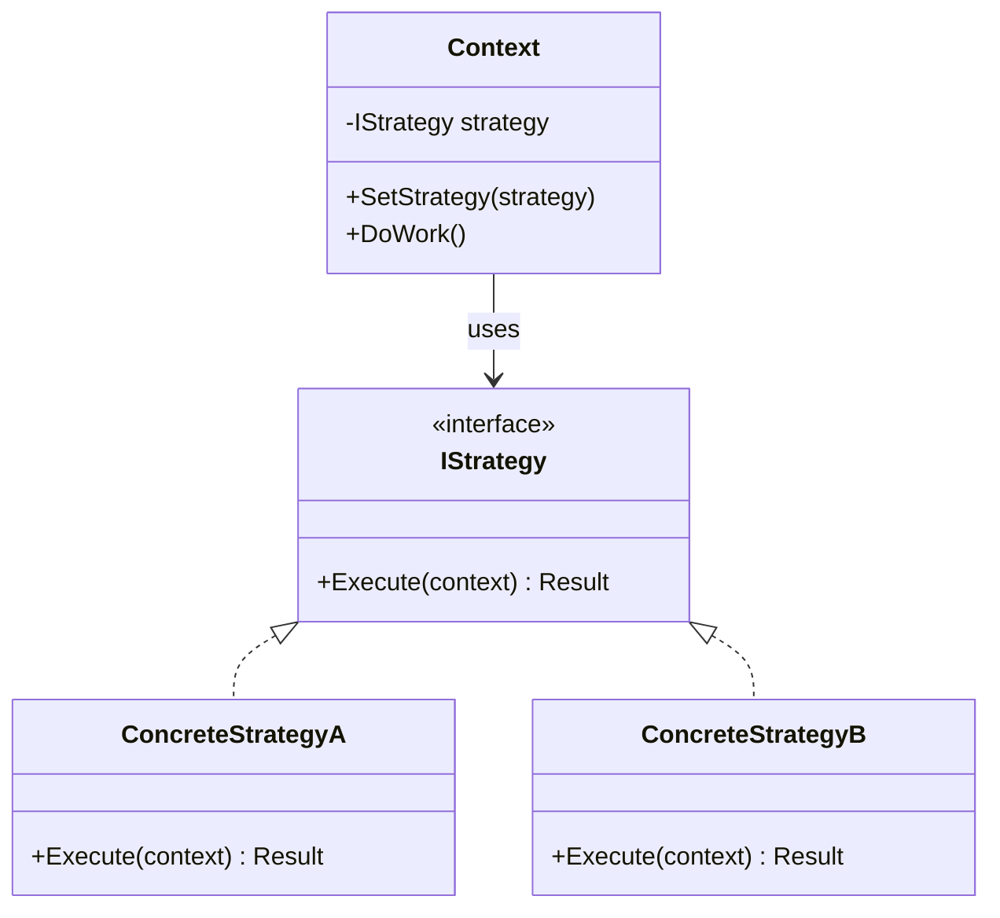

```csharp
public interface ISortStrategy
{
    List<T> Sort<T>(List<T> items) where T : IComparable<T>;
}

public class QuickSortStrategy : ISortStrategy
{
    public List<T> Sort<T>(List<T> items) where T : IComparable<T>
    {
        // Quick sort implementation
        var sorted = new List<T>(items);
        sorted.Sort(); // Simplified — real impl uses quicksort
        return sorted;
    }
}

public class DataProcessor
{
    private readonly ISortStrategy _sortStrategy;

    public DataProcessor(ISortStrategy sortStrategy)
    {
        _sortStrategy = sortStrategy; // Injected — swap without changing DataProcessor
    }

    public List<T> ProcessAndSort<T>(List<T> data) where T : IComparable<T>
    {
        // Business logic...
        return _sortStrategy.Sort(data);
    }
}
```

**Interview line:** "Strategy is my default when I see varying algorithms. Inject the strategy via constructor — the context class never knows which algorithm runs. Adding a new algorithm means adding a class, not touching existing code."

#### Observer Pattern

**Intent:** When one object changes state, all dependents are notified automatically.

**When the interviewer signals it:** "Notify when X happens", "multiple consumers of an event", "decouple producer from consumers."

```csharp
public interface IEventListener<T>
{
    void OnEvent(T eventData);
}

public class EventBus<T>
{
    private readonly List<IEventListener<T>> _listeners = new();

    public void Subscribe(IEventListener<T> listener) => _listeners.Add(listener);
    public void Unsubscribe(IEventListener<T> listener) => _listeners.Remove(listener);

    public void Publish(T eventData)
    {
        foreach (var listener in _listeners)
            listener.OnEvent(eventData);
    }
}
```

**Interview line:** "Observer decouples the event source from its consumers. The Kitchen doesn't know about robots — it just publishes 'order ready' and anyone subscribed reacts. Adding a new consumer is zero changes to the publisher."

#### Factory Method Pattern

**Intent:** Encapsulate object creation so callers don't depend on concrete types.

**When the interviewer signals it:** "Create different types based on input", "object creation varies", "hide construction complexity."

```csharp
public abstract class Notification
{
    public abstract void Send(string recipient, string message);
}

public class EmailNotification : Notification
{
    public override void Send(string recipient, string message)
    {
        // Send via SMTP
    }
}

public class SmsNotification : Notification
{
    public override void Send(string recipient, string message)
    {
        // Send via Twilio
    }
}

public static class NotificationFactory
{
    public static Notification Create(string channel) => channel switch
    {
        "email" => new EmailNotification(),
        "sms" => new SmsNotification(),
        _ => throw new ArgumentException($"Unknown channel: {channel}")
    };
}
```

**Interview line:** "Factory centralizes creation logic. When I add a new notification channel, I add one class and one switch case — no changes to any code that sends notifications."

#### Template Method Pattern

**Intent:** Define the skeleton of an algorithm in a base class, let subclasses override specific steps.

**When the interviewer signals it:** "Same flow, different details", "steps are common but implementation varies."

```csharp
public abstract class DataImporter
{
    // Template method — defines the skeleton, sealed to prevent override
    public void Import(string source)
    {
        var raw = ReadData(source);
        var validated = Validate(raw);
        var transformed = Transform(validated);
        Save(transformed);
    }

    protected abstract string ReadData(string source);
    protected virtual bool Validate(string data) => !string.IsNullOrEmpty(data); // Default with override option
    protected abstract string Transform(string data);
    protected abstract void Save(string data);
}

public class CsvImporter : DataImporter
{
    protected override string ReadData(string source) => File.ReadAllText(source);
    protected override string Transform(string data) => ParseCsv(data);
    protected override void Save(string data) => SaveToDb(data);
}
```

**Interview line:** "Template Method locks the algorithm skeleton while letting subclasses customize specific steps. The base class owns the flow — subclasses only override the parts that vary."

#### Command Pattern

**Intent:** Encapsulate a request as an object — supports undo, queuing, logging.

**When the interviewer signals it:** "Undo/redo", "queue actions", "log all operations", "transaction-like behavior."

```csharp
public interface ICommand
{
    void Execute();
    void Undo();
}

public class MoveCommand : ICommand
{
    private readonly IPiece _piece;
    private readonly Position _from;
    private readonly Position _to;
    private IPiece? _captured;

    public MoveCommand(IPiece piece, Position from, Position to)
    {
        _piece = piece;
        _from = from;
        _to = to;
    }

    public void Execute()
    {
        _captured = Board.GetPieceAt(_to);
        Board.Move(_piece, _from, _to);
    }

    public void Undo()
    {
        Board.Move(_piece, _to, _from);
        if (_captured != null) Board.Place(_captured, _to);
    }
}

public class CommandHistory
{
    private readonly Stack<ICommand> _history = new();
    private readonly Stack<ICommand> _redoStack = new();

    public void Execute(ICommand command)
    {
        command.Execute();
        _history.Push(command);
        _redoStack.Clear();
    }

    public void Undo()
    {
        if (_history.TryPop(out var command))
        {
            command.Undo();
            _redoStack.Push(command);
        }
    }
}
```

**Interview line:** "Command reifies an action as an object. Once it's an object, you can undo it, queue it, serialize it, replay it. Chess undo, text editor, and transaction rollback all use this."

#### State Pattern

**Intent:** Object changes its behavior when its internal state changes — looks like the object changed its class.

**When the interviewer signals it:** "Object behaves differently in different states", "state machine", "replace complex if/else on state."

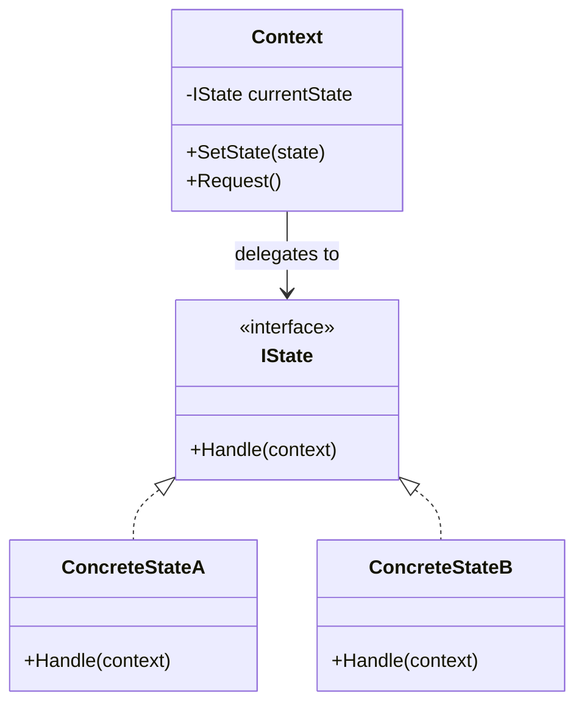

```csharp
public interface IVendingMachineState
{
    void InsertMoney(VendingMachine machine, decimal amount);
    void SelectProduct(VendingMachine machine, string productId);
    void Dispense(VendingMachine machine);
}

public class IdleState : IVendingMachineState
{
    public void InsertMoney(VendingMachine machine, decimal amount)
    {
        machine.Balance += amount;
        machine.SetState(new HasMoneyState());
    }

    public void SelectProduct(VendingMachine machine, string productId)
    {
        throw new InvalidOperationException("Insert money first.");
    }

    public void Dispense(VendingMachine machine)
    {
        throw new InvalidOperationException("No product selected.");
    }
}
```

**Interview line:** "State eliminates complex conditional logic. Instead of `if (state == Idle)` scattered everywhere, each state is a class that encapsulates its own behavior. Adding a new state means adding a class — not editing a giant switch statement."

#### Decorator Pattern

**Intent:** Attach additional responsibilities to an object dynamically — alternative to subclassing.

**When the interviewer signals it:** "Add behavior at runtime", "layered/stacked functionality", "wrap existing functionality."

```csharp
public interface IMessageSender
{
    void Send(Message message);
}

public class BasicMessageSender : IMessageSender
{
    public void Send(Message message)
    {
        // Send the message via transport
    }
}

// Decorator: adds encryption on top
public class EncryptedMessageSender : IMessageSender
{
    private readonly IMessageSender _inner;
    public EncryptedMessageSender(IMessageSender inner) => _inner = inner;

    public void Send(Message message)
    {
        message.Body = Encrypt(message.Body);
        _inner.Send(message); // Delegate to wrapped sender
    }
}

// Decorator: adds logging on top
public class LoggedMessageSender : IMessageSender
{
    private readonly IMessageSender _inner;
    private readonly ILogger _logger;
    public LoggedMessageSender(IMessageSender inner, ILogger logger)
    {
        _inner = inner;
        _logger = logger;
    }

    public void Send(Message message)
    {
        _logger.Log($"Sending to {message.Recipient}");
        _inner.Send(message);
        _logger.Log("Sent successfully");
    }
}

// Usage: stack decorators like layers
IMessageSender sender = new LoggedMessageSender(
    new EncryptedMessageSender(
        new BasicMessageSender()),
    logger);
```

**Interview line:** "Decorator follows the same interface as the thing it wraps. You stack behaviors like layers — encryption, logging, retry — without modifying the core sender. In .NET, this is how `HttpClient` `DelegatingHandler` middleware works."

#### Adapter Pattern

**Intent:** Convert one interface to another that clients expect.

**When the interviewer signals it:** "Integrate with external system", "legacy code with different interface", "bridge between two APIs."

```csharp
// External library — we can't change this
public class ThirdPartyPaymentGateway
{
    public bool ProcessPayment(string cardNumber, double amount, string currency) { /* ... */ }
}

// Our interface
public interface IPaymentProcessor
{
    PaymentResult Process(PaymentRequest request);
}

// Adapter bridges the gap
public class PaymentGatewayAdapter : IPaymentProcessor
{
    private readonly ThirdPartyPaymentGateway _gateway;

    public PaymentGatewayAdapter(ThirdPartyPaymentGateway gateway)
    {
        _gateway = gateway;
    }

    public PaymentResult Process(PaymentRequest request)
    {
        var success = _gateway.ProcessPayment(
            request.CardNumber,
            (double)request.Amount,
            request.Currency.ToString());

        return new PaymentResult(success);
    }
}
```

**Interview line:** "Adapter is the glue pattern. When you can't change the external interface and can't change your internal interface, you write a thin adapter between them. Our code stays clean, and if we switch payment providers, only the adapter changes."

### Pattern Decision Framework

| Requirement signal | Primary pattern | Secondary pattern | Why |
|---|---|---|---|
| "Multiple algorithms for the same task" | **[[Strategy]]** | | Encapsulate each algorithm, swap at runtime |
| "Object changes behavior based on state" | **[[State]]** | | Each state is a class with its own behavior |
| "Notify multiple consumers of an event" | **[[Observer]]** | | Decouple producer from consumers |
| "Same workflow, different step implementations" | **[[Template Method]]** | [[Strategy]] | Skeleton reuse with customizable hooks |
| "Undo, replay, queue operations" | **[[Command]]** | | Reify operations as first-class objects |
| "Add behavior without modifying existing class" | **[[Decorator]]** | [[Strategy]] | Layer additional responsibilities dynamically |
| "Tree/hierarchy treated uniformly" | **[[Composite]]** | | Leaf and container share the same interface |
| "Create objects without exposing concrete types" | **[[Factory Method|Factory]]** | [[Abstract Factory]] | Centralize and hide construction |
| "Bridge incompatible interfaces" | **[[Adapter]]** | | Thin translation layer |
| "Ensure one instance globally" | **[[Singleton]]** | | Thread-safe shared resource (use sparingly) |

> [!warning] Pattern anti-pattern
> Never say "I'll use Strategy because it's a good pattern." Always say "I'll use Strategy because the requirement is [X] — which means the algorithm varies and I need to swap it without changing the consumer."

### Common OOD Interview Mistakes

| # | Mistake | What it signals | Fix |
|---|---|---|---|
| 1 | Jumping to code without clarifying | Cannot decompose problems | Spend 6 min on entities + hierarchy FIRST |
| 2 | Giant `if/else` chains for type-based behavior | Doesn't think in polymorphism | Use Strategy, State, or inheritance |
| 3 | God class that does everything | Doesn't understand SRP | Split by responsibility into focused classes |
| 4 | Using inheritance where composition fits | Rigid hierarchy thinking | Prefer interface + injection |
| 5 | Naming patterns without explaining WHY | Pattern name-dropper | Always state the problem the pattern solves |
| 6 | No interfaces — all concrete types | Cannot extend or test | Program to interfaces, inject dependencies |
| 7 | Ignoring concurrency in shared-state designs | Missing production thinking | Address thread safety when multiple actors exist |

> [!tip] Interview line
> "I always start with interfaces because it gives me two things: extensibility — I can add new implementations without changing consumers — and testability — I can mock any dependency in isolation."

### Day 1 Practice Q&A

> [!question] "Explain SOLID to me. Pick the one you think is most important and explain why."
> **Model answer:**
> - Quick one-liner per principle (use the Quick Reference Card versions)
> - "If I had to pick one, it is Open/Closed. Here is why: OCP is what makes your code survive requirement changes. If adding a new feature means modifying existing tested code, your design is brittle. Strategy, Observer, Decorator — they all exist to achieve OCP. It is the principle that drives pattern selection."
> - Give the discount strategy example as a concrete illustration
> - Close with: "In practice, I use interfaces and dependency injection as the default enforcement mechanism for OCP."

> [!question] "When would you use inheritance vs composition?"
> **Model answer:**
> - "Inheritance for genuine 'is-a' relationships where the subtype always fulfills the base contract — like `EmailNotification : Notification`."
> - "Composition for 'has-a' or 'uses-a' — like a Robot that *has* a movement strategy. The robot is not a movement algorithm; it uses one."
> - "In practice, I default to composition because inheritance creates tight coupling. If the base class changes, all subclasses break. With composition, I swap implementations via interfaces."
> - "The heuristic: if you find yourself overriding methods to make them no-ops, you chose inheritance when you should have used composition."

> [!question] "Walk me through how you'd approach an OOD problem you've never seen before."
> **Model answer (use the OOD Interview Framework):**
> 1. "Clarify: I ask the interviewer about scope, core use cases, and constraints"
> 2. "Entities: I identify the nouns — the core domain objects and their relationships"
> 3. "Hierarchy: I look for 'is-a' vs 'has-a' relationships, extract interfaces for varying behavior"
> 4. "Patterns: I match requirement signals to patterns — 'varies' maps to Strategy, 'notifies' maps to Observer, 'states change behavior' maps to State"
> 5. "Code: I write the key interfaces, constructors, and wiring — not full implementations, just enough to show the design works"
> 6. "Extend: I demonstrate extensibility by showing how to add a new type without modifying existing code"

**Resources**: [Head First Design Patterns (C# examples)](https://www.oreilly.com/library/view/head-first-design/9781492077992/) · [Refactoring.Guru](https://refactoring.guru/design-patterns) · [SOLID Principles in C#](https://learn.microsoft.com/en-us/archive/msdn-magazine/2014/may/csharp-best-practices-dangers-of-violating-solid-principles-in-csharp)

---

## Day 2 (Friday, March 6) — The Actual DK Problem + Classic Set 1

### Design a Robot-Managed Restaurant PRIORITY — Actual DK Problem

> [!warning] THIS IS THE ACTUAL DRAFTKINGS OOD PROBLEM
> This exact problem was asked in a previous DraftKings interview round on HackerRank. The interviewer expects clean OOP with clear interfaces, extensibility, and special attention to how robots physically move. Practice this problem first and most thoroughly.

#### Problem Statement

Design a robot-managed restaurant system where:
1. A robot takes orders from customer tables
2. Robot sends orders to the kitchen
3. Robot picks up completed dishes and delivers to customers
4. **Extension**: add a Cleaner Robot without breaking existing design
5. **Special focus**: how does a robot physically move from point A to point B?

#### Step 1: Clarify and Identify Core Entities (3 min)

**Say this first:**

> "Before I start, let me clarify scope. Are we modeling a single-floor restaurant? How many tables and robots? Do robots have different capabilities, or are they all general-purpose? Should I account for concurrent orders from multiple tables?"

**Core entities:**

```text
┌─────────────────────────────────────────────────────────┐
│                    Restaurant System                     │
├──────────┬──────────┬──────────┬──────────┬─────────────┤
│  Robot   │  Table   │ Kitchen  │  Order   │ Restaurant  │
│ (types)  │(location)│ (events) │ (items)  │  (layout)   │
└──────────┴──────────┴──────────┴──────────┴─────────────┘
```

**Relationships:**
- Robot *has-a* position, *has-a* movement strategy, *is-a* type (Waiter, Cleaner)
- Table and KitchenStation *are* locations inside Restaurant
- All events flow through a single `EventBus` — Kitchen, RestaurantHost, and Robot publish; Dispatcher subscribes
- Dispatcher *assigns* tasks to idle robots via a priority queue

#### Step 2: Class Hierarchy and Movement Strategy (5 min)

> [!tip] Key Design Principle
> **Program to interfaces, not implementations.** This is what enables the Cleaner Robot extension later without modifying existing code (Open/Closed Principle).

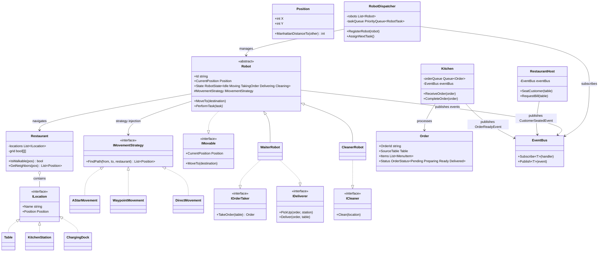

**Why this hierarchy wins in interviews:**

- **Open/Closed**: Adding `CleanerRobot` required **zero changes** to `WaiterRobot`, `Robot`, or `Kitchen`. New event type = one record class + one `Subscribe` call — no changes to existing publishers or Dispatcher logic
- **Interface Segregation**: `ICleaner` is separate from `IOrderTaker`/`IDeliverer` — no robot implements methods it doesn't need
- **[[Strategy]]**: Movement algorithm is injectable per robot — A* for waiters, waypoint-based for cleaners. Swap without touching Robot or any consumer
- **[[Observer]] via EventBus**: Kitchen, RestaurantHost, and Robot all publish typed events through a single `EventBus`. Dispatcher subscribes to all three — one decision point, zero coupling between publishers
- **Dependency Inversion**: Robot depends on `IMovementStrategy` abstraction, Dispatcher depends on `EventBus` abstraction — high-level policy never touches low-level details
- **Liskov Substitution**: Any `Robot` subclass works wherever `Robot` is expected — `WaiterRobot` and `CleanerRobot` both honor the base contract

#### Step 3: Apply Patterns — Key Code (10 min)

**Robot hierarchy — Strategy + ISP:**

```csharp
// Robot base — movement via injected Strategy
public abstract class Robot : IMovable
{
    public RobotState State { get; protected set; }
    protected IMovementStrategy MovementStrategy { get; } // Injected in constructor

    public void MoveTo(Position destination)
    {
        State = RobotState.Moving;
        var path = MovementStrategy.FindPath(CurrentPosition, destination, _restaurant);
        // Follow path step by step, then set State = Idle
    }

    public abstract void PerformTask(RobotTask task);
}

// Waiter implements ONLY order-related interfaces (ISP)
public class WaiterRobot : Robot, IOrderTaker, IDeliverer
{
    public Order TakeOrder(Table table) { MoveTo(table.Position); /* take order */ }
    public void Deliver(Order order, Table table) { MoveTo(table.Position); /* deliver */ }

    public override void PerformTask(RobotTask task) => _ = task.Type switch
    {
        TaskType.TakeOrder => TakeOrder(task.TargetTable),
        TaskType.Deliver => Deliver(task.Order, task.TargetTable),
    };
}

// Cleaner implements ONLY ICleaner — zero overlap with Waiter (ISP)
public class CleanerRobot : Robot, ICleaner
{
    public void Clean(ILocation loc) { MoveTo(loc.Position); /* clean */ }

    public override void PerformTask(RobotTask task) => Clean(task.TargetLocation);
}
```

> [!tip] Interview line
> "WaiterRobot implements IOrderTaker + IDeliverer. CleanerRobot implements ICleaner. No overlap — that's ISP. Both share movement via Strategy injection in the base class. Adding a new robot type = new class, zero changes to existing ones — that's OCP."

**EventBus orchestration — all events flow through one channel:**

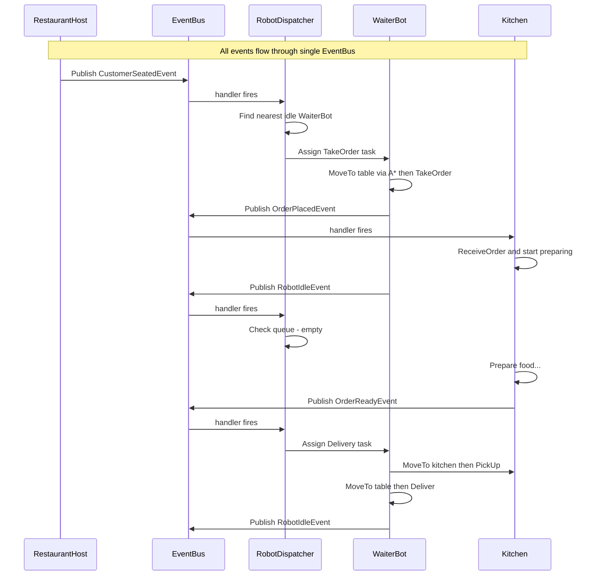

**Key pattern — single EventBus, typed events, one decision point:**

```csharp
// Single EventBus — all events flow through one channel
public class EventBus
{
    // { OrderReadyEvent: [Dispatcher.handler], OrderPlacedEvent: [Kitchen.handler], RobotIdleEvent: [Dispatcher.handler] }
    private readonly Dictionary<Type, List<Delegate>> _handlers = new();

    public void Subscribe<T>(Action<T> handler)
    {
        var key = typeof(T);
        if (!_handlers.ContainsKey(key)) _handlers[key] = new();
        _handlers[key].Add(handler);
    }

    public void Publish<T>(T evt)
    {
        if (!_handlers.TryGetValue(typeof(T), out var handlers)) return;
        foreach (Action<T> handler in handlers)
            handler(evt);
    }
}

// Event records — one per event type, easy to add new ones
public record CustomerSeatedEvent(Table Table);
public record OrderPlacedEvent(Order Order);
public record OrderReadyEvent(Order Order);
public record RobotIdleEvent(Robot Robot);

// Kitchen subscribes to OrderPlacedEvent, publishes OrderReadyEvent
public class Kitchen
{
    private readonly EventBus _bus;

    public Kitchen(EventBus bus)
    {
        _bus = bus;
        bus.Subscribe<OrderPlacedEvent>(e => ReceiveOrder(e.Order));
    }

    private void ReceiveOrder(Order order) { /* prepare food... */ }
    public void CompleteOrder(Order order) => _bus.Publish(new OrderReadyEvent(order));
}

// Dispatcher subscribes to all event types through one bus
public class RobotDispatcher
{
    public RobotDispatcher(EventBus bus)
    {
        bus.Subscribe<CustomerSeatedEvent>(e =>
        {
            _taskQueue.Enqueue(new RobotTask(TaskType.TakeOrder, e.Table), priority: 2);
            AssignNextTask();
        });
        bus.Subscribe<OrderReadyEvent>(e =>
        {
            _taskQueue.Enqueue(new RobotTask(TaskType.Deliver, e.Order), priority: 1);
            AssignNextTask();
        });
        bus.Subscribe<RobotIdleEvent>(_ => AssignNextTask());
    }

    // Core: nearest capable idle robot gets the task, or re-queue
    private void AssignNextTask()
    {
        if (!_taskQueue.TryDequeue(out var task, out _)) return;

        var best = _robots
            .Where(r => r.State == RobotState.Idle && r.CanHandle(task))
            .MinBy(r => r.DistanceTo(task.Location));

        if (best != null) best.PerformTask(task);
        else _taskQueue.Enqueue(task, task.Priority); // No idle robot — re-queue
    }
}
```

> [!tip] Interview line
> "One EventBus, typed events, one Dispatcher. Kitchen publishes OrderReadyEvent, RestaurantHost publishes CustomerSeatedEvent, Robot publishes RobotIdleEvent — all flow through the same bus. Adding a new event type is one record class and one Subscribe call. No new interfaces, no changes to existing publishers."

#### Step 4: Concurrency — Multiple Customers Simultaneously (10 min)

This is the critical part interviewers probe: how does the system handle **concurrent operations** when multiple customers are at different stages?

**Robot State Machine:**

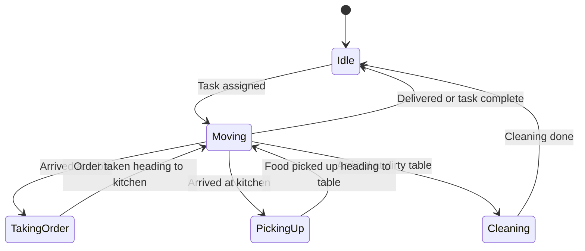

**Concurrent Scenario — Three Customers at Different Stages:**

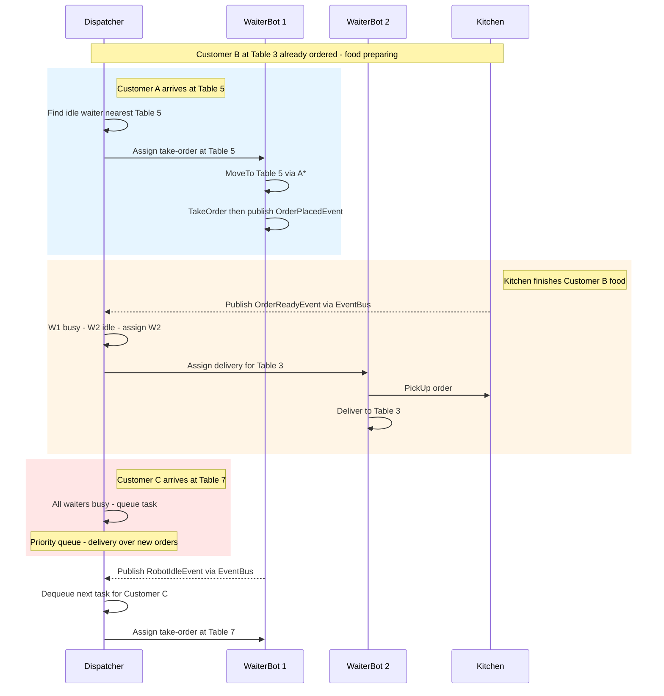

**Task Priority Queue** — When all robots are busy, tasks are queued by priority:

| Priority | Task Type | Rationale |
|---|---|---|
| 1 Highest | Food delivery | Food gets cold — direct customer impact |
| 2 | Order taking | Customer is waiting but not losing quality |
| 3 Lowest | Table cleaning | No active customer affected |

Robots auto-charge when idle — no charging tasks in the queue. If interviewer probes battery management, mention it as an extension.

**Key concurrency behaviors:**

1. **Event-driven dispatch** — Kitchen publishes `OrderReadyEvent`, Dispatcher's handler evaluates immediately but only assigns if a robot is idle. Otherwise the task enters the priority queue.
2. **State-checked dispatch** — The Dispatcher only assigns work to `Idle` robots. A robot moving to Table 5 for an order cannot be reassigned mid-path. The new task goes to another idle robot or the queue.
3. **Proximity-based selection** — Among idle robots that can handle the task, the nearest one is chosen via Manhattan distance. This minimizes wait time and avoids two robots crossing paths.
4. **Completion callback** — When a robot finishes any task, it publishes `RobotIdleEvent`. Dispatcher's handler fires `AssignNextTask()`, which dequeues the next highest-priority task immediately.

#### Step 5: The Movement Question — "How does the robot physically move from A to B?" (CRITICAL)

> [!warning] This is the special focus question they asked
> The interviewer specifically probes physical movement mechanics. Don't hand-wave "the robot moves." Show the grid, the algorithm, and the collision handling.

> [!question] "How would the robot physically move from A to B?"
> **Model answer (say this verbatim):**
> "I model the restaurant floor as a 2D grid where each cell is walkable or blocked. The robot uses a **pathfinding strategy** — I inject `IMovementStrategy` via constructor. For a fixed restaurant layout, I'd use A* on a pre-computed waypoint graph: optimal paths without re-running full grid search on every move. Real service robots like BellaBot and Bear Robotics' Servi do exactly this: SLAM builds the map once, then navigation runs on it. A collision avoidance layer checks if the next position is occupied by another robot — if so, wait or re-route."

**A* Pathfinding in 4 sentences (if they probe deeper):**

> "A* maintains an open set of candidates and a closed set of explored nodes. Each node has cost `f = g + h` where `g` is actual cost from start and `h` is heuristic estimate to goal — Manhattan distance for a grid. We always expand the lowest-f node first. When we reach the goal, backtrack parent pointers for the path."

**Grid representation to draw on whiteboard:**

```text
Restaurant Floor (10x8 grid):
┌──┬──┬──┬──┬──┬──┬──┬──┬──┬──┐
│  │  │  │T1│  │  │T2│  │  │  │  T = Table
├──┼──┼──┼──┼──┼──┼──┼──┼──┼──┤  K = Kitchen
│  │  │  │  │  │  │  │  │  │  │  W = Wall
├──┼──┼──┼──┼──┼──┼──┼──┼──┼──┤  C = Charging
│  │WW│WW│WW│  │WW│WW│WW│  │  │  R = Robot
├──┼──┼──┼──┼──┼──┼──┼──┼──┼──┤
│  │  │  │T3│R→│→ │→ │→T4│  │  │  ← A* path shown
├──┼──┼──┼──┼──┼──┼──┼──┼──┼──┤
│K │K │  │  │  │  │  │  │T5│  │
├──┼──┼──┼──┼──┼──┼──┼──┼──┼──┤
│  │  │  │  │  │  │  │  │  │C │
└──┴──┴──┴──┴──┴──┴──┴──┴──┴──┘
```

**Collision avoidance:**
- Each robot reserves its next N positions in a shared occupancy map
- Before stepping, check if target cell is reserved by another robot
- If blocked: wait briefly, then re-route via A* with dynamic obstacles

**Real-world reference:** BellaBot (Pudu Robotics) uses dual SLAM (LiDAR + Visual) which maps to swappable `IMovementStrategy`. The Nav2 navigation stack (used by 100+ companies) explicitly uses a plugin architecture for path planners — the Strategy pattern at framework scale.

#### Step 6: Extension — "Add a Cleaner Robot" (5 min)

**This is the OCP test. Say this:**

> "To add a Cleaner Robot, I need exactly three things:"
> 1. Create `ICleaner` interface with `Clean(ILocation location)` method
> 2. Create `CleanerRobot : Robot, ICleaner` — inherits movement from base, implements cleaning
> 3. Register `CleanerRobot` in `RobotDispatcher` and subscribe to relevant events (e.g., `TableVacatedEvent`)
>
> "Notice what I did NOT change: `WaiterRobot`, `Robot` base class, `Kitchen`, `EventBus`, or any existing event type. This is Open/Closed in practice — open for extension, closed for modification."

#### Full System Flow

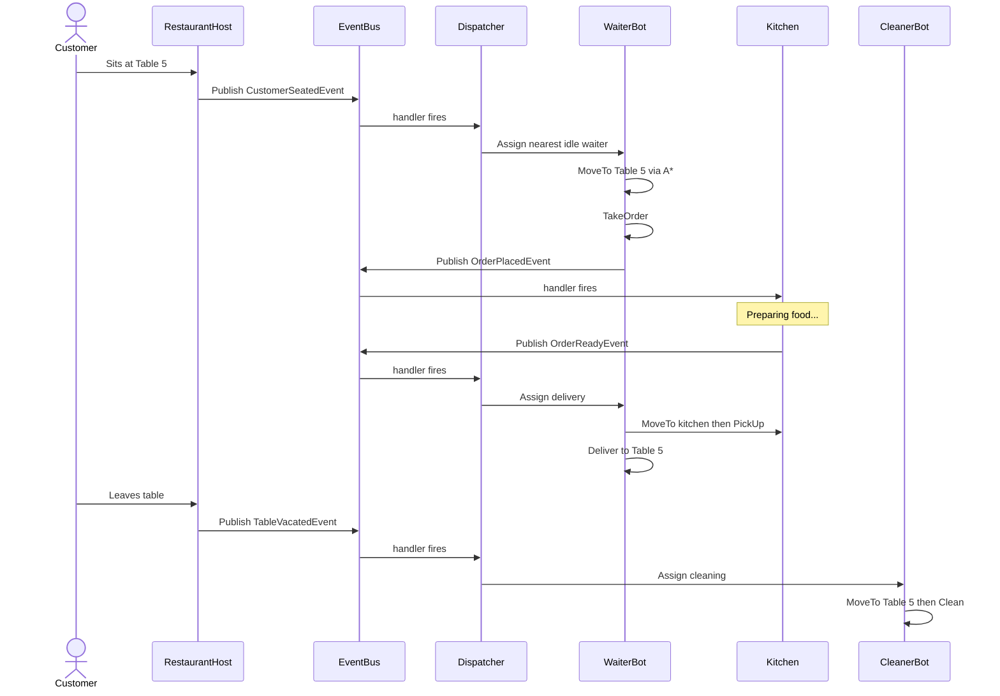

#### Patterns Summary for This Problem

| Pattern | Where Used | Why |
|---|---|---|
| **[[Strategy]]** | `IMovementStrategy` | Swap pathfinding per robot or context without changing robot code |
| **[[Observer]] via EventBus** | `EventBus` with typed events | Decouple all publishers (Kitchen, RestaurantHost, Robot) from Dispatcher — one channel, zero coupling |
| **Command-like** | `Order` / `RobotTask` objects | Tasks flow through system as data — can be queued, prioritized, or logged |
| **[[Template Method]]** | `Robot` base class | Shared movement logic with specialized task behavior in subclasses |
| **ISP** | `IOrderTaker`, `ICleaner`, `IDeliverer` | Robots only implement capabilities they actually have |
| **Priority Queue** | `RobotDispatcher.taskQueue` | Handle concurrent demand when robots are busy |

#### Interviewer Probes to Expect

> [!question] "Add a Host Robot that greets customers and seats them"
> **Model answer:**
> 1. Create `IGreeter` interface with `GreetAndSeat(Customer, Table)` method
> 2. Create `HostRobot : Robot, IGreeter` — inherits movement, implements greeting
> 3. Add `CustomerArrivedEvent` and subscribe in Dispatcher
> 4. Register `HostRobot` in `RobotDispatcher`
> 5. **Zero changes** to `WaiterRobot`, `CleanerRobot`, `Kitchen`, or `EventBus`
>
> "This is OCP in practice — open for extension, closed for modification."

> [!question] "What if two robots need to reach the same table?"
> - The occupancy map prevents two robots from occupying the same cell
> - Dispatcher assigns tasks with proximity-based selection to minimize crossing
> - If a robot is blocked en route, it waits 1 tick then re-routes via A* with the other robot as a dynamic obstacle
> - "This is the same problem Nav2 solves in real warehouse robotics — shared occupancy grid with conflict resolution."

> [!question] "How would you make this thread-safe with async operations?"
> - Dispatcher uses `ConcurrentQueue<RobotTask>` and `lock` on assignment logic
> - Robot state changes are atomic — `Interlocked.CompareExchange` on state enum
> - EventBus handlers are synchronous by default — use `Channel<RobotTask>` to decouple event publishing from task processing and avoid race conditions
> - "In a real .NET system, I would use `Channel<RobotTask>` for the producer-consumer pattern between Kitchen events and Dispatcher processing."

---

### Design a Library Management System

> [!note] Problem statement
> Design a library management system where members can search for books, borrow books, return books, and receive overdue notifications. The system should handle different member types with different borrowing limits.

#### Step 1: Clarify & Identify Entities

**Clarifying questions to ask:**
- "How many books and members are we designing for?" (scope)
- "Do we need to handle reservations for checked-out books?"
- "Are there different member tiers with different privileges?"
- "Do we need a fine/penalty system?"

**Core entities:**

```text
Book — BookCopy — Member (types) — Loan — Reservation — Catalog — Library — Notification
```

#### Step 2: Class Hierarchy

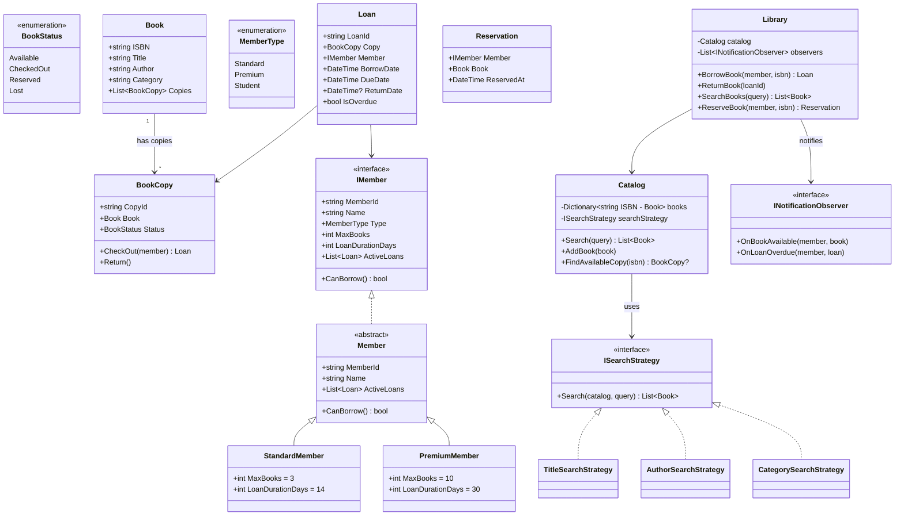

#### Step 3: Key Patterns Applied

| Pattern | Where | Why |
|---|---|---|
| **[[Strategy]]** | `ISearchStrategy` in Catalog | Search algorithm varies — title, author, category, full-text. Swap without changing Catalog. |
| **[[Observer]]** | `INotificationObserver` in Library | Notify members when reserved book becomes available or loan is overdue. Decouple notification from borrowing logic. |
| **[[Template Method]]** | `Member` base class | `CanBorrow()` uses shared logic (check active loans) with type-specific limits in subclasses. |
| **[[Factory Method|Factory]]** | `MemberFactory` | Create correct member type from registration data without exposing concrete types. |

#### Step 4: Key Code

```csharp
public abstract class Member : IMember
{
    public string MemberId { get; }
    public string Name { get; }
    public List<Loan> ActiveLoans { get; } = new();

    public abstract int MaxBooks { get; }
    public abstract int LoanDurationDays { get; }
    public abstract MemberType Type { get; }

    public bool CanBorrow() => ActiveLoans.Count < MaxBooks &&
                                ActiveLoans.All(l => !l.IsOverdue);

    protected Member(string id, string name)
    {
        MemberId = id;
        Name = name;
    }
}

public class PremiumMember : Member
{
    public override int MaxBooks => 10;
    public override int LoanDurationDays => 30;
    public override MemberType Type => MemberType.Premium;

    public PremiumMember(string id, string name) : base(id, name) { }
}
```

```csharp
public class Library
{
    private readonly Catalog _catalog;
    private readonly List<INotificationObserver> _observers = new();
    private readonly Dictionary<string, Reservation> _reservations = new();

    public Loan BorrowBook(IMember member, string isbn)
    {
        if (!member.CanBorrow())
            throw new InvalidOperationException("Member cannot borrow — limit reached or has overdue books.");

        var copy = _catalog.FindAvailableCopy(isbn)
            ?? throw new InvalidOperationException("No available copies.");

        var loan = copy.CheckOut(member);
        member.ActiveLoans.Add(loan);
        return loan;
    }

    public void ReturnBook(string loanId, Loan loan)
    {
        loan.ReturnDate = DateTime.UtcNow;
        loan.Copy.Return();
        loan.Member.ActiveLoans.Remove(loan);

        // Check if anyone has a reservation for this book
        if (_reservations.TryGetValue(loan.Copy.Book.ISBN, out var reservation))
        {
            _reservations.Remove(loan.Copy.Book.ISBN);
            foreach (var observer in _observers)
                observer.OnBookAvailable(reservation.Member, loan.Copy.Book);
        }
    }
}
```

#### Step 5: Interviewer Probes to Expect

> [!question] "How would you add a fine system for overdue books?"
> **Model answer:**
> 1. Create `IFineCalculator` interface with `Calculate(Loan loan) : decimal`
> 2. Implement `PerDayFineCalculator`, `FlatRateFineCalculator`
> 3. Inject into `Library` — calculate fine on `ReturnBook()` if overdue
> 4. Zero changes to `Member`, `BookCopy`, or `Catalog`
> 5. "Strategy pattern again — fine policy varies by library policy, and I want to swap it without touching return logic."

> [!question] "How do you handle concurrent borrows of the last copy?"
> **Model answer:**
> - "This is a classic race condition. Two members try to borrow the last copy simultaneously."
> - "Solution: `FindAvailableCopy` + `CheckOut` must be atomic. In a database-backed system, use optimistic concurrency — version column on BookCopy, retry on conflict. In-memory, use `lock` or `ConcurrentDictionary.TryUpdate`."
> - "I would also add a reservation queue so the second member gets priority when the book returns."

> [!question] "Extension: add a book recommendation feature"
> - New `IRecommendationStrategy` — by category, by borrowing history, collaborative filtering
> - Inject into Library or a separate `RecommendationService`
> - Zero changes to existing classes

---

### Design a Vending Machine

> [!note] Problem statement
> Design a vending machine that accepts coins, allows product selection, dispenses products, and returns change. Focus on the state transitions.

#### Step 1: State Machine Design

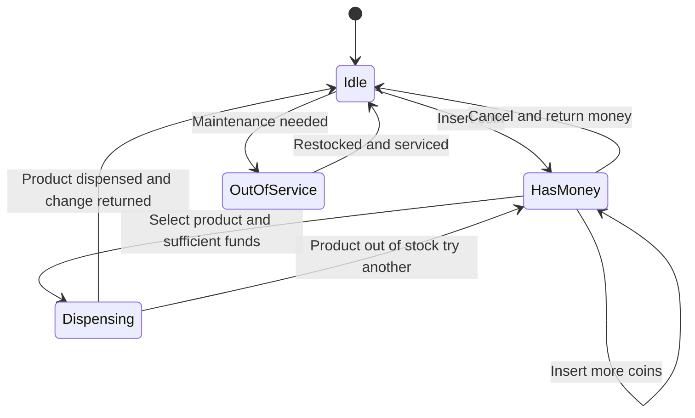

#### Step 2: Class Hierarchy

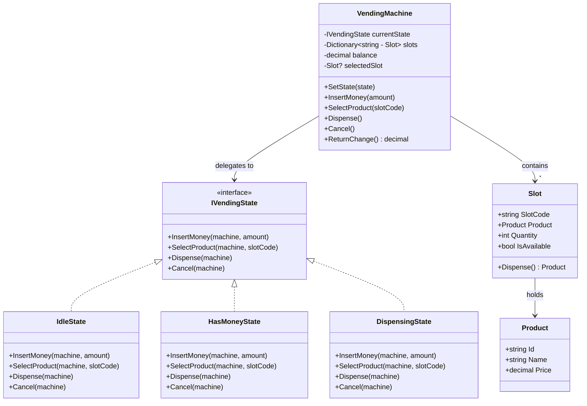

#### Step 3: Key Patterns Applied

| Pattern | Where | Why |
|---|---|---|
| **[[State]]** | `IVendingState` implementations | Each state encapsulates its own behavior — no giant switch on state. |
| **[[Factory Method|Factory]]** | Product/Slot initialization | Construct machine configuration from inventory data. |

#### Step 4: Key Code — State Implementations

```csharp
public class VendingMachine
{
    private IVendingState _currentState;
    private readonly Dictionary<string, Slot> _slots;

    public decimal Balance { get; set; }
    public Slot? SelectedSlot { get; set; }

    public VendingMachine(Dictionary<string, Slot> slots)
    {
        _slots = slots;
        _currentState = new IdleState(); // Start idle
    }

    public void SetState(IVendingState state) => _currentState = state;
    public void InsertMoney(decimal amount) => _currentState.InsertMoney(this, amount);
    public void SelectProduct(string slotCode) => _currentState.SelectProduct(this, slotCode);
    public void Dispense() => _currentState.Dispense(this);
    public void Cancel() => _currentState.Cancel(this);

    public Slot? GetSlot(string code) => _slots.GetValueOrDefault(code);

    public decimal ReturnChange()
    {
        var change = Balance;
        Balance = 0;
        return change;
    }
}
```

```csharp
public class IdleState : IVendingState
{
    public void InsertMoney(VendingMachine machine, decimal amount)
    {
        machine.Balance += amount;
        machine.SetState(new HasMoneyState());
    }

    public void SelectProduct(VendingMachine machine, string slotCode)
        => throw new InvalidOperationException("Insert money first.");

    public void Dispense(VendingMachine machine)
        => throw new InvalidOperationException("Insert money and select a product first.");

    public void Cancel(VendingMachine machine) { } // No-op — nothing to cancel
}

public class HasMoneyState : IVendingState
{
    public void InsertMoney(VendingMachine machine, decimal amount)
    {
        machine.Balance += amount;
        // Stay in HasMoney state — accumulate funds
    }

    public void SelectProduct(VendingMachine machine, string slotCode)
    {
        var slot = machine.GetSlot(slotCode)
            ?? throw new InvalidOperationException($"Invalid slot: {slotCode}");

        if (!slot.IsAvailable)
            throw new InvalidOperationException("Product out of stock.");

        if (machine.Balance < slot.Product.Price)
            throw new InvalidOperationException(
                $"Insufficient funds. Need {slot.Product.Price - machine.Balance:C} more.");

        machine.SelectedSlot = slot;
        machine.SetState(new DispensingState());
        machine.Dispense(); // Auto-trigger dispensing
    }

    public void Dispense(VendingMachine machine)
        => throw new InvalidOperationException("Select a product first.");

    public void Cancel(VendingMachine machine)
    {
        machine.ReturnChange();
        machine.SetState(new IdleState());
    }
}

public class DispensingState : IVendingState
{
    public void InsertMoney(VendingMachine machine, decimal amount)
        => throw new InvalidOperationException("Currently dispensing. Please wait.");

    public void SelectProduct(VendingMachine machine, string slotCode)
        => throw new InvalidOperationException("Currently dispensing. Please wait.");

    public void Dispense(VendingMachine machine)
    {
        var product = machine.SelectedSlot!.Dispense();
        machine.Balance -= product.Price;
        machine.ReturnChange(); // Return any excess
        machine.SelectedSlot = null;
        machine.SetState(new IdleState());
    }

    public void Cancel(VendingMachine machine)
        => throw new InvalidOperationException("Cannot cancel during dispensing.");
}
```

#### Step 5: Interviewer Probes to Expect

> [!question] "What if we need to add a new payment method (card, NFC)?"
> - Create `IPaymentMethod` interface with `ProcessPayment(decimal amount) : bool`
> - `CoinPayment`, `CardPayment`, `NfcPayment` implementations
> - Inject into VendingMachine — State pattern stays the same, payment processing is swapped via Strategy
> - "OCP: new payment method = new class, zero changes to state logic."

> [!question] "How would you handle the machine running out of change?"
> - Add `IChangeDispenser` with `CanMakeChange(decimal amount) : bool` and `DispenseChange(decimal amount) : List<Coin>`
> - Check before entering DispensingState — if can't make change, reject the transaction
> - Track coin inventory alongside product inventory

---

### Design a File System

> [!note] Problem statement
> Design an in-memory file system that supports files, directories, nested directories, and operations like search, size calculation, and display.

#### Step 1: Composite Pattern Focus

The file system is the classic Composite pattern use case: files and directories share the same interface, and directories contain other files/directories recursively.

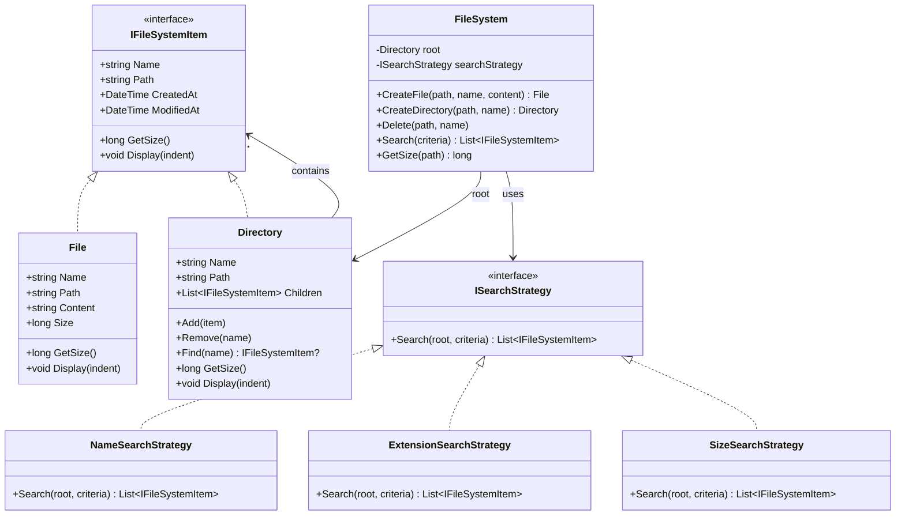

#### Step 2: Key Patterns Applied

| Pattern | Where | Why |
|---|---|---|
| **[[Composite]]** | `IFileSystemItem` → `File`, `Directory` | Uniform treatment of files and directories — `GetSize()` works the same way whether called on a file or a directory tree. |
| **[[Strategy]]** | `ISearchStrategy` | Search by name, extension, size, date — swap without changing FileSystem. |
| **Visitor** (if extensions requested) | `IFileSystemVisitor` | Add operations (compress, encrypt, count) without modifying File/Directory classes. |

#### Step 3: Key Code

```csharp
public interface IFileSystemItem
{
    string Name { get; }
    string Path { get; }
    DateTime CreatedAt { get; }
    long GetSize();
    void Display(int indent = 0);
}

public class File : IFileSystemItem
{
    public string Name { get; }
    public string Path { get; }
    public string Content { get; set; }
    public DateTime CreatedAt { get; } = DateTime.UtcNow;

    public File(string name, string path, string content = "")
    {
        Name = name;
        Path = path;
        Content = content;
    }

    public long GetSize() => Content.Length; // Simplified — real system tracks bytes
    public void Display(int indent = 0) => Console.WriteLine($"{new string(' ', indent)}{Name} ({GetSize()} bytes)");
}

public class Directory : IFileSystemItem
{
    public string Name { get; }
    public string Path { get; }
    public DateTime CreatedAt { get; } = DateTime.UtcNow;
    private readonly List<IFileSystemItem> _children = new();
    public IReadOnlyList<IFileSystemItem> Children => _children;

    public Directory(string name, string path)
    {
        Name = name;
        Path = path;
    }

    public void Add(IFileSystemItem item) => _children.Add(item);

    public void Remove(string name) =>
        _children.RemoveAll(c => c.Name == name);

    public IFileSystemItem? Find(string name) =>
        _children.FirstOrDefault(c => c.Name == name);

    // Composite: recursively sum all children
    public long GetSize() => _children.Sum(c => c.GetSize());

    // Composite: recursively display tree
    public void Display(int indent = 0)
    {
        Console.WriteLine($"{new string(' ', indent)}/{Name}/");
        foreach (var child in _children)
            child.Display(indent + 2);
    }
}
```

**Visitor pattern for extensibility (if interviewer asks "add compression/encryption"):**

```csharp
public interface IFileSystemVisitor
{
    void VisitFile(File file);
    void VisitDirectory(Directory directory);
}

public class SizeCalculatorVisitor : IFileSystemVisitor
{
    public long TotalSize { get; private set; }

    public void VisitFile(File file) => TotalSize += file.GetSize();
    public void VisitDirectory(Directory directory)
    {
        foreach (var child in directory.Children)
        {
            if (child is File f) VisitFile(f);
            else if (child is Directory d) VisitDirectory(d);
        }
    }
}
```

#### Step 4: Interviewer Probes to Expect

> [!question] "How would you add symbolic links?"
> - Create `SymbolicLink : IFileSystemItem` that holds a reference to another `IFileSystemItem`
> - `GetSize()` delegates to the target. `Display()` shows the link with an indicator
> - Must handle circular references — track visited nodes during traversal
> - "Composite handles this naturally because SymbolicLink implements the same interface."

> [!question] "How would you add permissions?"
> - Create `IPermissionChecker` interface. Decorator pattern: `PermissionCheckedDirectory : IFileSystemItem` wraps a Directory
> - Or simpler: add `Permissions` property to `IFileSystemItem` and check before operations
> - "I prefer the decorator approach because it separates permission logic from file system structure."

### Day 2 Practice Q&A

> [!question] "Design a Library Management System — 30 minutes"
> Follow the framework: Clarify → Entities → Hierarchy → Patterns → Code → Extend
> **Key phrases to say:**
> - "I'll use Strategy for search because the search algorithm varies — title, author, category"
> - "Observer for notifications — when a reserved book becomes available, the member is notified without the return logic knowing about notifications"
> - "Template Method for member types — same borrowing flow, different limits"
> - Extension: "Adding a fine system is a new Strategy — zero changes to existing code"

> [!question] "What pattern would you use for a vending machine? Why?"
> **Model answer:**
> - "State pattern. The vending machine's behavior changes entirely based on its current state — idle, has money, dispensing. Each state defines what actions are valid."
> - "The alternative — a giant switch on state — would be an SRP and OCP violation. Every new state would modify the switch in multiple methods."
> - "State pattern gives me: clear transitions, self-documenting behavior per state, and easy addition of new states like OutOfService."

---

## Day 3 (Saturday, March 7) — Classic OOD Problems (Set 2) + DraftKings-Relevant

### Design a Task Ticket Management System

> [!note] Problem statement
> Design a task/ticket management system (like Jira) that supports ticket creation, assignment, status transitions, priority management, and notifications. Different ticket types have different workflows.
>
> **DraftKings connection:** This directly maps to Dexter (Jira → PR automation) — the system that reads tickets, understands workflows, and generates code.

#### Step 1: Class Hierarchy

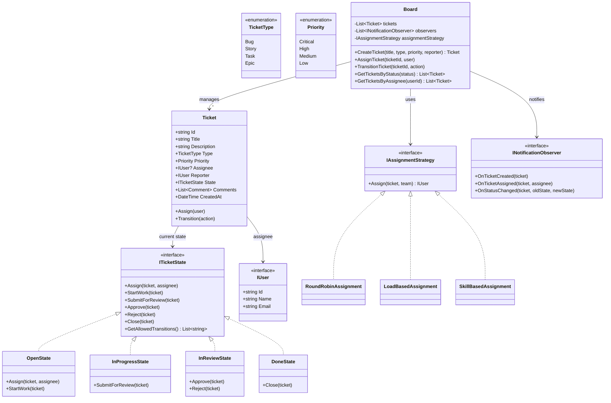

#### Step 2: Key Patterns Applied

| Pattern | Where | Why |
|---|---|---|
| **[[State]]** | `ITicketState` implementations | Ticket behavior changes by status — what transitions are valid, what actions are allowed. Eliminates if/else chains on status. |
| **[[Strategy]]** | `IAssignmentStrategy` | Assignment varies — round-robin, load-based, skill-based. Swap without changing Board. |
| **[[Observer]]** | `INotificationObserver` | Notify on ticket events — email, Slack, dashboard update. Decouple notification from ticket logic. |
| **[[Command]]** | Ticket transitions as objects | Enable audit trail — log every state change with who, when, from, to. |

#### Step 3: Key Code

```csharp
public class Ticket
{
    public string Id { get; }
    public string Title { get; }
    public TicketType Type { get; }
    public Priority Priority { get; set; }
    public IUser? Assignee { get; private set; }
    public ITicketState State { get; private set; }
    private readonly List<StateTransition> _history = new();

    public Ticket(string id, string title, TicketType type, Priority priority)
    {
        Id = id;
        Title = title;
        Type = type;
        Priority = priority;
        State = new OpenState();
    }

    public void SetState(ITicketState newState)
    {
        _history.Add(new StateTransition(State, newState, DateTime.UtcNow));
        State = newState;
    }

    public void Assign(IUser assignee)
    {
        State.Assign(this, assignee);
        Assignee = assignee;
    }

    public IReadOnlyList<StateTransition> GetHistory() => _history;
}
```

```csharp
public class OpenState : ITicketState
{
    public void Assign(Ticket ticket, IUser assignee)
    {
        // Valid in Open state
    }

    public void StartWork(Ticket ticket)
    {
        if (ticket.Assignee == null)
            throw new InvalidOperationException("Ticket must be assigned before starting work.");
        ticket.SetState(new InProgressState());
    }

    public void SubmitForReview(Ticket ticket)
        => throw new InvalidOperationException("Cannot submit for review from Open state.");

    public void Approve(Ticket ticket)
        => throw new InvalidOperationException("Cannot approve from Open state.");

    public void Reject(Ticket ticket)
        => throw new InvalidOperationException("Cannot reject from Open state.");

    public void Close(Ticket ticket)
        => throw new InvalidOperationException("Cannot close from Open state.");

    public List<string> GetAllowedTransitions() => new() { "Assign", "StartWork" };
}

public class InReviewState : ITicketState
{
    public void Approve(Ticket ticket) => ticket.SetState(new DoneState());

    public void Reject(Ticket ticket) => ticket.SetState(new InProgressState()); // Back to work

    // All other transitions throw InvalidOperationException
    public void Assign(Ticket ticket, IUser assignee)
        => throw new InvalidOperationException("Cannot reassign during review.");
    public void StartWork(Ticket ticket)
        => throw new InvalidOperationException("Already past In Progress.");
    public void SubmitForReview(Ticket ticket)
        => throw new InvalidOperationException("Already in review.");
    public void Close(Ticket ticket)
        => throw new InvalidOperationException("Must be approved first.");

    public List<string> GetAllowedTransitions() => new() { "Approve", "Reject" };
}
```

**DraftKings narrative:**

> [!tip] Interview line
> "This is exactly the domain Dexter operates in. Dexter watches ticket state transitions — when a ticket enters 'Open' with enough acceptance criteria, it maps to a repo, generates code, and creates a PR. The State pattern makes it clear which tickets are eligible for automation and which are not."

#### Step 4: Interviewer Probes to Expect

> [!question] "How would you add different workflows for different ticket types (Bug vs Story vs Epic)?"
> - `IWorkflowDefinition` interface — defines allowed states and transitions per ticket type
> - `BugWorkflow`, `StoryWorkflow`, `EpicWorkflow` implementations
> - Board checks the workflow definition before allowing a transition
> - "Strategy pattern on workflow rules — the ticket type determines which state machine applies."

> [!question] "How do you handle concurrent edits to the same ticket?"
> - Optimistic concurrency: version field on Ticket, check-and-increment on every update
> - If versions conflict, reject the later write and return a conflict error
> - "Same pattern as any web app — EF Core does this with `RowVersion` / `ConcurrencyToken`."

---

### Design a Notification System

> [!note] Problem statement
> Design a notification system that sends notifications through multiple channels (email, SMS, Slack, push), supports user preferences, and handles template-based messaging with different urgency levels.
>
> **DraftKings connection:** Maps to SlackJack (support bot notifications) and AmendA (PR comment updates) — systems that send context-aware notifications to the right channel.

#### Step 1: Class Hierarchy

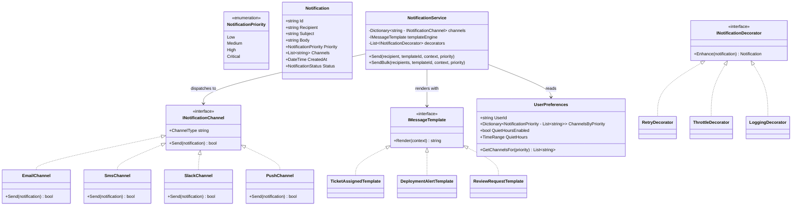

#### Step 2: Key Patterns Applied

| Pattern | Where | Why |
|---|---|---|
| **[[Strategy]]** | `INotificationChannel` | Sending logic varies by channel — each channel has its own transport (SMTP, Twilio, Slack API, FCM). |
| **[[Template Method]]** | `IMessageTemplate` | All notifications render content the same way (load template → inject variables → format) but each template type has different layout and fields. |
| **[[Decorator]]** | `INotificationDecorator` | Layer retry, throttle, logging without modifying the core send logic. Stack like middleware. |
| **[[Observer]]** | User preferences determine channels | User preferences route notifications to the right channels based on priority. |
| **[[Factory Method|Factory]]** | Channel instantiation | Create the right channel implementation based on configuration. |

#### Step 3: Key Code

```csharp
public class NotificationService
{
    private readonly Dictionary<string, INotificationChannel> _channels;
    private readonly Dictionary<string, IMessageTemplate> _templates;
    private readonly IUserPreferenceStore _preferences;

    public NotificationService(
        IEnumerable<INotificationChannel> channels,
        IEnumerable<IMessageTemplate> templates,
        IUserPreferenceStore preferences)
    {
        _channels = channels.ToDictionary(c => c.ChannelType);
        _templates = templates.ToDictionary(t => t.TemplateId);
        _preferences = preferences;
    }

    public async Task SendAsync(
        string recipientId,
        string templateId,
        Dictionary<string, string> context,
        NotificationPriority priority)
    {
        var prefs = await _preferences.GetAsync(recipientId);
        var targetChannels = prefs.GetChannelsFor(priority);

        var template = _templates[templateId];
        var body = template.Render(context);

        var notification = new Notification
        {
            Id = Guid.NewGuid().ToString(),
            Recipient = recipientId,
            Body = body,
            Priority = priority,
            CreatedAt = DateTime.UtcNow
        };

        // Fan out to all preferred channels
        var tasks = targetChannels
            .Where(ch => _channels.ContainsKey(ch))
            .Select(ch => _channels[ch].Send(notification));

        await Task.WhenAll(tasks);
    }
}
```

```csharp
// Decorator: add retry without modifying any channel
public class RetryChannelDecorator : INotificationChannel
{
    private readonly INotificationChannel _inner;
    private readonly int _maxRetries;

    public string ChannelType => _inner.ChannelType;

    public RetryChannelDecorator(INotificationChannel inner, int maxRetries = 3)
    {
        _inner = inner;
        _maxRetries = maxRetries;
    }

    public async Task<bool> Send(Notification notification)
    {
        for (int attempt = 1; attempt <= _maxRetries; attempt++)
        {
            try { return await _inner.Send(notification); }
            catch when (attempt < _maxRetries)
            {
                await Task.Delay(TimeSpan.FromMilliseconds(100 * Math.Pow(2, attempt)));
            }
        }
        return false;
    }
}

// Usage: wrap any channel with retry
INotificationChannel slack = new RetryChannelDecorator(new SlackChannel(config), maxRetries: 3);
```

**DraftKings narrative:**

> [!tip] Interview line
> "SlackJack's notification flow maps directly to this: user sends a support question → intent is classified → the reply is routed through the right channel (Slack thread) with context from Confluence retrieval. The decorator layer handles retry and logging without touching the core reply logic."

#### Step 4: Interviewer Probes to Expect

> [!question] "How do you prevent notification spam?"
> - `ThrottleDecorator` — tracks send count per user per time window (sliding window in Redis)
> - Aggregate similar notifications: "You have 5 new PR comments" instead of 5 separate notifications
> - Respect quiet hours from `UserPreferences` — queue notifications and batch-deliver after quiet hours end

> [!question] "How would you add a new notification channel (Teams, Discord)?"
> - Create `TeamsChannel : INotificationChannel` — implement `Send()`
> - Register in DI container
> - Add "teams" to user preference options
> - "Zero changes to NotificationService, existing channels, or templates. OCP."

---

### Design a Plugin Extension System

> [!note] Problem statement
> Design a plugin system where a host application can discover, load, and execute third-party plugins at runtime. Plugins should be isolated, versioned, and have a standardized interface.
>
> **DraftKings connection:** This maps directly to MCP architecture — MCP servers are plugins that expose tools, resources, and prompts via a standard protocol. The host (LLM client) discovers and invokes them dynamically.

#### Step 1: Class Hierarchy

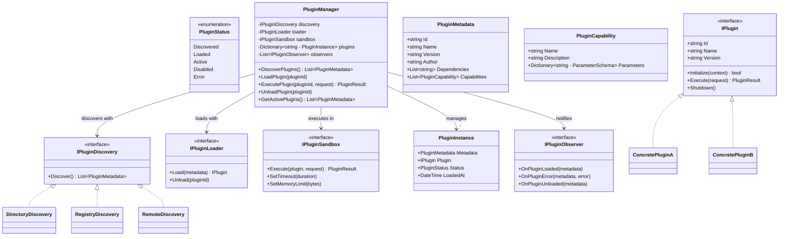

#### Step 2: Key Patterns Applied

| Pattern | Where | Why |
|---|---|---|
| **[[Strategy]]** | `IPluginDiscovery`, `IPluginLoader`, `IPluginSandbox` | Discovery varies (directory scan, registry, remote). Loading varies (assembly, process, container). Execution isolation varies (in-process, sandboxed, remote). |
| **[[Observer]]** | `IPluginObserver` | Notify when plugins load/error/unload — logging, dashboard, health checks subscribe. |
| **[[Factory Method|Factory]]** | Plugin instantiation via `IPluginLoader` | Create the right plugin instance based on metadata without exposing construction. |
| **[[Template Method]]** | Plugin lifecycle: `Discover → Load → Initialize → Execute → Shutdown` | Same lifecycle skeleton, different implementations per plugin type. |
| **[[Adapter]]** | Bridge between host interface and third-party plugin APIs | Third-party plugins may have different interfaces — adapter makes them conform to `IPlugin`. |

#### Step 3: Key Code

```csharp
public class PluginManager
{
    private readonly IPluginDiscovery _discovery;
    private readonly IPluginLoader _loader;
    private readonly IPluginSandbox _sandbox;
    private readonly Dictionary<string, PluginInstance> _plugins = new();
    private readonly List<IPluginObserver> _observers = new();

    public PluginManager(
        IPluginDiscovery discovery,
        IPluginLoader loader,
        IPluginSandbox sandbox)
    {
        _discovery = discovery;
        _loader = loader;
        _sandbox = sandbox;
    }

    public async Task<PluginResult> ExecutePluginAsync(string pluginId, PluginRequest request)
    {
        if (!_plugins.TryGetValue(pluginId, out var instance))
            throw new InvalidOperationException($"Plugin {pluginId} is not loaded.");

        if (instance.Status != PluginStatus.Active)
            throw new InvalidOperationException($"Plugin {pluginId} is not active. Status: {instance.Status}");

        try
        {
            // Execute in sandbox — timeout and resource limits enforced
            return await _sandbox.Execute(instance.Plugin, request);
        }
        catch (Exception ex)
        {
            instance.Status = PluginStatus.Error;
            foreach (var obs in _observers)
                obs.OnPluginError(instance.Metadata, ex);
            throw;
        }
    }

    public void LoadPlugin(string pluginId)
    {
        var metadata = _discovery.Discover().FirstOrDefault(m => m.Id == pluginId)
            ?? throw new InvalidOperationException($"Plugin {pluginId} not found.");

        // Check dependencies
        foreach (var dep in metadata.Dependencies)
        {
            if (!_plugins.ContainsKey(dep) || _plugins[dep].Status != PluginStatus.Active)
                throw new InvalidOperationException($"Missing dependency: {dep}");
        }

        var plugin = _loader.Load(metadata);
        var context = new PluginContext(this);
        plugin.Initialize(context);

        var instance = new PluginInstance
        {
            Metadata = metadata,
            Plugin = plugin,
            Status = PluginStatus.Active,
            LoadedAt = DateTime.UtcNow
        };

        _plugins[pluginId] = instance;
        foreach (var obs in _observers)
            obs.OnPluginLoaded(metadata);
    }
}
```

**DraftKings narrative:**

> [!tip] Interview line
> "This is the MCP architecture at the OOD level. MCP servers are plugins — they expose capabilities (tools, resources, prompts) through a standardized interface. The MCP client (host) discovers capabilities, invokes them via JSON-RPC, and handles errors uniformly. The plugin pattern means adding a new MCP server requires zero changes to the client or other servers — just register and advertise capabilities."

#### Step 4: Interviewer Probes to Expect

> [!question] "How do you handle a plugin that hangs or crashes?"
> - `IPluginSandbox` enforces timeout (CancellationToken) and memory limits
> - If timeout: cancel, set PluginStatus to Error, notify observers, return degraded result
> - If crash: catch, isolate (separate process or AppDomain), don't take down the host
> - Health check: periodic ping — if plugin doesn't respond, auto-disable

> [!question] "How do you handle plugin versioning and backwards compatibility?"
> - `PluginMetadata` includes `Version` and `MinHostVersion`
> - `IPluginLoader` checks compatibility before loading
> - Semantic versioning: major version bumps require explicit opt-in
> - Capability negotiation: host asks "what can you do?" and plugin advertises its capabilities — same as MCP's capability discovery

### Day 3 Practice Q&A

> [!question] "Design a ticket system — how would it integrate with automation like Dexter?"
> **Model answer:**
> - "The ticket system uses State pattern for lifecycle management. Each state defines valid transitions."
> - "For Dexter integration: an Observer subscribes to ticket events. When a ticket enters 'Open' with sufficient acceptance criteria, the observer triggers the automation pipeline."
> - "The automation doesn't modify the ticket system — it reacts to events. This is the same Observer decoupling we use everywhere."
> - "Key decision: automation only triggers on specific ticket types and priority levels — not all tickets. The IAssignmentStrategy can route eligible tickets to the AI worker."

> [!question] "How would you design notifications for a system with many microservices?"
> **Model answer:**
> - "Centralized NotificationService with channel strategies. Each microservice publishes notification events to a message bus."
> - "The NotificationService consumes events, resolves user preferences, and fans out to the right channels."
> - "Decorator layer handles cross-cutting concerns: retry, throttle, logging."
> - "This decouples notification logic from business services — OrderService doesn't know about Slack or email."

---

## Day 4 (Sunday, March 8) — Mock Practice & Edge Cases

### Concurrency Patterns in OOD

> [!warning] This is a common follow-up in OOD interviews
> "Your design looks good for single-threaded. What happens with concurrent access?" You need to have ready answers.

#### Thread-Safe Singleton

```csharp
// .NET preferred: use Lazy<T> for thread-safe lazy initialization
public sealed class ConnectionPool
{
    private static readonly Lazy<ConnectionPool> _instance =
        new(() => new ConnectionPool());

    public static ConnectionPool Instance => _instance.Value;

    private ConnectionPool()
    {
        // Initialize pool
    }
}
```

**Interview line:** "In .NET, `Lazy<T>` gives thread-safe lazy initialization without manual locking. But I avoid singletons in most designs — I prefer DI with scoped/singleton lifetime registration because it's more testable."

#### Reader-Writer Pattern

```csharp
// Multiple readers, exclusive writer
public class ThreadSafeCatalog<T>
{
    private readonly Dictionary<string, T> _items = new();
    private readonly ReaderWriterLockSlim _lock = new();

    public T? Get(string key)
    {
        _lock.EnterReadLock();
        try { return _items.GetValueOrDefault(key); }
        finally { _lock.ExitReadLock(); }
    }

    public void AddOrUpdate(string key, T value)
    {
        _lock.EnterWriteLock();
        try { _items[key] = value; }
        finally { _lock.ExitWriteLock(); }
    }
}
```

#### Async Patterns in C# OOD

```csharp
// Producer-consumer with Channel<T> — modern .NET async pattern
public class AsyncTaskQueue<T>
{
    private readonly Channel<T> _channel;
    private readonly Func<T, CancellationToken, Task> _handler;

    public AsyncTaskQueue(Func<T, CancellationToken, Task> handler, int capacity = 100)
    {
        _channel = Channel.CreateBounded<T>(new BoundedChannelOptions(capacity)
        {
            FullMode = BoundedChannelFullMode.Wait
        });
        _handler = handler;
    }

    public async ValueTask EnqueueAsync(T item, CancellationToken ct = default)
        => await _channel.Writer.WriteAsync(item, ct);

    public async Task ProcessAsync(CancellationToken ct)
    {
        await foreach (var item in _channel.Reader.ReadAllAsync(ct))
        {
            await _handler(item, ct);
        }
    }
}
```

**Interview line:** "For concurrent OOD, I use .NET's `Channel<T>` for producer-consumer, `ConcurrentDictionary` for shared state, and `SemaphoreSlim` for rate limiting. I avoid raw `lock` statements unless the critical section is trivially small."

#### Concurrency Cheat Sheet for OOD Interviews

| Scenario | Pattern | .NET Implementation |
|---|---|---|
| Shared read-heavy data | Reader-Writer Lock | `ReaderWriterLockSlim` |
| Thread-safe key-value | Concurrent collection | `ConcurrentDictionary<K,V>` |
| Producer-consumer queue | Bounded channel | `Channel<T>` |
| Rate limiting | Semaphore | `SemaphoreSlim` |
| Fire-and-forget with control | Background task | `Task.Run` + `CancellationToken` |
| Atomic check-and-update | Compare-and-swap | `Interlocked` or `ConcurrentDictionary.TryUpdate` |
| Multiple async operations | Fan-out/fan-in | `Task.WhenAll` / `Task.WhenAny` |

### Handling Extension Questions Gracefully

> [!tip] The 4-step extension framework
> Every OOD interview will end with "Now add X." This is the moment that proves your design is real, not theoretical. Use this framework every time.

**Step 1: Identify the right interface**
> "I need a new capability for [X]. Looking at my existing interfaces, I can either implement an existing interface or create a new one."

**Step 2: Create the new type**
> "I'll create `NewThing : IExistingInterface` — it inherits shared behavior from the base and adds its own implementation."

**Step 3: Show zero changes**
> "Notice: I did not modify `ExistingClassA`, `ExistingClassB`, or any consumer code. The new class is self-contained."

**Step 4: Name the principle**
> "This is Open/Closed — I extended the system by adding a new class, not by editing existing ones."

**Practice this pattern with the Robot Restaurant example:**

| Extension request | New class | Existing changes | Principle |
|---|---|---|---|
| "Add CleanerRobot" | `CleanerRobot : Robot, ICleaner` | Zero | OCP |
| "Add HostRobot" | `HostRobot : Robot, IGreeter` | Zero | OCP |
| "Add waypoint pathfinding" | `WaypointMovement : IMovementStrategy` | Zero | Strategy + OCP |
| "Add EV charging to parking" | `ElectricParkingSpot : ParkingSpot, IChargeable` | Zero | ISP + OCP |
| "Add VIP priority to elevator" | `Priority` enum on `Request` | Controller dispatch logic | [[Strategy]] |

### Rapid-Fire Mini OOD Problems

> [!note] Format
> 15 minutes each. Identify entities → pick the primary pattern → write 10-15 lines of key code → name one extension point.

#### Problem 1: Design a Logger

**Entities:** `ILogger`, `ConsoleLogger`, `FileLogger`, `DatabaseLogger`, `CompositeLogger`, `LogLevel`

**Primary pattern:** **[[Composite]]** — `CompositeLogger` contains multiple `ILogger` instances. A single `Log()` call fans out to all configured loggers.

```csharp
public interface ILogger
{
    void Log(LogLevel level, string message);
}

public class CompositeLogger : ILogger
{
    private readonly List<ILogger> _loggers;

    public CompositeLogger(params ILogger[] loggers) => _loggers = loggers.ToList();

    public void Log(LogLevel level, string message)
    {
        foreach (var logger in _loggers)
            logger.Log(level, message);
    }
}

// Decorator: add filtering by level
public class FilteredLogger : ILogger
{
    private readonly ILogger _inner;
    private readonly LogLevel _minLevel;

    public FilteredLogger(ILogger inner, LogLevel minLevel)
    {
        _inner = inner;
        _minLevel = minLevel;
    }

    public void Log(LogLevel level, string message)
    {
        if (level >= _minLevel) _inner.Log(level, message);
    }
}
```

**Extension:** "Add structured logging → Decorator that enriches the message with timestamp, correlation ID, and context before delegating."

#### Problem 2: Design a Rate Limiter

**Entities:** `IRateLimiter`, `TokenBucketLimiter`, `SlidingWindowLimiter`, `FixedWindowLimiter`, `RateLimitResult`

**Primary pattern:** **[[Strategy]]** — different rate limiting algorithms, swappable per use case.

```csharp
public interface IRateLimiter
{
    RateLimitResult TryAcquire(string clientId);
}

public class TokenBucketLimiter : IRateLimiter
{
    private readonly ConcurrentDictionary<string, TokenBucket> _buckets = new();
    private readonly int _maxTokens;
    private readonly TimeSpan _refillInterval;

    public TokenBucketLimiter(int maxTokens, TimeSpan refillInterval)
    {
        _maxTokens = maxTokens;
        _refillInterval = refillInterval;
    }

    public RateLimitResult TryAcquire(string clientId)
    {
        var bucket = _buckets.GetOrAdd(clientId, _ => new TokenBucket(_maxTokens, _refillInterval));
        return bucket.TryConsume()
            ? RateLimitResult.Allowed
            : RateLimitResult.Denied(bucket.RetryAfter);
    }
}
```

**Extension:** "Add per-endpoint rate limiting → Decorator that composes client-level + endpoint-level limiters."

#### Problem 3: Design an LRU Cache

**Entities:** `ICache<K,V>`, `LruCache`, `LfuCache`, `CacheEntry`, `IEvictionStrategy`

**Primary pattern:** **[[Strategy]]** for eviction policy — LRU, LFU, TTL-based.

```csharp
public interface IEvictionStrategy<TKey>
{
    void RecordAccess(TKey key);
    TKey SelectVictim();
    void Remove(TKey key);
}

public class LruEviction<TKey> : IEvictionStrategy<TKey> where TKey : notnull
{
    private readonly LinkedList<TKey> _order = new();
    private readonly Dictionary<TKey, LinkedListNode<TKey>> _map = new();

    public void RecordAccess(TKey key)
    {
        if (_map.TryGetValue(key, out var node))
            _order.Remove(node);
        _map[key] = _order.AddFirst(key);
    }

    public TKey SelectVictim()
    {
        var victim = _order.Last!.Value;
        return victim;
    }

    public void Remove(TKey key)
    {
        if (_map.Remove(key, out var node))
            _order.Remove(node);
    }
}
```

**Extension:** "Add TTL expiration → Decorator that checks expiry timestamp before returning cached values."

#### Problem 4: Design a Card Game (Blackjack)

**Entities:** `Card`, `Deck`, `Hand`, `Player`, `Dealer`, `Game`, `IGameStrategy`

**Primary pattern:** **[[Template Method]]** — game loop skeleton is the same (deal → player turns → dealer turn → evaluate), but specific games override the rules.

```csharp
public abstract class CardGame
{
    protected Deck Deck { get; }
    protected List<Player> Players { get; }

    // Template Method: skeleton of any card game
    public void Play()
    {
        Deck.Shuffle();
        DealInitialCards();

        foreach (var player in Players)
            PlayTurn(player);

        PlayDealerTurn();
        EvaluateWinners();
    }

    protected abstract void DealInitialCards();
    protected abstract void PlayTurn(Player player);
    protected abstract void PlayDealerTurn();
    protected abstract void EvaluateWinners();
}

public class BlackjackGame : CardGame
{
    protected override void DealInitialCards()
    {
        // Deal 2 cards to each player and dealer
    }

    protected override void PlayTurn(Player player)
    {
        // Hit or Stand logic — player decides via IPlayerStrategy
    }
}
```

**Extension:** "Add Poker → new `PokerGame : CardGame` — same skeleton, different rules. Zero changes to Blackjack."

#### Problem 5: Design a Payment Processor

**Entities:** `IPaymentMethod`, `CreditCardPayment`, `PayPalPayment`, `CryptoPayment`, `PaymentResult`, `IFraudDetector`, `PaymentProcessor`

**Primary pattern:** **[[Strategy]]** for payment method + **[[Decorator]]** for fraud detection, logging, retry.

```csharp
public interface IPaymentMethod
{
    Task<PaymentResult> ProcessAsync(PaymentRequest request);
    bool Supports(string currency);
}

public class PaymentProcessor
{
    private readonly List<IPaymentMethod> _methods;
    private readonly IFraudDetector _fraudDetector;

    public async Task<PaymentResult> ProcessAsync(PaymentRequest request)
    {
        var fraud = await _fraudDetector.CheckAsync(request);
        if (fraud.IsRisky) return PaymentResult.Declined("Fraud risk detected.");

        var method = _methods.FirstOrDefault(m => m.Supports(request.Currency))
            ?? throw new InvalidOperationException($"No payment method for {request.Currency}");

        return await method.ProcessAsync(request);
    }
}
```

**Extension:** "Add refund capability → `IRefundable` interface on payment methods that support it. ISP — not all methods need refund."

### Common Interviewer Follow-ups

> [!warning] Expect these after any OOD design
> Have a 30-second answer ready for each.

| Probe | What they're testing | Model response |
|---|---|---|
| "What if we need to persist this?" | Production thinking | "I would serialize state to a DB. For entities with state machines, I persist the current state + transition history. For caching, Redis with TTL. The domain model stays clean — persistence is a separate concern behind repository interfaces." |
| "How would you test this?" | Testability | "Because I use interfaces everywhere, I can mock any dependency. I would unit test each Strategy implementation independently, test state transitions with each State class, and integration-test the orchestrator (Board/Library/Machine) with mocked dependencies." |
| "What happens at 100x scale?" | Scalability awareness | "Identify the bottleneck first. Usually it is shared state. Solutions: partition by key, use concurrent collections, move to distributed cache, or shard the data. The OOD stays the same — Strategy and Observer work at any scale." |
| "What about error handling?" | Robustness | "Each operation returns a result type or throws a domain exception. I never swallow exceptions. For external calls (notifications, plugins), I use retry with timeout and fallback to degraded mode." |
| "How would you add logging/metrics?" | Cross-cutting concerns | "Decorator pattern. Wrap the core service with a LoggingDecorator that logs before/after. No changes to business logic. In .NET, this maps to middleware or DelegatingHandler." |
| "What if two users do the same thing simultaneously?" | Concurrency | "Optimistic concurrency for database-backed state. ConcurrentDictionary or lock for in-memory shared state. I always identify the critical section and minimize its scope." |
| "How does this integrate with the rest of the system?" | System thinking | "Through well-defined interfaces. The OOD module exposes its capabilities via interfaces. External systems call through these interfaces — they don't know the internal structure. This is Dependency Inversion at the system level." |
| "What would you change if requirements shifted?" | Adaptability | "That is why I used Strategy and interfaces. If the search algorithm changes, I add a new Strategy. If a new entity type is needed, I add a new class. The extension points are already in place." |

### Anti-Patterns in Class Design

| Anti-Pattern | What it looks like | Why it's bad | Fix |
|---|---|---|---|
| **God Class** | One class with 20+ methods doing everything | SRP violation, untestable, merge conflicts | Split by responsibility |
| **Feature Envy** | Method uses more data from another class than its own | Misplaced responsibility | Move method to the class it's envious of |
| **Primitive Obsession** | Using `string` for email, `int` for money, `string` for state | No type safety, validation scattered | Create value objects: `Email`, `Money`, `TicketState` |
| **Inheritance for Code Reuse** | Deep hierarchy just to share utility methods | Tight coupling, fragile base class | Use composition — extract shared logic to a collaborator |
| **Leaky Abstraction** | Interface exposes implementation details (`ISqlRepository`) | Tight coupling to specific tech | Name interfaces by capability, not implementation |
| **Anemic Domain Model** | Entities are pure data bags with getters/setters, all logic in services | Procedural code disguised as OOP | Move behavior into the entity that owns the data |
| **Circular Dependencies** | Class A depends on B, B depends on A | Cannot test independently, design confusion | Extract shared interface, invert one dependency |

> [!tip] Interview line
> "I watch for these during design. The most common one I catch early is Primitive Obsession — using strings for everything. Value objects like `Email`, `Money`, `TicketId` give you type safety, validation at construction, and self-documenting code."

### Day 4 Practice Q&A

> [!question] "Your design has a shared resource accessed by multiple threads. How do you handle it?"
> **Model answer:**
> - "First, I identify what kind of access pattern it is. Read-heavy → `ReaderWriterLockSlim`. Write-heavy or simple key-value → `ConcurrentDictionary`. Producer-consumer → `Channel<T>`."
> - "Second, I minimize the critical section. Lock only the specific data access, not the entire method."
> - "Third, I prefer immutable data where possible — no locking needed if objects don't mutate."
> - "In .NET, I avoid raw `lock` for anything complex and use the built-in concurrent collections."

> [!question] "I just added a new requirement to your design. Walk me through the changes."
> **Model answer (use the 4-step extension framework):**
> 1. "Looking at my existing interfaces, this new requirement maps to [interface]. I'll create a new implementation."
> 2. "Here's the new class: `NewThing : IExistingInterface`"
> 3. "Notice the changes: I created one new class. I did NOT modify [list existing classes]. They remain untouched."
> 4. "This is Open/Closed in action — the system is extended without modifying tested code."

> [!question] "What's the difference between State and Strategy patterns?"
> **Model answer:**
> - "They look almost identical in structure — both delegate to an interface with multiple implementations."
> - "The difference is INTENT and who controls the switch."
> - "**[[Strategy]]**: the CLIENT picks the algorithm and injects it. The context doesn't change its own strategy."
> - "**[[State]]**: the OBJECT changes its own state internally based on transitions. The client doesn't choose states."
> - "Example: Vending machine states — the machine moves itself from Idle to HasMoney to Dispensing. The user doesn't inject states."
> - "Example: Sort strategy — the caller picks QuickSort vs MergeSort and injects it. The sorter doesn't change its own algorithm."

---

## Day 5 (Monday, March 9) — Full Mock & Weak Spots

> [!tip] Goal
> Today is about simulation and gap-filling. Treat Robot Restaurant as a real interview. Redo your weakest problems. Rehearse the closing script until it's natural.

### Full Mock: Robot Restaurant (35 min, interview conditions)

Set a 35-minute timer. No notes. Speak out loud as if the interviewer is listening.

1. **Clarify** (3 min) — State the scope and ask your clarifying questions
2. **Entities** (3 min) — List them on paper/whiteboard
3. **Hierarchy** (5 min) — Draw the class diagram with interfaces
4. **Patterns + Code** (10 min) — Strategy for movement, Observer for kitchen, key Robot/Dispatcher code
5. **Concurrency** (5 min) — State machine, priority queue, concurrent scenario
6. **Movement question** (5 min) — Grid, A*, collision avoidance
7. **Extension: CleanerRobot** (4 min) — 4-step extension framework

**After the mock, evaluate yourself:**

| Criterion | Pass | Fail |
|---|---|---|
| Named patterns with reasoning | Said WHY, not just the name | Name-dropped without explanation |
| Extension required zero changes | Showed OCP concretely | Modified existing classes |
| Movement was concrete | Grid + A* + collision | Hand-waved "robot moves" |
| Concurrency addressed | State machine + priority queue | Ignored concurrent customers |
| Code was compilable | Key methods with real signatures | Pseudocode or incomplete |

### Redo 2 Weakest Problems (30 min each)

Pick the 2 problems from Days 2-3 where you felt least confident. Redo them timed with the full framework:

- If patterns were shaky → focus on the "why this pattern" explanation
- If code was rough → write the key 15 lines cleanly
- If extensions stumbled → practice the 4-step extension framework

### Extension Question Drill

For every problem you covered this week, answer the extension question using the [[Sr. AI Engineer - OOD Interview Prep#Handling Extension Questions Gracefully|4-step framework]]:

| Problem | Extension | Key move |
|---|---|---|
| Robot Restaurant | Add CleanerRobot | New class + `ICleaner`, zero changes |
| Robot Restaurant | Add HostRobot | New class + `IGreeter`, zero changes |
| Library | Add fine system | `IFineCalculator` Strategy |
| Vending Machine | Add card payment | `IPaymentMethod` Strategy |
| File System | Add symbolic links | `SymbolicLink : IFileSystemItem` |
| Ticket System | Add different workflows per type | `IWorkflowDefinition` Strategy |
| Notification | Add Teams channel | `TeamsChannel : INotificationChannel` |
| Plugin System | Add health checks | `IPluginObserver` subscription |

### Concurrency Quick Review

Make sure you can answer the concurrency probe for ANY design:

- "What if two users/robots/threads do X simultaneously?"
- Default answer: identify the shared resource → pick the right primitive → minimize critical section
- .NET toolkit: `ConcurrentDictionary`, `Channel<T>`, `SemaphoreSlim`, `ReaderWriterLockSlim`

### Closing Script Rehearsal

Practice the [[Sr. AI Engineer - OOD Interview Prep#2-Minute Closing Script for OOD Round]] out loud 3 times. It should feel natural, not memorized.

---

## Day 6 (Tuesday, March 10 morning) — Final Review Before 4 PM Interview

### Morning Cheat Sheet 30 Minutes

> [!tip] Spend 30 minutes on this. Read each line out loud.

- **OOD Framework**: Clarify (3) → Entities (3) → Hierarchy (5) → Patterns (10) → Code (10) → Extend (5)
- **SOLID**: S=one reason to change, O=extend don't modify, L=honor contracts, I=no fat interfaces, D=depend on abstractions
- **Top Patterns**: Strategy (varying algorithms), State (behavior by state), Observer (event notification), Factory (creation), Template Method (same skeleton), Command (undo/log), Decorator (layer behavior), Composite (tree/uniform), Adapter (bridge interfaces)
- **Extension Framework**: Identify interface → Create new type → Show zero changes → Name the principle
- **Concurrency**: `ConcurrentDictionary`, `ReaderWriterLockSlim`, `Channel<T>`, `SemaphoreSlim`
- **Anti-patterns**: God class, primitive obsession, feature envy, anemic domain, leaky abstraction
- **Robot Restaurant key beats**: Grid floor + A* movement + Observer kitchen + Strategy pathfinding + Priority queue dispatcher + CleanerRobot extension with zero changes

### Pattern Decision Tree

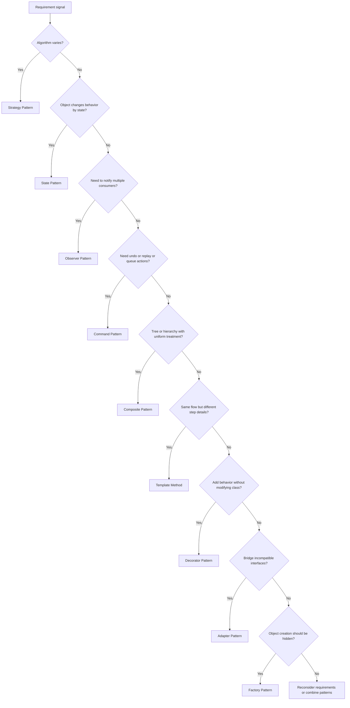

### SOLID Violations Quick-Check

Use this to spot violations in under 10 seconds:

| Check | What to look for | Violation |
|---|---|---|
| **S** | "This class does X AND Y AND Z" | SRP — split by responsibility |
| **O** | `if/else` chain on type or enum | OCP — use polymorphism or Strategy |
| **L** | Subclass overrides method to throw or no-op | LSP — wrong inheritance, use composition |
| **I** | Class implements interface but leaves methods empty | ISP — split the interface |
| **D** | `new ConcreteService()` inside business logic | DIP — inject via interface |

**Speed drill:** For each principle, think of one example from the designs you practiced (Robot Restaurant, Library, Vending Machine, Ticket System, Notification System, Plugin System).

### Final Robot Restaurant Pass

One last walkthrough — focus only on the three things the interviewer specifically probed:

1. **Movement**: "I model the floor as a 2D grid. The robot uses an injected `IMovementStrategy` — A* for optimal pathfinding. Collision avoidance via shared occupancy map."
2. **Extension**: "Adding CleanerRobot required zero changes to WaiterRobot, Robot, Kitchen, or Order. New class, new interface, register in factory."
3. **Concurrency**: "Dispatcher is event-driven with a priority queue. Kitchen fires Observer events. Idle robots trigger next-task assignment. No polling."

### 2-Minute Closing Script for OOD Round

> [!note] Practice this out loud — 3 times minimum
> "I approach class design the way I approach production systems: start with clear interfaces and single-responsibility classes. I use patterns like Strategy, State, and Observer not because they're textbook answers, but because they make the system survive requirement changes — and requirements always change.
>
> In my DraftKings context, these patterns map directly to the systems I'd be building. Ticket state machines for Dexter's automation flow. Observer decoupling for notification systems like SlackJack. Plugin architecture for MCP server integrations.
>
> My design principle is: make the common case easy and the extension case possible without modifying existing code. That's Open/Closed applied practically — every new feature is a new class, not a modification to tested code.
>
> I also think about the production concerns from the start: concurrency for shared state, error handling at every boundary, and testability through interface injection. A design that looks clean on a whiteboard but breaks under concurrent access isn't a good design — it's a demo."

---

## OOD Pattern Summary

| Pattern | Robot Restaurant | Library | Vending Machine | File System | Ticket System | Notification | Plugin System |
|---|---|---|---|---|---|---|---|
| **[[Strategy]]** | `IMovementStrategy` | `ISearchStrategy` | `IPaymentMethod` | `ISearchStrategy` | `IAssignmentStrategy` | `INotificationChannel` | `IPluginDiscovery` |
| **[[Observer]]** | `IKitchenObserver` | `INotificationObserver` | — | — | `INotificationObserver` | User preferences | `IPluginObserver` |
| **[[State]]** | `RobotState` enum | — | `IVendingState` | — | `ITicketState` | — | `PluginStatus` |
| **[[Factory Method|Factory]]** | `RobotFactory` | `MemberFactory` | — | — | — | Channel factory | `IPluginLoader` |
| **[[Template Method]]** | `Robot.PerformTask` | `Member.CanBorrow` | — | — | — | `IMessageTemplate` | Plugin lifecycle |
| **[[Composite]]** | — | — | — | `IFileSystemItem` | — | — | — |
| **[[Decorator]]** | — | — | — | Permission wrapper | — | `RetryDecorator` | Sandbox wrapper |
| **[[Command]]** | `Order` as data | — | — | — | State transitions | — | `PluginRequest` |
| **[[Adapter]]** | — | — | — | — | — | — | Third-party plugins |

> [!tip] Interview power move
> "I notice the same patterns appearing across different domains. Strategy shows up everywhere because varying behavior is the most common design challenge. Observer shows up wherever events need to decouple producers from consumers. Recognizing these recurring structures is what lets me design quickly — I'm not inventing from scratch each time."
