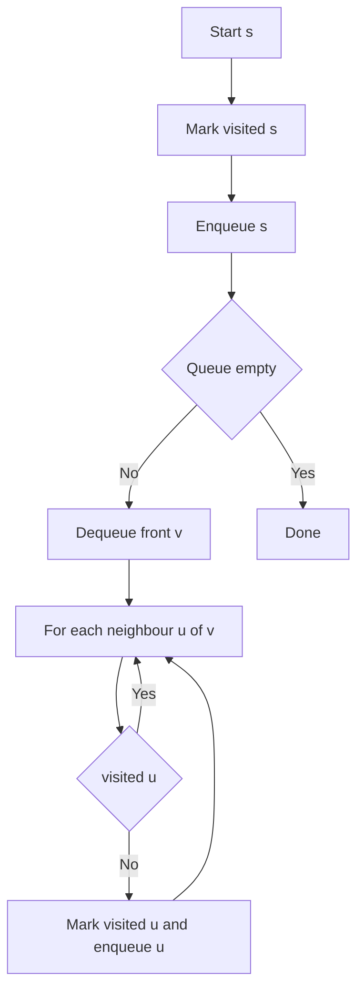
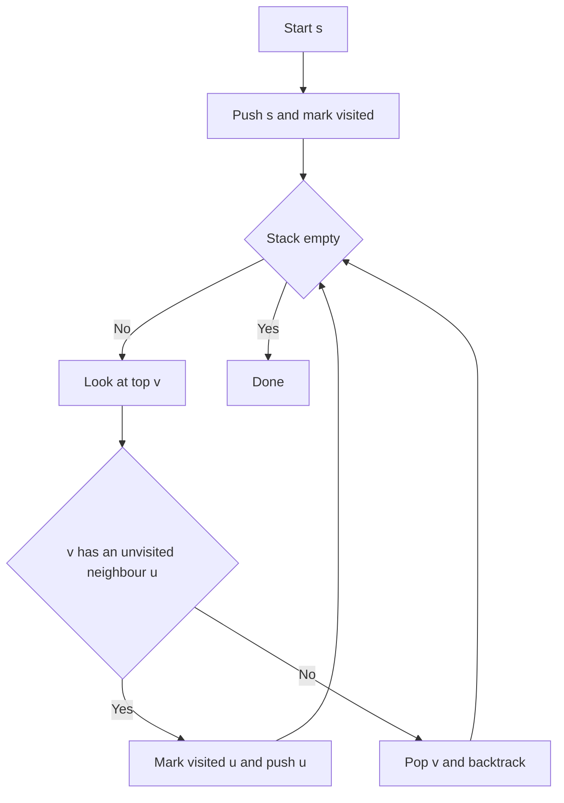

---
topic:
  - Computer Science
subtopic:
  - Algorithms
level:
  - "4"
priority: Medium
status: Done
publish: true
---

# Intro

BFS (Breadth-First Search) and DFS (Depth-First Search) are the two fundamental graph traversal strategies. Both run in `O(V + E)` and visit every reachable node exactly once — so the choice is not about speed but about which property you need: **BFS gives distance ordering** (layers), **DFS gives depth ordering** (finish times, back edges).

## BFS (Breadth-First Search)

BFS explores nodes layer by layer using a **queue** — every node at distance `k` from the source is visited before any node at distance `k+1`. That ordering makes it the tool for **shortest paths by edge count** in unweighted graphs, and for level-order problems like "minimum moves" or "shortest transformation sequence".

**How it works** — BFS maintains a queue and a visited set:

1. Enqueue the source and mark it visited.
2. Dequeue the front node `v`; for each unvisited neighbour `u`, mark `u` visited and enqueue it.
3. Repeat until the queue is empty. The first visit to any node is along a shortest path by hop count.

On the edges `A-B, A-C, B-D, C-E` from `A`, BFS visits **A → B → C → D → E** (layer by layer).



```steptrace
{"algorithm":"bfs","start":"A"}
```

**Watch its memory.** The BFS frontier holds every node at the current distance level, so on very wide graphs (millions of nodes per level) the queue can approach `O(V)` and exhaust memory. Mitigate with bidirectional BFS (search from both ends, meet in the middle) or a depth limit.

## DFS (Depth-First Search)

DFS explores one branch as deep as possible before backtracking, using a **stack** (explicit or the call stack). It is the natural fit for **cycle detection, topological sorting, and connected-component discovery**.

**How it works** — DFS maintains a stack and a visited set:

1. Push the source (or call `dfs(source)`) and mark it visited.
2. Move to an unvisited neighbour `u` and mark it visited.
3. When a node has no unvisited neighbours, backtrack. A node gets its finish time when backtracking completes.

On the same edges from `A`, DFS visits **A → B → D → C → E** (depth first).



```steptrace
{"algorithm":"dfs","start":"A"}
```

**Two DFS traps.** Recursive DFS uses call-stack space proportional to depth — on chain-shaped graphs 10k+ deep it overflows; switch to an **explicit-stack iterative DFS** (identical logic, heap memory). For **directed cycle detection**, track three states — unvisited / in-progress / completed — and report a cycle when DFS reaches an in-progress node (a back edge); "visited" alone can't tell a back edge from a harmless cross edge.

## Choosing between them

Both traverse in `O(V + E)`; the difference is the property you need:

| Need | Use | Why |
| --- | --- | --- |
| Shortest path by edge count | **BFS** | Visits nodes in increasing-distance order; DFS may reach a node via a longer branch first |
| Memory on wide, shallow graphs | **DFS** | Stack grows with depth, not level width |
| Memory on narrow, deep graphs | **BFS** | Queue stays small; recursive DFS can overflow |
| Cycle detection (directed) | **DFS** | Three-state back-edge tracking is the textbook method |
| Topological sort | either | DFS reverse post-order, or Kahn's in-degree queue |
| Connected components / SCC | **DFS** | Basis for Tarjan's and Kosaraju's algorithms |

> **Shared trap:** always keep a visited set. Without marking nodes before/at exploration, cycles cause infinite re-entry — for both BFS and DFS.

## Questions

> [!QUESTION]- When should you choose BFS over DFS?
  > - Use BFS when you need shortest path by hop count in an unweighted graph — BFS visits nodes in order of increasing distance from the source.
  > - Use BFS when you need level-order properties (e.g., minimum moves in a puzzle, shortest transformation sequence).
  > - DFS cannot guarantee shortest path because it may reach a node through a longer branch first.
  > - BFS guarantees shortest paths but can use more memory on wide graphs — accept the memory cost when correctness requires distance ordering.

> [!QUESTION]- Why can recursive DFS cause stack overflow and how do you fix it?
  > - Recursive DFS adds one stack frame per depth level. Graphs shaped like chains with 10k+ depth exceed typical stack limits.
  > - Iterative DFS with an explicit stack has identical traversal logic but uses heap memory instead of call stack, avoiding overflow.
  > - The conversion is mechanical: replace function calls with stack pushes, returns with stack pops.
  > - Iterative DFS is slightly more verbose but safe for arbitrary graph sizes — always prefer it in production code where graph depth is unbounded.

> [!QUESTION]- How do you detect cycles using DFS in a directed graph?
  > - Maintain three states for each node: unvisited, in-progress (on recursion stack), and completed.
  > - A cycle exists if DFS reaches a node that is currently in-progress — this means a back edge closes a cycle.
  > - This is more precise than checking "visited" alone because a cross edge to a completed node is not a cycle.
  > - Three-state tracking adds slight implementation complexity over basic visited-set DFS, but correctly distinguishes back edges from cross edges — necessary for correctness in directed graphs.

## References

- [Breadth-first search -- encyclopedic overview with algorithm description, applications, and complexity analysis (Wikipedia)](https://en.wikipedia.org/wiki/Breadth-first_search)
- [Depth-first search -- encyclopedic overview covering edge classification, applications to cycle detection, and topological sort (Wikipedia)](https://en.wikipedia.org/wiki/Depth-first_search)
- [BFS and applications -- implementation guide with code examples and problem set (cp-algorithms)](https://cp-algorithms.com/graph/breadth-first-search.html)
- [DFS and applications -- implementation guide covering back edges, timestamps, and connected components (cp-algorithms)](https://cp-algorithms.com/graph/depth-first-search.html)
