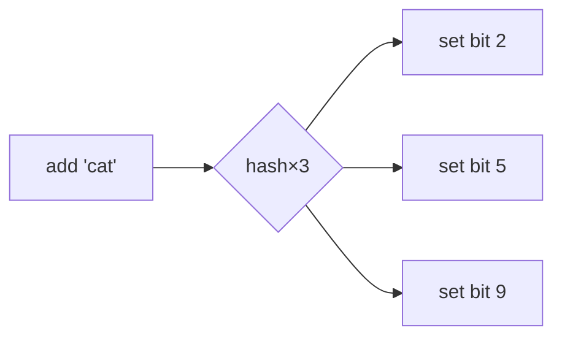

---
topic:
  - Computer Science
subtopic:
  - Data Structures
level:
  - "4"
priority: Medium
status: Ready to Repeat
publish: true
---

# Intro

A Bloom filter is a **probabilistic** set membership structure that answers "have I seen this item?" using a tiny, fixed amount of memory — at the cost of allowing **false positives** (it may say "maybe present" for something never added) but **never false negatives** (if it says "no", that's certain). It stores no elements, only bits, so it can track billions of items in megabytes. It's the standard front-line filter in databases (skip disk reads for keys that definitely aren't there), CDNs/caches, web crawlers (dedupe seen URLs), and spam/malware blocklists. .NET has no built-in Bloom filter type — you implement one over a `BitArray` (or a rented bit buffer) with *k* independent hash functions, or use a library.

## How It Works

A Bloom filter is a bit array of size *m* plus *k* independent hash functions.

- **Add(x)**: hash x with all k functions, get k positions, set those bits to 1.
- **MightContain(x)**: hash x the same way; if **all** k bits are 1, return "maybe"; if **any** is 0, return "definitely not".

The asymmetry is the whole idea: a 0 bit proves x was never added (adding it would have set that bit), but all-1s can happen by coincidence from *other* elements — that's the false positive.



## Example

```csharp
public class BloomFilter
{
    private readonly bool[] _bits;
    private readonly int _k;

    public BloomFilter(int sizeBits, int hashCount)
        => (_bits, _k) = (new bool[sizeBits], hashCount);

    public void Add(string item)
    {
        foreach (var idx in Positions(item))
            _bits[idx] = true;
    }

    public bool MightContain(string item)
    {
        foreach (var idx in Positions(item))
            if (!_bits[idx]) return false; // a 0 bit ⇒ definitely not present
        return true;                        // all 1s ⇒ probably present
    }

    // Double hashing: derive k indices from two base hashes (Kirsch–Mitzenmacher)
    private IEnumerable<int> Positions(string item)
    {
        int h1 = item.GetHashCode();
        int h2 = HashCode.Combine(item, 0x9E3779B1);
        for (int i = 0; i < _k; i++)
            yield return (int)((uint)(h1 + i * h2) % _bits.Length);
    }
}
```

## Tuning

For *n* expected items and a target false-positive rate *p*:

- Optimal bit count **m = −(n · ln p) / (ln 2)²**.
- Optimal hash count **k = (m / n) · ln 2**.

Roughly: ~10 bits per element gives ~1% false positives; ~15 bits gives ~0.1%. The rate degrades as the filter fills past its design *n*.

## Pitfalls

- **You cannot delete from a standard Bloom filter** — clearing bits for one item could clear bits shared by others, introducing false negatives. Use a **Counting Bloom filter** (small counters instead of bits) or a **Cuckoo filter** when deletion is required.
- **Underestimating n inflates false positives** — once you add more than the design capacity, too many bits flip to 1 and "maybe" approaches "always". Size for the real peak, or use a **Scalable Bloom filter** that grows.
- **Treating "maybe" as "yes"** — a Bloom filter is a *filter*, not the source of truth. The correct pattern is: "definitely not" → skip the expensive check; "maybe" → do the authoritative lookup. Using it as the final answer is the classic misuse.
- **Weak/ correlated hashes** raise the real false-positive rate above the theoretical one. Use good independent hashes (or the double-hashing trick above) rather than k calls to the same weak hash.

## Tradeoffs

| Structure | False positives | False negatives | Delete? | Memory |
|---|---|---|---|---|
| **Bloom filter** | Yes (tunable) | Never | No | Tiny, fixed |
| **Counting Bloom** | Yes | Never | Yes | ~4× a Bloom |
| **Cuckoo filter** | Yes | Never | Yes | Comparable, supports delete |
| **`HashSet<T>`** | Never | Never | Yes | Stores full elements (large) |

**Decision rule**: use a Bloom filter when an exact set is too big to hold and a small, controllable false-positive rate is acceptable in exchange for skipping expensive work (disk/network lookups). If you need deletes, use a counting or cuckoo filter; if you need exactness, use a `HashSet`.

## Questions

> [!QUESTION]- Why can a Bloom filter have false positives but never false negatives?
> Adding an item sets specific bits to 1 and never clears any. So if a queried item's bits include a 0, it was definitely never added (false negatives impossible). But its k bits could all have been set to 1 by *other* items, producing a false "maybe present" — a false positive.

> [!QUESTION]- Why can't you delete an element from a standard Bloom filter?
> Bits are shared across elements. Clearing the bits for one item might clear a bit another present item relies on, which would then produce a false negative — violating the core guarantee. Counting Bloom filters fix this by storing counters you can decrement.

> [!QUESTION]- Where does a Bloom filter save the most work in practice?
> As a cheap pre-check in front of an expensive lookup. A database checks the Bloom filter before reading an SSTable from disk: "definitely not present" lets it skip the I/O entirely, and only "maybe" requires the real read. Most absent-key queries are answered from RAM.

## References

- [Bloom filter (Wikipedia)](https://en.wikipedia.org/wiki/Bloom_filter) — math, optimal parameters, and counting/scalable variants.
- [Less hashing, same performance (Kirsch & Mitzenmacher)](https://www.eecs.harvard.edu/~michaelm/postscripts/rsa2008.pdf) — the double-hashing technique used above.
- [Cuckoo filter: practically better than Bloom](https://www.cs.cmu.edu/~dga/papers/cuckoo-conext2014.pdf) — when you need deletion and better space efficiency.
