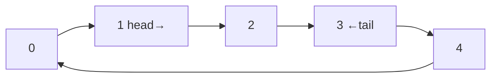

---
topic:
  - Computer Science
subtopic:
  - Data Structures
level:
  - "4"
priority: Medium
status: Ready to Repeat
publish: true
---

# Intro

A circular buffer (ring buffer) is a fixed-size array treated as if its ends were joined, with a read index and a write index that wrap around modulo the capacity. It gives **O(1)** enqueue and dequeue with **zero allocation** after construction — the same memory is reused forever — which makes it the structure of choice for streaming and bounded-history scenarios: audio/video pipelines, network packet queues, log/metric ring buffers ("keep the last N events"), and lock-free producer/consumer channels. In .NET it underpins the high-throughput paths of `System.Threading.Channels` and `Pipelines`.

## How It Works

Keep a backing array of size *n*, a `head` (next read), a `tail` (next write), and a count.

- **Enqueue(x)**: write at `tail`, advance `tail = (tail + 1) % n`.
- **Dequeue()**: read at `head`, advance `head = (head + 1) % n`.
- When the buffer is full you either **reject** the write (bounded queue) or **overwrite the oldest** (most recent N — common for logs/telemetry).

The modulo wrap is what makes it "circular": indices that run off the end come back to the start, so there's no shifting and no reallocation.



## Example

```csharp
public class CircularBuffer<T>
{
    private readonly T[] _buffer;
    private int _head, _tail, _count;

    public CircularBuffer(int capacity) => _buffer = new T[capacity];

    public int Count => _count;
    public bool IsFull => _count == _buffer.Length;

    // Overwrite-oldest variant (ring of the most recent N items)
    public void Write(T item)
    {
        _buffer[_tail] = item;
        _tail = (_tail + 1) % _buffer.Length;
        if (IsFull) _head = (_head + 1) % _buffer.Length; // drop oldest
        else _count++;
    }

    public bool TryRead(out T item)
    {
        if (_count == 0) { item = default!; return false; }
        item = _buffer[_head];
        _buffer[_head] = default!;                 // release reference for GC
        _head = (_head + 1) % _buffer.Length;
        _count--;
        return true;
    }
}
```

## Pitfalls

- **Full vs empty ambiguity** — when `head == tail` the buffer could be either empty or full. Resolve it by tracking an explicit `count` (as above), or by leaving one slot unused, or with monotonically increasing head/tail counters masked to the size. Power-of-two capacities let you replace `% n` with a cheaper bitmask `& (n-1)`.
- **Holding references prevents GC** — for `T` that is a reference type, overwriting/dequeuing should null out the slot (`_buffer[i] = default`), otherwise the buffer pins objects long after they're logically gone — a subtle leak in long-lived ring buffers.
- **Concurrency is not free** — a single-producer/single-consumer ring can be made lock-free with careful memory ordering, but multi-producer or multi-consumer rings need synchronization (or a proven lock-free algorithm like the Disruptor/LMAX). Don't assume "it's just two indices" makes it thread-safe.
- **Overwrite vs reject semantics must be a deliberate choice** — a telemetry ring wants "drop oldest"; a work queue usually wants "apply backpressure / reject". Picking the wrong one silently loses data or stalls producers.

## Tradeoffs

| Need | Circular buffer | Alternative | When to prefer the alternative |
|---|---|---|---|
| Bounded, allocation-free FIFO | Ideal — O(1), reuses memory | `Queue<T>` | When size is unbounded/unknown (Queue grows dynamically) |
| Keep only the most recent N | Natural (overwrite-oldest) | `List` + trim | List trimming is O(n); ring is O(1) |
| High-throughput producer/consumer | Lock-free SPSC possible | `Channel<T>` | Channels already wrap a ring with async + backpressure — prefer them in app code |

**Decision rule**: use a circular buffer when the capacity is fixed and you want zero per-item allocation — streaming, recent-history, or as the engine inside a bounded queue. In application code, prefer the battle-tested `System.Threading.Channels` (which is a ring buffer with async semantics) over hand-rolling concurrency.

## Questions

> [!QUESTION]- How do you distinguish a full buffer from an empty one when head equals tail?
> Three standard fixes: (1) keep an explicit `count`; (2) sacrifice one slot so "full" is `(tail + 1) % n == head` and "empty" is `head == tail`; or (3) use unbounded monotonic head/tail counters and compare/mask them. Each trades a little space or arithmetic for an unambiguous state.

> [!QUESTION]- Why is a circular buffer allocation-free and why does that matter?
> It writes into a pre-allocated fixed array and reuses slots via index wrap-around, so steady-state operation allocates nothing and creates no GC pressure. That matters on hot paths (audio, networking, high-frequency telemetry) where per-item allocation would cause latency spikes from garbage collection.

> [!QUESTION]- When should you overwrite the oldest element instead of rejecting new writes?
> Overwrite when you only care about the *most recent* N items and old data is disposable — debug ring logs, latest sensor readings, a frame buffer. Reject (or block/backpressure) when every item must be processed — a task queue — so you don't silently drop work.

## References

- [Circular buffer (Wikipedia)](https://en.wikipedia.org/wiki/Circular_buffer) — index schemes, full/empty disambiguation, and applications.
- [System.Threading.Channels (Microsoft Learn)](https://learn.microsoft.com/en-us/dotnet/core/extensions/channels) — production ring-buffer-backed producer/consumer with async + backpressure.
- [The LMAX Disruptor](https://lmax-exchange.github.io/disruptor/) — a high-performance lock-free ring buffer design and its rationale.
