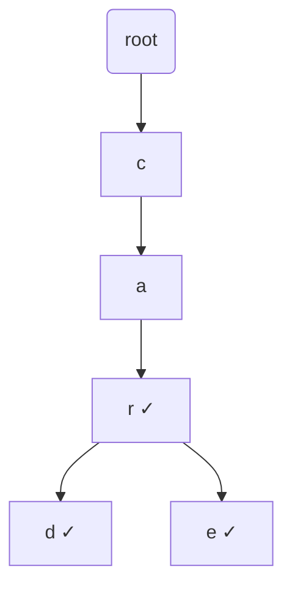

---
topic:
  - Computer Science
subtopic:
  - Data Structures
level:
  - "4"
priority: Medium
status: Ready to Repeat
publish: true
---

# Intro

A trie (prefix tree, pronounced "try") stores a set of strings as a tree of characters, where the path from the root to a node spells a prefix. Its defining property: lookup, insert, and prefix queries are **O(k)** where k is the key length — completely independent of how many keys are stored. That is why a trie of 1M product names answers "what completes `lap`?" in the time it takes to walk three nodes, while a `Dictionary` scan would be O(n). Tries power autocomplete, spell-checkers, IP routing tables (longest-prefix match), and T9-style text entry. .NET has no built-in trie type — you build one from nodes holding a `Dictionary<char, TrieNode>` (or a fixed child array for a known alphabet).

## How It Works

Each node holds links to child nodes (one per possible next character) and a flag marking whether a word ends there. Shared prefixes share nodes, so `car`, `card`, and `care` reuse the `c→a→r` path.

- **Insert**: walk/create one node per character, set `IsEnd` on the last.
- **Search (exact)**: walk the characters; the word exists only if every step exists *and* the final node has `IsEnd`.
- **StartsWith (prefix)**: same walk, but success is just reaching the last character — no `IsEnd` check.



## Example

```csharp
public class Trie
{
    private sealed class Node
    {
        public readonly Dictionary<char, Node> Children = new();
        public bool IsEnd;
    }

    private readonly Node _root = new();

    public void Insert(string word)
    {
        var node = _root;
        foreach (var c in word)
        {
            if (!node.Children.TryGetValue(c, out var next))
                node.Children[c] = next = new Node();
            node = next;
        }
        node.IsEnd = true;
    }

    public bool Search(string word) => Walk(word) is { IsEnd: true };

    public bool StartsWith(string prefix) => Walk(prefix) is not null;

    private Node? Walk(string s)
    {
        var node = _root;
        foreach (var c in s)
        {
            if (!node.Children.TryGetValue(c, out var next)) return null;
            node = next;
        }
        return node;
    }
}
```

## Pitfalls

- **Memory overhead** — each node carries a children map, so a trie can use far more memory than a `HashSet<string>` for the same keys, especially with sparse/wide alphabets. For fixed small alphabets a `Node[26]` array is faster but wasteful; a `Dictionary<char, Node>` is compact but slower. A **radix/Patricia trie** (compress chains of single-child nodes into one edge) cuts node count dramatically for long, sparse keys.
- **Alphabet and case assumptions** — an array-indexed trie (`children[c - 'a']`) silently breaks on uppercase, digits, Unicode, or emoji. Decide the character domain up front and normalize input (e.g. lower-case) consistently on insert and query.
- **Deletion is fiddly** — removing a word means clearing `IsEnd` and then pruning now-childless nodes back up the path, but only if no other word shares them. Many implementations just tombstone (`IsEnd = false`) and never prune, leaking memory over churn.

## Tradeoffs

| Need | Trie | Alternative | When to prefer the alternative |
|---|---|---|---|
| Prefix / autocomplete queries | O(k), enumerate subtree | `SortedSet` + range scan | Rarely — trie is purpose-built for this |
| Exact membership only | O(k) | `HashSet<string>` | Almost always — less memory, simpler, also O(k) hashing |
| Ordered iteration of keys | In-order DFS gives sorted output | `SortedSet<T>` | When you don't also need prefix queries |
| Longest-prefix match (routing) | Natural fit | Linear scan of rules | Trie wins decisively for routing tables |

**Decision rule**: reach for a trie when **prefixes are the query** (autocomplete, longest-prefix routing, dictionary word games). For plain "is this string present?", a `HashSet<string>` is smaller and simpler.

## Questions

> [!QUESTION]- Why is a trie lookup O(k) regardless of the number of stored keys?
> The walk follows one node per character of the query, so the work depends only on the key length k, not the set size n. Adding millions more keys does not lengthen the path for an existing query — unlike hashing's worst case or a tree's O(log n) depth.

> [!QUESTION]- When is a `HashSet<string>` the better choice than a trie?
> When you only need exact membership and don't care about prefixes. Both are effectively O(k) per operation (hashing must read the whole key too), but the hash set uses far less memory and is simpler. Choose the trie only when prefix or ordered traversal is a real requirement.

> [!QUESTION]- How does a trie support autocomplete?
> Walk to the node at the end of the typed prefix (O(k)), then DFS/BFS the subtree below it collecting every node with `IsEnd` — those are all completions of the prefix. Bounding the traversal (e.g. top-N) keeps it responsive on large dictionaries.

## References

- [Trie (Wikipedia)](https://en.wikipedia.org/wiki/Trie) — formal definition, radix/Patricia variants, and complexity.
- [Trie data structure (cp-algorithms)](https://cp-algorithms.com/string/aho_corasick.html) — tries as the basis of Aho-Corasick multi-pattern search.
- [Prefix and suffix trees overview (GeeksforGeeks)](https://www.geeksforgeeks.org/trie-insert-and-search/) — worked insert/search walkthrough with diagrams.
