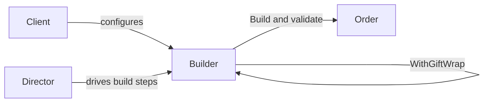

---
topic:
  - Architecture
subtopic:
  - Patterns
level:
  - "3"
priority: High
status:
  - Done
publish: true
---
# Builder

Ordering a custom sandwich at a sub shop is a Builder in action. You start with bread, add meat, choose veggies, pick a sauce, decide on a size — step by step, in any order, skipping what you don’t want. At the end, the sandwich artist assembles everything into a finished product. You never see a constructor that takes twelve arguments for bread-type, meat-type, lettuce-yes-no, tomato-yes-no.

The Builder pattern separates the construction of a complex object from its representation. A `Builder` class accumulates configuration through a fluent API — `.WithShipping(address)`, `.WithDiscount(code)`, `.WithGiftWrap()` — and a final `Build()` call validates constraints and assembles the finished object. Each step is optional, order-independent, and self-documenting. For **simple objects**, modern C# `required` properties and `init` setters with object initializers are often sufficient — Builder earns its complexity when construction involves cross-field validation, computed values, or a director-driven assembly sequence where the same process produces different representations.



## Problem

`OrderService.CreateOrder()` takes a growing parameter list. Every new requirement adds another parameter:

```csharp
public class OrderService
{
    // ⚠️ 12-parameter constructor — callers must know the correct order
    public Order CreateOrder(
        Customer customer,
        List<OrderItem> items,
        Address shippingAddress,
        Address? billingAddress,      // ⚠️ null means "same as shipping" — implicit convention
        string? discountCode,
        bool giftWrap,
        string? giftMessage,
        DateTime? requestedDeliveryDate,
        string shippingCarrier,
        bool signatureRequired,
        string? specialInstructions,
        bool isBusinessOrder)
    {
        // ⚠️ Validation scattered — which combinations are invalid?
        if (giftWrap && string.IsNullOrEmpty(giftMessage))
            throw new ArgumentException("Gift wrap requires a message");
        if (requestedDeliveryDate.HasValue && requestedDeliveryDate < DateTime.UtcNow.AddDays(1))
            throw new ArgumentException("Delivery date must be at least tomorrow");

        var order = new Order
        {
            Id = Guid.NewGuid(),
            Customer = customer,
            Items = items,
            // ⚠️ Computed fields mixed with assignment — easy to miss one
            Total = items.Sum(i => i.UnitPrice * i.Quantity),
            ShippingAddress = shippingAddress,
            BillingAddress = billingAddress ?? shippingAddress,
            // ... 8 more assignments
        };
        return order;
    }
}

// ⚠️ Call site — what does 'true, null, false, true' mean?
var order = orderService.CreateOrder(customer, items, shipping, null, "SAVE10",
    true, "Happy Birthday!", null, "FedEx", false, null, false);
```

Here's what breaks when requirements change: adding a "priority shipping" flag means a 13th parameter, and every existing call site must be updated even if they don't use priority shipping.

## Solution

`OrderBuilder` accumulates configuration through named methods and validates on `Build()`:

```csharp
public class Order
{
    public Guid Id { get; init; }
    public Customer Customer { get; init; } = null!;
    public IReadOnlyList<OrderItem> Items { get; init; } = [];
    public decimal Subtotal { get; init; }
    public decimal DiscountAmount { get; init; }
    public decimal Total { get; init; }
    public Address ShippingAddress { get; init; } = null!;
    public Address BillingAddress { get; init; } = null!;
    public ShippingOptions Shipping { get; init; } = null!;
    public GiftOptions? Gift { get; init; }
    public string? SpecialInstructions { get; init; }
    public bool IsBusinessOrder { get; init; }
}

public class OrderBuilder(Customer customer)
{
    private readonly List<OrderItem> _items = [];
    private Address? _shippingAddress;
    private Address? _billingAddress;
    private string? _discountCode;
    private GiftOptions? _gift;
    private ShippingOptions _shipping = ShippingOptions.Standard;
    private string? _specialInstructions;
    private bool _isBusinessOrder;

    public OrderBuilder AddItem(Product product, int quantity)
    {
        if (quantity <= 0) throw new ArgumentOutOfRangeException(nameof(quantity));
        _items.Add(new OrderItem(product.Id, quantity, product.Price));
        return this; // ✅ fluent — enables chaining
    }

    public OrderBuilder ShipTo(Address address)
    {
        _shippingAddress = address;
        return this;
    }

    public OrderBuilder BillTo(Address address)
    {
        _billingAddress = address;
        return this;
    }

    public OrderBuilder WithDiscount(string code)
    {
        _discountCode = code;
        return this;
    }

    public OrderBuilder WithGiftWrap(string message) // ✅ gift wrap and message are one concept
    {
        _gift = new GiftOptions(message);
        return this;
    }

    public OrderBuilder WithShipping(ShippingOptions options)
    {
        _shipping = options;
        return this;
    }

    public OrderBuilder AsBusinessOrder()
    {
        _isBusinessOrder = true;
        return this;
    }

    public Order Build()
    {
        // ✅ All validation in one place
        if (_shippingAddress is null)
            throw new InvalidOperationException("Shipping address is required");
        if (_items.Count == 0)
            throw new InvalidOperationException("Order must contain at least one item");
        if (_shipping.RequestedDeliveryDate.HasValue &&
            _shipping.RequestedDeliveryDate < DateTime.UtcNow.AddDays(1))
            throw new InvalidOperationException("Delivery date must be at least tomorrow");

        var subtotal = _items.Sum(i => i.UnitPrice * i.Quantity);
        var discount = _discountCode is not null ? CalculateDiscount(subtotal, _discountCode) : 0m;

        return new Order
        {
            Id = Guid.NewGuid(),
            Customer = customer,
            Items = _items.AsReadOnly(),
            Subtotal = subtotal,
            DiscountAmount = discount,
            Total = subtotal - discount,                    // ✅ computed field, not caller's responsibility
            ShippingAddress = _shippingAddress,
            BillingAddress = _billingAddress ?? _shippingAddress, // ✅ default logic encapsulated
            Shipping = _shipping,
            Gift = _gift,
            SpecialInstructions = _specialInstructions,
            IsBusinessOrder = _isBusinessOrder
        };
    }

    private static decimal CalculateDiscount(decimal subtotal, string code) =>
        code == "SAVE10" ? subtotal * 0.10m : 0m;
}

// ✅ Call site is self-documenting
var order = new OrderBuilder(customer)
    .AddItem(laptop, 1)
    .AddItem(mouse, 2)
    .ShipTo(shippingAddress)
    .WithDiscount("SAVE10")
    .WithGiftWrap("Happy Birthday!")
    .WithShipping(ShippingOptions.Express)
    .Build();
```

Adding priority shipping now means one new `WithPriorityShipping()` method — existing call sites are unaffected.

## You Already Use This

**`WebApplicationBuilder` / `IHostBuilder`** — the canonical .NET Builder. `builder.Services.AddDbContext<>()`, `builder.Configuration.AddJsonFile()`, `builder.Logging.AddConsole()` accumulate configuration; `builder.Build()` assembles the `WebApplication`. The director pattern is implicit: `Program.cs` is the director.

**`StringBuilder`** — the original .NET Builder. `Append()`, `AppendLine()`, `Insert()` accumulate string segments; `ToString()` produces the final string. Avoids the O(n²) allocation cost of string concatenation.

**`IQueryable<T>` LINQ chain** — each LINQ operator (`Where`, `OrderBy`, `Select`) adds to the query expression tree; `ToListAsync()` is the `Build()` call that executes it. EF Core translates the accumulated expression tree into SQL.

**`UriBuilder`** — builds `Uri` objects from scheme, host, port, path, and query components without string manipulation.

## Pitfalls

**Over-engineering simple objects** — if an object has 3-4 required fields and no validation logic, a Builder adds indirection for no benefit. Use C# `required` properties with object initializers: `new Order { Customer = customer, Items = items, Total = total }`. The compiler enforces required fields at the call site.

**Mutable builder state leaking into the product** — if `Build()` returns the builder's internal list directly (not a copy), callers can mutate the order's items after construction. Always copy or wrap collections: `_items.AsReadOnly()` or `new List<OrderItem>(_items)`.

**Missing validation on `Build()`** — builders that don't validate produce invalid objects silently. Validate all invariants in `Build()`, not in individual setter methods (where partial state is expected). The builder's job is to accumulate; `Build()`'s job is to validate and assemble.

## Tradeoffs

| Concern | Builder | Object initializer (`required`/`init`) | Telescoping constructors |
|---|---|---|---|
| Required field enforcement | Runtime (in `Build()`) | Compile-time (`required` keyword) | Compile-time |
| Optional parameters | Named methods, self-documenting | Named properties, self-documenting | Combinatorial explosion |
| Validation | Centralized in `Build()` | Must use custom setter or factory | Scattered across overloads |
| Computed fields | Encapsulated in `Build()` | Caller's responsibility | Caller's responsibility |
| Fluent chaining | Yes | No | No |
| Complexity | High | Low | Medium |

**Decision rule**: Start with `required` properties and object initializers for new objects. Introduce Builder when: (1) construction requires multi-step validation, (2) computed fields depend on multiple inputs, (3) the same assembly process produces different representations, or (4) a director needs to drive construction programmatically. The signal is when `Build()` does real work beyond assignment.

## Questions

> [!QUESTION]- When does Builder's `Build()` method justify its existence over a constructor?
> When `Build()` does work a constructor shouldn't: cross-field validation (gift wrap requires a message), computed fields (total = subtotal - discount), default derivation (billing = shipping if not set), or async initialization. Constructors should be fast and never throw business logic exceptions. `Build()` is the right place for invariant enforcement that spans multiple fields. The tradeoff: `Build()` can throw at runtime; `required` properties fail at compile time. Use `required` when all fields are independent; use Builder when fields interact.

> [!QUESTION]- How does the Director role work, and when do you need it?
> A Director encapsulates a specific construction sequence, calling builder methods in a fixed order. Example: `StandardOrderDirector.BuildGiftOrder(builder, customer, items)` always calls `ShipTo`, `WithGiftWrap`, `WithShipping(Express)` in the right order. Directors are useful when the same construction sequence is reused across multiple call sites, or when the sequence itself is a business rule (gift orders always use express shipping). Without a director, each call site must know the correct sequence — a form of knowledge duplication. The tradeoff: directors add a class; without them, call sites are more flexible but less consistent.

> [!QUESTION]- Why does `WebApplicationBuilder` use a builder instead of a constructor with parameters?
> Because `WebApplication` construction is a multi-step process where each step can affect subsequent steps: adding a service can change how middleware behaves; configuration sources are layered in priority order; logging providers must be registered before the host starts. A constructor can't express this ordering or allow conditional registration. The builder accumulates all configuration, then `Build()` wires everything together in the correct dependency order. The cost: `Build()` can fail at runtime if configuration is invalid — there's no compile-time guarantee that all required services are registered.

## References

- [Builder — refactoring.guru](https://refactoring.guru/design-patterns/builder) — canonical pattern description with structure diagram and C# example
- [WebApplicationBuilder — Microsoft Learn](https://learn.microsoft.com/en-us/dotnet/api/microsoft.aspnetcore.builder.webapplicationbuilder) — .NET's primary Builder in production use
- [StringBuilder — Microsoft Learn](https://learn.microsoft.com/en-us/dotnet/api/system.text.stringbuilder) — the original .NET Builder for string construction
- [Required members (C# reference) — Microsoft Learn](https://learn.microsoft.com/en-us/dotnet/csharp/language-reference/keywords/required) — modern C# alternative for simple object construction
