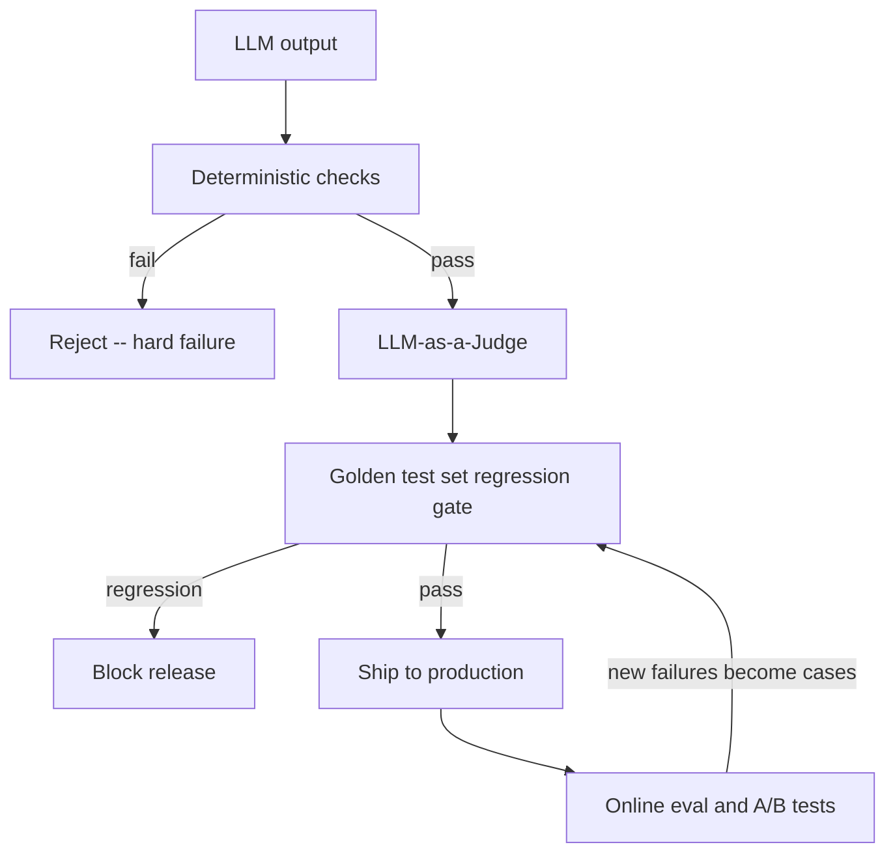

---
topic:
  - AI & ML
subtopic:
  - LLM
tags:
  - FolderNote
publish: true
level:
  - "3"
status: Done
priority: High
---

# Intro

Evaluation is how you measure whether an LLM application is doing the right thing: answer quality, grounding, safety, and regressions over time. Because LLM output is probabilistic and open-ended, you cannot rely on a single pass/fail assertion the way you would for deterministic code — evaluation becomes a layered system that combines cheap hard checks, scalable semantic judges, fixed regression sets, and production signals. This folder covers each layer; this hub shows how they fit together.

## The Evaluation Stack

No single technique is sufficient. A production LLM evaluation system layers four, cheapest and strictest first, so expensive judgment is spent only on output that already passed the hard gates:



- **[[Deterministic Checks]]** — non-LLM rules that run first on every output: schema validity, allowlisted actions, PII scans, length and format constraints. Microseconds, zero cost, zero false positives. A malformed or unsafe output is a hard failure that never reaches a judge.
- **[[LLM-as-a-Judge]]** — a separate model scores semantic quality (correctness, groundedness, tone) against a rubric, either as absolute scorecards or pairwise comparisons. Scalable where human review is too slow, but carries its own biases (verbosity, position, self-preference) that must be calibrated against human labels.
- **[[Golden Test Set and Regression Runs]]** — a versioned, curated set of representative and adversarial cases run on every change to catch regressions, with a frozen holdout you never tune against. This is the release gate.
- **[[Online Evaluation and AB Tests]]** — measure real user outcomes on live traffic, since offline sets cannot anticipate production distribution. New production failures feed back into the golden set, closing the loop.

A useful framing across all four: combine **offline** (fixed sets, fast iteration, regression gating) with **online** (real outcomes, distribution shift), and combine **automated** (deterministic + judge, scalable) with **human** (rubric review, calibration, edge-case discovery). Neither axis alone is enough.

All four layers run against an evaluation set; how you construct, synthesize, and size that set is [[Building an Evaluation Set]]. Two domains specialize this general stack with their own metrics and labeling, reusing everything above rather than repeating it: RAG adds retrieval-quality and faithfulness metrics — see [[Home/07 AI & ML/LLM/RAG/Evaluation/Evaluation|RAG Evaluation]] and [[Monitoring]] — and agents add trajectory, tool-call, and task-success metrics — see [[Home/07 AI & ML/LLM/Agents/Evaluation/Evaluation|Agent Evaluation]].

## Example

Example scorecard for a customer support assistant (one test case):

```text
Case: "Refund policy for damaged item after 45 days"

Dimensions (0-2):
- Correctness: 0 wrong / 1 partly / 2 correct
- Groundedness: 0 invented / 1 unclear / 2 supported by policy
- Safety: 0 unsafe / 1 questionable / 2 safe
- Actionability: 0 vague / 1 partial / 2 clear steps

Hard checks:
- Must include a citation to the policy section
- Must not request credit card numbers
```

## Evaluation Overfitting

When you iterate on prompts or rubrics against a fixed evaluation set, you can overfit to that benchmark—improvements on your dev set don't transfer to real users. This happens because you're optimizing for the specific distribution and phrasing of your test cases, not for genuine quality.

**Practical signals of evaluation overfitting:**

- You keep iterating on a prompt until it maximizes a single judge score on your dev set.
- It becomes overly verbose and "judge-friendly" while real users complain about slow, indirect answers.
- Improvements only show up on your dev set but not on a holdout set (or online metrics).

**Fix:** Introduce multiple eval dimensions, add human spot checks, and keep a frozen holdout set that you never tune against.

## Questions

> [!QUESTION]- When are classic metrics (BLEU/ROUGE) useful?
> Mainly for narrow summarization/translation style tasks and as weak signals. For open-ended assistants, rubric-based scoring and pairwise ranking usually track real quality better.

> [!QUESTION]- Why run deterministic checks before an LLM judge rather than relying on the judge alone?
> - Deterministic checks are microseconds and free; LLM-judge calls cost API tokens and seconds — running the cheap gate first avoids paying to judge output that is already invalid
> - Hard constraints (schema validity, disallowed actions, PII, length) have a zero false-positive rate when expressed as rules, whereas a judge can mis-rule on them
> - A judge can be distracted into scoring an output "good" that a deterministic rule would reject outright (a fluent answer that violates the output contract)
> - The two are complementary, not redundant: deterministic checks enforce hard contracts, judges evaluate soft quality — see [[Deterministic Checks]]

> [!QUESTION]- Why isn't a strong offline score enough to ship an LLM change?
> - Offline sets are frozen samples; production traffic shifts in phrasing, intent, and edge-case mix the set never captured
> - Iterating against a fixed set invites evaluation overfitting — the prompt gets tuned to the benchmark's distribution, not to real quality
> - Outcome metrics that matter (task resolution, escalation, retention) depend on multi-turn user behavior that no static set simulates
> - Treat offline evaluation as a release gate, then confirm with [[Online Evaluation and AB Tests|online evaluation]] before trusting the change

## References

- [Evaluation best practices (OpenAI API Docs)](https://developers.openai.com/api/docs/guides/evaluation-best-practices)
- [Working with evals (OpenAI API Docs)](https://developers.openai.com/api/docs/guides/evals)
- [Define your success criteria (Anthropic Docs)](https://docs.anthropic.com/en/docs/test-and-evaluate/define-success)
- [AI Risk Management Framework (NIST)](https://www.nist.gov/itl/ai-risk-management-framework)
