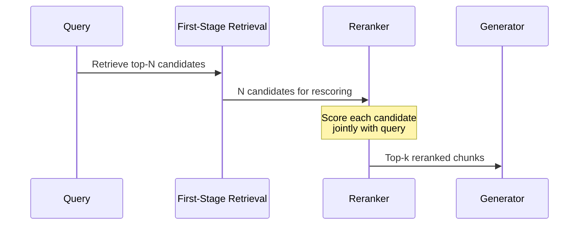
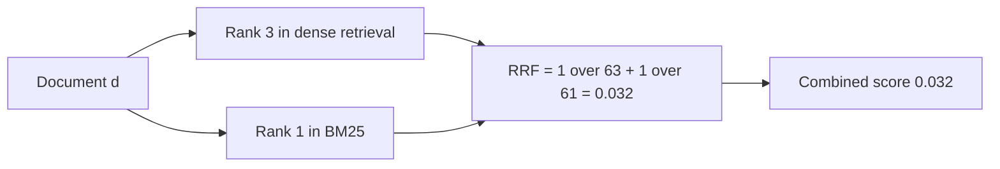

---
topic:
  - AI & ML
subtopic:
  - LLM
level:
  - "2"
priority: High
status: Done
publish: true
---

# Intro

Re-ranking is a second-stage scoring pass that takes the candidate set from [[Retrieval]] and reorders it using a more expensive, more accurate model before context reaches the generator. Retrieval optimizes for recall at speed — find plausible candidates from millions of chunks. Re-ranking optimizes for precision — push the most relevant candidates to the top of a small list.

The mechanism: first-stage retrieval (dense, sparse, or hybrid) returns a candidate set of 20–100 chunks ranked by approximate similarity. The reranker then scores each candidate against the query using a model that can read both query and document together (joint encoding), producing a more accurate relevance score. The reranked top-k goes to the generator.



Example: a hybrid retrieval returns 50 candidates for "what are the SLA penalties for tier-2 partners." Ten candidates mention SLAs generally, three mention tier-2 specifically, and the rest are noise about partner onboarding. A cross-encoder reranker reads each candidate alongside the query and pushes the three tier-2 SLA documents to positions 1–3, where the generator uses them. Without reranking, the generator might receive mostly generic SLA content and produce a vague answer.

## Reranking Approaches

### Cross-Encoder Reranking

A cross-encoder takes the query and a single document as a concatenated input, passes them through a transformer together, and outputs a relevance score. Unlike bi-encoders (which embed query and document independently), cross-encoders perform full token-level attention between query and document. This joint encoding captures fine-grained interactions — negation, qualifier scope, entity co-reference — that independent embeddings miss.

The tradeoff is speed: a cross-encoder must run inference once per query-document pair. Scoring 50 candidates means 50 forward passes. This makes cross-encoders impractical for first-stage retrieval over millions of chunks, but well-suited for rescoring a small candidate set.

SBERT provides pretrained cross-encoder models across a speed-quality spectrum. At one end, `cross-encoder/ms-marco-TinyBERT-L-2-v2` scores ~9000 docs/sec with moderate quality. At the other, `cross-encoder/ms-marco-MiniLM-L-12-v2` scores ~960 docs/sec with substantially higher [[Monitoring#Retrieval Quality Metrics|nDCG]] and [[Monitoring#Retrieval Quality Metrics|MRR]] on MS MARCO.

**Cohere Rerank** offers cross-encoder reranking as a managed API. Models like `rerank-v3.5` and the `rerank-v4.0` family accept JSON and semi-structured data natively, handle multilingual queries, and require no infrastructure. The tradeoff is per-query API cost and network latency.

### Late Interaction — ColBERT

ColBERT (Contextualized Late Interaction over BERT) encodes query and document independently into per-token embeddings, then scores relevance using MaxSim: for each query token, find the maximum cosine similarity to any document token, then sum across all query tokens. This is "late interaction" — token representations are pre-computed independently, but scoring considers token-level alignment.

The key advantage over cross-encoders: document embeddings are pre-computed and stored at index time. At query time, only the query needs encoding. Scoring is a matrix operation (MaxSim) over pre-stored document token vectors, which is significantly faster than full cross-encoder inference per candidate.

ColBERTv2 adds residual compression that reduces per-document storage by 6–10x while retaining most of the quality. On BEIR zero-shot benchmarks, ColBERTv2 achieves competitive [[Monitoring#Retrieval Quality Metrics|nDCG]] with full cross-encoders at a fraction of the latency.

The tradeoff: ColBERT requires multi-vector storage (one vector per token per document), which standard single-vector stores do not support natively. Dedicated engines like PLAID (ColBERTv2's retrieval engine) or vector stores with multi-vector support are needed.

### BM25 Lexical Reranking

BM25 scores a document by matching query terms against document terms, then adjusting for term frequency, inverse document frequency, and document length. In RAG pipelines it is usually a first-stage sparse retriever, but it can also act as a cheap second-stage lexical reranker over dense retrieval results when exact terminology matters.

Example: a user asks for "SOC 2 Type II retention exception." Dense retrieval may surface semantically similar compliance chunks about audits and data retention. A BM25 pass rewards chunks that contain the exact tokens `SOC`, `2`, `Type II`, `retention`, and `exception`, pushing the policy clause with the real exception language above more generic compliance explanations.

The strength is precision on named entities, error codes, product SKUs, legal terms, and acronyms. The weakness is vocabulary brittleness: BM25 does not understand that "customer-managed key" and "CMK" may refer to the same concept unless both terms appear or the query is expanded. Use BM25 as a lexical guardrail beside dense retrieval, not as the only relevance signal for semantic questions.

### MMR — Maximal Marginal Relevance

Maximal Marginal Relevance reranks candidates by balancing relevance to the query against novelty relative to documents already selected. Instead of taking the top-k most similar chunks, MMR picks the next chunk that is both relevant and not redundant with the chunks already in the context window.

The scoring idea is: `MMR = lambda * relevance_to_query - (1 - lambda) * similarity_to_selected_docs`. A high lambda behaves like normal relevance ranking. A lower lambda increases diversity and reduces duplicate context.

Example: retrieval returns ten chunks from the same incident report because all of them mention "vector index timeout." Plain top-k may spend the entire prompt budget on near-duplicate paragraphs. MMR can keep the strongest incident chunk, then select a configuration page and a monitoring runbook because they add different evidence for the same query.

MMR is most useful when chunk overlap, template-heavy documents, or near-duplicate pages crowd out coverage. The cost is that diversity can demote the single most relevant supporting chunk if lambda is too low. Start with MMR when the generator receives repetitive context; avoid it when the answer requires multiple adjacent chunks from the same source.

### LLM-as-Reranker

An LLM-as-reranker asks a language model to judge candidate relevance directly, usually by scoring each chunk or choosing the best chunks from a small candidate set. Compared with a cross-encoder, it can follow domain-specific instructions: "prefer current policy over archived policy," "penalize snippets without dollar amounts," or "rank implementation guidance above marketing copy."

Example prompt shape:

```text
Query: What SLA credits apply to tier-2 partners?

Candidate A: Tier-2 partners receive a 5 percent service credit after two missed monthly uptime targets...
Candidate B: Our partner program has three support tiers...

Return JSON with relevance scores from 0 to 5 and a one-sentence reason for each score.
```

The advantage is judgment flexibility: the model can apply business rules, read longer evidence than small cross-encoders, and explain why a chunk was selected. The tradeoff is latency, cost, and variance. LLM reranking is best for low-volume or high-stakes queries where transparent ranking decisions matter; for high-QPS search, use a trained reranker or managed rerank API and reserve LLM judging for evaluation or difficult fallback cases.

### Score Fusion — RRF and Alternatives

Score fusion combines ranked lists from multiple retrievers into a single ordering. This is not reranking in the cross-encoder sense — no new model scores relevance — but it serves the same purpose of improving ranking quality before generation.

**Reciprocal Rank Fusion (RRF)** is the most common fusion method. For each document, sum the reciprocal of its rank in each input list:



The formula: `RRF_score = sum of 1 / (k + rank_i)` where k=60 is the standard constant from the original paper. RRF is rank-based, not score-based — it does not need score normalization across retrievers with different scales, which makes it robust.

**Linear combination** normalizes scores from each retriever to a common range and computes a weighted sum: `score = alpha * dense_score + (1 - alpha) * sparse_score`. This preserves score magnitude but requires choosing alpha and handling score distributions that shift across query types.

When to use which: RRF is the safer default because it only depends on rank ordering, not score distributions. Linear combination is worth trying when one retriever is consistently more reliable than the other and you want to weight it explicitly. In both cases, score fusion is a complement to model-based reranking, not a replacement — fuse first, then rerank the fused list.

## Pitfalls

### Latency Budget Exhaustion

Cross-encoder reranking adds 50–200ms per query depending on candidate count and model size. In a pipeline with a 500ms total SLA, reranking can consume 10–40% of the budget. Teams add reranking for quality, then discover that p95 latency exceeds the SLA under production load.

Mitigation: set a hard candidate cap (20–50 documents) and choose the reranker model size based on your latency budget, not just quality benchmarks. Profile reranking latency under realistic batch sizes and concurrency, not just single-query benchmarks.

### Candidate Count Reduction Under Load

Under traffic pressure, teams reduce the candidate count passed to the reranker (from 100 to 20) to stay within latency budgets. This silently kills recall — if the relevant document was at position 35 in the first-stage results, reducing to top-20 means the reranker never sees it.

Detection: monitor first-stage recall@N at the candidate count you actually pass to the reranker, not the theoretical maximum. If recall@20 is significantly lower than recall@100, the candidate cut is the bottleneck, not the reranker.

### Reranker-Retriever Distribution Mismatch

A reranker trained on MS MARCO (short web passages, English) may underperform on your domain (long technical documents, multilingual). The reranker's relevance judgments are calibrated to its training distribution — out-of-distribution documents get unreliable scores.

Mitigation: evaluate the reranker on your own query-document pairs before committing. If domain-specific recall degrades after reranking (reranker demotes relevant documents), the reranker is hurting, not helping. Consider domain-adapted or multilingual reranker models.

### Over-Reliance on Reranking to Fix Retrieval

Reranking can only reorder what retrieval found. If the relevant document is not in the candidate set at all (recall failure), no amount of reranking will surface it. Teams sometimes add rerankers expecting them to fix retrieval coverage problems, when the actual fix is better [[Chunking]], [[Embeddings|embedding model selection]], or query expansion.

Diagnostic: if reranking improves precision but not recall, the pipeline has a first-stage recall problem, not a ranking problem.

## Tradeoffs

| Approach | Quality | Latency per query | Infrastructure | Best for |
| --- | --- | --- | --- | --- |
| No reranking | Baseline -- retrieval order only | Lowest -- no extra scoring | None | Simple corpora where first-stage ranking is sufficient |
| BM25 lexical reranking | Moderate -- exact term precision | Low -- sparse scoring over candidates | Sparse index or BM25 scorer | Queries with identifiers, acronyms, policy terms, error codes |
| Score fusion only -- RRF | Moderate -- better ordering from multiple signals | Minimal -- arithmetic on ranks | None -- works with any retriever pair | Hybrid retrieval where dense and sparse complement each other |
| MMR diversity reranking | Moderate -- less redundant context | Low to moderate -- pairwise similarity over selected chunks | Embeddings or similarity scores for candidates | Context windows crowded by near-duplicate chunks |
| Cross-encoder -- small model | High -- joint query-document attention | 50-100ms for 20-50 candidates | GPU or CPU inference | Quality-sensitive pipelines with moderate latency budgets |
| Cross-encoder -- large model | Highest -- deepest token interaction | 100-300ms for 20-50 candidates | GPU required | High-stakes domains where quality justifies latency |
| ColBERT late interaction | High -- token-level alignment with pre-computed docs | 20-50ms for 20-50 candidates | Multi-vector storage -- specialized index | Latency-sensitive pipelines needing better-than-bi-encoder quality |
| LLM-as-reranker | High but variable -- instruction-following judgment | Highest -- model call over candidate text | LLM API or hosted model plus output validation | Low-volume, high-stakes queries needing explainable ranking rules |
| Managed API -- Cohere or Azure | High -- no infrastructure | Network round-trip + provider latency | None -- API call | Teams without ML infrastructure or needing fast integration |

Decision rule: start without reranking and measure retrieval quality. Add BM25 or RRF when lexical and dense signals complement each other. Add MMR when the prompt contains redundant chunks. Add model-based reranking only when precision failures at the top of the ranked list are the dominant error mode — not when recall is the problem. Use LLM-as-reranker selectively when business judgment or explainability is worth the extra latency and cost.

## Questions

> [!QUESTION]- Why can reranking improve offline [[Monitoring#Retrieval Quality Metrics|nDCG]] without visible quality improvement for end users?
> The improvement may be in ranking positions that the generator does not use. If the generator only reads the top-3 chunks, improvements at positions 4–5 are invisible to users. Evaluate whether the reranker changes the top-k composition that actually enters the prompt, not just overall [[Monitoring#Retrieval Quality Metrics|nDCG]]. Also verify that the eval set reflects production query distribution — gains on eval-set query types may not represent the queries users actually send.

> [!QUESTION]- When does reranking hurt retrieval quality instead of helping?
> When the reranker is out-of-distribution for your domain. A reranker trained on short web passages may misjudge relevance on long technical documents, internal terminology, or multilingual content — demoting actually relevant documents. Also when the candidate count is too small: if first-stage recall@N is already low, the reranker only reorders noise. Always compare [[Monitoring#Retrieval Quality Metrics|recall and precision]] before and after reranking on domain-specific queries.

> [!QUESTION]- Why is ColBERT faster than a cross-encoder at query time despite also using token-level scoring?
> ColBERT pre-computes per-token document embeddings at index time and stores them. At query time, only the query tokens need encoding (one forward pass regardless of candidate count). Scoring is a MaxSim matrix operation over pre-stored vectors, not a full transformer forward pass per document. Cross-encoders must run a complete forward pass for each query-document pair because they jointly encode the concatenated input. The tradeoff is that ColBERT needs multi-vector storage, which uses more space and requires specialized indexes.

## References

- [Retrieve and rerank pipeline — bi-encoder retrieval plus cross-encoder reranking (SBERT)](https://sbert.net/examples/applications/retrieve_rerank/README.html)
- [Pretrained cross-encoder models — speed and quality benchmarks (SBERT)](https://sbert.net/docs/cross_encoder/pretrained_models.html)
- [ColBERT — efficient and effective passage search via contextualized late interaction (SIGIR 2020)](https://arxiv.org/abs/2004.12832)
- [ColBERTv2 — residual compression and denoised supervision (NAACL 2022)](https://arxiv.org/abs/2112.01488)
- [Reciprocal Rank Fusion outperforms Condorcet and individual rank learning methods (SIGIR 2009)](https://plg.uwaterloo.ca/~gvcormac/cormacksigir09-rrf.pdf)
- [The Probabilistic Relevance Framework BM25 and beyond — lexical ranking model background (Foundations and Trends in Information Retrieval)](https://www.staff.city.ac.uk/~sbrp622/papers/foundations_bm25_review.pdf)
- [The use of MMR, diversity-based reranking for reordering documents and producing summaries (SIGIR 1998)](https://dl.acm.org/doi/10.1145/290941.291025)
- [Semantic ranking in Azure AI Search — L2 reranking with language understanding (Microsoft Learn)](https://learn.microsoft.com/azure/search/semantic-search-overview)
- [Rerank API — models and semi-structured data support (Cohere)](https://docs.cohere.com/docs/rerank)
- [RankGPT — LLM-based passage reranking with permutation generation (arXiv)](https://arxiv.org/abs/2304.09542)
