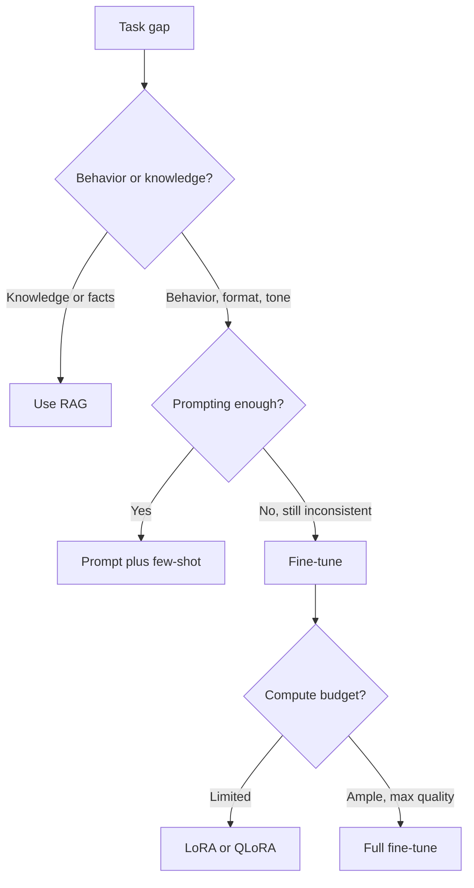

---
topic:
  - AI & ML
subtopic:
  - LLM
level:
  - "2"
priority: High
status: Done
publish: true
---

# Intro

Fine-tuning continues training a pretrained model's weights on task-specific data, changing the model's behavior rather than just its inputs. It is the most powerful and most expensive of the three adaptation levers in [[LLM]] — the others being [[Prompting]] (no weight change) and [[RAG]] (external knowledge at query time). The defining trait: fine-tuning bakes behavior into the weights, so it persists across every request without consuming context tokens — but it also bakes in a snapshot that starts aging the moment training ends.

The single most important decision is *what* you are trying to change. Fine-tuning is the right tool for **behavior** — output format, tone, refusal policy, domain style, structured-output reliability, or compressing a large model's behavior into a smaller one. It is the wrong tool for **knowledge** — facts change faster than you can retrain, fine-tuning provides no source traceability, and a model fine-tuned to "know" a fact will still hallucinate confidently at the edges. Keep mutable facts in retrieval; keep durable behavior in weights.

## When to Fine-tune

Reach for fine-tuning only after prompting and retrieval have been tried, because it is the costliest to build and maintain. It earns its place when:

- **Behavior is inconsistent despite good prompting** — the model mostly follows the format or policy but drifts often enough to break downstream systems, and few-shot examples are not closing the gap reliably.
- **The behavior is hard to specify in words but easy to demonstrate** — a house style, a domain-specific structure, a nuanced classification boundary. Examples teach what prose cannot.
- **You want a smaller, cheaper model to match a larger one** on a narrow task — fine-tune a small model on the large model's outputs (distillation) to cut latency and per-request cost at scale.
- **Prompt overhead is dominating cost** — if every request needs a long instruction block or many few-shot examples, fine-tuning can move that into the weights and shrink the prompt.

Do not fine-tune to inject knowledge, to fix a problem you have not first diagnosed, or before you have an [[Home/11 AI & ML/LLM/Evaluation/Evaluation|evaluation]] set to prove the change helped.

## Methods

### Full Fine-tuning

Update every weight in the model. Highest quality ceiling, but the cost is steep: training needs memory for the model, gradients, and optimizer states (often 3–4× the model size in GPU memory), and each fine-tuned task produces a full copy of the model to store and serve. Full fine-tuning also risks **catastrophic forgetting** — narrow training data can erode the general capabilities the base model had. Reserve it for when you have ample compute and the quality ceiling genuinely matters.

### Parameter-Efficient Fine-tuning (PEFT)

PEFT methods freeze the base model and train a small number of additional parameters, capturing most of the quality of full fine-tuning at a fraction of the cost.

- **LoRA (Low-Rank Adaptation)** — freeze the base weights and inject small trainable low-rank matrices into the attention and MLP layers. Only ~0.1–1% of parameters are trained. The resulting adapter is tiny (megabytes), can be swapped or stacked at serve time, and can be merged back into the base weights for zero inference overhead. The default PEFT method.
- **QLoRA** — quantize the frozen base model to 4-bit, then train LoRA adapters on top. This collapses the memory footprint enough to fine-tune large models on a single consumer or modest cloud GPU, with little quality loss versus 16-bit LoRA. The standard way to fine-tune large open models on limited hardware.
- Other variants — prefix tuning, prompt tuning, and adapter layers trade flexibility for even fewer trained parameters; LoRA/QLoRA dominate in practice.

### Preference Alignment

Supervised fine-tuning (SFT) teaches the model to imitate good responses. **Preference alignment** goes further, training the model to prefer better responses over worse ones — this is the stage that shapes helpfulness, tone, and refusal behavior (see [[LLM]] on the training pipeline).

- **RLHF** — train a reward model from human preference comparisons, then optimize the policy against it with reinforcement learning. Powerful but operationally heavy.
- **DPO (Direct Preference Optimization)** — optimize directly on preference pairs with a simple classification-style loss, skipping the separate reward model and RL loop. Much simpler to run and now a common default for preference tuning; newer variants (ORPO, KTO) push simplicity further.

## Data

Data quality dominates data quantity. A few hundred to a few thousand clean, consistent, representative examples routinely beat tens of thousands of noisy ones for SFT.

- **Match the inference format exactly.** Training examples must use the same chat template, system prompt, and structure the model will see in production. A mismatch silently degrades results.
- **Be consistent.** Inconsistent formatting or labeling in the training set teaches the model to be inconsistent. Audit examples the way you would audit few-shot demonstrations.
- **Hold out an evaluation split.** Reserve representative cases the model never trains on, and evaluate the fine-tune against the base model on both that split and your [[Golden Test Set and Regression Runs|golden set]] — training loss going down is not proof of task improvement.

## Pitfalls

### Fine-tuning to Inject Knowledge

**What goes wrong**: a team fine-tunes on a corpus of documents expecting the model to "learn the facts," then it hallucinates confidently on anything near the edges of that corpus and silently goes stale as the facts change.

**Why it happens**: fine-tuning shifts behavior and style far more reliably than it implants retrievable facts, and it bakes a snapshot with no source traceability.

**How to avoid it**: use [[RAG]] for knowledge. Fine-tune for how the model should behave with that knowledge, not to store the knowledge itself.

### Catastrophic Forgetting

**What goes wrong**: after fine-tuning on a narrow task, the model gets better at that task but measurably worse at general reasoning, instruction following, or other tasks it used to handle.

**Why it happens**: full fine-tuning on a narrow distribution overwrites general capability. The narrower the data and the more weights updated, the worse the erosion.

**How to avoid it**: prefer LoRA/QLoRA (the frozen base preserves general capability), mix some general-purpose data into the training set, and evaluate on a broad held-out set, not only the target task.

### Overfitting a Small Dataset

**What goes wrong**: the model memorizes the training examples — strong on them, poor on anything slightly different.

**Why it happens**: too many epochs or too high a learning rate on a small set drives memorization rather than generalization.

**How to avoid it**: hold out an eval split, use early stopping, lower the learning rate and epoch count, and add more diverse examples before training harder on the few you have.

### Skipping Evaluation Against the Base

**What goes wrong**: the team ships the fine-tune because training loss dropped, without confirming it actually beats the base model on the real task — sometimes it is worse.

**Why it happens**: training loss measures fit to the training data, not task performance or generalization.

**How to avoid it**: always compare fine-tune vs base on a held-out eval and golden set before shipping. Treat the fine-tuned model like any other release gated by [[Home/11 AI & ML/LLM/Evaluation/Evaluation|evaluation]].

## Tradeoffs

| Approach | Quality ceiling | Compute / cost | Knowledge freshness | Best for |
| --- | --- | --- | --- | --- |
| Prompting / few-shot | Low–medium — bounded by base model | None — inference only | N/A (use RAG) | Fast iteration, no training pipeline, most tasks |
| RAG | Medium — depends on retrieval | Retrieval + index ops | High — reindex to update | Current or private facts, citation, freshness |
| LoRA / QLoRA | High — near full fine-tune | Low — single GPU, tiny adapters | Low — snapshot in weights | Behavior, format, style; limited hardware |
| Full fine-tuning | Highest | High — full copy, heavy memory | Low — snapshot in weights | Max quality when compute is ample |
| Preference alignment (DPO/RLHF) | High — shapes behavior/policy | Medium–high | N/A | Tone, helpfulness, refusal behavior |

**Decision rule**: start with prompting; add RAG when the gap is knowledge; fine-tune only when the gap is behavior that prompting cannot stabilize. When you do fine-tune, default to LoRA/QLoRA and reserve full fine-tuning for cases where the quality ceiling justifies the cost. Use DPO when the goal is preference and policy shaping rather than imitation. The strongest production pattern is to combine them — fine-tune for behavior, RAG for current facts.

## Questions

> [!QUESTION]- When should you fine-tune instead of using RAG or prompting?
> - Fine-tune when the gap is **behavioral** — format, tone, refusal policy, domain style, or structured-output reliability that prompting cannot stabilize
> - Use **RAG** when the gap is **knowledge** — facts that change, need citation, or are too large to fit in context; fine-tuning bakes a stale, untraceable snapshot
> - Use **prompting** first for everything: it is the cheapest to iterate and solves most tasks without a training pipeline
> - The best systems combine them: fine-tune behavior into the weights, retrieve current facts at query time
> - Decision test: if the model retrieves the right information but presents it wrong, fine-tune; if it presents things well but lacks the facts, use RAG

> [!QUESTION]- Why is LoRA the default fine-tuning method rather than full fine-tuning?
> - LoRA freezes the base model and trains tiny low-rank adapters (~0.1–1% of parameters), capturing most of full fine-tuning's quality at a fraction of the compute and memory
> - Adapters are megabytes, not gigabytes — cheap to store, swap, stack, or merge into the base weights for zero inference overhead
> - Because the base weights are frozen, LoRA largely avoids the catastrophic forgetting that narrow full fine-tuning causes
> - QLoRA extends this by quantizing the base to 4-bit, making large-model fine-tuning feasible on a single modest GPU
> - Full fine-tuning is reserved for when the absolute quality ceiling matters and compute is ample

> [!QUESTION]- What are the main ways a fine-tuning project fails even when training loss looks good?
> - Trying to inject knowledge: the model hallucinates at the edges and goes stale — that is a RAG problem
> - Catastrophic forgetting: narrow data erodes general capability, invisible unless you evaluate broadly
> - Overfitting a small set: memorization instead of generalization, from too many epochs or too high a learning rate
> - Format mismatch: training examples that do not match the production chat template silently degrade results
> - The common thread: training loss measures fit to training data, not task performance — always evaluate the fine-tune against the base model on a held-out and golden set

## References

- [LoRA: Low-Rank Adaptation of Large Language Models (Hu et al., 2021)](https://arxiv.org/abs/2106.09685) — the parameter-efficient method behind most modern fine-tuning.
- [QLoRA: Efficient Finetuning of Quantized LLMs (Dettmers et al., 2023)](https://arxiv.org/abs/2305.14314) — 4-bit base + LoRA adapters, enabling large-model fine-tuning on a single GPU.
- [Direct Preference Optimization (Rafailov et al., 2023)](https://arxiv.org/abs/2305.18290) — preference alignment without a separate reward model or RL loop.
- [Training language models to follow instructions with human feedback (Ouyang et al., 2022)](https://arxiv.org/abs/2203.02155) — the SFT + RLHF recipe; foundational context for preference alignment.
- [Hugging Face PEFT documentation](https://huggingface.co/docs/peft) — practical reference for LoRA, QLoRA, and other PEFT methods.
- [Fine-tuning guide (OpenAI)](https://platform.openai.com/docs/guides/fine-tuning) — provider guidance on when fine-tuning helps, data preparation, and evaluation.
- [When to fine-tune vs RAG (Azure AI Foundry)](https://learn.microsoft.com/en-us/azure/ai-foundry/concepts/fine-tuning-considerations) — decision framing for fine-tuning versus retrieval in production.
