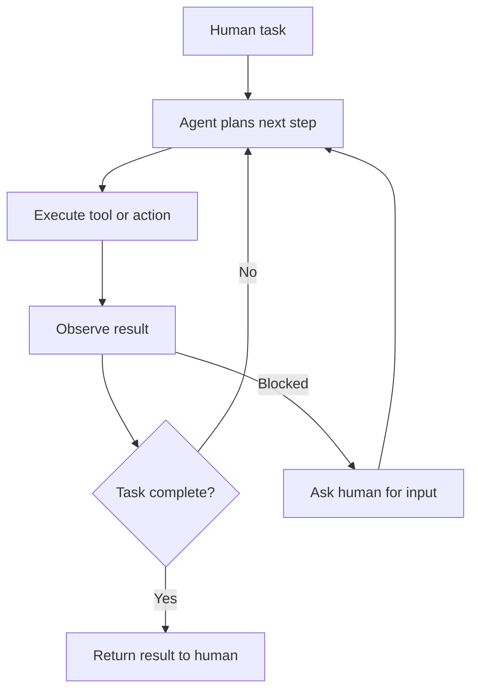

---
topic:
  - AI & ML
subtopic:
  - LLM
summary: "Systems where an LLM controls part of the workflow, calling tools, making decisions, or directing other LLMs."
tags:
  - FolderNote
publish: true
level:
  - '3'
status: Creation
priority: High
---

An agentic system is any system where an LLM controls part of the workflow — calling tools, making decisions, or directing other LLMs. The term "agent" gets used loosely, but there is a practical distinction that matters for system design:

- **Workflows** are systems where LLMs and tools are orchestrated through predefined code paths. The developer controls the sequence; the LLM handles individual steps.
- **Agents** are systems where the LLM dynamically directs its own process and tool usage, deciding what to do next based on results so far.

Most production systems that people call "agents" are actually workflows — and that is the right choice. The most effective agentic systems use the simplest pattern that solves the problem. Start with a single LLM call with good prompting and retrieval. Add workflow orchestration when that falls short. Reach for autonomous agents only when the task is genuinely open-ended and unpredictable.

An agent is where the four steering disciplines of the [[Home/AI & ML/LLM/LLM|engineering ladder]] come together: precise instructions ([[Home/AI & ML/LLM/Prompt Engineering/Prompt Engineering|Prompt Engineering]]), a curated window ([[Context Engineering]]), a capability surface ([[Harness Engineering]] — [[Tools]] and [[Model Context Protocol|MCP]]), and a controlled runtime ([[Loop Engineering]] — the [[Agent Loop]] and [[Multi-Agentic Systems|multi-agent topologies]]). This note covers the integration: when to assemble those pieces into a workflow versus an autonomous agent, and which orchestration pattern fits. Measuring the result is [[Home/AI & ML/LLM/Agents/Evaluation/Evaluation|Agent Evaluation]].

```datacorejsx
const { FolderStructureMap } = await dc.require("Assets/components/devbook-folder-map.jsx");
return FolderStructureMap;
```

# The Augmented LLM

The building block of every agentic system is an LLM enhanced with retrieval, [[Tools]], and memory. The model generates its own search queries, selects appropriate tools, and decides what information to retain. Before building multi-step systems, invest in making this single building block work well — choose the right model, tune the prompts, and ensure tools have clear, well-documented interfaces.

[[Model Context Protocol|Model Context Protocol (MCP)]] standardizes how an augmented LLM connects to external tools and data sources.

# Workflow Patterns

When one augmented LLM is not enough but full autonomy is overkill, five reusable workflow patterns cover the middle ground — **prompt chaining**, **routing**, **parallelization**, **orchestrator-workers**, and **evaluator-optimizer**. They form a progression of increasing complexity; start with the simplest that solves the problem. Orchestrator-workers, where the subtasks are decided at runtime, is the dominant pattern for complex coding and research and the bridge into [[Multi-Agentic Systems]].

See [[Home/AI & ML/LLM/Agents/Workflow Patterns|Workflow Patterns]] for the full catalog — each pattern with its diagram and when-to-use guidance.

# Autonomous Agents

When the task is genuinely open-ended — you cannot predict the number of steps, and no fixed workflow covers the problem — use an autonomous agent. An agent is an LLM using tools in a loop: observe results, decide next action, execute, repeat.



Agents are powerful but come with higher costs and compounding error risk. Each step that goes slightly wrong can push the agent further off track. Three principles from production experience:

1. **Simplicity** — keep the design minimal. Complex agents are harder to debug and more prone to cascading failures.
2. **Transparency** — show the agent's planning and reasoning steps explicitly. When something fails, you need to see where and why.
3. **Tool quality** — invest as much effort in tool interfaces (documentation, error messages, parameter design) as in prompts. Think of it as designing an API for a junior developer — if the tool is ambiguous to use, the agent will misuse it.

Where agents work well today: coding tasks (verifiable via tests), customer support (measurable via resolution), and research tasks (structured by sources). The common thread is clear success criteria and feedback loops that let the agent assess its own progress. Measuring those criteria rigorously — task success, trajectory quality, tool-call correctness, and reliability across stochastic runs — is [[Home/AI & ML/LLM/Agents/Evaluation/Evaluation|Agent Evaluation]].

For patterns on coordinating multiple agents, see [[Multi-Agentic Systems]].

# Questions

> [!QUESTION]- When should you use a workflow instead of an autonomous agent?
> - Use a workflow when the task decomposes into predictable steps with clear inputs and outputs at each stage
> - Workflows are cheaper, faster, and more debuggable than autonomous agents
> - Use an autonomous agent only when steps are unpredictable, the task is open-ended, and you have feedback mechanisms (tests, eval criteria) to catch errors
> - Most production "agents" are actually workflows — and that is the right choice for the majority of use cases
> - Key tradeoff: workflows trade flexibility for reliability; agents trade reliability for adaptability

> [!QUESTION]- Why do autonomous agents accumulate error, and how do you bound it?
> Each step an agent takes is conditioned on the output of the last one, so a small early mistake — a misread tool result, a wrong assumption — gets carried forward and compounds, pushing the agent further off track with every loop. That compounding is the main reason to prefer a workflow when you can: fixed code paths don't drift. When you do need autonomy, you bound the damage with hard iteration caps, explicit gates that validate progress before continuing, transparency into the planning steps so you can see where it went wrong, and a human-in-the-loop escape hatch when the agent is blocked. The throughline is feedback: the agent needs a way to catch its own drift before it cascades.

> [!QUESTION]- What makes a task a good fit for an autonomous agent?
> Two things together: the task is genuinely open-ended — you can't predict the number of steps or write a fixed workflow for it — and it has a clear, checkable success signal the agent can use to judge its own progress. That's why coding works (tests pass or fail), customer support works (the issue is resolved or not), and research works (claims trace back to sources). Tasks with vague or delayed success criteria are where agents flail, because there's no feedback to correct the compounding error. If you can't define what "done" and "correct" look like in a way the system can check, the task isn't ready for an agent yet.

# References

- [Building Effective Agents (Anthropic Engineering)](https://www.anthropic.com/engineering/building-effective-agents) — the source of the workflow-pattern taxonomy and the "simplest pattern that works" principle.
- [Patterns for Basic Agent Workflows — cookbook (Anthropic)](https://platform.claude.com/cookbook/patterns-agents-basic-workflows) — runnable implementations of chaining, routing, and parallelization.
- [Multi-Agent Research System — Engineering (Anthropic)](https://www.anthropic.com/engineering/multi-agent-research-system) — production orchestrator-workers system, including the 90.2% single-agent comparison.
- [Claude Agent SDK — overview and patterns (Anthropic)](https://platform.claude.com/docs/en/agent-sdk/overview)
- [Microsoft Agent Framework — Overview (Microsoft Learn)](https://learn.microsoft.com/en-us/agent-framework/overview/)
- [Semantic Kernel to Agent Framework Migration Guide (Microsoft)](https://learn.microsoft.com/en-us/agent-framework/migration-guide/from-semantic-kernel/)
