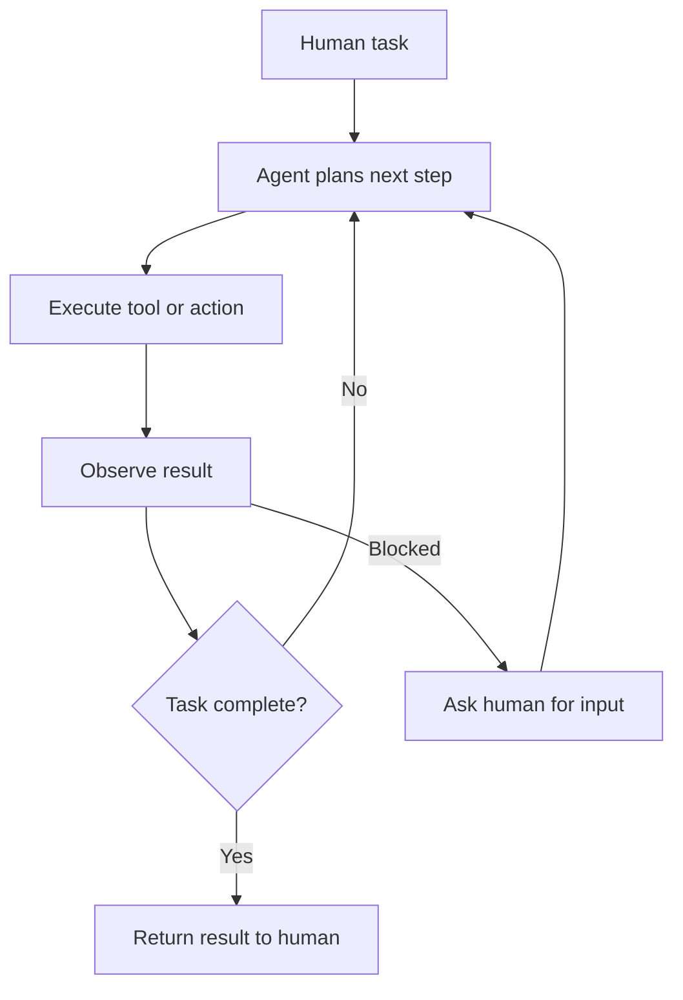

---
topic:
  - AI & ML
subtopic:
  - LLM
summary: "Systems where an LLM controls part of the workflow, calling tools, making decisions, or directing other LLMs."
tags: [FolderNote]
publish: true
level:
  - "3"
status: Creation
priority: High
---

An agentic system gives an LLM control over part of a workflow: calling tools, making decisions, or directing other LLMs. The term "agent" is used loosely, so system design starts with one practical boundary:

- **Workflows** are systems where LLMs and tools are orchestrated through predefined code paths. The developer controls the sequence. The LLM handles individual steps.
- **Agents** are systems where the LLM dynamically directs its own process and tool usage, deciding what to do next based on results so far.

Most production systems described as agents are workflows. That is usually the right choice. A single LLM call with good prompting and retrieval is the simplest starting point. Workflow orchestration belongs next, once a single call falls short. Autonomous agents earn their extra complexity only when the task is genuinely open-ended and unpredictable.

An agent joins the four steering disciplines of the [[Home/AI & ML/LLM/LLM|engineering ladder]]: precise instructions ([[Home/AI & ML/LLM/Prompt Engineering/Prompt Engineering|Prompt Engineering]]), a curated window ([[Home/AI & ML/LLM/Context Engineering/Context Engineering|Context Engineering]]), a capability surface ([[Home/AI & ML/LLM/Harness Engineering/Harness Engineering|Harness Engineering]] — [[Tool Design]] and [[Model Context Protocol|MCP]]), and a controlled runtime ([[Home/AI & ML/LLM/Loop Engineering/Loop Engineering|Loop Engineering]] — the [[Agent Loop]] and [[Multi-Agentic Systems|multi-agent topologies]]). The design question is how much control to place in code and how much to give the model. Measuring the result is [[Home/AI & ML/LLM/Agents/Evaluation/Evaluation|Agent Evaluation]].

```datacorejsx
const { FolderStructureMap } = await dc.require("Assets/components/devbook-folder-map.jsx");
return FolderStructureMap;
```

# The Augmented LLM

Every agentic system starts with an LLM enhanced with retrieval, [[Tool Design|tools]], and memory. The model can generate search queries and choose tools. The surrounding runtime persists selected state and supplies it to later model calls. This component should work well before orchestration is added. Model choice, prompts, and clear tool contracts usually matter more than another control layer.

[[Model Context Protocol|Model Context Protocol (MCP)]] standardizes how an augmented LLM connects to external tools and data sources.

# Workflow Patterns

When one augmented LLM is not enough and full autonomy is excessive, five workflow patterns cover the middle ground: **prompt chaining**, **routing**, **parallelization**, **orchestrator-workers**, and **evaluator-optimizer**. The first pattern that fits is usually enough. Orchestrator-workers decides subtasks at runtime, making it a useful bridge into [[Multi-Agentic Systems]] for complex coding or research.

[[Home/AI & ML/LLM/Agents/Workflow Patterns|Workflow Patterns]] describes each pattern, its control flow, and the conditions that make it fit.

# Autonomous Agents

Autonomy fits tasks whose steps cannot be predicted and whose control flow cannot be expressed as a fixed workflow. The model uses tools in a loop: observe the latest result, choose an action, execute it, and repeat.


```mermaid
flowchart TD
    H[Human task] --> A[Agent plans next step]
    A --> T[Execute tool or action]
    T --> E[Observe result]
    E --> C{Task complete?}
    C -->|No| A
    C -->|Yes| R[Return result to human]
    E -->|Blocked| HI[Ask human for input]
    HI --> A
```

That flexibility costs more model calls and introduces compounding error. A small mistake can become the premise for every later step. Three design principles contain the risk:

1. **Simplicity** — keep the control loop small. Extra branches make failures harder to isolate.
2. **Transparency** — record decisions, tool calls, results, and validation outcomes. A useful trace shows where the run diverged without depending on hidden model reasoning.
3. **Tool quality** — treat tool descriptions, parameters, errors, and outputs as an API contract. Ambiguous tools produce ambiguous actions.

Agents work best when progress is observable. Tests constrain coding tasks, resolution criteria constrain support work, and cited evidence constrains research. Without a checkable success signal, the loop has no reliable way to distinguish progress from drift. Measuring task success, trajectory quality, tool-call correctness, and reliability across stochastic runs is [[Home/AI & ML/LLM/Agents/Evaluation/Evaluation|Agent Evaluation]].

For patterns on coordinating multiple agents, see [[Multi-Agentic Systems]].

# Questions

> [!QUESTION]- When does a workflow fit better than an autonomous agent?
> A workflow fits predictable steps with explicit inputs and outputs. Its fixed control flow is cheaper to run and easier to debug. Autonomy is justified when the steps are not known in advance and the system has a checkable success signal that can catch drift.

> [!QUESTION]- How does an autonomous agent accumulate error, and what bounds it?
> Each step consumes state produced by earlier steps, so one bad assumption can shape the rest of the run. Iteration caps bound cost, validation gates reject invalid progress, and an escalation path stops the loop when recovery needs outside input. Decision and tool traces make the original divergence visible.

> [!QUESTION]- What makes a task a good fit for an autonomous agent?
> The control flow must be genuinely open-ended, and progress must still be checkable. Tests, resolution criteria, or source-backed claims give the loop feedback. Vague or delayed outcomes do not. The agent can keep moving while getting further from the goal.

# References

- [Building Effective Agents (Anthropic Engineering)](https://www.anthropic.com/engineering/building-effective-agents)
- [Microsoft Agent Framework — Overview (Microsoft Learn)](https://learn.microsoft.com/en-us/agent-framework/overview/)
