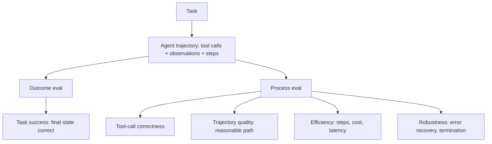

Evaluating an [[Home/AI & ML/LLM/Agents/Agents|agent]] means evaluating a *trajectory*, not a single answer. The agent chooses a tool, reads the result, and decides what to do next. Two runs can reach the same result by very different routes. A third can look reasonable for several steps and then fail. A final-answer score hides that difference. Agent evaluation separates the **outcome** (was the task completed?) from the **process** (was the route sound and efficient?).

Agent evaluation reuses the machinery in [[Home/AI & ML/LLM/Evaluation/Evaluation|LLM Evaluation]]: [[Building an Evaluation Set|building the task set]], applying [[Deterministic Checks]] to tool schemas and arguments, using [[LLM-as-a-Judge]] for semantic grading, and closing the [[Online Evaluation and AB Tests|online/A-B loop]]. The difference is the unit being scored. These checks operate over a sequence of actions rather than one model response.

```datacorejsx
const { FolderStructureMap } = await dc.require("Assets/components/devbook-folder-map.jsx");
return FolderStructureMap;
```

# What to Measure



- **Task success (outcome).** Check the resulting state, not the agent's claim about it. Assert the refund row, run the generated code against tests, or diff the written file. This is the closest thing to ground truth, but it says nothing about how the agent arrived there.
- **Tool-call correctness (process).** Check whether each tool was appropriate, its arguments were valid, and the call was needed. Schema and allowlist checks belong in [[Deterministic Checks]]. Judging necessity or tool choice often needs a reference trace or a rubric. [[Tool-Call Evaluation]] breaks this down into selection, arguments, validity, and necessity.
- **Trajectory quality (process).** Inspect whether the trace follows a reasonable route. Wandering, repeated work, and lucky recovery from a bad branch matter even when the final state is correct. [[Trajectory Evaluation]] covers reference matching and rubric-based judgment for the whole trace.
- **Efficiency.** Record steps, token cost, and wall-clock latency per task. Fourteen calls for work that normally takes four is a regression even if both runs succeed. More steps also create more places for the run to go wrong.
- **Robustness and termination.** Inject tool failures and watch what happens. The agent must recover when recovery is possible and stop when the task is complete. Track loops, oscillation, and step-cap hits directly. A one-shot evaluation cannot expose them.

Average success hides shaky behavior. A task that passes 6 runs out of 10 is materially different from one that passes every time, although either can look perfect in a single demo. Run each task `k` times and report the share solved on *all* attempts, using a pass^k-style reliability metric alongside the mean pass rate.

[[Agent Benchmarks]] explains what public suites such as SWE-bench, tau-bench, GAIA, and WebArena actually measure. Those scores are useful orientation, though they rarely predict performance on a private toolset and task distribution.

# Example

A per-task scorecard for a customer-support agent (one task, run k=5 times):

```text
Task: "Refund the damaged item on order #4815 and email the customer"

Outcome (verifiable end state):
- refund_issued(order=4815, amount=full)   -> assert DB row
- email_sent(to=customer, topic=refund)    -> assert outbox

Process (per trajectory):
- Tool-call validity: all calls schema-valid, no disallowed actions  (deterministic)
- Tool selection: used lookup_order before issue_refund               (judge / reference)
- Efficiency: 4 steps, $0.011, 3.2s   (budget: <=6 steps, <$0.02, <5s)
- Termination: stopped after success, no loop

Reliability: solved on 5/5 runs  (pass^5 = 1.0)
```

# Tradeoffs

| Approach | What it catches | Cost | When to rely on it |
| --- | --- | --- | --- |
| Outcome-only (verifiable end state) | Whether the task was completed | Low: one state assertion, no judge | Every task. It is strong evidence but blind to path quality |
| Reference-trajectory match | Deviation from a known route | High: reference traces require manual upkeep | Narrow tasks where one route genuinely dominates |
| LLM-as-judge over the trace | Whether the path and tool choices make sense | Medium: one judge call per trajectory | Open-ended tasks with several valid routes, calibrated against human labels |
| Efficiency / cost counters | Waste and looping | Very low: instrumentation only | Every task, paired with outcome checks |

Gate releases on **verifiable task success plus efficiency limits**. Both are cheap and objective. Add trajectory judgment when many routes are valid and the outcome cannot separate a clean solve from a lucky one. Hand-built reference traces belong only on narrow, high-stakes tasks. Maintaining them across a broad suite becomes its own project.

# References

- [Trajectory evaluations -- reference-match and LLM-judge scoring of agent trajectories (LangSmith docs)](https://docs.langchain.com/langsmith/trajectory-evals)
