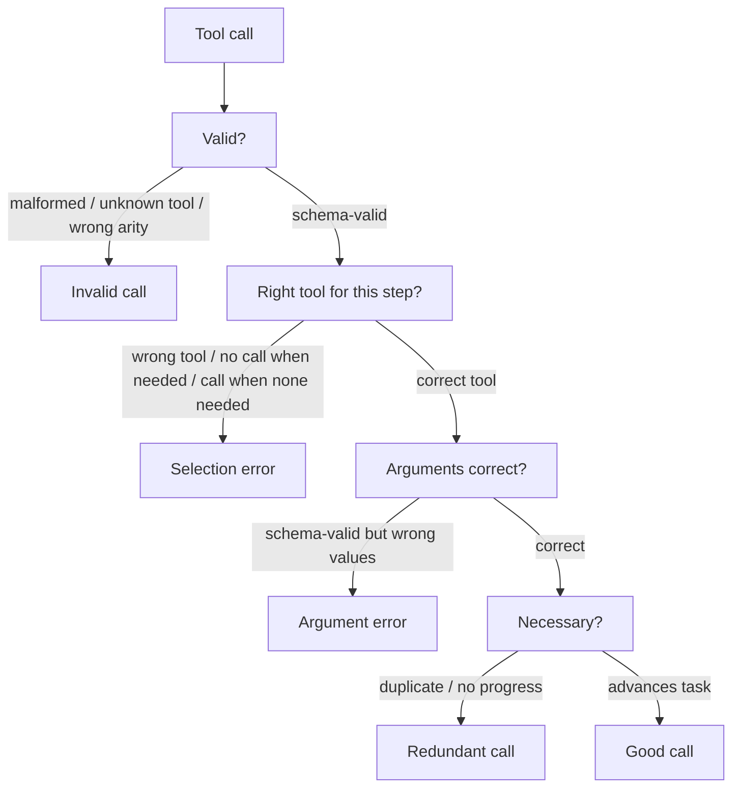

---
topic:
  - AI & ML
subtopic:
  - LLM
summary: "Scoring each agent tool call on four axes: right tool, correct arguments, valid call, and necessity."
level:
  - "3"
priority: High
status: Done
publish: true
---

A tool call is where an agent stops describing an action and asks a system to perform it. Failures at this boundary are concrete: the agent can name the wrong tool, send the wrong value in valid JSON, invent a function, or repeat a call that changed nothing.

Score four properties separately: validity, selection, arguments, and necessity. A combined "tool accuracy" number hides the repair. Selection failures usually point to routing or tool descriptions. Argument failures more often expose weak grounding or an unsafe schema.

This is the detailed version of tool-call correctness in [[Home/AI & ML/LLM/Agents/Evaluation/Evaluation|Agent Evaluation]]. A [[Deterministic Checks|deterministic check]] handles structure. An [[LLM-as-a-Judge|LLM judge]] or labeled reference handles decisions whose meaning depends on conversation state.

# What a Tool Call Can Get Wrong



- **Validity** asks whether the tool exists and whether its arguments parse against the schema. This check is deterministic and can run before execution.
- **Selection** asks whether the current state calls for this tool. It covers both needless calls and the opposite failure: answering from memory when fresh state was required.
- **Arguments** checks meaning after structure has passed. `order_id=4851` is valid JSON even when the conversation identifies order `4815`. Time zones and dropped search constraints fail the same way.
- **Necessity** checks whether the call advances the task. Repeating the same read against unchanged state raises cost and often marks the start of a loop.

# Metrics

| Metric | What it measures | Scorer |
| --- | --- | --- |
| Invalid-call rate | Fraction of calls that are malformed, unknown, or schema-invalid | Deterministic |
| Tool-selection accuracy | Right tool chosen for the step (incl. correctly choosing *no* call) | Reference or judge |
| Argument match | Arguments equal the expected values — exact for ids/enums, semantic for free text | Reference (exact) + judge (semantic) |
| Redundant-call rate | Duplicate or no-progress calls per task | Deterministic (hash of tool+args) + judge |
| Calls-per-task | Total calls vs the minimum a clean solve needs | Counter |

Keep selection and argument accuracy separate. If selection is 95% and argument accuracy is 70%, the immediate problem is value grounding. Averaging them to 82.5% destroys that diagnosis.

# Ground Truth

Reference-based evaluation stores the expected `(tool, arguments)` for a step. Tool equality scores selection. Field comparison scores the arguments. Successful human or agent traces are usually better raw material than hand-written cases. This is the trace equivalent of deriving [[Retrieval Evaluation Sets|retrieval eval sets]] from known source evidence.

Reference-free evaluation starts with schema validation and exact-duplicate detection. A judge then reads the conversation and tool catalog to score selection or necessity. This works before labeled traces exist, but it is weak at catching a plausible value that differs from the real target by one digit.

# Example

Per-call scoring for one step of a support agent:

```text
State: user asked "refund my order, it arrived broken" (order #4815 in context)
Agent call: issue_refund(order_id="4851", amount="full")

- Valid:      yes (schema-valid, real tool)            [deterministic: PASS]
- Selection:  issue_refund is correct here             [reference: PASS]
- Arguments:  order_id 4851 != expected 4815           [reference: FAIL]
- Necessary:  yes, advances the task                   [PASS]

Verdict: schema-valid call, wrong target order — the failure deterministic
checks cannot see. Caught only because the reference pinned order_id=4815.
```

# Tradeoffs

| Scorer | Catches | Cost | Blind to |
| --- | --- | --- | --- |
| Deterministic schema check | Malformed calls, unknown tools, exact duplicates | Lowest — runs pre-execution | Semantically wrong arguments, wrong tool choice |
| Reference match | Wrong tool, wrong argument values | Medium — needs labeled traces | Valid alternate tools/paths the reference didn't list |
| LLM judge | Tool-choice reasonableness, necessity, semantic args | Highest — a judge call per step, plus judge bias | Subtle value errors a reference would pin exactly |

Run deterministic validity checks on every call. They are cheap and can block malformed requests before execution. Add reference matching to tools where a wrong value is expensive, such as payments or deletion. A judge fits open-ended selection and necessity decisions, provided its scores are calibrated against human labels. Otherwise it may reward a longer trace simply because the trace looks more thorough.

# Pitfalls

## Exact Argument Match Flags Semantically-equal Values

String equality marks `"refund the full amount"` wrong against `"full refund"`, even though the action is identical. Exact matching belongs on identifiers, enums, and booleans. Natural-language fields need normalization or a semantic scorer.

## Order-sensitive Scoring Punishes Valid Reorderings

An exact reference sequence penalizes harmless reordering of independent reads. Compare those calls as a set. Order becomes part of correctness only when one call establishes a precondition for the next, such as looking up an order before issuing its refund.

## Schema-valid Hides Semantically Wrong

The riskiest call may be perfectly valid: real tool, valid schema, wrong account. Structural checks should be paired with reference or semantic argument checks. Irreversible actions also need confirmation or a dry run at the execution boundary.

# Questions

> [!QUESTION]- Why tool selection and argument accuracy remain separate metrics?
> They fail for different reasons. A wrong tool suggests routing or description problems. A correct tool with a wrong value suggests grounding or schema problems. A blended score can hide a 95%/70% split and send engineering effort toward the healthy axis. Structured fields can use exact references, while free text usually needs a semantic scorer.

# References

- [Berkeley Function-Calling Leaderboard -- AST and executable accuracy for tool/function calls, including irrelevance detection (Gorilla, UC Berkeley)](https://gorilla.cs.berkeley.edu/blogs/8_berkeley_function_calling_leaderboard.html)
- [Tool use (function calling) overview (Anthropic Docs)](https://platform.claude.com/docs/en/agents-and-tools/tool-use/overview)
