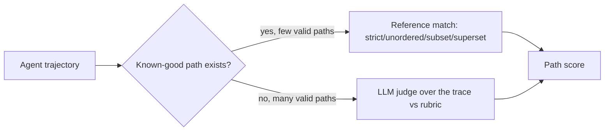

---
topic:
  - AI & ML
subtopic:
  - LLM
summary: "Scoring the whole path an agent took via reference-trajectory match or an LLM judge over the trace."
level:
  - "3"
priority: High
status: Done
publish: true
---

Trajectory evaluation scores the path from task to result: tool calls, observations, and intermediate decisions in order. Outcome scoring cannot distinguish a four-step solve from a lucky recovery after six wrong calls. [[Tool-Call Evaluation|tool-call scoring]] can flag individual mistakes, but it does not explain whether the sequence as a whole was sensible.

Two scorer families cover that gap. Reference matching compares the trace with a known-good path. A trace judge reads the transcript against a rubric. The second approach reuses [[LLM-as-a-Judge]] machinery, but feeds it agent decisions instead of a final answer.

# Reference-trajectory Match

A reference path records the calls a correct solve should contain. The comparison mode defines how much variation remains valid:

- **Strict** requires the same tools, arguments, and order. It fits a task with one valid procedure.
- **Unordered** requires the same calls but ignores order. It fits independent reads.
- **Subset** requires every agent call to belong to the allowed reference set (`agent ⊆ reference`). It is useful for safety boundaries, such as proving a read-only task never invoked a write tool.
- **Superset** requires every reference step to appear in the trace (`agent ⊇ reference`) while allowing exploration. It proves that required work happened.

Reference matching is cheap and objective once the paths exist. Its coverage is narrow. An unanticipated but correct solution fails, while a bloated superset trace passes as long as the required calls appear somewhere.

# LLM-as-judge over the Trace

When many paths can work, a judge can score the transcript against a rubric covering plan quality, tool choice, wasted work, and recovery. This captures reasoning that no fixed path can enumerate. It costs a model call per trajectory, and long traces amplify the judge's position and verbosity biases.



# Step-level Vs Episode-level

Episode-level scoring assigns one verdict to the run. It is cheap enough for a release gate, but a failure only says the path was bad.

Step-level scoring asks whether each next action made sense given the state at that point. It localizes the first bad decision and the recovery that followed. The price is one judgment per step plus enough running context to judge it. A practical setup gates every run at episode level, then expands failed or high-risk traces into step-level analysis.

# Example

Two evaluations of the same support task, run as reference-match plus judge:

```text
Reference (superset mode): {lookup_order, issue_refund, send_email} must all appear

Agent A path: lookup_order -> issue_refund -> send_email
  - Superset match: PASS (all required present)
  - Judge (1-5): 5  "minimal, correct order, no wasted calls"

Agent B path: search_orders -> lookup_order -> lookup_order -> issue_refund -> send_email
  - Superset match: PASS (all required present)   <- match alone hides the waste
  - Judge (1-5): 3  "redundant lookup_order, unnecessary initial search"

Same outcome, same superset verdict; the judge separates the clean path from the wasteful one.
```

# Tradeoffs

| Approach | Catches | Cost | Breaks when |
| --- | --- | --- | --- |
| Reference match (strict) | Any deviation from the one correct path | Lowest to run | More than one valid path exists |
| Reference match (subset/superset) | Missing required work / out-of-bounds actions | Low | Path quality within bounds (bloat, detours) |
| LLM judge over the trace | Plan quality, redundancy, recovery | High — judge call per run, long context | Traces exceed the judge's reliable context window |

Use reference matching when the valid procedures are few and knowable. Subset mode is especially effective as a hard safety gate because forbidden tools fail deterministically. Use a judge when decomposition is open-ended. In either case, keep outcome and efficiency metrics from [[Home/AI & ML/LLM/Agents/Evaluation/Evaluation|Agent Evaluation]] beside the path score. A polished trajectory that missed the task is still a failure.

# Pitfalls

## Reference Brittleness Penalizes Valid Alternate Paths

A strict match can reject a correct solve because it used `search` followed by `filter` instead of one `query`. At that point the metric measures conformity to the author’s path. Unordered or superset matching fits bounded alternatives. A judge fits tasks where valid decompositions cannot be listed.

## Judge Degrades on Long Traces

Long transcripts make trace judges less reliable. Middle steps receive less attention, first and last actions become anchors, and verbose agents can look more deliberate than concise ones. Chunk or switch to step-level scoring when trace length passes the range where the judge has been validated against human labels. Agreement on short traces does not establish that boundary.

## Outcome Leakage Inflates Path Scores

Visible task success can make a judge rationalize a messy path. Hide the outcome from the trajectory scorer or evaluate path and outcome in separate calls. Otherwise a lucky recovery becomes evidence of good process.

# Questions

> [!QUESTION]- When is reference matching a better trajectory scorer than an LLM judge?
> Reference matching fits tasks with a small set of knowable procedures. It is cheap, objective, and can enforce hard boundaries: subset mode proves the agent stayed within an allowed tool set, while superset mode proves required calls occurred. A judge becomes necessary when valid decompositions are too numerous to enumerate, but it adds cost and long-context bias.

# References

- [Trajectory evaluations -- reference-match modes and LLM-judge scoring of agent trajectories (LangSmith docs)](https://docs.langchain.com/langsmith/trajectory-evals)
- [AgentBench -- evaluating LLMs as agents across eight interactive environments (Liu et al., 2023)](https://arxiv.org/abs/2308.03688)
