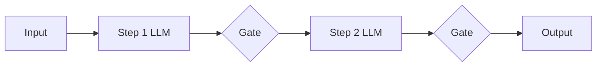
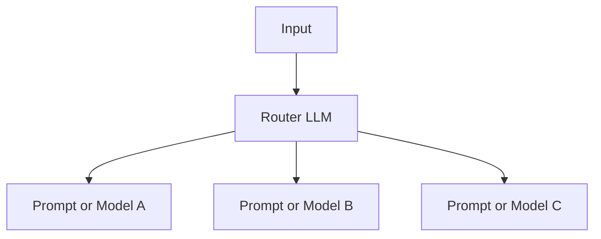
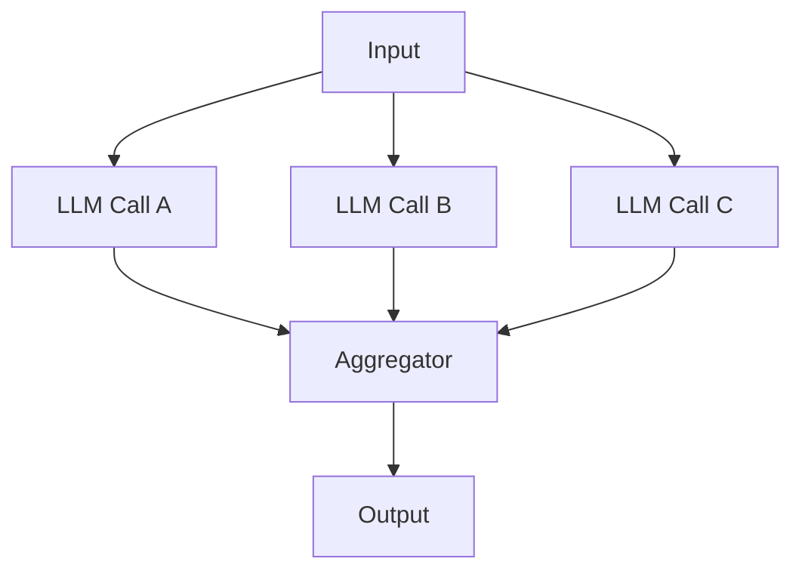
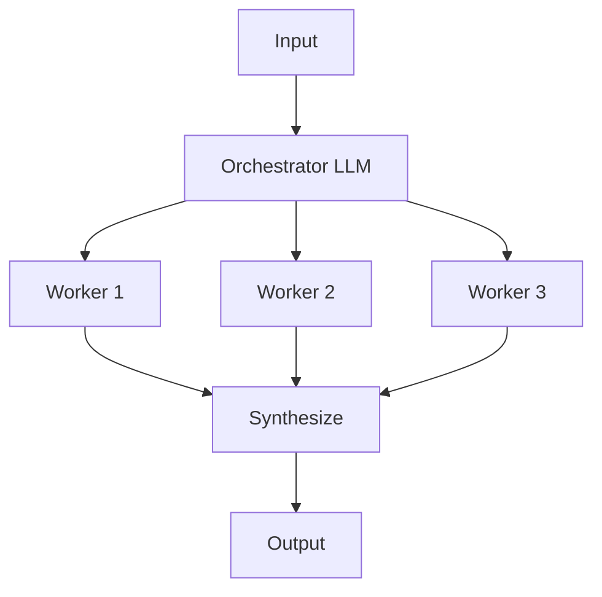
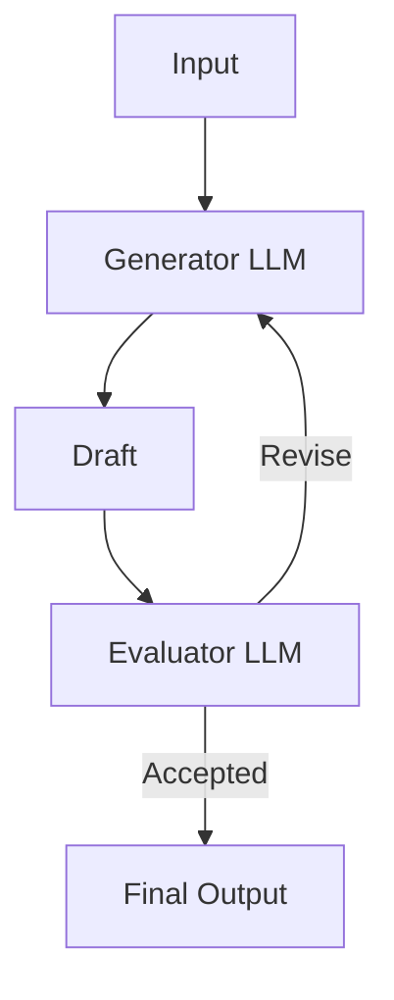

---
topic:
  - AI & ML
subtopic:
  - LLM
summary: "Five orchestration patterns — chaining, routing, parallelization, orchestrator-workers, evaluator-optimizer — from fixed pipelines to dynamic delegation."
level:
  - "3"
priority: Medium
status: Creation
publish: true
---

Five workflow patterns cover the space between one [[Home/AI & ML/LLM/Agents/Agents|augmented LLM]] call and an autonomous loop. Application code still owns the outer control flow. The model handles bounded decisions inside it. This middle of the [[Home/AI & ML/LLM/Agents/Agents|agentic]] spectrum is usually easier to test and operate because the allowed paths remain visible.

The patterns differ in where the next step is chosen. Prompt chaining fixes every stage in code. Routing chooses among predefined branches. Parallelization fixes the work but runs it concurrently. Orchestrator-workers lets a model decide the decomposition at runtime, while evaluator-optimizer adds a feedback loop. The smallest pattern that solves the task is normally the most reliable one.

## Prompt Chaining

Prompt chaining passes one model output into the next fixed stage. Programmatic gates between calls reject a bad intermediate result before it contaminates later work.

It fits tasks with a stable sequence, such as drafting an outline, validating required sections, and expanding the accepted outline. Chaining adds latency, so it earns its place only when narrower calls or early gates improve reliability.

## Routing

Routing classifies the input and sends it to one predefined path. Each branch can use a different prompt, tool set, or model. A refund path can become stricter without changing general question answering. Applying the same decision to model choice produces [[Home/AI & ML/LLM/Model Selection and Routing|model routing]].

It fits distinct categories with different handling. General questions might use a small model, technical cases a larger one, and refunds a constrained workflow with explicit policy checks. The router now becomes a failure boundary: a perfect specialist cannot recover a request sent to the wrong branch.

## Parallelization

Parallelization starts several model calls together and combines their outputs. Sectioning assigns independent pieces of work to different calls. Voting runs the same decision more than once and aggregates the answers.

It reduces wall-clock time when subtasks are independent, for example separate code-review concerns. Voting can reduce variance when disagreement is meaningful. Both variants spend more tokens, and sectioning fails when workers silently depend on shared intermediate state.

## Orchestrator-Workers

An orchestrator reads the task, decides how to decompose it, delegates the pieces, and synthesizes the results. The worker count and assignments do not exist until runtime. That is the boundary from parallelization, where application code defines every branch in advance.

Anthropic reports this design in its Research system: a lead agent starts three to five subagents in parallel and improved an internal research evaluation by 90.2% over a single-agent setup. The number belongs to that system and evaluation, not to the pattern in general. Runtime decomposition makes orchestrator-workers useful for complex coding or research, and it is the simplest pattern here that crosses into [[Multi-Agentic Systems]].

## Evaluator-Optimizer

One model produces a draft and another evaluates it against explicit criteria. Rejected drafts return to the generator with feedback. Approval or an iteration cap ends the loop.

This pattern fits work where feedback improves the output and the evaluator can recognize improvement. Code review and policy checking often qualify. A vague rubric produces a confident loop with no stable stopping condition, so both criteria and the cap are part of the design.

# Questions

> [!QUESTION]- Which control-flow decision separates the five workflow patterns?
> Prompt chaining fixes a sequence. Routing selects one predefined branch. Parallelization runs predefined work concurrently. Orchestrator-workers lets the model decide the tasks and worker count at runtime. Evaluator-optimizer repeats generation against an explicit acceptance test. The right choice is the first pattern whose control boundary matches the task. Extra model-owned decisions add latency and make failures harder to reproduce.

> [!QUESTION]- Why are orchestrator-workers harder to operate than ordinary parallelization even when their diagrams look similar?
> Parallelization starts a known set of calls, so coverage, cost, and aggregation can be tested ahead of time. An orchestrator chooses the decomposition and worker count from the input. That flexibility creates variable cost and new failure modes: missing work, overlapping assignments, or a synthesis that cannot reconcile the results. It also makes the pattern a bridge into [[Multi-Agentic Systems]], because the model controls the shape of the work.

# References

- [Building Effective Agents (Anthropic Engineering)](https://www.anthropic.com/engineering/building-effective-agents) — the source of this workflow-pattern taxonomy and the "simplest pattern that works" principle.
- [Patterns for Basic Agent Workflows — cookbook (Anthropic)](https://platform.claude.com/cookbook/patterns-agents-basic-workflows) — runnable implementations of chaining, routing, and parallelization.
- [Multi-Agent Research System — Engineering (Anthropic)](https://www.anthropic.com/engineering/multi-agent-research-system) — production orchestrator-workers system, including the 90.2% single-agent comparison.
