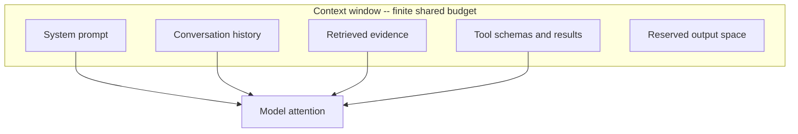

---
topic:
  - AI & ML
subtopic:
  - LLM
summary: "Deliberately deciding what fills the finite context window, and in what order, to maximize useful signal."
tags: [FolderNote]
level:
  - "2"
priority: High
status: Done
publish: true
---

Context engineering decides what the model sees and where it appears in the context window. Instructions compete with examples, retrieved evidence, conversation history, and tool traffic for the same finite budget. Once a system gains retrieval or memory, [[Home/AI & ML/LLM/Prompt Engineering/Prompt Engineering|Prompting]] is only one part of an assembled payload.

On the [[Home/AI & ML/LLM/LLM|engineering ladder]], context engineering sits between the instruction and the runtime around it. [[Home/AI & ML/LLM/Harness Engineering/Harness Engineering|Harness Engineering]] controls what the model can do. [[Home/AI & ML/LLM/Loop Engineering/Loop Engineering|Loop Engineering]] controls repeated behavior. Context engineering controls the material available for each decision.

The hard constraint is uneven attention inside a limited window. Models tend to use evidence near the beginning and end better than evidence buried in the middle. And answer quality can decline as otherwise relevant input grows, often called context rot. More context is therefore a poor default. The target is the smallest well-ordered context that still contains the evidence needed for the task.



Retrieval is the main way external evidence enters the window. [[Home/AI & ML/LLM/Context Engineering/RAG/RAG|RAG]] selects and ranks that evidence, then bounds how much of it reaches generation.

```datacorejsx
const { FolderStructureMap } = await dc.require("Assets/components/devbook-folder-map.jsx");
return FolderStructureMap;
```

# The Context Budget

The system prompt, conversation history, retrieved documents, tool schemas, tool results, and reserved output space all draw from one token budget. Account for them like memory allocations. When the total approaches the limit, choose what to remove before the runtime truncates an old instruction by accident.

Three costs are easy to miss:

- Output needs headroom. Budget `max_tokens` against what remains after the input. [[Generation]] cannot produce tokens that the context limit has already consumed.
- Tool schemas are sent as input. Names, descriptions, and parameter definitions can consume thousands of tokens before the first call. [[Tools]] covers the accuracy cost of oversized toolsets.
- History grows every turn. Reasoning, calls, and results quietly fill the window during long [[Agent Loop|agent loops]] unless the runtime compacts them.

# Techniques

**Ordering and positioning.** Put the strongest instructions and evidence where the model is most likely to use them, usually near the start or end. Ranked retrieval should place its best chunk first. This is the context-assembly side of [[Generation]].

**Selection over stuffing.** A few complete, relevant chunks usually beat a pile of fragments. [[Retrieval]] keeps the candidate set focused, while [[Re-ranking|Reranking]] spends extra work to choose what actually enters the prompt.

**Compaction.** Replace old turns with a short record of decisions, constraints, and pending work before history crowds out the task. Tool results should return only fields used by the next decision. [[Tools]] shows how oversized API payloads consume context without improving the next decision. [[Home/AI & ML/LLM/Loop Engineering/Loop Engineering|Loop Engineering]] turns token pressure into an explicit compact-or-stop condition.

**Structure.** Separate trusted instructions from untrusted data with explicit sections. That makes the payload easier to interpret and supports [[Guardrails|prompt injection]] defenses. [[Home/AI & ML/LLM/Prompt Engineering/Prompt Engineering|prompt anatomy]] supplies the smaller building blocks.

**Offloading.** Store bulky intermediate state outside the window and pass back a lightweight reference. A scratchpad or file can hold detail that is needed later but not on every turn. [[Multi-Agentic Systems]] uses the same idea for shared artifacts.

**Isolation.** Separate work when two concerns need conflicting instructions or large, unrelated toolsets. The context-centric decomposition in [[Multi-Agentic Systems]] keeps each worker's window focused, though coordination adds cost.

**Caching stable prefixes.** A repeated system prompt or fixed tool definition can stay logically present without paying full processing cost each time. [[Home/AI & ML/LLM/Context Engineering/RAG/Caching|Caching]] covers the key boundaries and invalidation risks.

# Pitfalls

## More Context, Worse Answers

**What goes wrong:** more retrieved documents or a longer system prompt lowers answer quality and raises latency.

**Why it happens:** useful evidence is diluted across the larger input, and some of it lands in the weakly attended middle. Irrelevant tokens still compete for attention.

**How to avoid it:** filter and rerank to a smaller set, then measure quality as context size changes. Stop adding tokens when they no longer improve the result.

## Unbounded History Growth

**What goes wrong:** a long run fills the window, after which the runtime drops old messages or rejects the request. The original instruction is often among the first things lost.

**Why it happens:** each iteration appends reasoning and raw tool output without compaction.

**How to avoid it:** cap tool-result size and track cumulative tokens per iteration. Compact or stop before the limit. [[Agent Loop]] traces how repeated oversized results become token explosion across iterations.

## Context Poisoning

**What goes wrong:** one hallucinated fact or injected instruction enters history and is replayed as trusted context on later turns.

**Why it happens:** the runtime replays history without a trust label, and natural-language errors carry no automatic warning.

**How to avoid it:** validate claims before storing them, keep untrusted content separate from instructions, and enforce controls in code. [[Guardrails]] should not depend on a poisoned prompt obeying itself.

## Tool-Schema Bloat

**What goes wrong:** attaching many tools inflates every request and makes selection less reliable.

**Why it happens:** many clients send every connected schema on every request, even when the task needs only one.

**How to avoid it:** expose only the tools needed for the current task, or use tool search to load them on demand. [[Tools]] covers the degradation seen with large toolsets.

# Tradeoffs

| Lever | What it buys | What it costs | Best when |
| --- | --- | --- | --- |
| Larger context window | More room before truncation | Higher cost, weaker attention, more latency | The task truly needs broad material at once |
| Retrieval + reranking | Dense and traceable evidence | Retrieval infrastructure and tuning | Knowledge-heavy tasks over a large corpus |
| History compaction | A bounded window over long sessions | Summary cost and possible detail loss | Long conversations and agent runs |
| Context offloading | Small working context with detail on demand | Extra reads and coordination | Multi-step work with bulky intermediate state |
| Context isolation (sub-agents) | A focused window for each concern | Coordination overhead and more total tokens | Conflicting instructions or oversized toolsets |

The smallest context that answers the task is the starting point. Retrieval and reranking control what enters, and compaction frees space before more capacity is added. Offloading or isolation becomes worthwhile only when one focused window cannot hold the work. Once extra context stops improving measured quality, it has become overhead.

# Questions

> [!QUESTION]- Why does adding more context often make answers worse, not better?
> Attention is uneven across a long window, so evidence buried in the middle may be underused. Added tokens also compete with the evidence already present, even when they are loosely relevant. Larger inputs cost more and take longer. The fix is signal density: keep fewer complete chunks, order them deliberately, and measure whether each increase in context improves the answer.

> [!QUESTION]- What are the main techniques for keeping a long-running agent's context under control?
> Track the token budget on every iteration. Select a small set of strong evidence and put the best material where the model will use it. Compact old turns, trim tool results to the fields needed next, and offload bulky state behind references. Isolation helps when concerns need conflicting context, but it adds coordination cost. The runtime should compact or stop before arbitrary truncation decides what disappears.

# References

- [Lost in the Middle: How Language Models Use Long Contexts (Liu et al., 2023)](https://arxiv.org/abs/2307.03172) — the U-shaped attention finding that motivates ordering and selection.
- [Effective context engineering for AI agents (Anthropic Engineering)](https://www.anthropic.com/engineering/effective-context-engineering-for-ai-agents) — practitioner guidance on context as a managed, finite resource for agents.
- [Context Rot: How Increasing Input Tokens Impacts LLM Performance (Chroma Research)](https://research.trychroma.com/context-rot) — empirical study showing quality degradation as context length grows.
- [Prompt caching (Anthropic Docs)](https://platform.claude.com/docs/en/build-with-claude/prompt-caching) — making stable context prefixes cheap to re-send.
- [Prompt engineering overview (Anthropic Docs)](https://docs.anthropic.com/en/docs/build-with-claude/prompt-engineering/overview) — the prompt-level building blocks that context engineering assembles.
