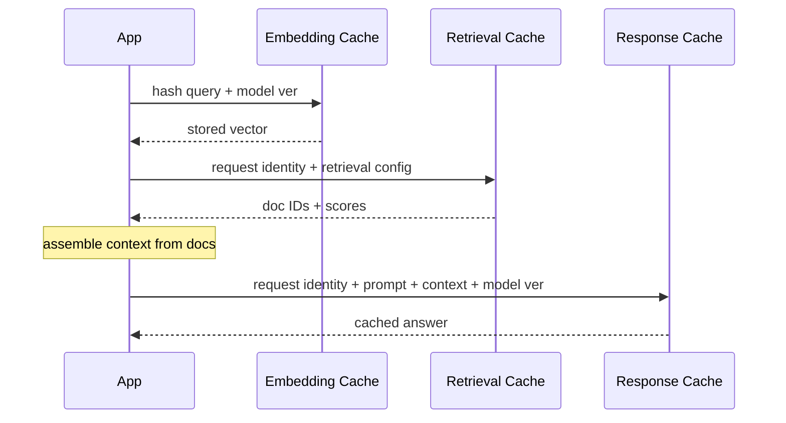
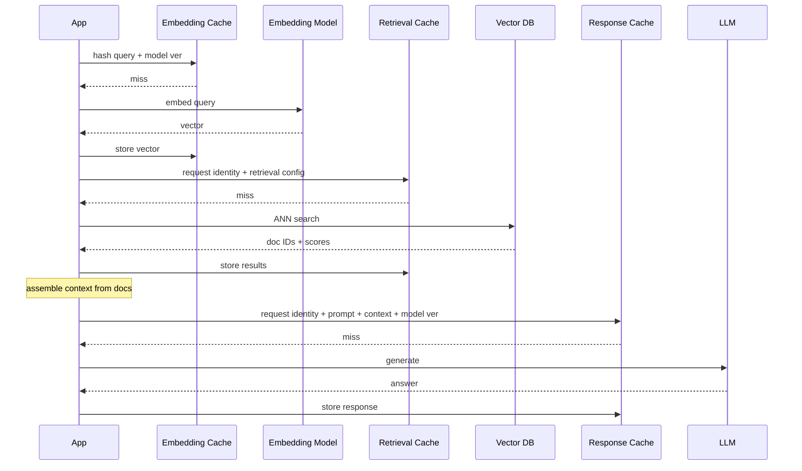

A RAG request can repeat the same expensive work: embed the query, search the index, and generate an answer. Caches remove that work only when their keys capture every input that affects the result.

That leads to a layered design. Embedding, retrieval, and response caches have different keys and invalidation rules. Treating them as one generic cache hides those differences and usually creates stale or unsafe hits.

For retrieval and response caches, correctness includes authorization. If the key omits permission context, one caller can populate an entry containing evidence that another caller is not allowed to see. Permission scope belongs in every key whose value depends on protected content.

Use one versioned request identity across those protected layers: canonical or translated query text plus its transformation version, tenant and authorization-context hash, embedding model and index versions, filters and top-k, and retriever/reranker configuration. A response key extends that identity with the prompt template, selected evidence, generation model, and conversation state when it changes meaning.

# Flow

## Cache Hit Diagram

## Cache Miss Diagram

# Embedding Cache

An embedding cache is a pure-function cache.

- Maps text to its vector representation so the embedding model is called at most once per unique input. At ingestion time, the cache prevents re-embedding unchanged chunks when the pipeline re-runs. At query time, it prevents re-embedding identical or previously seen queries.
- The key is `hash(text) + embedding_model_version`. The value is the vector. For a fixed model, the same input produces the same embedding.
- Long TTLs are safe because invalidation is structural: the cache entry becomes invalid only when the source text changes (new content hash) or the embedding model is swapped (new model version). Neither happens on a per-query basis.

It pays off in two places:

- High-volume ingestion pipelines where documents are re-processed frequently (nightly syncs, incremental updates). Without an embedding cache, every re-run re-embeds unchanged chunks at full cost.
- Query-heavy workloads with repeated identical or deterministically canonicalized queries. An exact hash does not match merely similar wording; semantic reuse is a separate cache with a different correctness risk.

The main failure mode is version drift.

- **Model version mismatch.** Without the model version in the key, an upgrade can return old vectors from a different embedding space. Similarity scores then lose meaning. Version the key and stop reading the old namespace after a model change.

# Retrieval Cache

A retrieval cache stores the ranked candidate list, not the source documents.

- Stores the candidate document IDs and their relevance scores for a given query, so the vector search and any reranking are skipped on cache hit. The cache sits between query embedding and context assembly.
- The key must cover the processed query and transformation version, embedding model and index versions, top-k, filters, tenant and authorization context, and retriever/reranker configuration. An omitted field can change the correct candidate list without changing the cache key.
- The value stays small: a list of `(document_id, score)` pairs. Full content remains in the document store.

This cache works best when queries repeat and the index changes slowly.

- Workloads with high query repetition and stable indexes. Customer support systems, internal knowledge bases, and documentation assistants often see the same questions repeatedly. If the index is rebuilt infrequently (daily or weekly), retrieval cache hit rates can be high.
- Systems where vector search latency or cost is the bottleneck. ANN search over large indexes (millions of vectors) can take tens of milliseconds per query. A cache hit returns in sub-milliseconds.

Two failures matter more than hit rate.

- **Stale results after index update.** Without an index version in the key, added or removed documents remain invisible to cached queries. Bump the version for every rebuild or incremental update.
- **Cross-tenant leakage.** If tenant ID or authorization context is missing from the key, a query from one tenant can populate the cache with results that a different tenant's query later receives. This is a data breach, not a staleness bug.

# LLM Response Cache

LLM response caching operates at two levels that solve different problems.

**Provider-level prompt caching (KV reuse).**

- OpenAI and Anthropic cache the key-value attention tensors computed during the prefill phase. When a new request shares a long prefix with a previous request (system prompt, few-shot examples, retrieved context), the provider skips recomputing attention for the cached prefix and starts generation from the first divergent token.
- OpenAI applies prompt caching automatically on supported models. The minimum cacheable prompt is model-dependent: 1,024 visible input tokens for GPT-5.6 and later, and 2,048 for older models, which may occasionally cache shorter prefixes. Retention behavior depends on the model and caching mode documented by the provider. Anthropic supports automatic caching through top-level `cache_control`, with a five-minute default and an optional one-hour duration, as well as explicit breakpoints for finer control.
- Savings are provider-specific. Anthropic prices cached prefix reads below ordinary input, while OpenAI discounts eligible cached input tokens. Current pricing belongs in provider documentation. In both cases, the prefix must be long, stable, and shared.

**Application-level response caching (exact or semantic match).**

- The application caches the final generated answer under the protected request identity plus the full generation input: system prompt, retrieved context, user query, generation model, and conversation state when relevant. On an exact cache hit, the LLM is not called at all.
- Semantic caching extends this by finding cache hits for queries that are similar but not identical. The cache stores the query embedding alongside the response. On a new query, it embeds the query, searches the cache by vector similarity, and returns the cached response if the similarity score exceeds a threshold.
- Semantic similarity is a weak correctness test. "What is the largest lake in Africa?" and "What is the second largest lake in Africa?" are close in meaning but require different answers. A loose threshold creates false hits. A tight one may make the cache pointless.

The safe uses are narrow.

- Provider-level caching benefits stable, long prompt prefixes and needs little application machinery.
- Application-level exact caching works for FAQ-style systems with high query repetition and stable retrieval context.
- Semantic caching is viable only when false-positive risk is low and the domain is narrow enough to calibrate a reliable similarity threshold. High-stakes domains (medical, legal, financial) should avoid semantic caching or use extremely tight thresholds.

Response caches fail when an input is missing from the key.

- **Response depends on mutable inputs.** Unlike embeddings (pure function of text + model), a response depends on the system prompt template, the retrieved evidence, the user's permissions, and the model version — all of which can change independently. A cached response becomes wrong when any of these change without invalidating the cache.
- **Semantic cache false positives.** A nearby query may still require a different answer. Calibrate thresholds on held-out data, include conversation state when it changes meaning, and monitor false-hit rate.

# Pitfalls

- **Cross-tenant leakage from missing authorization fields.** Without tenant ID and authorization-context hash, one caller's cached result can be served to someone without permission. Include both in keys that depend on protected content, then validate the tenant again on read.
- **Silent staleness when index version is not part of key.** Documents are added, updated, or deleted, but the retrieval cache keeps serving old candidate lists because the key does not change. Users see outdated or missing information with no error signal. Mitigation: include `index_version` in retrieval cache keys and bump it on every index rebuild or incremental update.
- **Over-caching LLM responses while source freshness changes quickly.** If the corpus updates frequently but the response-cache TTL is long, callers receive answers grounded in old evidence. Tie the TTL to source update frequency. Fast-changing data may justify caching embeddings and retrieval results without caching final answers.
- **Semantic cache threshold miscalibration.** Too loose a threshold returns wrong cached answers for different questions. Too tight a threshold reduces hit rate to near zero, making the cache infrastructure overhead for no benefit. Calibrate the threshold on a held-out set from the actual domain, start at the strictest candidate that meets the false-hit budget, and adjust only from measured results.

# Questions

> [!QUESTION]- Why should retrieval cache keys be based on processed query text instead of raw embeddings?
> Processed query text and its transformation version are readable, deterministic inputs. Raw embedding bytes change with the model and hide why two entries differ. A translation-version change should produce a new key, and the embedding model version still belongs in the retrieval key because it affects ranking.

> [!QUESTION]- Why is response caching riskier than embedding caching?
> A fixed text-and-model pair produces the same embedding. A response also depends on the prompt template, retrieved evidence, permissions, and generation model. Any of those can change independently, so a response key is easier to under-specify and harder to invalidate safely.

> [!QUESTION]- When is semantic caching safe to deploy, and when should it be avoided?
> Semantic caching is defensible when the domain is narrow, queries repeat, false positives have low cost, and a held-out set supports a stable threshold. It should be avoided when a wrong answer can cause harm, conversation state changes meaning, or no threshold separates safe reuse from false hits.

# References

- [Prompt caching (OpenAI API docs)](https://developers.openai.com/docs/guides/prompt-caching)
- [SemanticCache with RedisVL](https://redis.io/docs/latest/develop/ai/redisvl/0.7.0/user_guide/llmcache/)
- [Caching embeddings (LangChain integrations)](https://docs.langchain.com/oss/python/integrations/embeddings)
- [Semantic cache with Azure Cosmos DB](https://learn.microsoft.com/en-us/azure/cosmos-db/gen-ai/semantic-cache)
- [RAGOps: Operating and Managing RAG Pipelines](https://arxiv.org/abs/2506.03401)
