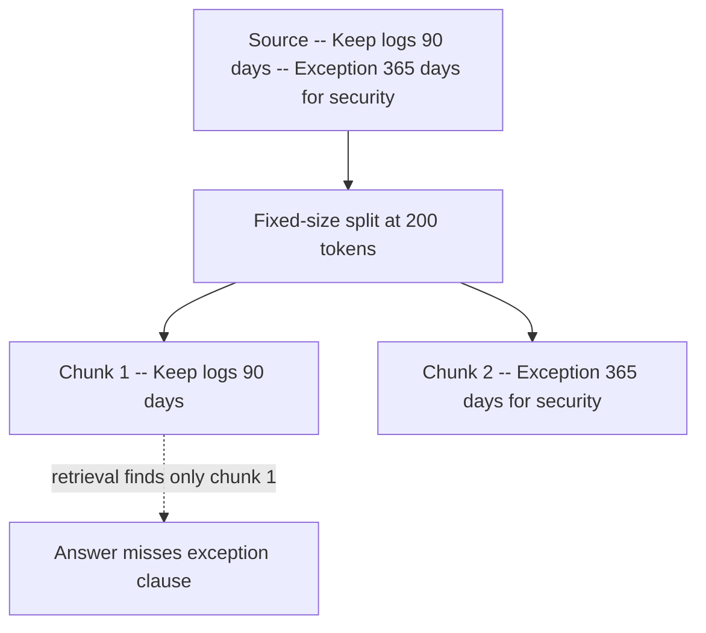
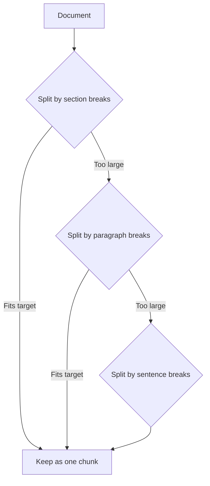
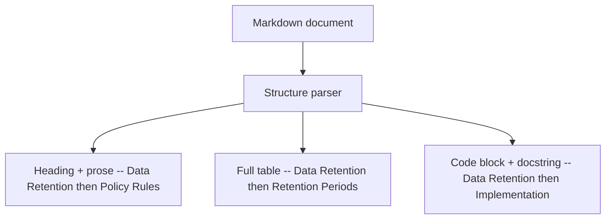
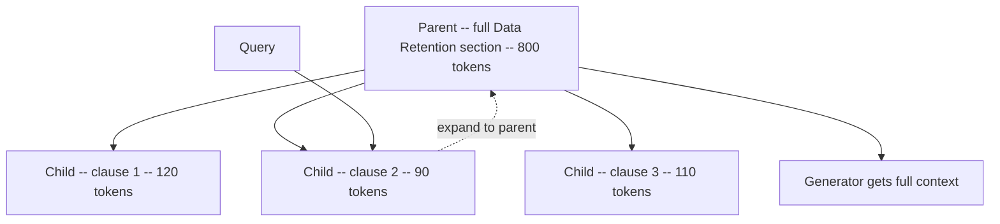
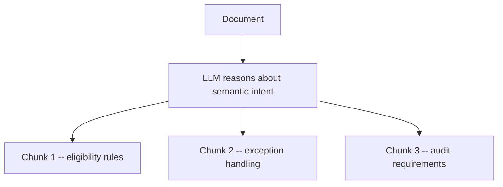

---
topic:
  - AI & ML
subtopic:
  - LLM
summary: "Sets the unit of retrieval: too wide adds noise, too narrow splits meaning."
level:
  - "2"
priority: High
status: Done
publish: true
---

Chunking sets the unit of retrieval. Large chunks carry more surrounding text but waste context on noise. Small chunks match precisely, yet can separate a rule from the condition that changes it. A useful chunk keeps one recoverable idea together and retains enough source metadata to trace it.

A policy might state, "Keep logs for 90 days. Exception: security investigations require 365 days." A raw character split can put the exception in another chunk. Retrieval finds the first fragment, and the answer quietly loses the condition that mattered.

# How to Choose a Strategy

Choose from observed retrieval failures. There is no universally best splitter.

| Observed evaluation failure | Start with | Why | Upgrade trigger |
| --- | --- | --- | --- |
| Split clauses, tables, or code blocks break answer correctness | Structure-aware | Preserves logical units and improves citation traceability | Parser misses important layouts or ingestion cost gets too high |
| Answers miss adjacent constraints even when relevant docs are found | Parent-child | Keeps retrieval precise while restoring broader synthesis context | Storage and orchestration overhead outweigh quality gains |
| Queries drift across topics inside long prose | Semantic | Places boundaries around topic shifts | Ingestion becomes too slow or unstable across model updates |
| Need a fast, predictable baseline now | Recursive | Better boundaries than fixed-size with low implementation cost | Quality plateaus on mixed-format or highly structured corpora |
| Tight latency and simple homogeneous corpus | Fixed-size | Most operationally predictable ingestion | Faithfulness drops from boundary cuts |

# Chunking Strategies

## Fixed-Size Chunking

Fixed-size chunking is the blunt baseline.

- Split every document into windows of N tokens (or characters) with a configurable overlap between adjacent windows. Every document follows the same split rule regardless of content structure.
- The overlap parameter controls how much context is shared between neighboring chunks. Typical values are 10-20% of chunk size. Zero overlap is fastest but maximizes the chance of splitting a sentence mid-thought.
- The work scales predictably with document size, and uniform chunks make capacity planning straightforward.

It fits when:

- A working baseline matters more than perfect boundaries.
- Homogeneous text corpora (blog posts, news articles) where documents have consistent structure and few tables or code blocks.

Its weaknesses are structural.

- **Boundary cuts through logical units.** A policy clause, code block, or table row gets split at an arbitrary token offset. The retriever returns a fragment that looks relevant but is incomplete, and the model generates a confidently wrong answer. Mitigate by increasing overlap and auditing retrieval on structured documents.
- **No awareness of document structure.** Headers, sections, and paragraphs are invisible to the splitter. A chunk may start mid-paragraph and end mid-sentence. This hurts both retrieval precision (partial matches) and generation quality (decontextualized evidence).

## Recursive Chunking

Recursive chunking adds boundary awareness without a document parser.

- Apply a hierarchy of separators from largest to smallest: section breaks (`\n# `), paragraph breaks (`\n\n`), sentence breaks (`. `), then character-level splits. At each level, try the largest separator first. Only recurse to smaller separators when a chunk still exceeds the target size.
- This preserves the largest coherent units possible. A short section stays as one chunk. A long section gets split at paragraph boundaries, not arbitrary offsets.
- LangChain provides `RecursiveCharacterTextSplitter` as its recommended generic-text splitter, with a separator hierarchy configurable for the document format. Other frameworks choose different defaults. LlamaIndex, for example, uses a sentence-oriented splitter.

It is a good fit for:

- Strong general-purpose default for mixed prose documents (wiki pages, runbooks, knowledge base articles).
- The first upgrade from fixed-size when format-specific parsers are not justified.

The separator hierarchy can still be wrong for the source format.

- **Tables and code blocks can still be split** if the separator hierarchy is text-centric. A markdown table has no `\n\n` between rows, so the splitter treats the whole table as continuous text and may cut mid-row. Add custom separators for table and code block delimiters, or pre-extract these as atomic units before recursive splitting.
- **Separator ordering is format-dependent.** The default hierarchy assumes markdown-style headings. HTML, PDF-extracted text, or Slack exports need different separator lists. A wrong hierarchy degrades to character-level splitting silently.

## Structure-Aware Chunking

Structure-aware chunking starts from the document's syntax tree or layout model.

- Parse headings, tables, code blocks, and list items as logical units. Each unit becomes a chunk with its structural context preserved.
- Different source formats need different parsers: markdown heading hierarchy, HTML DOM tree, PDF layout analysis (Unstructured, PyMuPDF), DOCX paragraph styles. The parser output is a sequence of typed blocks (heading + prose, table, code block, list).
- Each chunk inherits metadata from its structural ancestors: section title, heading path, document ID. This enables section-level filtering at retrieval time and improves citation traceability.

It earns its maintenance cost for:

- Documents where layout carries meaning: policies with clause/exception structure, API docs with endpoint/parameter tables, runbooks with step/command pairs, legal contracts with nested clauses.
- Corpora with heavy table or code content where recursive splitting consistently breaks structured elements.

The parser becomes part of retrieval correctness.

- **Parser drift across format versions.** A parser tuned for one markdown flavor may silently misparse another. When document sources change format (e.g., Confluence to Notion export), chunk boundaries degrade without visible errors. Version parsers per source type and run ingestion QA snapshots that compare expected vs actual chunk boundaries on sample documents.
- **Oversized chunks from large structural units.** A single section with 2000 tokens becomes one chunk that exceeds embedding model context or dilutes retrieval precision. Set a max chunk size and recursively split oversized blocks internally while preserving the structural metadata.
- **Parser complexity and maintenance.** Each document format needs its own parser or extraction pipeline. Budget for ongoing parser updates as source formats evolve.

## Semantic Chunking

Semantic chunking looks for topic changes in the text itself.

- Compute embedding similarity between adjacent text spans (sentences or small windows). Walk through the document and measure how semantically similar each span is to its neighbor. When similarity drops below a threshold, insert a chunk boundary at that point.
- The core assumption: spans that are semantically similar belong together, and a drop in similarity signals a topic shift. The boundary is placed where the content actually changes, not where a fixed window happens to end.
- Threshold selection is critical. Too aggressive (high threshold) fragments the document into single-sentence chunks. Too conservative (low threshold) produces oversized chunks that span multiple topics. Calibrate on a held-out evaluation set per corpus.

It helps most with:

- Long narrative text that changes topic without reliable headings: transcripts, meeting notes, email threads, unstructured knowledge base articles.
- Corpora where recursive splitting produces chunks that mix unrelated topics because the text lacks structural markers.

Its boundary rule depends on the embedding distribution.

- **Threshold instability.** The optimal threshold varies by embedding model, document domain, and even writing style. A threshold tuned on technical docs may over-fragment conversational text. Lock thresholds per corpus and re-evaluate when the embedding model changes.
- **Ingestion cost.** Every span needs an embedding call during chunking (not just at retrieval time). For large corpora, this can be significantly slower and more expensive than rule-based strategies. Batch embedding calls and cache results.
- **Embedding model sensitivity.** Different embedding models produce different similarity distributions for the same text. Switching models requires re-tuning thresholds and potentially re-chunking the entire corpus.

## Parent-Child Chunking

Parent-child chunking separates the search unit from the generation unit.

- Create small child chunks as precise retrieval units (100-200 tokens) and map them to larger parent spans (500-1000 tokens) from the source document.
- Retrieval searches the smaller children for precision. A match expands to its parent before generation, restoring context that the child alone may lack.
- The parent-child mapping is stored as metadata. Each child stores its parent ID. Expansion is a metadata lookup, not a second retrieval call.

It fits when:

- Domains where child-only retrieval is precise but answers consistently miss adjacent constraints or context. Common in policy docs (rule + exception), technical specs (parameter + constraint), and legal text (clause + condition).
- Answer completeness needs more context without changing the precise search unit.

Expansion can undo the precision gained by small children.

- **Parent expansion reintroduces noise.** If the parent span is too broad (entire document section), expanding to parent floods the context window with irrelevant content. Limit parent size and track citation precision before and after expansion.
- **Storage overhead.** Only child chunks need vector entries in the common design. Parents can live once in the document store, with each child carrying a parent ID. The extra cost is the child index, mapping metadata, and parent text retained for expansion; duplicating parents in the vector index is optional and increases the overhead.
- **Orchestration complexity.** The retrieval pipeline needs a post-retrieval expansion step that maps children to parents, deduplicates overlapping parents, and assembles final context. This adds latency and code to maintain.

## Agentic Chunking

Agentic chunking delegates boundary decisions to an LLM.

- Use an LLM to read the document and decide where to place chunk boundaries based on semantic intent, not fixed rules. The model reasons about document structure, identifies self-contained units of meaning, and outputs boundary positions with optional metadata tags.
- A fully agentic splitter lets the model decide every boundary. A less expensive hybrid starts with recursive candidates and asks the model only to merge or split them.
- Boundary decisions are non-deterministic. The same document can produce different chunks on re-processing unless the LLM's boundary decisions are cached and versioned alongside the prompts and model used.

The cost is defensible for:

- High-stakes domains where chunk quality directly affects business risk: medical guidelines, financial compliance, safety procedures. The marginal improvement in chunk quality justifies the higher ingestion cost.
- Documents with complex implicit structure that rule-based parsers cannot capture — e.g., narrative documents where the logical structure does not follow heading conventions.

The output is expensive and harder to reproduce.

- **Non-deterministic boundaries.** Re-running ingestion can produce different chunks, which breaks diff-based cache invalidation and makes regressions hard to reproduce. Cache boundary decisions, version the prompt and model, and treat chunk definitions as versioned artifacts.
- **Cost at scale.** Every document requires LLM inference during ingestion (not just at query time). For large corpora, this can be orders of magnitude more expensive than rule-based chunking. Budget accordingly and reserve for high-value documents.
- **Prompt sensitivity.** Small changes to the chunking prompt can shift boundaries across the corpus. Treat the prompt as production code: version it, test it on a sample set, and monitor chunk quality metrics after changes.

# Practical Baselines

- Recursive chunking at 300-800 tokens with 10-20% overlap is a reasonable baseline, not a universal optimum.
- Track per-source retrieval failure modes before switching strategy. Aggregate metrics hide format-specific problems — a retriever can perform well on prose while consistently breaking on table-heavy docs.
- Store the source document ID, section path, ingestion timestamp, and ACL scope with each chunk. Adding this during ingestion is cheaper than reconstructing it later.
- Re-evaluate strategy when corpus format changes (e.g., prose-heavy docs to table-heavy docs) or when retrieval metrics plateau despite query translation improvements.

# Tradeoffs

| Strategy | Retrieval precision | Ingestion cost | Implementation complexity | Best corpus type |
| --- | --- | --- | --- | --- |
| Fixed-size | Low — arbitrary cuts split logical units | Lowest — no parsing, constant throughput | Trivial — one parameter (window + overlap) | Homogeneous prose with uniform structure |
| Recursive | Medium — respects paragraph/sentence boundaries | Low — rule-based, no model calls | Low — configurable separator list per format | Mixed prose without heavy tables or code |
| Structure-aware | High — preserves tables, code, clauses as atomic units | Medium — requires format-specific parsers | Medium-High — one parser per source format, ongoing maintenance | Documents where layout carries meaning (policies, API docs, contracts) |
| Semantic | High — boundaries align with actual topic shifts | High — embedding call per span during ingestion | Medium — threshold tuning per corpus and embedding model | Long narrative text without reliable structural markers |
| Parent-child | High (child precision + parent context expansion) | Medium — child indexing, parent storage, metadata mapping | Medium — retrieval pipeline needs expansion and deduplication step | Domains where answers depend on adjacent constraints (policy, legal, specs) |
| Agentic | Task-dependent — can preserve implicit semantic units | Highest — LLM inference per document at ingestion | High — prompt versioning, non-deterministic output, caching infra | High-stakes documents where measured gains justify model-driven boundaries |

The table describes steady-state behavior. A practical rollout starts with recursive chunking, records failures by source type, and replaces only the splitter responsible for those failures. Agentic precision must beat that corpus baseline in held-out retrieval evaluation; model-selected boundaries are not inherently more accurate.

# Questions

> [!QUESTION]- Why does parent-child chunking often improve answer completeness over child-only retrieval?
> Small children give the retriever a precise target, but a child may omit an adjacent exception or prerequisite. Expanding a match to its parent restores that surrounding evidence before generation. The price is more context and possibly more noise, so parent size still needs evaluation.

> [!QUESTION]- When should a team move from recursive to structure-aware chunking?
> Move when failed queries repeatedly trace to broken tables, code blocks, or clause-and-exception pairs. Recursive splitting understands separators, not the source format's actual structure. A parser is justified once that blind spot costs more than maintaining it.

> [!QUESTION]- Why is semantic chunking not always superior to simpler rule-based approaches?
> It embeds spans during ingestion and relies on a threshold whose distribution changes with the model and corpus. Reliable headings already provide cheaper boundaries. Semantic splitting is useful when topic changes are real but structural markers are absent.

# References

- [Chunking and integrated vectorization (Azure AI Search)](https://learn.microsoft.com/en-us/azure/search/vector-search-how-to-chunk-documents)
- [Chunking strategies for RAG (Pinecone)](https://www.pinecone.io/learn/chunking-strategies/)
- [5 Levels of Text Splitting (Greg Kamradt)](https://github.com/FullStackRetrieval-com/RetrievalTutorials/blob/main/tutorials/LevelsOfTextSplitting/5_Levels_Of_Text_Splitting.ipynb)
- [Unstructured: Document preprocessing and chunking](https://docs.unstructured.io/open-source/core-functionality/chunking)
